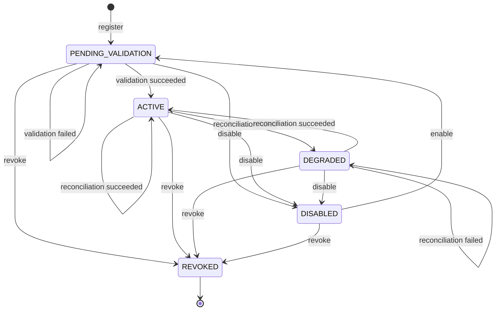

# M0-S9A Provider Registry Relational Contract

> Sanitized public reference. Fictional identities cannot authorize execution.
> Historical approvals apply only to their original bytes; see
> [public contract edition](../../docs/technical/public-reference-sanitization.md) (sanitization, integrity and approval boundaries).

## Document control

| Field | Value |
| --- | --- |
| Status | `IMPLEMENTED_AND_ACCEPTED / LOCAL_ONLY` |
| Version | 1.8 |
| Date | 2026-08-28 |
| Work package | M0-S9A (provider-neutral registry and reconciliation foundation) |
| Owner and reviewer | Designated reviewer (`example-reviewer`) |
| Applies to | Curve-owned PostgreSQL tables in the public Plane fork |
| Plane base | Exact `preview` commit `ad5772c0565c934e64ea90f892be1374819979be`, containing Plane PR #10 (M0-S6A durable parent/child Temporal orchestration implementation) |
| Published Curve contract baseline | Curve `main` `e6e43ea7fdf99baf79922a4ae506bbcb73e7c4cb`, the squash merge of [Curve PR #37](https://github.com/faocampo/curve/pull/37) (M0-S9A post-correction lifecycle reconciliation) |
| Accepted Plane implementation | [Plane PR #12](https://github.com/faocampo/plane/pull/12) (M0-S9A local provider-registry implementation) approved at exact head `d48a7d09f6824f045a1077ce2de256bd3dcde5d4` and squash-merged as `af7187d049c6ee6d0c82a5c70b686d4c444e9b63`; accepted Git tree `d43bdc22413627399f2232f1b17e2092d9e31cb1` |
| Accepted evidence | [M0-S9A implementation evidence](../../docs/technical/m0-s9a-implementation-evidence.md) (exact contract, implementation, tests, security, dependency disposition, and rollback) |

Version 1.8 binds the completed local Plane implementation and accepted
post-merge evidence. It changes no table, constraint, transaction, replay,
delivery, event, migration, or rollback semantic.

Version 1.7 reconciles only post-merge lifecycle and evidence metadata after
Curve PR #36 (six-finding M0-S9A contract correction); it changes no table,
constraint, transaction, replay, delivery, event, migration, or rollback
semantic.

Version 1.6 resolves the six findings from the independent implementation
review without widening the local provider-registry package. It fixes command
authorization/drain order, pending reconciliation replay, guarded ORM bulk
writes, abandoned-claim exhaustion, stale result normalization, and versioned
aggregate-aware provider event payload contracts.

The six-finding correction, exact-context dispatch, Plane implementation,
commit-bound validation, exact-head approval, squash merge, and post-merge
acceptance evidence are complete for `LOCAL_ONLY`.

## Purpose and boundary

This contract fixes the local PostgreSQL representation and transaction rules
for the first provider-neutral substrate. It adds workspace-scoped connection
metadata, immutable capability history, a typed adapter port, and explicit
reconciliation through Curve's existing Operation, DomainEvent, OutboxEvent,
IdempotencyRecord, PolicyDecision, and AuditEvent kernel.

M0-S9A (provider-neutral registry and reconciliation foundation) uses one
deterministic `FAKE_LOCAL` adapter with synthetic `INTERNAL` metadata. It
performs no network call, credential lookup, callback handling, outgoing
webhook, scheduled job, MCP operation, model call, repository mutation, or
external side effect. M0-S9B (external provider transport and administration)
owns those capabilities after their applicable material decisions.

Provider commands execute synchronously. Their local domain-event delivery uses
the existing durable outbox/inbox records with two explicit application-service
drain points: immediately after transaction commit and, only after the next
provider command receives `ALLOW`, before that command's provider mutation. A
denied command performs zero provider-delivery mutation. This package starts no
Temporal workflow, Celery task, scheduler, or background loop.

Plane remains authoritative for workspace identity and membership. Curve stores
`workspace_id` as an opaque UUID and creates no hard foreign key to a Plane
table. For M0-S9A registration, an authenticated human's live, active Plane
workspace role `20` in the exact target workspace is the trusted source of
Curve `PLATFORM_ADMINISTRATOR` for provider registration and administration
actions only. Caller input cannot supply that role. M0-S9A
exposes application-service/repository boundaries only and creates no public
provider-administration API.

The ProviderConnection and ProviderCapability wire projections use schema
version `2.0`. They replace the initial unimplemented v1 drafts before any
database row, endpoint, generated client, or provider adapter exists. No stored
data or deployed consumer requires migration. A future incompatible change
requires a new schema version and compatibility plan.

## Authorization contracts

The [M0-S9A registration authorization decision](../../docs/technical/m0-s9a-registration-authorization-decision.md)
(approved Option B Plane workspace-admin mapping and existing-workspace
registration resource) defines the human-readable decision. The
[core policy v2 manifest](../policy/core-policy-v2.json) (machine-readable
trusted role source and additive registration action) and
[core policy v2 schema](../schemas/core-policy-manifest-v2.schema.json) (closed
validation of the approved extension) are normative.

Core policy v2 supersedes v1 for new evaluations. The
[core policy v1 manifest](../policy/core-policy-v1.json) (immutable original M0
action set and deny precedence) remains byte-for-byte unchanged, and every v1
action is identical in v2. Historical `PolicyDecision` records continue to
resolve the exact version and manifest digest they captured.

## Physical records

### `curve_provider_connection`

`ProviderConnection` is a mutable workspace-scoped aggregate root using the
existing `WorkspaceScopedModel` fields. It adds:

| Column | PostgreSQL/Django representation | Constraint |
| --- | --- | --- |
| `provider_type` | bounded text | M0-S9A accepts only `FAKE_LOCAL` at the adapter registry boundary. |
| `adapter_key` | text, maximum 100 | `curve.fake-local` in M0-S9A; lowercase stable code. |
| `adapter_version` | text, maximum 100 | Exact implementation version used for validation. |
| `environment` | bounded text | `LOCAL` in M0-S9A. |
| `display_name` | text, maximum 255 | Human-readable only; never an authorization input. |
| `external_tenant_ref` | nullable text | Always null for `FAKE_LOCAL`. |
| `configuration_ref` | nullable JSON | Always null until protected storage is authorized. |
| `configuration_digest` | digest text | SHA-256 of adapter-validated canonical non-secret configuration. |
| `secret_reference` | nullable text | Database check requires null for `FAKE_LOCAL`. |
| `current_capability_id` | nullable UUID foreign key | Same-workspace immutable `ProviderCapability`; required in `ACTIVE` and `DEGRADED`. The wire projection serializes this field as `capability_document_ref` with resource type, ID, and capability version. |
| `allowed_classifications` | JSON array | Exactly `['INTERNAL']` for `FAKE_LOCAL`; array type, unique known values. |
| `status` | bounded text | `PENDING_VALIDATION`, `ACTIVE`, `DEGRADED`, `DISABLED`, or `REVOKED`. |
| `validated_at` | nullable timestamp | Required for `ACTIVE` and `DEGRADED`. |
| `validation_result_ref` | nullable JSON `ResourceRef` | Required for `ACTIVE` and `DEGRADED`; references the reconciliation Operation. |
| `last_reconciled_at` | nullable timestamp | Required for `ACTIVE` and `DEGRADED`. |
| `next_reconcile_at` | nullable timestamp | Required for `ACTIVE`; null for `DISABLED` and `REVOKED`. It is advisory until M0-S9B adds a scheduler. |
| `last_error` | nullable safe JSON | Required for `DEGRADED`; contains code/retryable only in M0-S9A. |

Database uniqueness is
`(workspace_id, environment, adapter_key)`. A workspace has at most one
connection for an exact adapter/environment pair. Display names and external
tenant labels are never global identity.

The model's exposed manager/queryset rejects `bulk_create`. It also rejects
`bulk_update` or `QuerySet.update` when the write can change `workspace_id` or
`current_capability_id`. The repository assigns `current_capability_id` only
after locking the connection and capability under the same `workspace_id` and
validating their relationship. These rules keep ORM bulk paths from bypassing
same-workspace reference validation.

### `curve_provider_capability`

`ProviderCapability` is append-only immutable history:

| Column | PostgreSQL/Django representation | Constraint |
| --- | --- | --- |
| `id` | UUID primary key | Application generated. |
| `workspace_id` | UUID, indexed | Mandatory first repository predicate. |
| `connection_id` | UUID foreign key | References a connection in the same workspace. |
| `connection_version` | positive bigint | Exact connection version validated. |
| `capability_version` | positive bigint | Monotonic per workspace/connection. |
| `provider_type` | bounded text | Must equal the connection value. |
| `adapter_key`, `adapter_version` | bounded text | Exact adapter implementation observed. |
| `protocol_versions` | JSON array | Unique stable versions. |
| `capabilities` | JSON array | Closed name/risk/enabled/schema-reference records. |
| `allowed_classifications` | JSON array | Cannot exceed the connection's allowed classifications. |
| `observed_at`, `validated_at` | timestamps | Trusted service time, never provider-supplied authority. |
| `expires_at` | nullable timestamp | Null means no automatic expiry for the local fake; later adapters must decide freshness. |
| `created_at` | timestamp | Database receipt time. |

Database uniqueness is
`(workspace_id, connection_id, capability_version)`. Application code rejects
update/delete through the immutable repository. The connection's
`current_capability_id` changes only in the same transaction that accepts the
corresponding validation/reconciliation result.

Every manager/queryset exposed by `ProviderCapability` rejects `bulk_create`,
`bulk_update`, `QuerySet.update`, and delete. Capability creation goes through
the repository, which locks the parent connection with matching `workspace_id`
and validates all copied adapter/provider/version coordinates before one-row
persistence. Model validation alone is insufficient because Django bulk APIs
skip it. The connection and capability guards together implement manifest
`workspace_reference_guard = INSTANCE_AND_QUERYSET` and
`bulk_workspace_reference_mutation = PROHIBITED`.

## Adapter port

The Python boundary is a protocol implemented outside domain models:

```python
class ProviderAdapter(Protocol):
    adapter_key: str
    provider_type: str
    adapter_version: str

    def describe_capabilities(
        self, context: ProviderCallContext
    ) -> ProviderCapabilityObservation: ...

    def reconcile(
        self, context: ProviderCallContext, previous: ProviderObservationRef | None
    ) -> ProviderReconciliationObservation: ...
```

`ProviderCallContext` carries only workspace/connection IDs, the
`provider-registry` service actor, the initiating human effective principal from
the authorized receipt, `INTERNAL` classification, correlation/causation IDs, digest-only
idempotency reference, 15-second deadline, cancellation token, and pinned
policy/adapter versions. It contains no secret value or protected body.

The registry resolves an exact adapter key from a static code allowlist. Unknown
keys, duplicate registrations, provider-type mismatches, unsupported protocol,
or enabled non-`READ` fake capability fail before state mutation.

The normalized error taxonomy is `AUTHENTICATION`, `AUTHORIZATION`, `POLICY`,
`NOT_SUPPORTED`, `RATE_LIMIT`, `TRANSIENT`, `AMBIGUOUS_MUTATION`, and
`TERMINAL`. The fake adapter deterministically exposes fixtures for success,
transient failure, terminal failure, unsupported capability, and ambiguous
observation. It never opens a socket or reads the process environment.

`OPTIMISTIC_CONCURRENCY` is the application-service result for a stale
connection or reconciliation Operation version/status. It takes precedence
over both a successful observation and every adapter error when result
compare-and-set fails. It is not an adapter error and is never retryable inside
the current reconciliation command.

## State machine



`REVOKED` is terminal. Enabling a disabled connection returns it to
`PENDING_VALIDATION`; previous capability history remains immutable and cannot
make the connection active. Invalid transitions return a stable conflict and
write safe no-effect audit evidence. Successful reconciliation of an already
active connection is an accepted `ACTIVE` to `ACTIVE` transition. An exhausted
retry while already degraded is an accepted `DEGRADED` to `DEGRADED`
transition. Both advance the aggregate version and append exact result evidence.

## Command and transaction boundaries

### Common authorization and drain order

Every register, reconcile, disable, enable, or revoke command uses
`execute_authorized_mutation`, preserving the M0-03 transaction-bound receipt
contract. The wrapper locks the target metadata, derives trusted context,
evaluates policy, and follows this order:

1. On `DENY`, append only the immutable denial decision and its linked safe
   denial audit, commit, and return. The private mutation callback is never
   entered, so the command cannot claim or update a provider outbox row, insert
   or update an inbox row, acknowledge delivery, schedule retry, or dead-letter
   an event.
2. On `ALLOW`, construct the private transaction-bound receipt and enter the
   mutation callback. Before changing the current provider aggregate, the
   callback invokes one bounded next-command drain for due provider events in
   that workspace. The drain and current command mutation participate in the
   wrapper-owned outer transaction; nested savepoints do not weaken receipt or
   atomicity guarantees.
3. After the authorized command transaction commits, invoke the bounded
   post-commit drain for the events it emitted. A normalized local-consumer
   failure records retry/dead-letter state and does not change the committed
   command result. A database persistence error follows the existing atomic
   rollback rule.

This ordering creates no reusable boolean authorization check and no serializable
receipt. It places the next-command recovery work after `ALLOW` while retaining
the existing policy-owned mutation boundary. It implements manifest
`next_command_drain_order = AFTER_ALLOW_RECEIPT_BEFORE_COMMAND_MUTATION` and
`denied_command_delivery_mutation = NONE` exactly.

### Register connection

Within the common wrapper-owned transaction:

1. Uses core policy v2 action
   `CURVE.PROVIDER_CONNECTION.REGISTER` against the locked existing
   `WORKSPACE` at policy resource version `1`. The authenticated human must have live active Plane workspace
   role `20` in that exact workspace. The trusted static registry supplies
   allowlisted target `curve.fake-local@1.0.0`. Caller-supplied roles and targets
   are rejected. The wrapper alone constructs the active receipt and invokes
   the next-command drain only on its `ALLOW` callback branch.
2. Requires `workspace_id`, exact fake adapter code/version, `LOCAL`, the
   authenticated human/effective principal, canonical empty configuration, raw
   idempotency key in memory, and correlation ID.
3. Computes and stores only digest material; rejects any secret/configuration
   body outside the adapter's closed empty-object schema.
4. Drains at most 10 previously due provider events under the active receipt,
   then locks/creates the idempotency scope.
5. Writes `ProviderConnection(PENDING_VALIDATION)`, DomainEvent, OutboxEvent,
   AuditEvent, and completed IdempotencyRecord atomically.
6. Replays the original database `ResourceRef` for the same key/request digest;
   a changed request digest returns conflict with no domain/outbox effect.

Plane roles `15` and `5`, inactive membership, a membership in another
workspace, agent/service principals, non-`LOCAL` environments, non-`INTERNAL`
classification, and any target other than `curve.fake-local@1.0.0` fail before
the connection mutation. After registration, disable/enable/revoke/reconcile
commands use the unchanged
`CURVE.PROVIDER_CONNECTION.ADMINISTER` action against the persisted
workspace-scoped connection.

### Reconcile connection

Reconciliation has no database transaction around the adapter call:

1. After `ALLOW`, the wrapper callback drains previously due provider events,
   locks the workspace-scoped connection, rejects `DISABLED`/`REVOKED`, and
   creates or replays an `Operation(PROVIDER_RECONCILIATION)` with its
   event/outbox/audit/idempotency records.
2. For the same idempotency key and request digest, a terminal Operation returns
   its original terminal result without adapter invocation. A `PENDING`
   Operation returns the same identity and resumes at step 3. A changed request
   digest remains a conflict with no reconciliation effect.
3. For a new or replayed `PENDING` Operation, the application service calls the
   selected fake adapter outside the transaction with the 15-second context.
   Concurrent resumptions may execute this deterministic, side-effect-free
   adapter more than once; result compare-and-set provides exactly one accepted
   terminal application.
4. A result transaction locks the connection and Operation, verifies both
   expected versions, requires the Operation to remain `PENDING`, and validates
   the observation's workspace/adapter coordinates before it appends a new
   capability when the normalized document changed, transitions connection/
   Operation state, and writes DomainEvent/OutboxEvent/AuditEvent.
5. If the Operation version or required `PENDING` status is stale, both a
   successful adapter observation and an adapter failure normalize to
   `OPTIMISTIC_CONCURRENCY`. The result transaction discards the provider
   outcome, preserves all provider and Operation state, emits no result
   DomainEvent/outbox effect, and appends only safe no-effect audit evidence.
6. If the Operation is still current and `PENDING` but the connection version
   is stale, both adapter outcomes normalize to `OPTIMISTIC_CONCURRENCY`. The
   transaction preserves connection/capability/last-error state, transitions
   only that Operation to terminal `FAILED`, and emits its
   `curve.provider_reconciliation.failed` `OPERATION` event/outbox plus safe
   audit evidence. It emits no `PROVIDER_CONNECTION` event. The terminal
   Operation then replays without another adapter invocation.
7. Byte-equivalent capability observations do not append duplicate capability
   history. The connection still records the successful reconciliation time
   and advances its aggregate version.
8. One reconciliation has a single 15-second monotonic deadline across all
   adapter attempts and permits at most three attempts. Only `RATE_LIMIT` and
   `TRANSIENT` are retryable while time remains. `AUTHENTICATION`,
   `AUTHORIZATION`, `POLICY`, `NOT_SUPPORTED`, `AMBIGUOUS_MUTATION`, `TERMINAL`,
   cancellation, and deadline exhaustion stop immediately. Exhausted retry
   moves an active connection to `DEGRADED` and keeps a degraded connection
   `DEGRADED`, recording only the safe taxonomy.
9. An ambiguous observation records conflict evidence and does not replace the
   current capability. No mutation is retried until explicit reconciliation.

Steps 2 and 3 implement manifest
`same_command_replay = RETURN_TERMINAL_OR_RESUME_PENDING` and
`pending_command_replay = RESUME_FROM_DURABLE_PHASE`. Steps 5 and 6 implement
`stale_result_outcomes = [SUCCESS, FAILURE]`,
`stale_result_error_code = OPTIMISTIC_CONCURRENCY`, and
`stale_result_provider_mutation = NONE`. Step 6 additionally implements
`stale_connection_operation_settlement =
FAIL_PENDING_WITH_OPTIMISTIC_CONCURRENCY`; step 5 implements
`stale_operation_result = OPTIMISTIC_CONCURRENCY_NO_MUTATION`.

M0-S9A exposes explicit application-service invocation only. On successful
reconciliation, `next_reconcile_at` is the trusted result-acceptance time plus
exactly 900 seconds. It is advisory for future consumers; no Celery, Temporal
schedule, cron, or network callback is activated by this contract.

## Local outbox/inbox delivery

The provider adapter call and event delivery are separate boundaries. Adapter
commands stay synchronous; the outbox transports only committed, local Curve
provider events. The provider delivery destination is exactly
`CURVE_PROVIDER_LOCAL_V1`, and its only consumer ID is exactly
`curve-provider-local-v1`. The existing Temporal relay never consumes this
destination.

Every accepted command or result transaction appends its DomainEvent,
OutboxEvent, AuditEvent, aggregate version, and idempotency outcome atomically.
After commit, the application service invokes one bounded local drain. Before
the next provider aggregate mutation, the policy wrapper invokes the same drain
for previously due records only from its `ALLOW` callback. A denial returns
before that callback and leaves all provider outbox/inbox delivery rows
byte-equivalent. Both drain invocations are explicit call-stack work; no process
wakes independently.

One drain performs these steps:

1. Recover expired claims for the current workspace/destination. Expired claims
   with attempt count below three return to due state; an expired third claim
   moves directly to `DEAD_LETTER`.
2. Claim at most 10 due outbox rows whose attempt count is below three, using a
   30-second lease and skip-locked selection. Claiming atomically increments the
   attempt count, so the first, second, and third leases are the only permitted
   consumer attempts.
3. For each event, attempt to insert an InboxMessage keyed uniquely by
   `(workspace_id, consumer_id, event_id)`.
4. If that inbox tuple already exists, acknowledge the outbox record without
   repeating the local consumer effect.
5. If local consumption succeeds, mark the inbox processed and the outbox
   delivered in a transaction.
6. If local consumption fails on attempt one or two, release it for retry
   exactly five seconds later. Failure on attempt three moves directly to
   `DEAD_LETTER` and preserves safe failure metadata for inspection.

The claim selector never returns a row with attempt count three. Therefore an
explicit third consumer failure and abandonment of the third 30-second lease
have the same exhausted outcome and no fourth claim is possible. This enforces
manifest `expired_claim_at_maximum_attempts = DEAD_LETTER`.

A process crash after the provider transaction commits and before the
post-commit drain leaves a durable pending outbox row. The next provider command
drains that row after it receives `ALLOW`. A denied command leaves the row
unchanged. With no later allowed provider command, it remains visibly pending;
this local proof includes no background latency guarantee. A post-commit drain
failure never rolls back or changes the already committed provider-command
outcome.

## Events, audit, and telemetry

The exact event and local-delivery allowlists are defined by the
[M0-S9A provider-registry manifest](../providers/m0-s9a-provider-registry-v1.json)
(local authority, Option B registration authorization, lifecycle, synchronous
adapter, delivery, persistence, and event constants). Its `required_events`
remains the eight-name event allowlist. Its aggregate-aware
`event_payload_contracts` provides the normative payload mappings:

| Aggregate type | Versioned payload schema | Event types |
| --- | --- | --- |
| `PROVIDER_CONNECTION` | [Provider connection event schema v1](../schemas/provider-connection-event-v1.schema.json) (closed provider-connection lifecycle and reconciliation-result payload) | `curve.provider_connection.registered`, `curve.provider_connection.validated`, `curve.provider_connection.degraded`, `curve.provider_connection.disabled`, `curve.provider_connection.enabled`, `curve.provider_connection.revoked`, `curve.provider_reconciliation.completed`, and `curve.provider_reconciliation.failed` |
| `OPERATION` | [Provider reconciliation event schema v1](../schemas/provider-reconciliation-event-v1.schema.json) (closed reconciliation-operation result payload) | `curve.provider_reconciliation.completed` and `curve.provider_reconciliation.failed` |

The manifest entries use exact `{aggregate_type, payload_schema, event_types}`
objects. A generic event-name array is not a payload schema. Before a
DomainEvent and its outbox record are persisted, the event type must be in both
`required_events` and the selected aggregate mapping, and its payload must
validate against that mapping's exact schema. Unknown events, aggregate/event
mismatches, missing schema references, extra properties, and invalid payloads
fail the command transaction before event/outbox creation.

Every valid event payload contains safe identifiers, versions, states, and
digests only. The registered connection event carries the stored
`configuration_digest`; active connection events carry the accepted capability
digest/version pair. Capability arrays remain in PostgreSQL/resource
projections and are not copied to generic logs or metrics.

M0-S9A reuses M0-08 (audit and observability foundation) correlation and
redaction. It may add bounded state/error-code attributes to existing operation
and audit instruments; it creates no high-cardinality provider, connection,
workspace, or capability label.

## Migration, rollback, and verification

The Plane implementation must provide:

1. One additive Curve feature migration named
   `0005_providerconnection_providercapability.py`, with
   `0004_policydecision_recorded_at_default.py` as its exact predecessor, for
   the two tables, indexes, foreign key, uniqueness, positive-version,
   fake-local, lifecycle, and JSON-array checks. The same migration replaces
   `curve_policy_identity_ck` with the backward-compatible identity constraint
   `policy_key = CURVE_CORE_POLICY AND policy_version IN (1, 2)`. The immutable
   PolicyDecision envelope remains schema version `1.0`, the model default
   remains policy version `1`, and policy version `3` or greater is rejected.
2. Forward to `0005`, backward to `0004`, and forward again to `0005` against disposable
   PostgreSQL. Persistent rollback uses feature disablement and leaves the
   additive tables intact until the rollback window closes.
3. Model/repository/service tests for immutable capability history, optimistic
   concurrency, uniqueness, state-required fields, workspace isolation, and
   `REVOKED` terminality. Direct manager/queryset tests must prove that
   `ProviderCapability` bulk create/update/delete paths and
   `ProviderConnection` bulk creation/reference mutation cannot bypass
   same-workspace validation.
4. Command-kernel tests for atomic event/outbox/audit/idempotency writes,
   duplicate terminal replay, resumed `PENDING` replay, changed-digest conflict,
   concurrent resumption, stale-success and stale-failure result races both
   yielding `OPTIMISTIC_CONCURRENCY`, current-Operation/stale-connection
   settlement to terminal `FAILED` with an Operation-only event, terminal
   replay after that settlement, stale-Operation no-mutation handling,
   transaction rollback, and safe audit.
5. Adapter conformance tests for success, unsupported capability, transient,
   terminal, timeout/cancellation, ambiguity, unknown key, version mismatch,
   and proof that socket/environment/credential access is absent.
6. Local-delivery tests for post-commit draining, recovery only after the next
   command receives `ALLOW`, denial with byte-equivalent delivery rows,
   workspace/consumer/event deduplication, batch limit 10, 30-second lease
   expiry/reclaim for attempts one and two, third abandoned claim to
   `DEAD_LETTER` without a fourth claim, five-second retry eligibility,
   third-explicit-failure `DEAD_LETTER`, destination isolation, and absence of
   Temporal/Celery/scheduler/background dispatch.
7. Contract tests that validate both versioned provider event schemas and every
   aggregate/event entry in `event_payload_contracts`, then reject unknown
   events, aggregate/event mismatches, missing schema references, extra
   properties, and schema-invalid payloads before DomainEvent/outbox creation.
8. Full Plane backend, Curve frontend regression, `pnpm check`, `pnpm build`,
   migration drift, CodeQL, and copyright checks.

Rollback sets the Curve module/provider-registry feature off. Existing Plane
behavior, existing Celery workers, Temporal, and current Curve operations remain
unchanged. No down-migration runs against a persistent shared stack during
rollback.
