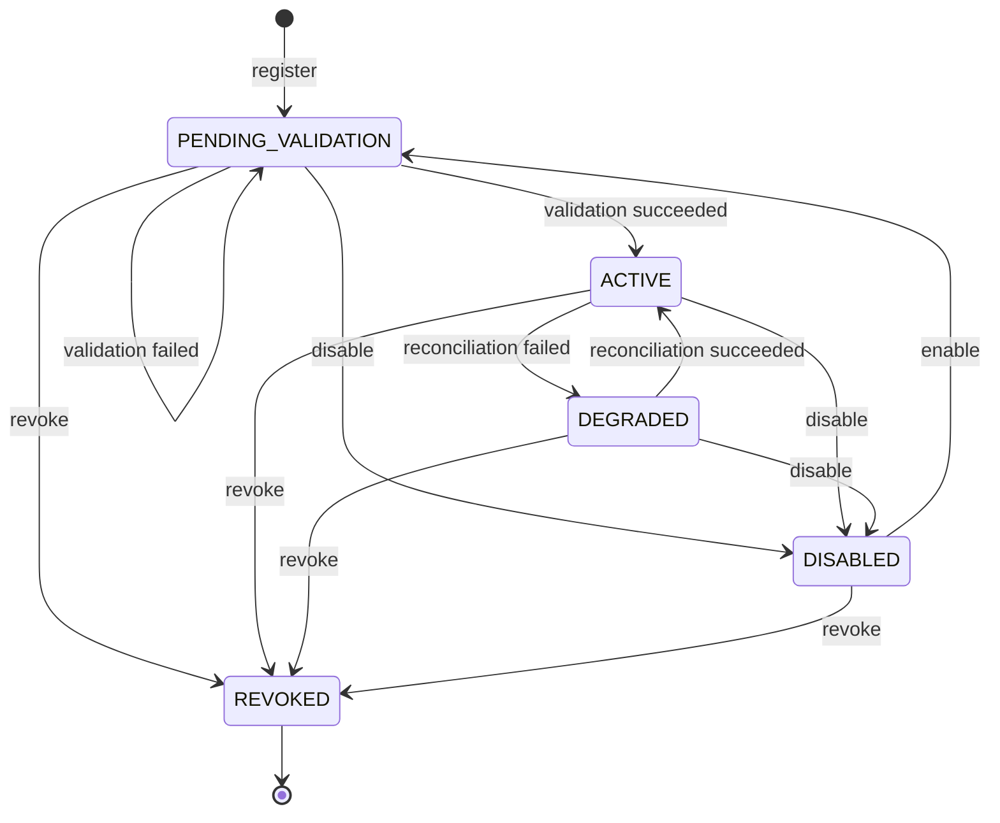

# M0-S9A Provider Registry Relational Contract

## Document control

| Field | Value |
| --- | --- |
| Status | `REVIEW_DRAFT / NOT_DISPATCHABLE` |
| Version | 1.0 |
| Date | 2026-08-22 |
| Work package | M0-S9A (provider-neutral registry and reconciliation foundation) |
| Owner and reviewer | Federico Ocampo (`faocampo`) |
| Applies to | Curve-owned PostgreSQL tables in the public Plane fork |
| Plane base | `preview` at `1b06153f6f49848f208808f4f09385a581a55d26` |

## Purpose and boundary

This contract fixes the local PostgreSQL representation and transaction rules
for the first provider-neutral substrate. It adds workspace-scoped connection
metadata, immutable capability history, a typed adapter port, and explicit
reconciliation through Curve's existing Operation, DomainEvent, OutboxEvent,
IdempotencyRecord, PolicyDecision, and AuditEvent kernel.

M0-S9A (provider-neutral registry and reconciliation foundation) uses one
deterministic `FAKE_LOCAL` adapter with synthetic `INTERNAL` metadata. It
performs no network call, credential lookup, callback handling, outgoing
webhook, scheduled job, MCP operation, model call, repository mutation, or
external side effect. M0-S9B (external provider transport and administration)
owns those capabilities after their applicable material decisions.

Plane remains authoritative for workspace identity and membership. Curve stores
`workspace_id` as an opaque UUID and creates no hard foreign key to a Plane
table. M0-S9A exposes application-service/repository boundaries only; it does
not create the unresolved human `PLATFORM_ADMINISTRATOR` role source or a
public provider-administration API.

The ProviderConnection and ProviderCapability wire projections use schema
version `2.0`. They replace the initial unimplemented v1 drafts before any
database row, endpoint, generated client, or provider adapter exists. No stored
data or deployed consumer requires migration. A future incompatible change
requires a new schema version and compatibility plan.

## Physical records

### `curve_provider_connection`

`ProviderConnection` is a mutable workspace-scoped aggregate root using the
existing `WorkspaceScopedModel` fields. It adds:

| Column | PostgreSQL/Django representation | Constraint |
| --- | --- | --- |
| `provider_type` | bounded text | M0-S9A accepts only `FAKE_LOCAL` at the adapter registry boundary. |
| `adapter_key` | text, maximum 100 | `curve.fake-local` in M0-S9A; lowercase stable code. |
| `adapter_version` | text, maximum 100 | Exact implementation version used for validation. |
| `environment` | bounded text | `LOCAL` in M0-S9A. |
| `display_name` | text, maximum 255 | Human-readable only; never an authorization input. |
| `external_tenant_ref` | nullable text | Always null for `FAKE_LOCAL`. |
| `configuration_ref` | nullable JSON | Always null until protected storage is authorized. |
| `configuration_digest` | digest text | SHA-256 of adapter-validated canonical non-secret configuration. |
| `secret_reference` | nullable text | Database check requires null for `FAKE_LOCAL`. |
| `current_capability_id` | nullable UUID foreign key | Same-workspace immutable `ProviderCapability`; required in `ACTIVE` and `DEGRADED`. |
| `allowed_classifications` | JSON array | Exactly `['INTERNAL']` for `FAKE_LOCAL`; array type, unique known values. |
| `status` | bounded text | `PENDING_VALIDATION`, `ACTIVE`, `DEGRADED`, `DISABLED`, or `REVOKED`. |
| `validated_at` | nullable timestamp | Required for `ACTIVE` and `DEGRADED`. |
| `validation_result_ref` | nullable JSON `ResourceRef` | Required for `ACTIVE` and `DEGRADED`; references the reconciliation Operation. |
| `last_reconciled_at` | nullable timestamp | Required for `ACTIVE` and `DEGRADED`. |
| `next_reconcile_at` | nullable timestamp | Required for `ACTIVE`; null for `DISABLED` and `REVOKED`. It is advisory until M0-S9B adds a scheduler. |
| `last_error` | nullable safe JSON | Required for `DEGRADED`; contains code/retryable only in M0-S9A. |

Database uniqueness is
`(workspace_id, environment, adapter_key)`. A workspace has at most one
connection for an exact adapter/environment pair. Display names and external
tenant labels are never global identity.

### `curve_provider_capability`

`ProviderCapability` is append-only immutable history:

| Column | PostgreSQL/Django representation | Constraint |
| --- | --- | --- |
| `id` | UUID primary key | Application generated. |
| `workspace_id` | UUID, indexed | Mandatory first repository predicate. |
| `connection_id` | UUID foreign key | References a connection in the same workspace. |
| `connection_version` | positive bigint | Exact connection version validated. |
| `capability_version` | positive bigint | Monotonic per workspace/connection. |
| `provider_type` | bounded text | Must equal the connection value. |
| `adapter_key`, `adapter_version` | bounded text | Exact adapter implementation observed. |
| `protocol_versions` | JSON array | Unique stable versions. |
| `capabilities` | JSON array | Closed name/risk/enabled/schema-reference records. |
| `allowed_classifications` | JSON array | Cannot exceed the connection's allowed classifications. |
| `observed_at`, `validated_at` | timestamps | Trusted service time, never provider-supplied authority. |
| `expires_at` | nullable timestamp | Null means no automatic expiry for the local fake; later adapters must decide freshness. |
| `created_at` | timestamp | Database receipt time. |

Database uniqueness is
`(workspace_id, connection_id, capability_version)`. Application code rejects
update/delete through the immutable repository. The connection's
`current_capability_id` changes only in the same transaction that accepts the
corresponding validation/reconciliation result.

## Adapter port

The Python boundary is a protocol implemented outside domain models:

```python
class ProviderAdapter(Protocol):
    adapter_key: str
    provider_type: str
    adapter_version: str

    def describe_capabilities(
        self, context: ProviderCallContext
    ) -> ProviderCapabilityObservation: ...

    def reconcile(
        self, context: ProviderCallContext, previous: ProviderObservationRef | None
    ) -> ProviderReconciliationObservation: ...
```

`ProviderCallContext` carries only workspace/connection IDs, the
`provider-registry` service actor, the initiating human effective principal from
the authorized receipt, `INTERNAL` classification, correlation/causation IDs, digest-only
idempotency reference, 15-second deadline, cancellation token, and pinned
policy/adapter versions. It contains no secret value or protected body.

The registry resolves an exact adapter key from a static code allowlist. Unknown
keys, duplicate registrations, provider-type mismatches, unsupported protocol,
or enabled non-`READ` fake capability fail before state mutation.

The normalized error taxonomy is `AUTHENTICATION`, `AUTHORIZATION`, `POLICY`,
`NOT_SUPPORTED`, `RATE_LIMIT`, `TRANSIENT`, `AMBIGUOUS_MUTATION`, and
`TERMINAL`. The fake adapter deterministically exposes fixtures for success,
transient failure, terminal failure, unsupported capability, and ambiguous
observation. It never opens a socket or reads the process environment.

## State machine



`REVOKED` is terminal. Enabling a disabled connection returns it to
`PENDING_VALIDATION`; previous capability history remains immutable and cannot
make the connection active. Invalid transitions return a stable conflict and
write safe no-effect audit evidence.

## Command and transaction boundaries

### Register connection

One atomic application transaction:

1. Requires a previously issued authorized policy receipt for
   `CURVE.PROVIDER_CONNECTION.ADMINISTER`; M0-S9A tests supply a synthetic
   receipt through the internal service boundary because the human role source
   and public endpoint are deferred.
2. Requires `workspace_id`, exact fake adapter code/version, `LOCAL`, synthetic
   actor/effective principal, canonical empty configuration, raw idempotency key
   in memory, and correlation ID.
3. Computes and stores only digest material; rejects any secret/configuration
   body outside the adapter's closed empty-object schema.
4. Locks/creates the idempotency scope.
5. Writes `ProviderConnection(PENDING_VALIDATION)`, DomainEvent, OutboxEvent,
   AuditEvent, and completed IdempotencyRecord atomically.
6. Replays the original database `ResourceRef` for the same key/request digest;
   a changed request digest returns conflict with no domain/outbox effect.

### Reconcile connection

Reconciliation has no database transaction around the adapter call:

1. The command transaction locks the workspace-scoped connection, rejects
   `DISABLED`/`REVOKED`, creates an `Operation(PROVIDER_RECONCILIATION)`, and
   commits its event/outbox/audit/idempotency records.
2. The application service calls the selected fake adapter outside the
   transaction with the 15-second context.
3. A result transaction locks the connection and Operation, verifies their
   expected versions and the observation's workspace/adapter coordinates,
   appends a new capability when the normalized document changed, transitions
   connection/Operation state, and writes DomainEvent/OutboxEvent/AuditEvent.
4. Byte-equivalent capability observations do not append duplicate capability
   history. The connection still records the successful reconciliation time
   and advances its aggregate version.
5. A transient/terminal error records only the safe taxonomy, follows the
   bounded three-attempt policy at the application-service boundary, and moves
   a previously active connection to `DEGRADED` after exhaustion.
6. An ambiguous observation records conflict evidence and does not replace the
   current capability. No mutation is retried until explicit reconciliation.

M0-S9A exposes explicit application-service invocation only. `next_reconcile_at`
is computed for future consumers; no Celery, Temporal schedule, cron, or network
callback is activated by this contract.

## Events, audit, and telemetry

The exact event allowlist is defined by the
[M0-S9A provider-registry manifest](../providers/m0-s9a-provider-registry-v1.json)
(local authority, lifecycle, adapter, persistence, and event constants). Every
event payload contains safe identifiers, versions, states, and digests only.
Capability arrays remain in PostgreSQL/resource projections and are not copied
to generic logs or metrics.

M0-S9A reuses M0-08 (audit and observability foundation) correlation and
redaction. It may add bounded state/error-code attributes to existing operation
and audit instruments; it creates no high-cardinality provider, connection,
workspace, or capability label.

## Migration, rollback, and verification

The Plane implementation must provide:

1. One additive Curve migration named
   `0004_providerconnection_providercapability.py` for the two tables, indexes, foreign key,
   uniqueness, positive-version, fake-local, lifecycle, and JSON-array checks.
2. Forward to `0004`, backward to `0003`, and forward again to `0004` against disposable
   PostgreSQL. Persistent rollback uses feature disablement and leaves the
   additive tables intact until the rollback window closes.
3. Model/repository/service tests for immutable capability history, optimistic
   concurrency, uniqueness, state-required fields, workspace isolation, and
   `REVOKED` terminality.
4. Command-kernel tests for atomic event/outbox/audit/idempotency writes,
   duplicate replay, changed-digest conflict, result-version race, transaction
   rollback, and safe no-effect audit.
5. Adapter conformance tests for success, unsupported capability, transient,
   terminal, timeout/cancellation, ambiguity, unknown key, version mismatch,
   and proof that socket/environment/credential access is absent.
6. Full Plane backend, Curve frontend regression, `pnpm check`, `pnpm build`,
   migration drift, CodeQL, and copyright checks.

Rollback sets the Curve module/provider-registry feature off. Existing Plane
behavior, existing Celery workers, Temporal, and current Curve operations remain
unchanged. No down-migration runs against a persistent shared stack during
rollback.
