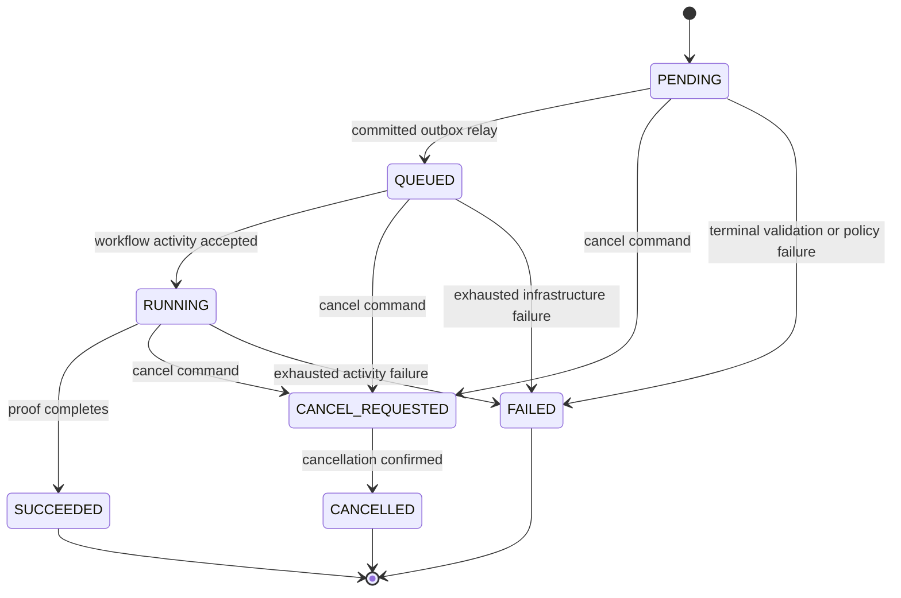

# M0 Temporal Workflow Contract

## Identity and ownership

| Item | M0 contract |
| --- | --- |
| Namespace | `curve-local` for the local proof; non-local values require D-003. |
| Task queue | `curve-control-plane-v1` |
| Workflow type | `CurveOperationWorkflowV1` |
| Workflow ID | `curve:{workspace_id}:{operation_id}` |
| Domain state owner | Curve PostgreSQL/application services |
| Orchestration state owner | Temporal history |
| Payload rule | Opaque IDs, aggregate versions, digests, safe enums, and correlation only; no protected bodies or credentials. |

## Input

```json
{
  "schema_version": "1.0",
  "workspace_id": "00000000-0000-0000-0000-000000000001",
  "operation_id": "00000000-0000-0000-0000-000000000002",
  "operation_version": 1,
  "operation_type": "FOUNDATION_PROBE",
  "correlation_id": "synthetic-local-proof"
}
```

## Commands and signals

| Name | Kind | Required fields | Behavior |
| --- | --- | --- | --- |
| `request_cancel` | Signal | actor reference, reason, command ID | Idempotently records cancellation intent and stops starting new activities. |
| `refresh_operation` | Signal | operation version, event ID | Re-reads authoritative application state when an outbox event advances the aggregate. |
| `state` | Query | none | Returns safe workflow phase, last observed operation version, and cancellation state. |

## Activity contract

Activities call application-service commands; they do not write domain tables directly. Every activity receives an idempotency key derived from workflow ID, workflow run ID, activity name, and logical command ID. Retryable errors are typed; authorization, policy, validation, and version conflicts are not retried blindly.

The M0 probe activities are `mark_operation_running` and `mark_operation_succeeded`. Default start-to-close timeout is 30 seconds, schedule-to-close timeout is two minutes, and maximum retry attempts are three with bounded exponential backoff. These values are local proof defaults, not production SLO decisions.

## State sequence



Terminal states never transition. Duplicate signals and duplicate outbox delivery return the existing result without creating a second workflow or domain mutation.

## Versioning and replay

- Workflow code uses explicit Temporal patch/version markers for incompatible control-flow changes.
- CI replays a retained synthetic history corpus against the candidate worker.
- A new worker build may poll the v1 queue only when replay passes.
- Long-running incompatible histories remain pinned to the compatible worker build or follow an approved continue-as-new/migration procedure.

## Cancellation and recovery

Cancellation is cooperative and bounded. On worker loss, Temporal redelivers activities, and application idempotency prevents duplicate effects. An ambiguous application response is reconciled by reading the operation and idempotency record before retry. No workflow completion is inferred from provider success alone.
