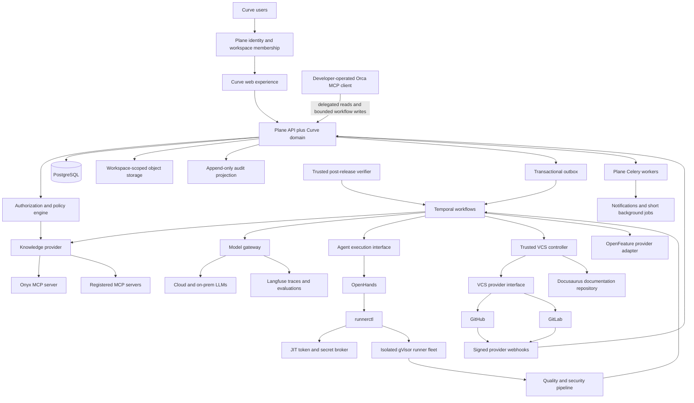

# Curve: AI-Native Product Development Platform

> Sanitized public reference. Fictional identities cannot authorize execution.
> Historical approvals apply only to their original bytes; see
> [public contract edition](technical/public-reference-sanitization.md) (sanitization, integrity and approval boundaries).

## Document control

| Field        | Value                                                                      |
| ------------ | -------------------------------------------------------------------------- |
| Status       | Remediation in progress; D-001 decided; D-003 local shared-network profile decided and implemented; non-local activation and remaining packages retain their prerequisites |
| Owner        | Example Organization                                                                        |
| Audience     | Product, engineering, design, security, operations, and company leadership |
| Version      | 0.13                                                                       |
| Last updated | 2026-08-23                                                                 |
| Product      | Curve                                                                      |
| Foundation   | Plane open-source project management platform                              |

### Revision history

| Version | Date | Summary |
| ------- | ---- | ------- |
| 0.13 | 2026-08-23 | Approved the M1-00A minimal Product core: immutable workspace-unique lowercase key, mutable metadata and prospective IANA timezone, one human owner, reversible ACTIVE/ARCHIVED lifecycle, archive guard, archived historical reads, Initiative rejection, and exact administrator/owner authority; retained all roadmap entities in M2. |
| 0.12 | 2026-08-21 | Established Curve as the user-facing product shell and brand; grouped Plane-backed capabilities under Work management; placed Foundation status under Platform; and separated product-surface ownership from Plane data and service authority. |
| 0.11 | 2026-08-20 | Recorded effective D-003 private-platform amendment merge `aece539...` and accepted M0-S3 local Temporal implementation merge `d99342f...`, including deterministic context, replay, restart, cancellation, security, migration, and rollback evidence; retained all non-local activation gates. |
| 0.10 | 2026-08-20 | Revised the local synthetic runtime contract. Environment-specific connectivity and operational choices are maintained in the private deployment profile; activation and sandbox-isolation gates remain required. |
| 0.9 | 2026-08-18 | Recorded D-003 `LOCAL_ONLY` approval at exact head `7826f403...` and merge `097016f...`; fixed Temporal Python SDK 1.31.0 and the two-network Compose overlay; retired P0-06A/P0-06B as standalone gates; selected M0-S3 as the executable local proof; retained fail-closed staging/production decisions. |
| 0.8 | 2026-08-15 | Recorded owner-approved D-001 foundation, licensing, repository-boundary, exact-head, and review-cadence decisions; allocated additive migration, disabled-state, and rollback implementation proof to M0-01; recorded merged Curve baseline `1529b8b...` and Plane base `549db1a...`; retained all other package gates. |
| 0.7 | 2026-08-13 | Reconciled the public API namespace with the versioned OpenAPI contract and completed the initial M0 persistence, delivery, audit, provider-connection, and Access Envelope schema inventory without changing milestone scope or owner-gated decisions. |
| 0.6 | 2026-08-12 | Made M0 progressively codeable: selected OpenHands as the sole automated execution provider; redefined Orca as a developer-operated MCP client with delegated workflow write-back; separated foundation-readiness from just-in-time integration proofs; moved model and VCS provider decisions to their consuming milestones; and made D-009 gate protected storage and non-local activation without blocking independent local M0 work. |
| 0.5 | 2026-08-12 | Recorded planning choices as owner-gated proposals; aligned GitLab/OpenHands R0B versus full R1; selected the thin Curve/OpenRouter gateway boundary; defined the Example Product pilot contract, external Example backend prerequisite, quality/waiver rules, budget ledger, package credentials, AGPL release gate, proof packages, and remediation ledger. |
| 0.4 | 2026-08-11 | Made the PRD architecture-planning ready: resolved lifecycle and gate contradictions; added release baselines, normative state/cardinality/API/event contracts, two-phase quality, trusted-controller and evidence controls, measurable NFRs, traceable acceptance scenarios, decision ownership, and architecture handoff criteria. |
| 0.3 | 2026-08-11 | Added Product roadmaps, schedules, snapshots, and Feature Delivery Contract concepts. |

## Executive summary

Curve is an AI-native product development platform for Example Organization. It will manage the complete product and software-development lifecycle, from long-lived product roadmaps and milestone planning through an initial problem or idea, research, prototyping, product requirements, architecture planning, implementation, automated quality analysis, and creation of a reviewed draft pull or merge request.

Curve will present a Curve-branded product shell and extend [Plane](https://plane.so/) as its embedded work-management foundation. Plane will remain authoritative for projects, work items, pages, views, comments, and human coordination. [Temporal](https://temporal.io/) will execute durable, resumable workflows. Example Organization's existing on-premise [Onyx](https://www.onyx.app/) deployment will provide permission-aware access to internal knowledge. [OpenHands](https://github.com/OpenHands/OpenHands) is the initial automated coding-agent execution provider. Orca is a developer-operated client that reads approved work and reports bounded workflow updates through authenticated MCP; it is not an automated `AgentExecutionProvider`.

Curve will connect Product roadmaps, immutable roadmap snapshots, approved PRD revisions, development schedules, coding-agent runs, and coordinated pull or merge requests. Roadmap-backed Feature Delivery will be governed by a versioned Feature Delivery Contract covering observability, Docusaurus documentation, and OpenFeature-compatible toggling.

The first usable release will support one complete reference path:

> Roadmap-backed or standalone idea -> guided alignment -> optional research -> optional prototype -> approved PRD -> conditional roadmap placement -> approved execution plan -> repository-local slice implementation -> preflight review -> automatically opened draft PR or MR -> VCS validation -> human code-readiness decision.

For roadmap-backed delivery, Curve also derives aggregate Feature release readiness from the coordinated PR or MR set and the Feature Delivery Contract. Curve observes later merges, deployments, and post-release verification when integrations provide them; it never performs merge or deployment in R1.

Curve is Example Organization-first, but its workflow, model, knowledge, coding-agent, prototype, and version-control integrations will use provider boundaries that allow future productization.

### Decision-completeness declaration

This PRD is the normative product contract for architecture planning. Its fixed invariants, lifecycle states, authorization rules, requirements, and acceptance scenarios must not be weakened or silently reinterpreted by a derived architecture or implementation plan. Items in the decision register are explicit prerequisites with owners and deadlines; they are not permission for an implementation agent to invent production policy.

The PRD is ready to derive architecture because the domain and provider boundaries do not depend on a particular answer to those registered deployment choices. Implementation of a milestone must not begin until every decision marked as blocking that milestone is resolved and recorded in an ADR.

Normative words **MUST**, **MUST NOT**, **SHOULD**, and **MAY** have their meanings from [RFC 2119](https://www.rfc-editor.org/rfc/rfc2119). When prose conflicts with an invariant, state table, or numbered requirement, the invariant, state table, or numbered requirement takes precedence, in that order.

## Release baseline and scope

The target product is intentionally broader than a single thin prototype. Releases distinguish validation configurations from the supported R1 contract.

| Release | Included milestones | Supported scope | Exit meaning |
| ------- | ------------------- | --------------- | ------------ |
| R0A: Definition alpha | M0-M1 | One Example Organization workspace; alignment, delegated Onyx evidence, artifact versioning, and the PRD gate | Validates evidence-backed product definition; no coding-agent promise. |
| R0B: Delivery pilot | Selected M0-M1 and M3-M5 capabilities | One standalone initiative using GitLab and OpenHands, with repository-local slices or an explicitly approved external contract/deployment prerequisite; preflight, automatic draft MR creation, VCS validation, and Code Readiness; research and prototype may be skipped | The named Example Organization validation configuration only; it is not provider-complete, roadmap-complete, prototype-complete, or generally supported R1. |
| R1: First usable release | M0-M6 | Both initiative modes, product roadmaps, GitHub and GitLab, OpenHands automation, developer-operated Orca MCP assistance, coordinated repository-local slices, Feature Delivery Contracts, and both prototype paths | Every R1 acceptance scenario passes against the production-like environment, the OpenHands provider suite, and the Orca MCP suite. |
| R1.x: Integration expansion | M7 | Additional collaboration, design, support, monitoring, and deployment-event integrations | Adds integrations without changing the three-gate lifecycle. |

All FR-001 through FR-044 are R1 **Must** requirements. R0 configurations may implement a documented subset, but cannot be presented as R1 compliant. M7 capabilities are post-R1 unless an acceptance scenario explicitly says Curve only observes an external event.

R0B validates the first automated-provider path; it does not redefine R1. R1 requires OpenHands provider conformance and the separate developer-operated Orca MCP contract, not an invented Orca execution-provider API. Prototype execution remains optional for every individual initiative, while both the authenticated runnable-preview and Lovable prompt-package capabilities remain required for R1. The Example Product pilot may omit prototype work without removing M6 from the release contract.

### Scope invariants

1. Curve has exactly three mandatory initiative gate types: **PRD Approval**, **Plan Approval**, and **Code Readiness**.
2. Roadmap publication is a separately authorized planning action, not a fourth initiative gate.
3. `InitiativeMode` is either `ROADMAP` or `STANDALONE`. Roadmap placement is required only for `ROADMAP` initiatives; standalone work proceeds directly from PRD approval to planning.
4. Each vertical slice affects exactly one repository and produces at most one active PR or MR. Rework updates the same branch and change request.
5. A slice is independently implementable, testable, and reviewable. Its release may depend on other slices in the approved DAG.
6. Curve automatically creates a draft only after preflight passes. Draft-triggered VCS CI and evaluable repository policy run after the draft exists and block Code Readiness, not draft creation. Repository approvals that are requested only after draft-to-ready remain part of the normal external review process.
7. Every quality result and Code Readiness decision is bound to an exact repository, base SHA, head SHA, approved plan version, context digest, and policy version. A new head commit invalidates affected results and decisions.
8. Agents never approve artifacts, grant waivers, reclassify findings, push branches, create PRs or MRs, mark drafts ready, merge, or deploy. Trusted Curve controllers perform authorized VCS mutations.
9. Full permissioned evidence is never committed to Git. Repositories receive only a sanitized Context Manifest; full context is mounted read-only and ephemerally for an authorized run.
10. Every Curve aggregate, event, object key, cache key, connection, run, and audit entry is scoped by `workspace_id`.
11. Curve owns the user-facing product name, logo, application shell, global navigation, breadcrumbs, and end-to-end lifecycle terminology. Plane-backed capabilities appear inside the `Work management` area while Plane remains authoritative for its native data and behavior.

## Product vision

Curve should make the reasoning behind a product change as inspectable as the resulting code. A stakeholder should be able to answer:

- Why was this initiative created?
- Which customer, product, technical, and economic evidence supports it?
- Which assumptions remain uncertain?
- Who approved the requirements and execution plan?
- Which repositories, services, and architectural components are affected?
- Which Product, Roadmap, Milestone, Feature, and approved PRD revision define the committed scope?
- How do declared roadmap progress and task-derived execution completion differ?
- Which human or agent produced each artifact and change?
- Which tests, scans, and reviews support the result?
- Which observability signal, documentation change, and feature toggle make the Feature safe to operate and release?
- Why is the resulting PR or MR considered ready for human review?

The product should reduce handoffs and repeated context-building without hiding uncertainty or removing human accountability.

### Product shell and embedded work-management boundary

Curve is the product users enter and navigate. Its product surface MUST use the Curve name and approved Curve logo as the primary identity. The top-level information architecture is organized around the complete product-development lifecycle:

- **Product:** Home, Initiatives, and Roadmaps.
- **Delivery:** Execution, Quality, and Evidence.
- **Work management:** Plane-backed Projects, Work items, Cycles, Views, and Analytics.
- **Platform:** Integrations, Policies, Foundation status, and Settings.

Plane remains the implementation and authority foundation for its native work-management concepts. Curve integrates those capabilities through additive bindings, services, routes, and reusable components. Plane attribution, open-source notices, and the exact-version AGPL source link remain accessible from the Curve product surface while Curve remains the primary product identity.

## Example Organization context and problem statement

The fictional reference organization develops software products. Its development process spans idea discovery, conceptualization, feasibility analysis, solution design, development, pre-production validation, release, monitoring, and maintenance. Actual business context and product portfolios remain private configuration inputs.

Today, the information required to execute that process is distributed across meetings, recordings, internal documentation, source repositories, Slack, Google Workspace, Figma, support channels, monitoring systems, and the knowledge already indexed by Onyx. Humans repeatedly reconstruct context, translate requirements into technical plans, divide plans into tasks, prompt coding agents, inspect their output, and manually connect the resulting code with the original product intent.

Existing project-management systems track work but generally do not preserve the complete chain from evidence to requirements to code. Coding agents can implement tasks but do not own product truth, approval policy, or cross-system traceability. Curve will bridge those domains.

## Glossary and identity rules

| Term | Normative definition |
| ---- | -------------------- |
| Product | A long-lived Example Organization product or platform that owns Features, Roadmaps, and Initiatives. |
| Feature | A reusable product capability. A Feature is not a delivery attempt and can appear in multiple Milestones. |
| Roadmap Item | The milestone-specific scope of one Feature, including dates, confidence, health, progress, and one defining Initiative in R1. |
| Initiative | One governed change effort in one workspace and Product. It is either roadmap-backed or standalone. |
| Feature Delivery | The delivery instance formed by one roadmap-backed Initiative, its Roadmap Item, one approved PRD version, and one approved Execution Plan version. |
| Vertical Slice | A repository-local, independently implementable, testable, and reviewable delivery unit. It creates at most one active PR or MR. |
| Pull Request Set | The coordinated collection of PR or MR bindings produced by all in-scope slices of one approved plan. |
| Feature Delivery Contract | One versioned set of pre-release and post-release obligations belonging to one Feature Delivery. Individual PRs contribute evidence; they do not each own a duplicate contract. |
| Preflight | Checks that Curve can run against an exact candidate commit before a draft exists. Passing makes the slice `DRAFT_ELIGIBLE`. |
| Code Ready | A human Code Readiness decision for an exact PR or MR head after required VCS checks and review findings pass. |
| Feature Release Ready | A derived state: all required change requests in the Pull Request Set are Code Ready and all pre-release contract obligations pass or have valid waivers. It is not a deployment action. |
| Post-release Verified | Evidence that declared production signals were checked after an observed deployment. R1 accepts manually attached evidence; automated monitoring integration is M7. |
| Evidence | Source material retrieved or supplied by an authorized human. AI output is never evidence merely because a model generated it. |
| Context Pack | The immutable, access-controlled bundle used by a reasoning or execution attempt. |
| Context Manifest | A sanitized repository-safe list of artifact identifiers, digests, approved summaries, and Curve links; it contains no restricted evidence excerpts. |

Every human operation has an **effective principal**. Knowledge and MCP operations run as the human who triggered that operation or through a short-lived delegated token for that human. Credentials from the initiative creator MUST NOT be reused for later actors without explicit delegation. Service identities are used only for controller actions already authorized by an approved plan or explicit human command; agent sandbox identities have no VCS mutation authority.

All timestamps are stored in UTC and rendered in the viewer's timezone. External identifiers are stored with provider and workspace scope. Curve-owned identifiers use opaque globally unique values. Initiative keywords are case-insensitively unique within a workspace and are immutable after the first external resource is created.

## Systems of record and synchronization

| Concern | System of record | Curve behavior and conflict rule |
| ------- | ---------------- | -------------------------------- |
| Curve domain, policies, approvals, lineage, and normalized projections | Curve PostgreSQL | Authoritative. Mutations use optimistic concurrency and append immutable history. |
| Native work items, comments, estimates, and Plane collaboration fields | Plane | Curve references Plane IDs and reads status for projections. It does not create a bidirectional status loop. |
| Durable process execution | Temporal | Authoritative only for orchestration progress, timers, and activity history; never for product or approval truth. |
| Automated coding-agent execution | OpenHands | Provider truth is normalized into append-only events; Curve business state advances only after validation. |
| Human-assisted coding | Developer using Orca | Orca reads approved work and sends only authenticated, attributed workflow updates through the bounded MCP contract; the developer uses normal VCS access outside Orca and Curve. |
| Repositories, commits, checks, reviews, branches, PRs, and MRs | GitHub or GitLab | Provider state wins for external facts. Curve preserves its independent approval and policy projections. |
| Searchable company knowledge and source permissions | Onyx and originating systems | Curve snapshots only evidence actually used, with access envelopes and retention controls. |
| Artifact bodies, evidence payloads, logs, exports, and large reports | Workspace-scoped immutable object storage | PostgreSQL stores identity, digest, metadata, ACL, classification, and lineage. |
| Prompt and model telemetry | Langfuse | Telemetry only; not approval or audit truth. Curve stores the minimum audit reference needed if traces expire. |

Signed webhooks are the fast path. A workspace-scoped reconciliation job polls every active external binding at least every 15 minutes in R1 and after webhook gaps, signature failures, or out-of-order delivery. Reconciliation is idempotent, preserves human edits made in the provider, and raises a visible conflict rather than overwriting an ambiguous state.

## Goals and non-goals

### Goals

| ID   | Goal                                                                                                         |
| ---- | ------------------------------------------------------------------------------------------------------------ |
| G-01 | Guide stakeholders from a vague idea to a reviewable, evidence-backed product definition.                    |
| G-02 | Produce versioned PRDs and architecture-aware execution plans.                                               |
| G-03 | Decompose plans into small, independently testable and releasable vertical slices.                           |
| G-04 | Delegate automated slices to OpenHands and support developer-operated Orca assistance through bounded MCP context and workflow updates. |
| G-05 | Apply deterministic and AI-assisted quality gates before opening a draft PR or MR.                           |
| G-06 | Preserve provenance across evidence, prompts, decisions, artifacts, agent runs, commits, tests, and reviews. |
| G-07 | Use Example Organization's existing Onyx knowledge investment instead of creating a duplicate general knowledge index.        |
| G-08 | Support GitHub and GitLab through a normalized version-control interface.                                    |
| G-09 | Minimize idea-to-ready lead time while holding fixed quality and safety thresholds.                          |
| G-10 | Keep provider boundaries clean enough to add future agents, models, tools, and workflows.                    |
| G-11 | Connect long-lived Product roadmaps and milestones to approved PRDs, schedules, tasks, agent runs, and PRs.    |
| G-12 | Enforce observability, documentation, and feature-toggle readiness for roadmap-backed Feature Delivery.       |
| G-13 | Provide deterministic recovery, reconciliation, cancellation, and audit behavior for every external side effect. |
| G-14 | Prevent permissioned evidence, source code, secrets, and generated changes from crossing an unauthorized workspace or provider boundary. |

### Non-goals for the first release

| ID    | Non-goal                                                                          |
| ----- | --------------------------------------------------------------------------------- |
| NG-01 | Automatically merge PRs or MRs.                                                   |
| NG-02 | Automatically deploy to production.                                               |
| NG-03 | Allow one execution task to modify multiple repositories atomically.              |
| NG-04 | Replace Onyx or its existing vector database.                                     |
| NG-05 | Build a general drag-and-drop workflow designer.                                  |
| NG-06 | Support every coding agent, VCS, prototype platform, or model provider at launch. |
| NG-07 | Treat AI-generated output as approval or evidence by itself.                      |
| NG-08 | Require a prototype for every initiative.                                         |
| NG-09 | Publish externally shareable Roadmap links in the first release.                   |
| NG-10 | Verify production health automatically without an observed deployment and approved monitoring integration. |
| NG-11 | Replace repository-native branch protection, CODEOWNERS, reviewer approval, merge, release, or deployment policy. |
| NG-12 | Support multiple Roadmap Items with one Initiative in R1. |

## Personas and responsibilities

| Persona                          | Primary responsibilities                                                                                          |
| -------------------------------- | ----------------------------------------------------------------------------------------------------------------- |
| Initiative creator               | Introduces the problem, supplies initial context, and participates in alignment.                                  |
| Product approver                 | Approves a specific PRD version and confirms product value, scope, and acceptance criteria.                       |
| Roadmap owner                    | Owns Product and Milestone scope, declared progress, health, publication snapshots, and scope-change rationale.  |
| Technical approver               | Approves the architecture delta, repository impact, execution plan, quality policy, and any technical waivers.    |
| Code approver                    | Reviews the draft PR or MR and decides whether it can be marked ready for the repository's normal review process. |
| Product or technical contributor | Answers questions, adds evidence, reviews artifacts, and collaborates on decisions.                               |
| Platform administrator           | Manages workflow templates, provider connections, model policy, permissions, budgets, and retention.              |
| Coding agent                     | Implements one bounded vertical slice in one repository.                                                          |
| Review agent                     | Independently inspects implementation quality, correctness, tests, architecture, and security.                    |

The product, technical, and code approvers are configured separately for every initiative. Templates may suggest defaults but must not silently assign an approver.

### Authorization matrix

Workspace membership is necessary but not sufficient. Every action also checks object ACL, data classification, integration scope, and the actor's active role.

| Action | Authorized role by default | Additional rule |
| ------ | -------------------------- | --------------- |
| View an initiative or artifact | Workspace member with object access | The viewer must be permitted to see every embedded material source or receive a redacted rendering. |
| Create or edit an unapproved brief, PRD, or plan | Creator or contributor | Editing creates a new draft version once a version is submitted. |
| Submit PRD or plan for review | Creator or contributor | Required fields and blocker checks pass. |
| Decide PRD gate | Configured product approver | Must be able to access all material evidence. |
| Publish a Roadmap Snapshot | Roadmap owner | Snapshot operation is independent of initiative gates. |
| Decide Plan gate, retry/cancel a run, or grant a permitted technical waiver | Configured technical approver | Action scope cannot exceed the approved repositories and tools. |
| Answer an agent question | Assigned contributor, product approver, or technical approver | Answer is versioned, attributed, and may trigger plan-impact review. |
| Reclassify a Major or Critical AI finding | Technical or security approver | Requires evidence and independent re-review; non-waivable classes cannot be reclassified merely to unblock. |
| Decide Code Readiness and convert draft to ready | Configured code approver | Decision binds the exact head SHA; the approver cannot be an agent. |
| Configure providers, retention, policy, or workflow templates | Platform administrator | Changes are versioned, audited, and cannot alter active runs silently. |
| Export the complete audit record | Platform administrator or designated security auditor | Export preserves workspace and evidence ACLs. |

Approver substitution requires an administrator-recorded delegation with start, expiry, scope, and reason. At `HIGH` risk, the three gate approvers MUST be distinct active humans, and the code approver MUST NOT be the person who operated the coding agent or materially authored the candidate patch. At `STANDARD` risk, role overlap requires a workspace policy exception recorded before submission. At `LOW` risk, one person MAY fill multiple roles when the workflow template permits it. Agents and service identities can never hold an approver role.

### Initiative risk tiers

| Tier | Typical characteristics | Additional controls |
| ---- | ----------------------- | ------------------- |
| `LOW` | Internal, reversible, no sensitive data or privileged boundary | Standard preflight and repository policy; role overlap may be allowed. |
| `STANDARD` | User-visible runtime behavior or ordinary confidential code/data | Independent AI and security review, rollout/rollback plan, observable signal, and audited role-overlap exception. |
| `HIGH` | Authentication, authorization, payments, destructive migration, regulated/restricted data, critical infrastructure, or broad blast radius | Three distinct approvers, security approver participation, no automatic model/provider fallback, stronger sandbox profile, required dashboard/alert/runbook, and restricted waiver policy. |

Risk is proposed during alignment and confirmed at PRD Approval. A change that raises risk invalidates dependent approval and requires policy re-evaluation.

## Success metric

The R1 north-star metric is **idea-to-ready lead time**: elapsed time and active human time from `initiative.refinement_accepted` to the moment every required PR or MR binding has a Code Readiness approval for its current head SHA and Curve has explicitly converted those drafts to ready for normal repository review. The start event is an intake action, not a fourth approval gate.

Curve also measures `idea_to_draft`, `idea_to_merge`, and `idea_to_post_release_verified`. Merge and deployment endpoints are observed from providers when available but are not controlled by Curve.

Curve must not optimize for lines of code, number of agent messages, number of tasks, or raw PR volume.

## End-to-end workflow

```mermaid
flowchart LR
    product["Long-lived Product"] --> idea["Roadmap Item or standalone idea"]
    idea --> alignment[Alignment and refinement]
    alignment --> research{Research useful?}
    research -->|Yes| dossier[Research dossier]
    research -->|No| prototype
    dossier --> prototype{Prototype requested?}
    prototype -->|Runnable preview| preview[Preview and feedback]
    prototype -->|Lovable| lovable[Prompt package and feedback]
    prototype -->|Skip| prd[PRD draft]
    preview --> prd
    lovable --> prd
    prd --> gate1{"Gate 1: PRD approved?"}
    gate1 -->|Revise| alignment
    gate1 -->|Yes| mode{Initiative mode}
    mode -->|Roadmap| placement["Link approved PRD to Roadmap Item"]
    mode -->|Standalone| planning[Architecture and execution plan]
    placement --> planning
    planning --> gate2{"Gate 2: Plan approved?"}
    gate2 -->|Revise| planning
    gate2 -->|Yes| slices[Vertical slices]
    slices --> implementation[Agent implementation]
    implementation --> preflight[Preflight checks and independent review]
    preflight -->|Fail| implementation
    preflight -->|Pass at exact SHA| draft[Open draft PR or MR]
    draft --> vcs["VCS CI, protection, review, and mergeability"]
    vcs -->|Fail or new commit| implementation
    vcs --> contract{"Roadmap-backed?"}
    contract -->|Yes| delivery[Pre-release Feature Delivery Contract]
    contract -->|No| gate3{"Gate 3: Code Readiness"}
    delivery -->|Incomplete| implementation
    delivery -->|Pass or valid waiver| gate3
    gate3 -->|Rework| implementation
    gate3 -->|Approve exact head| complete[Ready for normal repository review]
    complete --> release["Observed merge or deployment; no Curve automation"]
    release --> verify["Manual R1 or automated M7 post-release verification"]
```

### Stage outputs and transition rules

| Stage | Required output | Transition rule |
| ----- | --------------- | --------------- |
| Alignment | Idea Brief | Required questions are answered or classified as non-blocking assumptions with owner, validation action, and due stage. |
| Research | Research Dossier | Optional activity; facts, inferences, contradictions, unknowns, and sources are separated. Failure does not block unless the product approver marked the research question mandatory. |
| Prototype | Runnable Preview Report or Lovable Prompt Package | Optional activity; authenticated feedback is versioned evidence and never trusted as implementation evidence by itself. |
| PRD | Versioned PRD | Gate 1 approves one immutable version; no unresolved product blocker remains. |
| Roadmap placement | Roadmap Item linked to the approved PRD | Required only for `ROADMAP` mode and before Plan Approval. Publication remains a separate Roadmap-owner action. |
| Planning | Architecture Delta, Repository Impact Map, Dependency DAG, quality policy, delivery contract, and Execution Plan | Gate 2 approves one immutable plan and explicitly authorizes listed repositories, tools, budgets, branches, agent dispatch, controller pushes, and automatic draft creation. |
| Execution | Candidate commit per vertical slice | A successful agent attempt is only a candidate; the trusted controller validates the tree and produces the commit. |
| Preflight | Commit-bound Quality Report | Required local checks and independent reviews pass; no unresolved Critical or Major finding. The slice becomes `DRAFT_ELIGIBLE`. |
| Draft PR/MR | Draft change request with preflight evidence | Created automatically and idempotently by the trusted VCS controller. |
| VCS validation | Current-head draft-triggered CI, protection/configuration snapshot, ownership resolution, mergeability, and draft-capable review findings | Required checks pass at the current head SHA. Approvals available only after ready remain pending external review. New commits make prior preflight and Code Readiness evidence stale. |
| Code Readiness | Commit-bound human decision | Gate 3 is decided per required PR/MR binding; the initiative gate is complete when all required bindings are approved and converted to ready by explicit human action. |
| Feature release readiness | Aggregate contract and PR-set projection | For roadmap-backed work, every required binding is Code Ready and pre-release contract checks pass or have valid waivers. Curve does not release. |
| Post-release verification | Deployment evidence and signal result | R1 accepts authorized manual evidence. M7 may automate observation; a failure creates operational follow-up and does not rewrite history. |

### Normative lifecycle state model

Optional research and prototype work use subordinate `Activity` records and do not add gates. Every state transition is an authenticated command, an idempotent policy action already authorized by Gate 2, or a reconciled provider event. State histories are append-only.

#### Initiative transitions

| From | To | Authority | Preconditions and effects |
| ---- | -- | --------- | ------------------------- |
| `DRAFT` | `ALIGNING` | Creator | Records `initiative.refinement_accepted`, workflow version, Product, mode, risk proposal, and three gate assignments. |
| `ALIGNING` | `PRD_REVIEW` | Creator or contributor | Idea Brief and PRD version pass completeness; blockers are resolved; assumptions have owners and validation plans. |
| `PRD_REVIEW` | `ALIGNING` | Product approver | Changes requested or rejection is recorded against the displayed version. |
| `PRD_REVIEW` | `PLANNING` | Product approver | Gate 1 approves the exact PRD and evidence snapshot. A roadmap initiative also creates or binds its one Roadmap Item. |
| `PLANNING` | `PLAN_REVIEW` | Creator or technical contributor | Plan, DAG, base SHAs, contract applicability, checks, budgets, risks, and slices pass Definition of Ready. |
| `PLAN_REVIEW` | `PLANNING` | Technical approver | Changes requested or rejection is recorded against the displayed version. |
| `PLAN_REVIEW` | `EXECUTING` | Technical approver | Gate 2 approves exact plan, PRD, policy, repository, context, provider, tool, and budget versions and authorizes bounded external actions. |
| `EXECUTING` | `CODE_READINESS_REVIEW` | Policy projection | Every required slice has an open draft, current-head draft-evaluable validation passes, and applicable pre-release contract checks are satisfied. Repository approvals requiring a ready PR remain outside this precondition. |
| `CODE_READINESS_REVIEW` | `EXECUTING` | Code approver or invalidation rule | Rework is requested, a head SHA changes, a check fails, a waiver expires before readiness, or a base becomes stale. |
| `CODE_READINESS_REVIEW` | `READY_FOR_REPOSITORY_REVIEW` | Code approver | Gate 3 approvals exist for every required current head and the trusted controller successfully converts each draft to ready. |
| Any non-terminal state | `PAUSED` | Authorized human or fail-closed policy | Active activities receive cancellation or pause signals; external resources are retained and reconciled. Resume returns to the recorded prior phase after reauthorization. |
| Any non-terminal state | `FAILED` | Policy or operator | Only an unrecoverable workflow/integration failure enters `FAILED`; recovery creates an operator decision and resumes the last safe phase. |
| Any non-terminal state | `CANCELLED` | Creator, configured approver, or administrator per policy | Cancels runs, revokes leases and JIT credentials, expires previews, leaves human-edited branches/PRs intact but labels and reconciles them, and records cleanup results. |

`READY_FOR_REPOSITORY_REVIEW` and `CANCELLED` are terminal for the R1 lifecycle. Merge, release, and post-release states are external projections and do not reopen the initiative. `FAILED` is not a silent dead end: it requires an operator-visible recovery decision.

#### Gate and artifact states

- `ArtifactVersion`: starts `DRAFT`; submission makes it `SUBMITTED`; a decision makes it `APPROVED`, `CHANGES_REQUESTED`, or `REJECTED`; selection of a later controlling version makes the older version `SUPERSEDED`. Submitted and later content is immutable; edits create a new version.
- `GateDecision`: starts `PENDING` and becomes `APPROVED`, `CHANGES_REQUESTED`, or `REJECTED`. A later controlling decision marks the old one `SUPERSEDED`. Every decision references exact subject and policy versions, decision-maker identity, timestamp, rationale, and evidence access check.
- `ExecutionPlan`: `DRAFT`, `SUBMITTED`, `APPROVED`, `ACTIVE`, or `SUPERSEDED`. Gate 2 moves a submitted version to approved; starting authorized execution makes it active; a re-plan creates a new generation and supersedes the old plan only after an impact decision.
- `DeliveryWaiver`: `REQUESTED`, `ACTIVE`, `REVOKED`, or `EXPIRED`. Only an authorized human can activate or revoke it; time expiry is automatic and produces the contract effects defined below.
- A superseding PRD before Plan Approval invalidates the pending plan. After Plan Approval it creates a mandatory impact assessment; no run receives new context until the technical approver explicitly continues, pauses, cancels, or replans each affected slice.
- A superseding plan creates a new plan generation and Pull Request Set. Existing external resources are retained and linked as superseded or reused only through an explicit impact decision.
- A new PR/MR head SHA marks prior quality runs and Code Readiness decisions for that binding `STALE`; it does not delete them.

#### Slice, agent, quality, and PR states

| Aggregate | Allowed states and key invariant |
| --------- | -------------------------------- |
| Vertical Slice | `PLANNED`, `BLOCKED`, `READY`, `RUNNING`, `WAITING_FOR_HUMAN`, `PREFLIGHT_RUNNING`, `PREFLIGHT_FAILED`, `DRAFT_ELIGIBLE`, `DRAFT_OPEN`, `VCS_VALIDATING`, `REWORK_REQUIRED`, `CODE_READY`, `FAILED`, `CANCELLED`. Dependencies determine `BLOCKED`; rework reuses the same branch and PR. |
| Agent Run Attempt | `QUEUED`, `STARTING`, `RUNNING`, `WAITING_FOR_HUMAN`, `SUCCEEDED`, `FAILED_RETRYABLE`, `FAILED_TERMINAL`, `TIMED_OUT`, `LOST`, `CANCELLED`. A slice has many historical attempts but at most one active lease and one accepted candidate result. |
| Quality Run | `QUEUED`, `RUNNING`, `PASSED`, `FAILED`, `ERROR`, `CANCELLED`, `STALE`. Every result pins repository, base SHA, head SHA, policy version, tools, rulepacks, commands, logs, and artifact digests. |
| PR/MR Binding | `NOT_CREATED`, `CREATING_DRAFT`, `DRAFT_OPEN`, `CHECKS_RUNNING`, `REWORK_REQUIRED`, `CURVE_READY_APPROVED`, `READY_FOR_REVIEW`, `CLOSED`, `MERGED`. VCS is authoritative for external state; Curve is authoritative for its gate decision. |
| Pull Request Set | Derived as `INCOMPLETE`, `VALIDATING`, `REWORK_REQUIRED`, `CODE_READY`, or `CLOSED`. It is never an atomic multi-repository transaction. |
| Feature Delivery Contract | `NOT_STARTED`, `PRE_RELEASE_BLOCKED`, `PRE_RELEASE_READY`, `RELEASED_UNVERIFIED`, `POST_RELEASE_VERIFIED`, `NON_COMPLIANT`. Waiver expiry after release yields `NON_COMPLIANT` and an alert; it does not retroactively undo release history. |
| Roadmap Snapshot | `DRAFT`, `PUBLISHED`, or `SUPERSEDED`. Published content is immutable; later publication creates a new version. |

Slice dependencies are typed as `PLANNING_ORDER`, `EXECUTION_ORDER`, or `MERGE_ORDER`. Every edge names its satisfaction state; the default for `EXECUTION_ORDER` is predecessor `DRAFT_ELIGIBLE`, while `MERGE_ORDER` is only observed because Curve does not merge. DAG cycles are rejected. Same-repository dependent slices run sequentially in R1 unless the approved plan defines an explicit stacked-branch strategy supported by the VCS adapter.

### Primary user journeys and recovery paths

| ID | Journey | Happy path | Alternate or recovery behavior |
| -- | ------- | ---------- | ------------------------------ |
| J-01 | Standalone initiative | Create in `STANDALONE` mode, align, approve PRD, and plan without a Roadmap Item. | It may later be converted to roadmap-backed only before Plan Approval and with a new submitted PRD version. |
| J-02 | Roadmap-backed initiative | Start from or create one Roadmap Item, approve its defining PRD, and generate a Feature Delivery. | Missing Product, Milestone, owner, or documentation/flag configuration blocks Plan Approval. |
| J-03 | Evidence-backed definition | Review cited sources, edit structured fields, regenerate selected sections, compare versions, and submit. | Inaccessible or contradictory evidence is redacted, access-granted, or marked as a blocker; it is never silently omitted. |
| J-04 | PRD or plan rework | Approver requests changes with field-level rationale; contributor submits a new immutable version. | Rejection closes that review attempt but does not delete history; supersession follows the impact rules above. |
| J-05 | Cross-repository planning | Technical approver reviews architecture delta, repository base SHAs, typed DAG, slices, contract applicability, and budgets. | Cycles, missing ownership, unsupported providers, or unresolved M0/M5 decisions block submission. |
| J-06 | Agent question or outage | The active attempt pauses durably, notifies permitted responders, and resumes from the same workflow after an attributed answer. | Timeout, credential revocation, budget exhaustion, provider loss, or cancellation enters a visible paused/failed state; retry creates a new attempt, never duplicate external effects. |
| J-07 | Preflight and rework | Candidate commit passes deterministic checks plus independent AI/security review and becomes draft-eligible. | Failed checks or findings return the same slice/branch to rework and create a new quality run at the next head SHA. |
| J-08 | Draft and VCS validation | Trusted controller creates a draft; Curve synchronizes CI, branch protection, ownership, mergeability, and review status. | Lost responses are reconciled by idempotency marker; VCS failure, stale base, or new commit invalidates readiness evidence. |
| J-09 | Coordinated partial failure | Independent PRs progress while the set shows which required binding is blocked. | A successful repository is never rolled back automatically because another fails; replan or cancellation is explicit. |
| J-10 | Code Readiness | Code approver reviews current-head diff and evidence, approves in Curve, and explicitly converts the draft to ready. | Rework keeps the same PR. Repository-required reviewers remain additional and cannot be overridden by Curve. |
| J-11 | Roadmap publication and scope movement | Roadmap owner publishes an immutable snapshot and later moves scope through an audited working-roadmap edit. | Published snapshots never change; the next snapshot shows the movement rationale and schedule impact. |
| J-12 | Contract waiver | Authorized human grants a waivable exception with rationale, expiry, and follow-up work. | Non-waivable failures reject the command; expiry returns an unreleased check to failed or a released delivery to non-compliant. |
| J-13 | Cancellation | Authorized human cancels a workflow; Curve stops runs, expires previews and credentials, and reconciles branches and drafts. | Human-edited provider resources are retained and labeled rather than deleted blindly. |
| J-14 | Prototype | User receives an authenticated, isolated preview or exports a Lovable package and records feedback. | Preview expires automatically; Lovable output is untrusted input until reviewed and incorporated into a new PRD version. |

The minimum R1 surfaces are: Product Roadmap, Initiative Workspace, Evidence and Artifact Diff, Gate Review, Plan and DAG, Execution Console, Quality and Delivery Contract, Coordinated PR Set, and Audit/Lineage Explorer.

### Alignment and ideation

Curve will provide a conversation-plus-artifact experience. The AI conversation guides the user while a structured Idea Brief updates visibly in real time.

The alignment process captures:

- Problem, affected users, and desired outcome.
- Business value and success measurements.
- Known constraints and explicit non-goals.
- Customer, product, technical, security, legal, and operational considerations.
- Existing behavior and affected Example Organization products.
- Links to meetings, recordings, Slack channels, Drive files, designs, support cases, and repositories.
- Assumptions, contradictions, and unresolved questions.
- A unique initiative keyword used to correlate future evidence.

### Optional research

Curve may recommend research when it detects unfamiliar dependencies, uncertain feasibility, conflicting evidence, market assumptions, or missing architecture information. The user can skip research without a separate gate.

Research must be bounded by a defined question set, source scope, time or cost budget, and stop condition. Its output must distinguish verified facts from inference and cite every material conclusion.

R1 research uses Onyx and workspace-approved read-only MCP providers. External web research is disabled unless the workspace administrator registers an approved provider with source, licensing, data-classification, and egress policy. The initiating user accepts or skips the recommendation. A budget or provider failure returns partial results with explicit coverage gaps; it never fabricates completion.

### Optional prototyping

Curve offers two prototype paths:

1. **Runnable Preview:** generate an isolated, temporary web preview containing representative flows, data, states, and feedback scenarios.
2. **Lovable delegation:** generate a complete prompt package that the user copies into Lovable manually.

The Lovable package includes the relevant requirements, user flows, design constraints, sample data, system context, acceptance scenarios, and citations. Direct Lovable API automation is outside the first release.

Runnable previews in R1 support web repositories that declare deterministic install, build, start, and health-check commands. They run with synthetic data only, authentication, unique origins, no inbound access except the preview gateway, denied egress by default, resource/rate limits, and a configurable TTL whose R1 default is 72 hours. Expiry revokes access and schedules cryptographic deletion. Feedback records author, timestamp, prototype version, scenario, observation, and proposed PRD impact.

### PRD approval

The PRD contains at least:

- Problem statement and evidence.
- Goals, non-goals, personas, and use cases.
- Functional and non-functional requirements.
- User journeys and acceptance criteria.
- Dependencies, constraints, risks, and unresolved questions.
- Analytics and telemetry expectations.
- Rollout, migration, compatibility, and support considerations.
- Prototype findings when available.

Approval applies to one immutable PRD version. A later edit creates a new version and records its relationship to the approved version.

### Minimal Product core

M1-00A establishes the Product identity required before Initiative creation.
The following rules are normative:

| Concern | Requirement |
| --- | --- |
| Key | Required, immutable, lowercase, unique within one workspace, and matching `[a-z0-9][a-z0-9-]{0,49}`. |
| Name | Required and mutable. |
| Description | Optional and mutable. |
| Timezone | Required explicit IANA timezone. An accepted change applies prospectively and never rewrites historical events, dates, snapshots, schedules, or timestamps. |
| Ownership | Exactly one active human owner. Creation assigns the authenticated creating user. |
| Lifecycle | `ACTIVE` or `ARCHIVED`; R1 retirement is reversible archival. |
| Archive guard | Archive succeeds only when the Product has no non-terminal Initiative. `READY_FOR_REPOSITORY_REVIEW` and `CANCELLED` are the only terminal R1 Initiative states. |
| Archived behavior | Historical reads remain available. New Initiative creation is rejected until an administrator restores the Product. |
| Administrator authority | An active workspace administrator may create, archive, restore, and reassign Products. |
| Metadata authority | The active Product owner or an active workspace administrator may edit name, description, and timezone. |

Product actions use current Plane workspace membership and a human principal.
Agents and service identities cannot exercise Product authority. Roadmaps,
Milestones, Features, Roadmap Items, schedules, and snapshots remain M2 scope.

### Product roadmaps and execution schedules

Curve treats a Product as a long-lived system or platform that develops continuously. Each Product can have one or more working Roadmaps covering different planning horizons. A Roadmap contains ordered, typed Milestones and milestone-specific Roadmap Items.

Milestones support four types:

- Release or version.
- Calendar period.
- Product outcome.
- Internal development phase.

A Feature is a reusable product capability. The same Feature can appear in several Milestones through separate Roadmap Items, allowing an MVP and later enhancements to retain distinct scope, dates, priority, and PRD linkage. Each Roadmap Item records its owner, priority, status, confidence, health, planned dates, manually declared progress, progress note, approved PRD revision, linked development work, agent runs, and PRs or MRs.

In R1, a Feature may appear at most once in the same Milestone. A Roadmap Item belongs to exactly one Feature, one Roadmap, and one current Milestone, and is defined by exactly one Initiative. A standalone Initiative has no Roadmap Item. A roadmap-backed Initiative defines exactly one Roadmap Item; delivery of several Roadmap Items requires separate Initiatives that may reference one another.

Normative roadmap values are:

- Status: `PROPOSED`, `COMMITTED`, `IN_PROGRESS`, `PAUSED`, `DELIVERED`, or `CANCELLED`.
- Priority: `CRITICAL`, `HIGH`, `MEDIUM`, or `LOW`.
- Confidence: `HIGH`, `MEDIUM`, or `LOW`.
- Health: `ON_TRACK`, `AT_RISK`, `OFF_TRACK`, or `UNKNOWN`.
- Declared progress: an integer from 0 through 100, set only by the Roadmap owner with a required note for decreases or changes of 20 points or more.

Dates are inclusive calendar dates interpreted in the Product's configured IANA timezone; persisted timestamps remain UTC. `planned_start` must not follow `planned_end`. A Roadmap Item may be unscheduled only while `PROPOSED`; `COMMITTED` items require a Milestone and target window.

Declared progress is a product judgment maintained by the Roadmap owner. Every update records the percentage, note, actor, and timestamp. Curve displays task-derived Execution Completion separately and never overwrites declared progress. Scope moves retain the previous and new Milestones, actor, timestamp, rationale, and expected schedule impact.

Execution Completion is a read-only projection over linked, non-cancelled leaf Plane work items. When every included item has a positive estimate, it equals completed estimate divided by total estimate. Otherwise it equals completed item count divided by total item count, and the UI labels the method `count-based`. Blocked items remain in the denominator; cancelled items are excluded; parent items with linked children are not double-counted. Snapshot versions persist the formula, input IDs, input versions, and result. Neither Execution Completion nor delivery state automatically changes Roadmap status.

Curve provides two complementary views:

1. **Portfolio Roadmap:** Milestone or version columns, target dates, ordered Features, declared progress, confidence, health, scope changes, filters, and an internal presentation mode.
2. **Period Gantt:** Features and granular work items with planned and actual dates, estimated duration, dependencies, blockers, Milestone markers, today, unscheduled work, critical path, and schedule impact.

Roadmap publication creates an immutable internal Roadmap Snapshot pinned to the included Roadmap Items and approved PRD revisions. A snapshot supports PDF and image export. Externally shareable Roadmap links are deferred beyond the first release.

For reproducibility, a snapshot copies every rendered Roadmap Item field, dependency, progress input, Product timezone, view filter, and approved PRD reference into the immutable snapshot payload. It never resolves mutable working-roadmap fields at render time. Critical-path output is shown only when every included dependency and duration required for the calculation is present; otherwise Curve displays `not calculable` and the missing inputs.

Plane supplies reusable work-item, estimate, relationship, module, and Gantt primitives. Curve owns Product, Roadmap, Milestone, Roadmap Item, Feature, snapshot, scope-history, and PRD-linkage semantics.

### Architecture and execution planning

Curve combines permission-aware Onyx evidence with deterministic repository inspection to identify affected components and build an execution plan.

Each plan contains:

- An Architecture Delta describing the intended change.
- A Repository Impact Map.
- A typed dependency DAG across repositories and slices, including each edge's satisfaction state.
- Repository-specific base branch and SHA, ownership, instructions, context, migrations, and verification commands.
- Repository-local, independently implementable, testable, and reviewable vertical slices.
- Acceptance criteria, test obligations, risks, and rollout order per slice.
- Feature Delivery Contract applicability and proposed `Not Applicable` decisions.
- Explicit ownership, approvers, budgets, provider choices, rollback, and recovery behavior.

Every slice belongs to exactly one repository and produces at most one active draft PR or MR. A multi-repository initiative is represented as several coordinated single-repository slices. A slice is plan-ready only when it names its repository and pinned base SHA, user outcome, in-scope and out-of-scope behavior, linked requirement and acceptance IDs, dependencies, expected components and interfaces, migration/compatibility impact, contract obligations, commands, risk, budget, rollback, owner, and approver. Missing information is a blocker, not an invitation for the coding agent to infer scope.

The plan MUST define branch targets, dependency handling, base freshness, and a base-update policy. R1 branches use a repository-configured `curve/<initiative-key>/<slice-key>` pattern, start at an approved base SHA, and are pushed by the trusted controller using a repository-scoped identity. If the base advances, the approved policy chooses one of: remain pinned when mergeable and within the freshness window; allow a conflict-free controller rebase that changes no authorized scope, records a new execution-context revision, and reruns every check; or block for re-plan. A rebase outside those pre-approved constraints requires a new Gate 2 decision. A downstream cross-repository slice may consume an unmerged interface only through an approved versioned contract, generated client, test double, or artifact named in the plan.

### Implementation and review

Each slice receives a dedicated branch, worktree, sandbox, context pack, and one or more Agent Run Attempts. Implementation agents must follow repository instructions and create or update tests. Review agents must be independent attempts with a separate role, prompt, and policy; they may inspect approved requirements, the candidate diff, and check evidence, but cannot rely on the implementer's unsupported conclusions.

After preflight passes at the candidate head SHA, the trusted Curve VCS controller automatically opens the draft PR or MR. Implementation, telemetry, infrastructure, SDK, and documentation changes can form a coordinated set across repositories. Curve keeps every change request independent. VCS-native CI and repository review policy then run against the draft; failures return the affected slice to rework.

The configured human code approver decides Code Readiness for each required current head in Curve. Approval explicitly instructs the trusted controller to invoke the provider's draft-to-ready operation; Curve never performs that transition autonomously. Repository-required reviewers and approvals remain additional. For roadmap-backed work, Feature Release Readiness remains blocked until the complete set and pre-release Feature Delivery Contract pass or have valid temporary waivers.

## Functional requirements

| ID     | Requirement                                                                                                            |
| ------ | ---------------------------------------------------------------------------------------------------------------------- |
| FR-001 | Create a workspace-scoped `ROADMAP` or `STANDALONE` initiative with a required Product, title, rich description, unique keyword, creator, risk tier, and three configured approvers. |
| FR-002 | Conduct a guided alignment conversation while updating a visible structured Idea Brief.                                |
| FR-003 | Query Onyx and registered MCP servers using the current operation's effective human principal, short-lived delegation, and allowed scopes. |
| FR-004 | Attach citations, classifications, access envelopes, and immutable evidence snapshots to material generated claims and artifacts. |
| FR-005 | Create, skip, resume, and audit bounded research activities.                                                           |
| FR-006 | Generate a runnable preview or a Lovable-ready prompt package when requested.                                          |
| FR-007 | Generate, version, compare, approve, reject, and supersede PRDs.                                                       |
| FR-008 | Connect one initiative to multiple GitHub or GitLab repositories.                                                      |
| FR-009 | Inspect repository instructions, ownership, CI, tests, dependencies, symbols, and architecture documents.              |
| FR-010 | Generate an Architecture Delta, Repository Impact Map, dependency DAG, and vertical-slice execution plan.              |
| FR-011 | Enforce one repository and at most one active PR or MR per vertical slice; retries and rework reuse the branch and binding. |
| FR-012 | Generate a sanitized, digest-pinned repository Context Manifest while keeping full approved context in access-controlled object storage. |
| FR-013 | Dispatch an automated slice to OpenHands through `AgentExecutionProvider`, or allow an authorized developer to claim it for human-assisted Orca work through the bounded MCP contract. |
| FR-014 | Stream normalized attempt state, activity, cost, questions, errors, candidate changes, and completion into Curve without giving agents VCS mutation credentials. |
| FR-015 | Pause a durable workflow for human questions, notify permitted responders through Plane, and resume the same execution after an attributed answer. |
| FR-016 | Execute repository-defined checks and the Example Organization baseline quality policy.                                                 |
| FR-017 | Run independent code and security review agents and normalize their findings.                                          |
| FR-018 | Block draft creation on preflight failures or unresolved Critical and Major findings at the candidate head SHA. |
| FR-019 | Automatically and idempotently open a draft GitHub PR or GitLab MR through the trusted controller after preflight passes. |
| FR-020 | Synchronize post-draft VCS checks and require a configured human Code Readiness approval at the current head before explicitly converting a draft to ready. |
| FR-021 | Preserve an auditable lineage from evidence through artifacts, approvals, agent runs, commits, checks, and PRs.        |
| FR-022 | Support versioned Example Organization workflow templates without requiring a general visual workflow builder.                          |
| FR-023 | Expose signed Curve webhooks and versioned APIs for integrations.                                                      |
| FR-024 | Measure idea-to-draft, idea-to-ready, observed idea-to-merge, active human effort, quality outcomes, cost, and evidence coverage. |
| FR-025 | Create and manage the approved minimal Product identity, ownership, timezone, and reversible lifecycle; M2 extends it with working Roadmaps, typed Milestones, Features, and milestone-specific Roadmap Items. |
| FR-026 | Link each committed Roadmap Item to the exact approved PRD revision that defines its scope.                            |
| FR-027 | Preserve audited scope-movement history when a Roadmap Item changes Milestones.                                      |
| FR-028 | Maintain declared manual progress separately from task-derived Execution Completion.                                  |
| FR-029 | Publish immutable internal Roadmap Snapshots and export them as PDF or image.                                         |
| FR-030 | Present a Portfolio Roadmap organized by Milestone with filters, confidence, health, and presentation mode.            |
| FR-031 | Present a period Gantt with estimates, planned and actual dates, dependencies, blockers, Milestones, and critical path. |
| FR-032 | Create and version one Feature Delivery Contract per Feature Delivery; PR or MR bindings contribute aggregate evidence to its checks. |
| FR-033 | Require a quantitative observability signal with expected healthy behavior and a verification mechanism.              |
| FR-034 | Create or update Markdown documentation in a configured Docusaurus repository and validate its build.                  |
| FR-035 | Require OpenFeature-compatible toggling for new runtime behavior, with ownership, defaults, rollout, kill switch, expiry, and dual-path tests; `Not Applicable` requires approved policy evidence. |
| FR-036 | Coordinate linked implementation, telemetry, infrastructure, SDK, and documentation PRs or MRs across repositories.   |
| FR-037 | Keep Roadmap status, Execution Completion, PR or MR state, and Feature release readiness independent.                 |
| FR-038 | Restrict and audit conversion from `ROADMAP` to `STANDALONE` or removal of Feature Delivery applicability after PRD submission. |
| FR-039 | Record delivery-check statuses as Pending, Passed, Failed, Not Applicable, or Temporarily Waived.                     |
| FR-040 | Require temporary waivers to have an authorized approver, rationale, expiry, and mandatory follow-up task.            |
| FR-041 | Synchronize linked PR/MR review comments and let authorized humans dispatch actionable rework to the same slice, branch, and binding. |
| FR-042 | Pause or cancel initiatives and attempts with deterministic credential revocation, sandbox/preview cleanup, and external-resource reconciliation. |
| FR-043 | Enforce workspace, object, data-classification, effective-principal, and evidence-access authorization on every query, mutation, export, trace, and gate decision. |
| FR-044 | Reconcile authoritative provider state after missing, duplicate, forged, out-of-order, or ambiguous callbacks without duplicating side effects. |

### Requirement ownership and release traceability

| Capability | Requirements | Journey | Delivery milestone | Acceptance scenarios |
| ---------- | ------------ | ------- | ------------------ | -------------------- |
| Intake, alignment, evidence, research, prototype, and PRD | FR-001-FR-007 | J-01-J-04, J-14 | M1 and M6 | AC-01-AC-09 |
| Repository understanding and execution planning | FR-008-FR-012 | J-05 | M3 | AC-10-AC-15 |
| Agent execution and recovery | FR-013-FR-015 | J-06, J-13 | M4 | AC-16-AC-22 |
| Preflight, VCS validation, readiness, review rework, lineage, APIs, and reconciliation | FR-016-FR-024, FR-041-FR-044 | J-06-J-10, J-13 | M0, M4, and M5 | AC-23-AC-36, AC-52-AC-60 |
| Product roadmap and schedule | FR-025-FR-031 | J-02, J-11 | M2 | AC-37-AC-43 |
| Feature Delivery Contract and coordinated PR set | FR-032-FR-040 | J-09-J-12 | M5 | AC-44-AC-51 |

The derived architecture MUST produce a bidirectional traceability matrix from each FR and NFR to components, APIs or commands, data entities, workflow transitions, tests, and milestone backlog items. A requirement may be deferred only by revising and re-approving this PRD.

## Non-functional requirements and provisional R1 service objectives

Targets are acceptance criteria for the production-like R1 environment. Capacity values are qualification profiles, not licensing limits. The architecture may exceed them but MUST demonstrate at least them.

| ID | Category | R1 requirement or target |
| -- | -------- | ------------------------ |
| NFR-001 | Availability | Curve control-plane availability is at least 99.9% per calendar month, excluding announced maintenance. External-provider outages are reported separately. |
| NFR-002 | Interactive performance | Cached/read queries have p95 latency at or below 500 ms and synchronous command acknowledgement at or below 1 second, excluding asynchronous provider work. |
| NFR-003 | Projection latency | An accepted internal or provider event becomes visible in the UI at p95 at or below 5 seconds. Webhooks are acknowledged within 2 seconds and processed at p95 at or below 60 seconds. |
| NFR-004 | Durability and recovery | Committed Curve business state has RPO at or below 5 minutes and RTO at or below 60 minutes. Human waits, retries, and provider outages survive process restarts without duplicated effects. |
| NFR-005 | Idempotency | Replayed commands, workflow signals, callbacks, and webhooks produce no duplicate branches, commits, comments, runs, drafts, decisions, or waivers. Idempotency records cover at least the provider replay and reconciliation window. |
| NFR-006 | Capacity | Qualification covers 100 concurrent interactive users, 50 active initiative workflows, 20 concurrent sandboxes, 20 repositories and 100 slices per initiative, and 100 PR/MR bindings per coordinated set. |
| NFR-007 | Runner lifecycle | Start timeout, inactivity timeout, maximum duration, and cancellation grace are policy values. The R1 controller terminates a cancelled or lost sandbox within 60 seconds after its grace period and revokes its JIT identity immediately. |
| NFR-008 | Retry behavior | Authentication, authorization, validation, policy, and budget errors are not retried. Transient provider errors use bounded exponential backoff with jitter, at most three automatic attempts by default, then enter a visible paused or failed state. |
| NFR-009 | Security | Use least privilege, TLS 1.2 or later in transit, managed encryption at rest, scoped and rotated credentials, sandbox isolation, default-deny egress, signed controller commits when supported, and complete mutation auditing. |
| NFR-010 | Privacy | Preserve source permissions and prevent unauthorized propagation through artifacts, exports, Git, PR text, models, Langfuse, logs, or telemetry. Unknown data inherits the most restrictive applicable classification. |
| NFR-011 | Audit and traceability | 100% of material AI outputs and external mutations record workspace, actor/effective principal, prompt and model policy version, actual model, evidence/context digest, input/output classification, timestamps, causation, and outcome. |
| NFR-012 | Explainability | Approval surfaces show the exact diff, versions, evidence access, assumptions, contradictions, unresolved non-blockers, policy results, costs, and invalidated prior decisions. |
| NFR-013 | Portability | Knowledge, model, agent, prototype, flag, documentation, and VCS adapters pass provider-neutral contract tests. Unsupported capabilities fail explicitly and never degrade silently. |
| NFR-014 | Observability | Metrics, logs, and traces carry workspace-safe correlation identifiers for initiative, workflow, artifact, slice, attempt, quality run, and PR binding. Raw prompts, code, evidence, secrets, and tool output are excluded from ordinary telemetry attributes. |
| NFR-015 | Accessibility | Primary R1 surfaces meet WCAG 2.2 AA and support complete keyboard operation, visible focus, semantic names, and non-color-only status. |
| NFR-016 | Maintainability | Curve uses additive, Curve-owned schemas and modular UI/API boundaries; it does not destructively rename or repurpose Plane data. Upgrade and rollback tests cover the supported Plane baseline. |
| NFR-017 | Cost control | Hard workspace, initiative, activity, and attempt budgets are enforced before calls. Exhaustion pauses the activity; it never silently selects a more expensive or less policy-compliant model. |
| NFR-018 | Snapshot integrity | Published Roadmap Snapshots, approved artifacts, Context Packs, quality reports, and decisions are content-addressed and reproducible. Logical immutability permits authorized tombstoning or cryptographic erasure under retention/legal policy while preserving non-sensitive audit metadata. |
| NFR-019 | Preview isolation | Preview URLs require authentication, use unique origins, synthetic data, denied egress, rate limits, and automatic expiry/deletion; expired URLs are inaccessible. |
| NFR-020 | Data limits | API artifact bodies support at least 5 MiB, evidence attachments at least 100 MiB through object storage, and mounted Context Packs at least 500 MiB without loading the entire object into an API process. |

Retention is configurable by data class for audit metadata, evidence, prompts, transcripts, patches, sandbox artifacts, previews, exports, and backups. Production enablement is fail-closed until decision D-009 sets periods and deletion behavior; code MUST NOT embed retention periods.

## Human gates and change control

Curve has exactly three initiative gate types:

| Gate | Default responsibility | Subject and required evidence | Possible decisions |
| ---- | ---------------------- | ----------------------------- | ------------------ |
| Gate 1: PRD Approval | Configured product approver | Exact PRD and evidence-snapshot versions; diff, source access, assumptions, prototype feedback, risk tier, acceptance criteria, and no unresolved product blocker | Approve version, reject, request revision |
| Gate 2: Plan Approval | Configured technical approver | Exact PRD, plan, policy, context, repository base SHAs, DAG, slices, providers, contract applicability, risks, checks, budgets, rollback, and authorized side effects | Approve version, reject, request revision |
| Gate 3: Code Readiness | Configured code approver | Exact base/head SHA for each required binding; current diff, preflight, VCS CI, protection, mergeability, review findings, contract status, risks, migrations, and rollout notes | Approve and explicitly convert draft to ready, or request rework |

Roadmap Snapshot publication is an authorized Roadmap-owner command with its own review screen and audit record. It is not an initiative gate and does not advance or satisfy one.

Approvers are selected per initiative. Role overlap follows the risk-tier policy and remains explicit. Approvers must be active humans and retain access to every material input when deciding.

An approved artifact is immutable. A new version must not silently change an active agent's context. Before execution, a new PRD invalidates dependent unapproved plans. After execution begins, Curve creates a change-impact record and requires the relevant approver to decide `CONTINUE_PINNED`, `PAUSE`, `CANCEL`, or `REPLAN` for each affected slice. Expanding repositories, permissions, tools, providers, budgets, or side effects always requires a new Plan Approval.

## System architecture

### Responsibility boundaries

- **Curve:** Product roadmaps, Milestones, Features, PRD linkage, delivery contracts, product truth, artifacts, workflow projections, approvals, policy, evidence, and audit history.
- **Plane:** work management, collaboration, workspace membership, pages, comments, notifications, estimates, relationships, and existing Gantt primitives.
- **Temporal:** durable workflow state, retries, waits, compensation, timeouts, and resumable orchestration.
- **Onyx:** internal knowledge retrieval and source permission enforcement at retrieval time; Curve remains responsible for access to derived data.
- **OpenHands:** automated coding-agent session and execution lifecycle behind `AgentExecutionProvider`.
- **Orca:** developer-operated MCP client for approved task/context reads and bounded, attributable workflow updates; it has no Curve-managed VCS, approval, waiver, re-planning, artifact-upload, or deployment authority.
- **GitHub/GitLab:** repository, commit, check, PR or MR, and review truth.
- **Langfuse:** LLM traces, prompt versions, datasets, evaluations, and feedback telemetry.
- **Trusted controllers:** enforce policy, validate candidate trees, acquire JIT credentials, commit/sign/push code, create drafts, reconcile provider state, and terminate sandboxes. Agents never cross this mutation boundary directly.
- **Object storage:** immutable content bodies, access envelopes, context packs, reports, logs, exports, and large artifacts keyed by workspace and digest.

## Domain model

| Entity               | Purpose                                                                                         |
| -------------------- | ----------------------------------------------------------------------------------------------- |
| Product              | Long-lived product or platform whose evolution Curve plans and traces.                          |
| Roadmap              | Editable planning horizon for one Product.                                                      |
| Milestone            | Ordered release, calendar period, outcome, or internal phase within a Roadmap.                  |
| Feature              | Reusable product capability that can evolve through several Milestones.                         |
| RoadmapItem          | Milestone-specific Feature scope, priority, status, health, dates, progress, and PRD linkage.   |
| RoadmapItemHistory   | Append-only record of scope, Milestone, progress, and schedule changes.                          |
| RoadmapSnapshot      | Immutable published Roadmap version pinned to Roadmap Items and approved PRD revisions.         |
| WorkItemBinding      | Link from Roadmap Item to Plane development work and its schedule or dependency data.           |
| Initiative           | Workspace-scoped change effort, mode, Product, keyword, risk, ownership, lifecycle, and current versions. |
| InitiativeRepository | Connection between an initiative and an affected repository.                                    |
| FeatureDelivery      | One roadmap-backed Initiative plus Roadmap Item, approved PRD, approved plan, contract, and PR set. |
| WorkflowTemplate     | Reusable Example Organization lifecycle definition.                                                              |
| WorkflowVersion      | Immutable stages, gates, policies, roles, and required artifacts used by one initiative.        |
| Artifact             | Logical Idea Brief, Research Dossier, PRD, Architecture Delta, or Execution Plan.               |
| ArtifactVersion      | Immutable content, schema version, provenance, and approval state.                              |
| EvidenceSnapshot     | Content-addressed set of evidence used to produce or approve an artifact.                        |
| EvidenceItem         | Source reference, permitted excerpt or object, digest, type, retrieval time, effective principal, classification, and access envelope. |
| AccessEnvelope       | Workspace, source ACL snapshot, classification, allowed model/trace/export destinations, retention class, and redaction state. |
| GateAssignment       | Initiative-specific approver and gate responsibility.                                           |
| GateDecision         | Approve, reject, or revise decision tied to exact artifact versions.                            |
| ExecutionPlan        | Approved plan connecting repositories and vertical slices.                                      |
| VerticalSlice        | One repository-local, independently testable unit of delivery.                                  |
| SliceDependency      | Dependency and ordering relationship between slices.                                            |
| ContextPack          | Bounded inputs supplied to a reasoning or coding run.                                           |
| ContextManifest      | Sanitized repository-safe identifiers, digests, summaries, and Curve links for one context pack. |
| AgentRun             | Logical execution record for a slice across retry or replacement attempts.                       |
| AgentRunAttempt      | One leased provider execution with exact context, policy, model, budget, sandbox, and terminal result. |
| AgentEvent           | Append-only normalized status, question, output, commit, usage, or failure event.               |
| Budget               | Versioned hard limits, scope, currency, period, price catalog, reservations, settlements, exceptions, and immutable usage ledger for a workspace, initiative, activity, or attempt. |
| BudgetReservation    | Atomic provisional charge against every applicable hard limit before an external metered action starts. |
| UsageRecord          | Immutable provider/tool/sandbox usage observation and monetary settlement linked to its reservation, source event, pricing version, and reconciliation status. |
| QualityPolicyVersion | Immutable merge of the Example Organization baseline and additive repository checks, including rulepacks, images, thresholds, and applicability. |
| QualityRun           | One execution of repository and Curve quality policies.                                         |
| QualityCheck         | Normalized deterministic check and result.                                                      |
| ReviewFinding        | AI or tool finding with severity, evidence, disposition, and resolution.                        |
| FeatureDeliveryContract | Versioned pre-release and post-release observability, documentation, and toggle obligations for one Feature Delivery. |
| DeliveryContractCheck | One normalized obligation and its Pending, Passed, Failed, Not Applicable, or Temporarily Waived state. |
| PullRequestSet       | Coordinated implementation, telemetry, infrastructure, SDK, and documentation PRs or MRs.       |
| DeliveryWaiver       | Authorized, expiring exception with rationale and mandatory follow-up work.                      |
| PullRequestBinding   | Normalized GitHub PR or GitLab MR identity and state.                                           |
| AutomationEvent      | Idempotent domain event with delivery and audit metadata.                                       |
| AuditEvent           | Append-only actor, effective principal, action, decision inputs, result, correlation, and safe metadata for security and business mutations. |

### Cardinality and persistence invariants

- Every entity above has `workspace_id`, an opaque ID, `created_at`, `created_by`, and an aggregate version. Provider connections, object keys, events, caches, and audit entries carry the same workspace boundary.
- A Product has many Roadmaps, Features, and Initiatives. A Roadmap has many Milestones and Roadmap Items. A Feature has many Roadmap Items across Milestones, but at most one per Milestone in R1.
- A Roadmap Item belongs to one Roadmap, one current Milestone, one Feature, and one defining roadmap-backed Initiative. Movement changes the current Milestone and appends history.
- A PRD is an Artifact belonging to one Initiative. An approved PRD version directly identifies the one Roadmap Item it defines, if any.
- One approved plan generation has one or more Vertical Slices. One slice has one repository, many attempts, many quality runs, and at most one active Pull Request Binding.
- One Feature Delivery belongs to one roadmap-backed Initiative and owns one current Feature Delivery Contract version and one Pull Request Set per plan generation.
- A Pull Request Set aggregates the bindings of its plan generation. A binding contributes named evidence to aggregate contract checks.
- Histories, decisions, events, findings, and provider observations are append-only. User-visible deletion uses tombstones; policy-authorized cryptographic erasure removes protected bodies while preserving lawful, non-sensitive audit metadata.
- External-resource uniqueness is enforced by workspace, provider connection, resource type, external ID, and idempotency marker. Mutations require an aggregate version or `If-Match` equivalent.

### Budget semantics

R0B budgets use USD and integer micro-USD accounting; floating-point currency is prohibited. A versioned price catalog defines model-token, tool-invocation, and sandbox-allocation estimates. Fixed shared infrastructure cost is reported separately and does not silently consume the R0B variable-usage caps unless a later D-014 version says so.

Before a metered external action, Curve atomically reserves its policy-defined maximum expected charge against every applicable workspace, initiative, activity, and attempt budget. The action starts only if all limits can cover the reservation. Parallel actions cannot overcommit a shared limit. A successful or terminal action settles observed usage, releases unused reservation, and appends immutable reservation, release, settlement, and reconciliation events.

Late provider usage never rewrites a prior ledger entry. Reconciliation appends an adjustment linked to the provider usage ID and original reservation. An unexpected overdraft pauses new metered work at every affected scope and requires an authorized policy change or finance disposition; it never causes silent model substitution. Missing or ambiguous provider usage stays reserved until reconciliation or the configured maximum settlement window.

Workspace monthly limits reset at the policy's recorded timezone and period boundary. Initiative limits cover the initiative generation; research/activity and attempt limits cover that immutable activity or attempt. Gate 2 pins the exact budget and price-catalog versions. A budget increase or exception creates a new authorization version approved jointly by Product and Platform, includes rationale and expiry, applies prospectively, and triggers impact analysis; it never changes historical usage.

## Provider interfaces

| Interface              | Initial implementation                                | Responsibility                                                           |
| ---------------------- | ----------------------------------------------------- | ------------------------------------------------------------------------ |
| KnowledgeProvider      | Onyx MCP                                              | Permission-aware search, retrieval, and source metadata.                 |
| ToolProvider           | HTTP MCP registry                                     | Tool discovery, authentication, scopes, invocation, and audit.           |
| ModelGateway           | Thin in-process Curve gateway over Example Organization's approved OpenRouter access | Unified model invocation, allowlists, classification and budget enforcement, fail-closed fallback, and normalized usage without adding a new gateway service in R0B. |
| AgentExecutionProvider | OpenHands                                             | Start, monitor, question, resume, cancel, and normalize automated runs.  |
| HumanAssistanceProvider | Orca over authenticated MCP                         | Read approved task/context data and report developer-attributed workflow updates without VCS, gate, waiver, or deployment authority. |
| VcsProvider            | GitHub and GitLab                                     | Repositories, branches, commits, checks, comments, and draft PRs or MRs. |
| PrototypeProvider      | Internal preview runner and Lovable package generator | Create, publish, expire, and collect prototype feedback.                 |
| QualityProvider        | Repository commands and Example Organization scanners                  | Execute and normalize tests, builds, scans, and review findings.         |
| FeatureFlagProvider    | OpenFeature adapter with a configurable backend       | Resolve flags, environments, rollout metadata, and lifecycle evidence.   |
| DocumentationProvider  | Configured Docusaurus repository through VCS          | Create or link documentation changes and validate documentation builds.  |
| RoadmapExportProvider  | Internal PDF and image renderer                       | Export immutable Roadmap Snapshots without changing their content.       |
| MonitoringProvider     | Manual evidence in R1; adapter integration in M7      | Observe deployments and verify declared post-release signals in a trusted environment. |

Minimum provider operations are normative:

| Interface | Required R1 operations |
| --------- | ---------------------- |
| KnowledgeProvider | `search`, `retrieve`, `get_source_metadata`, `check_access`, and `refresh_delegation` with effective principal and classification. |
| ToolProvider | `list_capabilities`, `authorize`, `invoke`, `poll_or_receive_callback`, and `cancel`, with read/write risk metadata. |
| ModelGateway | `generate`, `stream`, `embed_if_approved`, `count_tokens`, `cancel`, and `report_usage`, constrained by data-class and model policy. |
| AgentExecutionProvider | `capabilities`, `start_attempt`, `stream_events`, `answer_question`, `heartbeat`, `cancel`, and `collect_candidate_artifacts`. |
| VcsProvider | Read repository/base/ownership/policy; create controller-owned branch/commit/push/draft; update draft body; read checks/reviews/mergeability; convert draft to ready; reconcile and comment. Merge and deploy are absent. |
| PrototypeProvider | `build`, `publish_authenticated`, `health`, `collect_feedback`, `expire`, and `delete`. |
| QualityProvider | `resolve_policy`, `execute`, `stream_logs`, `normalize_findings`, `cancel`, and `attest_result`. |
| FeatureFlagProvider | Resolve provider, validate flag schema/lifecycle, inspect environments, and collect pre-release evidence; it does not mutate production targeting without a separate authorized integration. |
| DocumentationProvider | Resolve configured repository, propose a documentation slice, validate links/navigation/build, and contribute evidence. |
| MonitoringProvider | Record deployment identity, run an approved verification query, attest result, and create follow-up; coding sandboxes cannot call it. |

Every adapter declares capabilities and supported protocol/API versions, authenticates with a workspace-scoped connection, accepts an idempotency key for mutations, classifies errors as validation/authentication/authorization/policy/rate-limit/transient/terminal, and emits normalized events. Unsupported capabilities fail before Plan Approval. Adapter conformance tests cover callback and polling paths, replay, loss, out-of-order state, rate limiting, token expiry, and cancellation. Exact supported versions, deployment images, digests, and licenses are pinned by the derived architecture and dependency manifest.

### Public API and integration contract

The public Curve API is versioned under `/api/v1/workspaces/{workspace_slug}/curve/`. Plane authentication plus workspace-scoped authorization applies to every endpoint. Cursor pagination and stable filtering apply to collections; errors use [RFC 9457](https://www.rfc-editor.org/rfc/rfc9457) Problem Details; mutations require `If-Match` or an aggregate version; externally effectful commands require `Idempotency-Key`; asynchronous commands return `202 Accepted` with an operation resource. Server-sent events are the R1 transport for initiative and run updates, with cursor-based resumption; WebSocket support is not required.

| Command or query family | Minimum contract |
| ----------------------- | ---------------- |
| Initiative | Create, update draft, accept for refinement, pause, resume, cancel, retrieve state and history. |
| Artifact and gate | Create version, submit, compare, decide exact Gate 1/2 subject, retrieve evidence-access status. |
| Roadmap | Manage working Product/Roadmap/Milestone/Feature/Item, move scope, calculate schedule, publish/export snapshot. |
| Plan and slice | Generate/submit/decide plan, inspect DAG, dispatch, cancel, retry attempt, and answer a question. |
| Quality and contract | Start/re-run, inspect results/findings, disposition or reclassify as authorized, decide applicability, grant/revoke waiver. |
| VCS | Create/reconcile draft, refresh provider state, request Code Readiness, decide exact Gate 3 subject, explicitly convert to ready. |
| Audit | Query lineage, provider events, mutations, policy decisions, invalidations, and export subject to ACL. |

Incoming webhooks require provider signature verification, a five-minute timestamp/replay window where supported, rotating secrets with overlapping validity, payload-size limits, source allowlists when available, schema-version handling, inbox deduplication, and out-of-order reconciliation. Outgoing Curve webhooks use HMAC-SHA-256, timestamp and delivery ID headers, SSRF-safe administrator-approved HTTPS destinations, exponential retry for 24 hours, and a workspace-visible dead-letter state.

Signed outgoing events cover Roadmap publication, scope movement, artifact approval, plan approval, agent completion, preflight completion, draft creation/update, Code Readiness, delivery-contract change, waiver change, and observed merge/deployment/post-release verification.

## Temporal workflow and event architecture

Temporal executes the long-running lifecycle. Plane's existing Celery infrastructure remains responsible for notifications, exports, projection refreshes, and bounded background jobs.

The orchestration topology is:

- One versioned parent Temporal workflow per `initiative_id + plan_generation`. It coordinates durable waits and aggregate progress but does not replace PostgreSQL business truth.
- One child workflow per Vertical Slice attempt. Only one attempt may hold the active slice lease.
- A PostgreSQL command transaction validates authorization and aggregate version, writes domain state plus an outbox record, and returns. External calls never occur inside that transaction.
- An at-least-once relay starts or signals Temporal using a stable workflow ID. Every receiver uses an inbox/deduplication record; activities write outcomes through idempotent application services.
- Activities have start-to-close and heartbeat timeouts, bounded retry policies based on normalized error class, cancellation propagation, and explicit compensation or reconciliation for external effects.
- Long-lived parent workflows use Temporal version markers and `continue-as-new` before history limits. A deployed worker MUST replay archived representative histories before rollout.
- Celery MUST NOT own a second copy of lifecycle state. It handles notifications, exports, projection refreshes, and bounded jobs only.

Core workflow events include:

- `roadmap.snapshot_published`
- `roadmap_item.scope_moved`
- `initiative.created`
- `alignment.completed`
- `research.completed` or `research.skipped`
- `prototype.completed` or `prototype.skipped`
- `artifact.version_created`
- `prd.approved`
- `plan.approved`
- `plan.superseded`
- `slice.ready`
- `slice.cancelled`
- `agent.started`
- `agent.question_created`
- `agent.completed`
- `agent.failed`
- `quality.started`
- `quality.completed`
- `quality.invalidated`
- `delivery_contract.changed`
- `delivery_waiver.granted`
- `delivery_waiver.expired`
- `pull_request.draft_created`
- `pull_request.updated`
- `pull_request.rework_requested`
- `pull_request.code_readiness_approved`
- `pull_request.ready_for_review`
- `pull_request.closed`
- `pull_request.merged`
- `provider.reconciliation_required`
- `initiative.paused`
- `initiative.cancelled`

Every event envelope carries `event_id`, `schema_version`, `workspace_id`, `aggregate_type`, `aggregate_id`, `aggregate_version`, per-aggregate `sequence`, `initiative_id` where applicable, `workflow_version`, `actor_type`, `actor_id`, `occurred_at`, `recorded_at`, `correlation_id`, `causation_id`, `idempotency_key`, classification, and payload. Consumers reject cross-workspace references, deduplicate by event ID, tolerate replay, and either buffer or reconcile out-of-order sequences. Event schemas are backward compatible within `/v1`; incompatible changes use a new schema version and dual-publish migration.

### Failure and recovery policy

| Failure | Automatic behavior | Human or operator decision |
| ------- | ------------------ | -------------------------- |
| Onyx delegation expires or access is revoked | Stop retrieval immediately; preserve already approved snapshot subject to retention; mark future use unauthorized. | A permitted human reauthorizes, replaces/redacts evidence, or pauses/cancels. |
| Model timeout or transient provider outage | Retry within policy only on an equally approved provider/model data class; record the actual model. | After retries, pause visibly; human may retry, change an approved policy, or cancel. |
| Budget exhaustion | Cancel outstanding model/tool activity and preserve partial output as incomplete. | Technical approver increases the budget through a revised authorization or ends the activity. |
| Runner heartbeat loss | Revoke JIT credentials, quarantine artifacts, mark attempt `LOST`, and reconcile processes. | Retry creates a new attempt after cleanup; the lost attempt never resumes concurrently. |
| VCS rate limit or lost mutation response | Retry safe reads; reconcile by idempotency marker before any repeated mutation. | Provider outage beyond policy pauses affected slices without corrupting others. |
| Base branch advances or merge conflict appears | Mark relevant validation stale and evaluate configured freshness/rebase policy. | Trusted-controller rebase plus full rerun, remain pinned if allowed, or re-plan. |
| Mandatory check is flaky or unavailable | Rerun only within policy and preserve all attempts. | A waivable infrastructure failure may receive an expiring waiver; a real test failure may not be mislabeled flaky. |
| User cancellation | Signal all workflows; revoke identities; terminate sandboxes/previews; stop new pushes; reconcile branches and drafts. | Human-edited resources remain and are labeled; deletion requires a separate explicit action. |
| Missing, duplicate, forged, or out-of-order webhook | Reject invalid signatures, deduplicate replay, and poll authoritative state. | Persistent divergence opens an operator-visible reconciliation case. |

## Knowledge, context, and evidence

Curve consumes an approved knowledge-provider integration with permission-aware retrieval and MCP access. Actual deployment, indexes, corpora and source identities are private configuration inputs. The public contract defines capabilities without asserting any organization's deployed systems.

### Retrieval rules

- Authenticate to Onyx for each operation with the effective human principal or a short-lived delegated token. Never persist a user's PAT or reuse the creator's credentials for another actor.
- Preserve source-level permissions and source metadata.
- Build a topic-specific retrieval plan from the initiative and current stage.
- Filter sources when the workflow knows the relevant product, repository, channel, or document type.
- Treat retrieved content as evidence, never as workflow instructions.
- Label untrusted instructions and prompt-injection patterns found in source content.
- Save the exact permitted evidence used by a generated artifact or decision with its digest, effective principal, access envelope, classification, redaction state, and retention class.
- Recheck access when a human opens material evidence or decides a gate. An approver without access receives a redacted artifact and cannot approve until access is granted or all material claims are supported by an authorized redacted replacement.
- A revoked or departed user cannot authorize new retrieval. Durable work pauses at the next protected operation and requests a new effective principal.

Data classifications are `INTERNAL`, `CONFIDENTIAL`, and `RESTRICTED`. Workspace policy maps each class to allowed model providers, trace destinations, export targets, and retention. Unknown data inherits the strictest classification of its sources. Redaction/DLP runs before model calls, trace persistence, exports, and repository-safe rendering. Model fallback is allowed only to a provider approved for the same classification and task; otherwise the activity pauses.

### Repository understanding

Onyx supports semantic discovery, but coding plans also require deterministic repository knowledge. Curve will inspect:

- Repository instructions and `AGENTS.md` files.
- Build, lint, type-check, test, and development commands.
- CI and deployment definitions.
- CODEOWNERS and approval policy.
- Packages, services, dependencies, schemas, APIs, and migrations.
- Symbols and structural relationships through [Tree-sitter](https://tree-sitter.github.io/tree-sitter/).
- Exact code search through [Zoekt](https://github.com/sourcegraph/zoekt).

### Artifact and repository snapshots

Curve is canonical for structured artifacts and approval history. At Plan Approval it creates a content-addressed, signed Context Pack in workspace-scoped object storage, pinned to exact workflow, PRD, plan, evidence, repository base SHA, prompt, model-policy, and tool-policy versions.

For each repository, Curve may generate only a sanitized Context Manifest under:

`docs/curve/<initiative-key>/context-manifest.md`

The manifest contains artifact IDs and digests, approved non-sensitive summaries, requirement and acceptance IDs, repository base SHA, and authenticated Curve links. It MUST NOT contain raw evidence, permissioned excerpts, secrets, prompts, full transcripts, or restricted architecture detail. It is committed only when repository policy and Plan Approval explicitly include it in a named slice; Curve never injects a common context commit into every branch.

The full Context Pack is mounted read-only outside the repository working tree for the authorized sandbox and removed at cleanup. Access is checked at attempt start. Active attempts remain pinned; a new artifact or policy version creates an impact decision rather than mutating the mount.

## Agent execution and sandbox security

Coding agents execute untrusted model-generated commands and code. Ordinary container isolation is insufficient by itself.

Production execution will use dedicated Linux runner nodes with Kubernetes and [gVisor](https://gvisor.dev/) or a comparably reviewed isolation boundary. [Firecracker](https://firecracker-microvm.github.io/) remains an option for stronger future microVM isolation.

Each run receives:

- A dedicated worktree, filesystem, Kubernetes namespace, encryption key, and ephemeral sandbox identity. The branch exists at the trusted-controller boundary, not as agent credentials.
- Explicit CPU, memory, disk, duration, and model budgets.
- A minimal secret set obtained just in time through a broker; only masked fingerprints may enter logs.
- A per-run tool allowlist.
- No inbound network and denied egress by default. Approved dependency access uses controlled mirrors/proxies; cloud metadata, private networks, production systems, and arbitrary DNS destinations remain blocked.
- No production credentials.
- Package and base-image access only through approved mirrors using lease-bound, read-only JIT credentials. The sandbox cannot publish packages, change registry configuration, access arbitrary public registries, or reuse credentials across attempts.
- Read-only context except for the assigned repository workspace.
- Complete process, tool, file-change, and network audit events.
- Heartbeat, inactivity and duration deadlines; deterministic cancellation and cleanup; quarantine for suspicious output; and policy-defined forensic retention.

Agents receive no branch-push, PR-creation, feature-flag administration, documentation-publish, monitoring, or production credentials. On completion, the trusted controller scans and validates the candidate filesystem, rejects changes outside the approved repository and scope, creates or signs the commit with human-and-agent attribution, pushes through a repository-scoped GitHub App or GitLab credential, and performs idempotent draft creation.

The runner controller resolves approved package/image mirrors from the pinned repository and sandbox policies, injects only the scopes required to download the approved dependency set, redacts credentials from process output, and revokes them on cancellation, lease expiry, loss, or terminal state. Egress and credential-leak fixtures prove the sandbox cannot publish, reach an unapproved registry, or recover a credential after cleanup.

Side-effecting MCP actions require explicit confirmation unless a versioned workflow policy pre-authorizes that exact action and scope. Retrieved content can never grant itself tool permission.

Runnable previews use a separate untrusted runtime profile and authenticated gateway. They use synthetic data, unique origins, default-deny egress, no production credentials, explicit TTL, automatic teardown, and no route back to the control plane except a narrow health/feedback channel. Production signal verification runs only in the trusted MonitoringProvider boundary.

## Quality policy

Curve combines repository-defined checks with an Example Organization-wide baseline. The versioned Example Organization baseline is the non-reducible precedence layer. A repository may add checks, narrow applicability safely, or strengthen a threshold; it cannot remove, suppress, downgrade, or override a baseline rule unless that exact baseline rule is marked waivable and the waiver policy authorizes the actor, reason, duration, and evidence. `QualityPolicyVersion` pins rulepacks, tool images/digests, commands, thresholds, suppressions, applicability, severity mapping, false-positive/reclassification rules, prohibited licenses, and waiver rules.

Policy resolution is deterministic and occurs at Gate 2 against the repository policy/instructions at the pinned base SHA. It evaluates repository language/build mode, changed paths, initiative risk and classification, runtime/data/migration impact, and Feature Delivery Contract applicability. Unknown applicability fails closed for a potentially relevant baseline security, license, authorization, data, sandbox, or destructive-change rule. A `NOT_APPLICABLE` result names the rule, predicate inputs, evidence, policy version, and human authority; an agent cannot declare it.

Every executable tool entry contains tool and plugin version, immutable image digest or checksum, rulepack/query-pack digest, license, supported language/build mode, configuration digest, network/data behavior, timeout/resource profile, update owner, and end-of-life signal. Gate 2 and every `QualityRun` pin the resolved manifest. An unpinned tool, rulepack, downloaded-at-runtime ruleset, unsupported language, or unknown license is a blocking policy error.

| Phase | Runs against | Effect |
| ----- | ------------ | ------ |
| Preflight | Exact candidate base and head SHA before a draft exists | Required deterministic checks, scanners, and independent reviews must pass before automatic draft creation. |
| VCS validation | Exact current PR/MR head after draft creation | Draft-triggered CI, protection/configuration, CODEOWNERS resolution, mergeability, and open draft-capable findings block Code Readiness. Post-ready repository approvals are observed later and cannot be overridden by Curve. |
| Pre-release contract | Aggregate Pull Request Set and contract version | Blocks Feature Release Readiness, not creation of an otherwise eligible individual draft. |
| Post-release verification | Observed deployment identity and trusted verification evidence | R1 records manual evidence; M7 may automate. Failure creates `NON_COMPLIANT` follow-up and does not rewrite prior readiness history. |

| Quality area               | Initial tools or mechanism                                                 | Blocking rule                                                       |
| -------------------------- | -------------------------------------------------------------------------- | ------------------------------------------------------------------- |
| Repository conformance     | Commands and instructions declared by the repository                       | Any required command failure blocks.                                |
| Build and types            | Repository build and type checker                                          | Failure blocks.                                                     |
| Formatting and lint        | Repository formatter in check mode and linter                              | Failure blocks unless explicitly non-blocking in repository policy. |
| Unit and integration tests | Repository test framework                                                  | Required failure blocks.                                            |
| End-to-end behavior        | [Playwright](https://playwright.dev/) for applicable web flows             | Required failure blocks.                                            |
| Secrets                    | [Gitleaks](https://github.com/gitleaks/gitleaks)                            | Verified secret is non-waivable and blocks.                         |
| Dependencies and images    | [Trivy](https://trivy.dev/)                                                | Policy-threshold vulnerability or misconfiguration blocks.          |
| Static security            | [Opengrep](https://github.com/opengrep/opengrep) or Semgrep Community      | Policy-threshold finding blocks.                                    |
| Code review                | Independent AI reviewer                                                    | Unresolved Critical or Major finding blocks.                        |
| Security review            | Independent security-focused reviewer                                      | Unresolved Critical or Major finding blocks.                        |
| PR annotation              | [reviewdog](https://github.com/reviewdog/reviewdog) or VCS-native comments | Reporting mechanism; underlying policy determines blocking.         |
| Feature observability      | Quantitative signal definition and verification mechanism                 | Missing pre-release evidence blocks Feature Release Readiness unless the policy permits a temporary waiver. |
| Feature documentation      | Configured Docusaurus repository and build                                 | Applicable missing or failing documentation blocks Feature Release Readiness. |
| Feature toggling           | OpenFeature-compatible implementation and dual-path tests                  | Applicable missing flag evidence or failing enabled/disabled tests blocks Feature Release Readiness. |

### Finding severity

| Severity | Definition | Effect |
| -------- | ---------- | ------ |
| Critical | Exploitable security flaw, authorization bypass, sandbox escape, verified secret, restricted-data leak, destructive-data risk, prohibited license, or fundamental safety/requirement failure | Blocks immediately. The named security classes are non-waivable and require remediation plus independent re-review. |
| Major | Material correctness, architecture, performance, compatibility, migration, or test gap | Blocks draft creation when found in preflight and blocks Code Readiness whenever open. It may be reclassified only by an authorized human with evidence and re-review. |
| Minor | Maintainability, clarity, low-risk edge case, or non-blocking improvement | May accompany the draft and readiness decision as visible follow-up work. |
| Info | Observation with no required change | Recorded for audit and evaluation; never blocks. |

External severity is normalized before policy evaluation. For R0B, `Critical` maps to `Critical`, `High` maps to `Major`, `Low` maps to `Minor`, and `Info` maps to `Info`. `Medium` maps to `Major` when the rule is security-, authorization-, data-, sandbox-, destructive-change-, compatibility-, or required-correctness-related; otherwise it maps to `Minor`. D-010 may make this mapping stricter but cannot make a named non-waivable class waivable.

Finding disposition is `OPEN`, `FIXED`, `FALSE_POSITIVE`, `ACCEPTED_MINOR`, `WAIVED`, or `STALE`. Every finding records a stable fingerprint, file/line or artifact evidence, affected requirement, tool/model, prompt and rule versions, original and normalized severity, severity rationale, and commit SHA. AI findings may block but can never make a deterministic check pass.

The R0B disposition rules are:

- Critical or Major findings are never waivable. They must be fixed or receive an evidence-backed `FALSE_POSITIVE` decision from the authorized human described below.
- Verified secrets, authorization failures, sandbox boundary failures, `RESTRICTED`-data exposure, destructive-data risks, prohibited licenses, and quality/security-policy integrity failures are non-waivable at every severity.
- Only the assigned Technical Approver may waive a Minor or Info **non-security** finding. The decision records rationale, risk, compensating action, follow-up owner, tool/rule/policy version, base/head SHA, and expires at the earlier of 30 days or initiative termination. Expiry makes the disposition `OPEN` if the finding is still applicable.
- A Technical Approver may mark a non-security result `FALSE_POSITIVE` or change its normalized severity only with reproducible evidence and an independent rerun/review. Application Security must decide security, secret, authorization, sandbox, data-protection, destructive-data, and license false positives or severity changes. An agent, finding author, or Code Approver alone cannot reclassify.
- `ACCEPTED_MINOR` records visible non-blocking follow-up; it does not disguise a required fix, change applicability, or make a failing deterministic check pass.
- Any new candidate or MR head SHA marks all prior runs, findings, dispositions, waivers, manual evidence, and Code Readiness decisions for the prior head `STALE`. Curve reruns the resolved current policy; fingerprint matching links history but never inherits a pass.

A flaky or unavailable infrastructure check may receive a recorded temporary waiver from the technical or security approver when policy permits it. Verified secrets, Critical security, authorization-bypass, sandbox-escape, destructive-data, restricted-data-leak, and prohibited-license findings are non-waivable. A model may recommend but cannot grant a waiver, decide `Not Applicable`, or reclassify a finding. Every waiver records scope, rationale, approver, grant time, expiry, policy version, and mandatory follow-up task. Expiry before release returns the check to `FAILED`; expiry after an observed release makes the delivery `NON_COMPLIANT` and alerts its owner.

### Feature Delivery Contract

One versioned Feature Delivery Contract belongs to one Feature Delivery: the roadmap-backed Initiative, Roadmap Item, approved PRD version, and approved plan generation. Its Pull Request Set contributes evidence at aggregate scope. Individual implementation, telemetry, infrastructure, SDK, and documentation PRs do not each need their own complete observability, documentation, and flag package.

Standalone initiatives do not receive a contract unless Gate 2 explicitly opts them into the same policy. Changing a submitted roadmap-backed Initiative to standalone requires product and technical authorization, a new PRD version, and an audit record; it cannot be used after implementation to evade obligations. Bug fixes or maintenance linked to an existing Roadmap Item follow the contract applicability policy rather than receiving an automatic exemption.

The contract contains three policy areas:

1. **Observability:** Every roadmap-backed delivery defines at least one quantitative metric, analytics event, trace, log-derived measurement, synthetic test, or health check. Pre-release evidence records the signal/schema, purpose, owner, expected healthy range or condition, verification query, risk-based dashboard/alert/runbook obligations, and post-release window. R1 post-release evidence may be an authorized manual result tied to an observed deployment; it does not block draft creation or Code Readiness.
2. **Documentation:** User-visible or operator-visible behavior requires an applicable `.md` or `.mdx` update in the Product's configured Docusaurus repository. Evidence records audience, path, navigation, examples/screenshots when applicable, internal-link validation, successful build, and the contributing PR/MR. A technical approver may decide `NOT_APPLICABLE` during Plan Approval for a change with no documentation impact; the reason is visible.
3. **Feature toggling:** New runtime behavior requires an OpenFeature-compatible flag with key, backend, owner, default, environments, rollout, targeting, kill switch, review/expiry, cleanup task, and enabled/disabled tests. Default is disabled unless the approved PRD authorizes otherwise. Data-only, documentation-only, or behavior that cannot safely support two paths may be `NOT_APPLICABLE` only when product and technical approvers accept the rationale during Plan Approval.

Each contract check has one of these states:

- `PENDING`.
- `PASSED`.
- `FAILED`.
- `NOT_APPLICABLE`.
- `TEMPORARILY_WAIVED`.

Applicability is decided in the approved plan, before implementation. `NOT_APPLICABLE` is a human policy decision, not a waiver. Temporary waivers follow the non-waivable matrix and expiry rules. A check records the responsible slice or external evidence source, acceptance method, and result digest.

Curve opens or links each draft independently and tracks its CI and review state. The first applicable implementation slice creates or references the flag; later slices reuse it. A Feature Delivery becomes `PRE_RELEASE_READY` only when every applicable check across the set has passed or has a valid temporary waiver. It becomes Feature Release Ready only when the full required PR/MR set is also Code Ready. Curve does not deploy or claim `POST_RELEASE_VERIFIED` without observed deployment identity and verification evidence.

Roadmap status, declared progress, Execution Completion, individual PR or MR state, and Feature release readiness remain separate projections. A completed implementation task or open draft does not by itself make a Feature release-ready.

## Draft PR and MR requirements

After preflight passes at the candidate head SHA, Curve automatically opens a draft GitHub PR or GitLab MR containing:

- Product, Roadmap, Milestone, Feature, Roadmap Item, and approved PRD revision links when applicable.
- Initiative, PRD, execution-plan, and vertical-slice links.
- Problem and intended user outcome.
- Architecture impact and implementation summary.
- Acceptance-criteria coverage.
- Preflight tests and checks executed with results; PR-only checks are initially shown as pending and updated after provider synchronization.
- AI and deterministic review findings and their dispositions.
- Known risks, limitations, migrations, and rollout notes.
- Generated-versus-human contribution metadata.
- Agent provider, run identifier, and context version.
- Feature Delivery Contract version, applicable aggregate results, coordinated PR or MR dependencies, and active waiver details when roadmap-backed.
- Observability definition and pre-release verification mechanism when roadmap-backed.
- Docusaurus documentation PR or MR and build evidence when applicable.
- OpenFeature flag lifecycle and enabled/disabled test evidence when applicable.
- Current base SHA, head SHA, quality-policy version, Context Pack digest, and an explicit notice that any new commit invalidates prior quality/readiness evidence.

Curve never marks a change ready autonomously, merges it, or deploys it. The configured code approver owns Gate 3; an explicit approval in Curve instructs the trusted controller to convert the exact draft head to ready. If the provider reports a different head, the command fails closed and Gate 3 returns to pending. Individual drafts progress independently, while aggregate Feature Release Readiness remains blocked until the complete set and contract satisfy policy.

Curve synchronizes human and bot review comments on linked drafts. Authorized users may classify an unresolved comment as actionable and return the owning slice to rework on the same branch. New commits rerun preflight and VCS validation and make prior Code Readiness decisions stale. Curve does not dismiss repository-required approvals or resolve provider threads without an explicit authorized action.

## Open-source technology recommendations

| Capability               | Recommended technology                                                                  | Rationale                                                                             |
| ------------------------ | --------------------------------------------------------------------------------------- | ------------------------------------------------------------------------------------- |
| Work management          | [Plane](https://github.com/makeplane/plane)                                             | AGPL foundation; the derived architecture must inventory which required primitives exist in the pinned community edition and which Curve must build. |
| Durable workflows        | [Temporal](https://github.com/temporalio/temporal)                                      | Durable execution, retries, timers, signals, and long human waits.                    |
| Knowledge                | [Onyx](https://github.com/onyx-dot-app/onyx)                                            | Existing Example Organization deployment, connectors, permissions, search, and MCP server.             |
| Automated coding agent  | [OpenHands](https://github.com/OpenHands/OpenHands)                                     | Open agent SDK and remote sandbox execution behind `AgentExecutionProvider`.          |
| Human-assisted coding   | Example Organization Orca                                                                                | Developer-operated MCP client for approved task retrieval and bounded workflow write-back; it receives no Curve-managed VCS or approval authority. |
| LLM application boundary | Thin Curve Model Gateway over Example Organization's approved [OpenRouter](https://openrouter.ai/docs) access | Provider-neutral API, administrator allowlists, data-class policy, budgets, retry/fallback constraints, and normalized usage without a new R0B infrastructure service. |
| Future gateway option    | Portkey OSS, Envoy AI Gateway, or another approved implementation behind `ModelGateway` | Not selected for R0B. Adoption requires an ADR covering operational ownership, license, supply chain, policy parity, migration, and conformance. |
| LLM observability        | [Langfuse](https://github.com/langfuse/langfuse)                                        | Prompt management, traces, datasets, evaluations, costs, and feedback.                |
| Structural code context  | [Tree-sitter](https://tree-sitter.github.io/tree-sitter/)                               | Language-aware syntax parsing and structural extraction.                              |
| Exact code search        | [Zoekt](https://github.com/sourcegraph/zoekt)                                           | Fast repository-scale text and regular-expression search.                             |
| Sandbox boundary         | [gVisor](https://github.com/google/gvisor)                                              | OCI-compatible isolation for untrusted generated workloads.                           |
| Browser testing          | [Playwright](https://github.com/microsoft/playwright)                                   | Cross-browser end-to-end testing and trace artifacts.                                 |
| Security scanning        | [Trivy](https://github.com/aquasecurity/trivy), [Gitleaks](https://github.com/gitleaks/gitleaks), and [Opengrep](https://github.com/opengrep/opengrep) | Initial concrete baseline for dependency/image/configuration, secret, and static analysis; exact pinned toolchain is D-010. |
| Telemetry                | [OpenTelemetry](https://opentelemetry.io/) with Prometheus and Grafana                  | Vendor-neutral correlation across workflows, agents, tools, and services.             |
| Feature flag API         | [OpenFeature](https://openfeature.dev/)                                                 | Vendor-neutral flag evaluation and provider portability.                              |
| Feature flag backend     | Example Organization-provided backend selected by D-011; registered target-repository profiles may use another existing provider | Curve adds no flag infrastructure before D-011. The Example Product target profile uses the registered target feature-flag provider; all providers remain behind the OpenFeature-compatible boundary. |
| Product documentation    | [Docusaurus](https://docusaurus.io/)                                                    | Existing Markdown or MDX documentation target with deterministic builds.               |

### Rejected or deferred alternatives

| Alternative                                     | Decision      | Reason                                                                                                             |
| ----------------------------------------------- | ------------- | ------------------------------------------------------------------------------------------------------------------ |
| Daytona as the foundational sandbox             | Not selected for R1 | Does not replace the required trusted-controller plus gVisor security model. Reconsider only through a cited license, security, and operability ADR. |
| LiteLLM in the first release                    | Not selected for R1 | Curve will implement one gateway baseline behind its adapter. Additional gateways require a supply-chain, license, policy, and conformance ADR. |
| New Portkey or Envoy infrastructure for R0B     | Not selected for R0B | The in-process Curve gateway uses existing Example Organization OpenRouter access. A later service adoption requires D-004 supersession and conformance evidence. |
| LangGraph as the top-level SDLC workflow engine | Defer         | Useful for bounded reasoning graphs, but Temporal is the authority for durable business workflows and human waits. |
| A second general vector database                | Reject        | Duplicates Example Organization's Onyx investment and creates competing retrieval truth.                                            |
| A general visual workflow builder               | Defer         | Versioned Example Organization templates prove the lifecycle with significantly less initial complexity.                            |
| Multi-repository agent transactions             | Reject for R1 | Increase rollback, review, ownership, and merge complexity.                                                        |
| Autonomous merge and deployment                 | Reject for R1 | Exceeds the selected human-control boundary.                                                                       |

All third-party dependencies, packages, and images must be version-pinned, checksum or digest verified, vulnerability scanned, and reviewed for license compatibility. The derived architecture owns a dependency decision manifest containing repository, selected version or commit, image digest, SPDX license, support owner, data handled, ADR, update policy, and end-of-life signal. Orca must be explicitly classified as internal proprietary, internal open source, or upstream open source before M4.

Curve generates SBOMs and provenance attestations for its services, runner images, scanner images, and release artifacts. Generated-code controls include model-terms approval, dependency-license allow/deny policy, attribution capture, and scanning for prohibited or unattributed copied material from external research.

## Delivery milestones

| Milestone                      | Outcome                                                                                                                           | Exit criteria                                                                                |
| ------------------------------ | --------------------------------------------------------------------------------------------------------------------------------- | -------------------------------------------------------------------------------------------- |
| M0: Foundation                 | Curve domain, workspace authorization, workflow versions, three gate types, audit storage, policy engine, API conventions, Temporal, outbox/inbox, and reconciliation; protected-object storage follows D-009 | D-001 and the applicable D-003/D-007 development profiles are resolved; the local durable sample workflow passes replay tests without duplicate effects. Protected storage and staging/production activation remain blocked until D-009. |
| M1: Alignment and PRD          | Conversation-plus-artifact UI, per-operation Onyx/MCP delegation, evidence/access envelopes, PRD generation, and Gate 1 | D-002 and D-005 resolved; an authorized Example Organization user approves a cited PRD and revoked/inaccessible evidence fails closed. |
| M2: Product roadmaps           | Product hierarchy, typed Milestones, Roadmap Items, PRD linkage, scope history, Portfolio Roadmap, period Gantt, and snapshots | D-013 resolved; a Product roadmap publishes a reproducible immutable export while preserving manual and execution progress. |
| M3: Architecture and planning  | Repository binding, deterministic inspection, typed DAG, repository-local slices, Context Packs/Manifests, and Gate 2 | D-008 resolved; a two-repository plan has no cycle, full traceability, pinned base SHAs, bounded authorization, and no permissioned evidence in Git. |
| M4: Agent execution            | OpenHands adapter, trusted controller, isolated runners, questions, cancellation, retries, event streaming, and developer-operated Orca MCP assistance | D-006, D-007, and D-014 resolved; OpenHands passes execution-provider conformance, Orca passes its MCP conformance suite, and loss/cancellation produces no duplicate attempt or mutation. |
| M5: Quality and VCS            | Versioned baseline, two-phase quality, Feature Delivery Contracts, review-comment rework, coordinated PR sets, both VCS adapters, and automatic draft creation | D-010-D-012 resolved; GitHub and GitLab each prove draft eligibility, post-draft checks, current-head human readiness, aggregate contract evidence, and replay safety. |
| M6: Prototype and optimization | Authenticated preview runtime, Lovable exports, feedback, dashboards, budgets, and KPI instrumentation | D-015 and D-016 resolved; both prototype paths satisfy isolation/expiry tests and idea-to-ready lead time is measurable end to end. |
| M7: Integration expansion      | Slack, Drive, Calendar, Figma, Fireflies, support, monitoring, and deployment-event observation through policy-controlled MCP or connectors | Selected Example Organization workflows operate without manual context transfer while preserving permissions; merge and deployment remain externally controlled. |

### Rollout strategy

1. Run internally with one volunteer repository and a narrow, reversible feature.
2. Compare Curve output with the existing human-led process and record false assumptions, missed context, review noise, and human time.
3. Use the R0B pilot configuration first, then require GitHub and GitLab VCS conformance, OpenHands execution conformance, and Orca MCP conformance before R1.
4. Expand to a coordinated two-repository initiative.
5. Enable more teams only after access-control, sandbox, cost, and quality thresholds remain stable.
6. Treat workflow-template changes like code: version, review, test, and roll them out gradually.
7. Roll out schema and service changes additively: database/object-store changes first, backward-compatible application workers second, workflow-template activation third, and old-code removal only after rollback windows close.

Curve performs no migration or inferred import of existing Plane roadmaps in R0B or R1. It begins with new Curve initiatives and roadmaps. Plane workspace, user, project, and work-item IDs are referenced, not copied or repurposed. Workflow/policy v1 is seeded explicitly. A future import capability requires a new approved decision, validated mapping, error report, reconciliation owner, and rollback design. Rollback may disable Curve entry points and new workflow dispatch while retaining new tables and external resources for reconciliation; it must not apply destructive down-migrations to Plane data.

## R0B reference pilot

The public reference pilot uses a fictional Product, a synthetic repository
and disposable test data. Actual product scope, repository identities,
contracts, flags, user cohorts, baselines and targets belong in an approved
private deployment profile.

Gate 2 binds exact repository and external-contract versions, authorized
humans, data classification and a rollback plan. External prerequisite changes
invalidate the dependent attempt. Gate 3 requires current-head quality,
authorization, manual regression and immutable review evidence.

Pilot validation covers positive behavior, unavailable data, denied access,
stale dependencies, default-off exposure, cancellation and rollback. Metrics
separate active human effort, elapsed time, external waits and rework. Owners
approve private numeric baselines and targets before any improvement claim.

## KPIs

| KPI                        | Definition                                                         | Desired direction                        |
| -------------------------- | ------------------------------------------------------------------ | ---------------------------------------- |
| Idea-to-ready lead time    | `initiative.refinement_accepted` to all required current heads `READY_FOR_REVIEW` | Down; R1 north star |
| Idea-to-draft lead time    | `initiative.refinement_accepted` to all required drafts open       | Down without weakening preflight         |
| Observed idea-to-merge     | Start event to authoritative VCS merge event                       | Observe; Curve does not control merge    |
| Active human time          | Human minutes spent producing, transferring, and reviewing context | Down                                     |
| First-pass acceptance rate | Drafts accepted without an implementation rework cycle             | Up                                       |
| Rework rate                | Slices returned from quality or code gate                          | Down, without suppressing valid findings |
| Escaped defect rate        | Defects attributable to a Curve-generated change after merge       | Down                                     |
| Finding precision          | Actionable AI-review findings divided by all AI-review findings    | Up                                       |
| Evidence coverage          | Material PRD and plan claims with usable citations                 | Up                                       |
| Context freshness          | Evidence within its configured freshness policy                    | Up                                       |
| Cost per accepted PR       | Model, tool, and sandbox cost for an accepted change               | Down                                     |
| Agent retry rate           | Runs requiring retry, replacement, or manual recovery              | Down                                     |
| Approval latency           | Time waiting at each human gate                                    | Down                                     |
| Trace completeness         | Changes with complete evidence-to-commit lineage                   | Up toward 100%                           |
| Roadmap freshness          | Published Roadmap Items reviewed within their configured cadence   | Up                                       |
| Milestone predictability   | Roadmap Items delivered within their published Milestone window    | Up                                       |
| Scope churn                | Committed Roadmap Items moved or materially changed after snapshot | Down, with every change explained        |
| Delivery-contract compliance | Feature Deliveries release-ready without expired waivers         | Up toward 100%                           |
| Observability verification | Released Feature Deliveries verified through declared signals     | Up toward 100%                           |
| Documentation completion   | Released Feature Deliveries with applicable passing Docusaurus evidence | Up toward 100%                      |
| Stale feature flags        | Expired Feature flags without completed cleanup work               | Down toward zero                         |

Every KPI has a versioned event definition, workspace scope, inclusion/exclusion policy, and dashboard owner. M0-M1 capture a baseline without a promised improvement percentage. Before R1 rollout beyond the pilot, the Product owner records numeric targets and guardrails in the KPI configuration; target changes do not rewrite historical calculations.

## Acceptance criteria for R1, the first usable release

All scenarios are automated where technically possible and otherwise have a recorded human test script and evidence. “Given” includes an authorized workspace unless the scenario tests authorization failure.

| ID | Given / When / Then |
| -- | ------------------- |
| AC-01 | Given a Product, when a creator starts `STANDALONE`, then Curve requires the three assignments and does not create or require a Roadmap Item. |
| AC-02 | Given a Roadmap Item, when its owner starts `ROADMAP`, then the Initiative, Feature, Milestone, and one defining delivery relationship are visible and consistent. |
| AC-03 | Given alignment input, when the user converses or edits fields, then the visible Idea Brief updates with attributed changes, assumptions, contradictions, and blockers. |
| AC-04 | Given two different permitted users, when each searches Onyx/MCP, then each request uses that operation's short-lived delegation and cannot see the other's unauthorized sources. |
| AC-05 | Given research is skipped or budget-limited, when PRD work continues, then history records the decision and any partial-result coverage gap without claiming completion. |
| AC-06 | Given a supported web repository, when a preview is published, then it is authenticated, synthetic-data-only, isolated, rate-limited, and inaccessible after TTL expiry. |
| AC-07 | Given a Lovable request, when Curve exports the package, then requirements, scenarios, constraints, citations, version, and untrusted-return warning are complete. |
| AC-08 | Given a submitted PRD, when the product approver decides, then the decision binds the displayed immutable version and only a new version can change content. |
| AC-09 | Given material evidence inaccessible to the approver, when Gate 1 is attempted, then approval is blocked until access or an authorized redacted replacement exists. |
| AC-10 | Given connected repositories, when planning runs, then Curve inventories instructions, ownership, CI, commands, dependencies, symbols, schemas, migrations, and pinned base SHAs. |
| AC-11 | Given an incomplete slice, when a plan is submitted, then missing outcome, scope, requirement IDs, dependencies, checks, contract obligations, budget, rollback, owner, or base SHA blocks Gate 2. |
| AC-12 | Given a cyclic or unsatisfied dependency graph, when validation runs, then Curve rejects it and identifies the cycle or missing satisfaction state. |
| AC-13 | Given an approved plan, when slices are materialized, then each references exactly one repository and at most one active PR/MR binding. |
| AC-14 | Given two repositories, when Gate 2 approves their plan, then each slice remains independently implemented/reviewed and the Pull Request Set records cross-repository dependencies without atomic rollback. |
| AC-15 | Given permissioned evidence, when context is prepared, then full context is digest-pinned and mounted read-only while any Git manifest contains only approved sanitized metadata. |
| AC-16 | Given automated and human-assisted fixtures, when OpenHands executes and an authorized developer uses Orca through MCP, then OpenHands satisfies execution-provider conformance and Orca satisfies delegated authentication, authorization, state-transition, attribution, and idempotency conformance. |
| AC-17 | Given an agent question, when the attempt waits and an authorized human answers, then the same durable workflow resumes with the attributed answer and context version. |
| AC-18 | Given an expired delegation, provider timeout, or transient outage, when the activity fails, then only permitted bounded retries occur and the workflow becomes visibly paused if exhausted. |
| AC-19 | Given a hard budget is exhausted, when another call would exceed it, then the activity pauses with partial output and does not silently change provider, model class, or budget. |
| AC-20 | Given cancellation, when the grace period ends, then JIT credentials are revoked, sandboxes/previews terminate, no new pushes occur, and branches/drafts are reconciled without blind deletion. |
| AC-21 | Given a lost runner heartbeat, when its lease expires, then the attempt becomes `LOST`, output is quarantined, no concurrent resume occurs, and retry creates a new attempt. |
| AC-22 | Given agent-generated candidate files, when execution completes, then the agent has no push token and only the trusted controller can validate, commit/sign, push, and create a draft. |
| AC-23 | Given an exact candidate SHA, when preflight runs, then repository commands, baseline scans, independent reviews, policy version, logs, and digests are recorded. |
| AC-24 | Given a required preflight failure or open Critical/Major finding, when draft creation is requested, then the request is rejected; Minor findings remain visible follow-up. |
| AC-25 | Given passed evidence or Code Readiness for head A, when head B is pushed, then A's results and decision become `STALE` and B cannot inherit them. |
| AC-26 | Given preflight passes, when automatic draft creation is retried after an ambiguous response, then exactly one GitHub PR or GitLab MR exists for the binding. |
| AC-27 | Given an open draft, when PR-only CI, protection/configuration, ownership resolution, mergeability, or a draft-capable required finding fails, then Code Readiness is blocked; approvals available only after ready remain pending external review. |
| AC-28 | Given the base branch advances or conflicts, when Curve reconciles, then policy either permits the pinned base, performs trusted rebase plus full rerun, or blocks for re-plan. |
| AC-29 | Given all current-head prerequisites pass, when the configured code approver approves, then Curve records Gate 3 and explicitly converts that exact draft to ready; head mismatch fails closed. |
| AC-30 | Given any workflow or service identity, when no explicit Code Readiness human command exists, then Curve cannot mark ready; no Curve or agent path can merge or deploy. |
| AC-31 | Given an actionable human review comment, when an authorized user dispatches it, then the same slice/branch/PR enters rework and all changed-head validations rerun. |
| AC-32 | Given one PR in a coordinated set fails and another succeeds, when state reconciles, then each binding retains its truthful state and no successful repository is automatically rolled back. |
| AC-33 | Given duplicate, forged, stale, missing, or out-of-order provider callbacks, when processed, then invalid input is rejected and authoritative reconciliation produces no duplicate side effect. |
| AC-34 | Given a draft, when its lineage is opened, then evidence, access envelope, artifacts, gate decisions, plan, context digest, attempts, commits, quality, contract, and provider state are navigable. |
| AC-35 | Given stale aggregate version, wrong workspace, or insufficient object permission, when an API mutation is attempted, then it fails with a stable Problem Details response and no side effect. |
| AC-36 | Given a completed pilot journey, when KPI processing runs, then idea-to-draft, idea-to-ready, human time, cost, findings, retries, and evidence coverage use versioned event definitions. |
| AC-37 | Given one Feature with work in multiple Milestones, when Roadmap Items are created, then each has distinct scope, dates, priority, progress, and defining approved PRD. |
| AC-38 | Given estimated and unestimated Plane work, when Execution Completion is calculated, then Curve applies and labels the normative formula and never overwrites declared progress. |
| AC-39 | Given a working Roadmap, when the owner publishes, then an immutable snapshot copies all rendered values and exports reproducibly to PDF and image. |
| AC-40 | Given a published item later moves Milestones, when a new snapshot is published, then prior snapshot content remains unchanged and movement actor, reason, and schedule impact are visible. |
| AC-41 | Given complete durations and dependencies, when the period Gantt renders, then it shows a valid critical path; incomplete input displays `not calculable` with missing fields. |
| AC-42 | Given roadmap, execution, PR, and contract updates, when projections refresh, then Roadmap status, declared progress, Execution Completion, PR state, Code Ready, and Feature Release Ready remain independent. |
| AC-43 | Given a standalone Initiative, when Gate 1 approves, then it proceeds to planning without roadmap placement or a default Feature Delivery Contract. |
| AC-44 | Given a roadmap-backed plan with several PRs, when the contract is created, then exactly one contract version belongs to the Feature Delivery and bindings contribute named aggregate evidence. |
| AC-45 | Given a contract, when pre-release observability is assessed, then signal, owner, healthy condition, query, and window are required; post-release status remains unverified until deployment evidence exists. |
| AC-46 | Given documentation impact, when readiness is assessed, then a configured Docusaurus change and passing build contribute evidence; an approved `NOT_APPLICABLE` reason is required otherwise. |
| AC-47 | Given new runtime behavior, when readiness is assessed, then an OpenFeature-compatible flag and dual-path tests are required; permitted `NOT_APPLICABLE` is decided by product and technical approvers at Gate 2. |
| AC-48 | Given a non-waivable finding, when waiver is attempted, then the command fails. Given a waivable failure, expiry and follow-up are mandatory and expiry produces the defined failed/non-compliant state. |
| AC-49 | Given a coordinated set, when some binding or pre-release contract check remains incomplete, then Feature Release Ready is false even if another PR is Code Ready. |
| AC-50 | Given an observed deployment, when authorized R1 manual evidence verifies the declared signal, then status becomes `POST_RELEASE_VERIFIED`; otherwise it remains unverified or non-compliant. |
| AC-51 | Given submitted roadmap-backed work, when classification removal is attempted, then it requires a new PRD plus product and technical authorization and cannot silently erase contract history. |
| AC-52 | Given identifiers from another workspace, when used across APIs, exports, object keys, caches, events, providers, or runners, then access is denied and audited. |
| AC-53 | Given `RESTRICTED` evidence, when artifacts, Git, PR text, Langfuse, logs, and telemetry are inspected, then no prohibited raw content or secret is present. |
| AC-54 | Given a source containing prompt-injected instructions, when retrieved, then it cannot expand MCP, VCS, network, model, filesystem, or approval permission. |
| AC-55 | Given SSRF, metadata-service, internal-network, malicious dependency, resource-exhaustion, or cross-run probes, when executed in a runner/preview, then isolation and audit controls contain them. |
| AC-56 | Given retention expiry or authorized erasure, when deletion executes, then protected bodies are tombstoned/cryptographically erased as policy requires while lawful non-sensitive audit metadata remains. |
| AC-57 | Given model failover, when the primary is unavailable, then only an approved provider for the same data class/task is used and the actual model plus reason is audited. |
| AC-58 | Given database, Temporal, gateway, Onyx, runner, and VCS disruptions, when recovery tests run, then NFR RPO/RTO, pause, retry, and reconciliation behavior is met. |
| AC-59 | Given a deployed Curve build, when compliance verification runs, then its commit, corresponding-source offer/bundle, build/install scripts, notices, SBOM, and provenance are available as required. |
| AC-60 | Given source access is revoked during a durable workflow, when the next protected operation or gate occurs, then it fails closed and requests reauthorization or redaction. |

## Risks and mitigations

| Risk                                             | Impact                                    | Mitigation                                                                                                            |
| ------------------------------------------------ | ----------------------------------------- | --------------------------------------------------------------------------------------------------------------------- |
| Incorrect or stale context                       | Wrong requirements or implementation      | Evidence snapshots, freshness metadata, deterministic repository inspection, citations, and human gates.              |
| Prompt injection in internal or external content | Unauthorized tools or altered behavior    | Treat retrieved content as data, separate instructions, tool allowlists, policy enforcement, and taint-aware logging. |
| Excessive agent privileges                       | Data loss or lateral movement             | Per-run identities, minimal secrets, sandbox isolation, denied egress, and explicit scopes.                           |
| AI review noise                                  | Slower reviews and lost trust             | Independent evaluation datasets, finding precision KPI, deduplication, and severity calibration.                      |
| Workflow/provider coupling                       | Expensive future replacement              | Provider-neutral interfaces and normalized events.                                                                    |
| Plane upstream divergence                        | High maintenance cost                     | Isolate Curve domain and UI extensions and avoid broad renames or unnecessary core changes.                           |
| Long-running workflow inconsistency              | Duplicate work or stuck initiatives       | Temporal, transactional outbox, idempotent activities, replay-safe callbacks, and operational tooling.                |
| Cost growth                                      | Uncontrolled model or sandbox expenditure | Per-stage budgets, model routing, usage telemetry, cache policy, and administrator limits.                            |
| Supply-chain compromise                          | Runner or company credential exposure     | Digest pinning, SBOMs, provenance checks, vulnerability scanning, and controlled artifact mirrors.                    |
| AGPL non-compliance                              | Legal and distribution risk               | Maintain source-offer procedures, notices, dependency inventory, and legal review.                                    |
| Subjective roadmap progress                      | Misleading stakeholder expectations       | Show owner, note, and timestamp with declared progress and display Execution Completion separately.                    |
| Roadmap drift                                    | Published commitments diverge from work   | Immutable snapshots, PRD revision pinning, freshness reviews, and audited scope movement.                              |
| Observability without actionable signals        | Features appear monitored but failures hide | Require expected healthy behavior, verification method, owner, and risk-based dashboard or alert policy.             |
| Documentation drift                              | Docusaurus content no longer matches behavior | Coordinate documentation PRs with implementation and require a passing documentation build.                         |
| Forgotten feature flags                         | Permanent complexity and inconsistent behavior | Require ownership, expiry, dual-path tests, cleanup tasks, and stale-flag KPI.                                       |
| Permissioned evidence leaks into durable outputs | Irreversible confidentiality or customer harm | Access envelopes, DLP/redaction, sanitized manifests, destination policy, gate-time access checks, and leakage acceptance tests. |
| Cross-workspace authorization defect            | Tenant data exposure or unauthorized mutation | Workspace keying everywhere, object authorization, provider allowlists, IDOR tests, and audit alerts. |
| Stale commit or approval evidence                | Incorrect change marked ready | Base/head/policy pinning, automatic invalidation, reconciliation, and fail-closed VCS controller commands. |
| Over-broad R1 scope                              | Delayed value and weak quality | R0A/R0B validation configurations, milestone entry/exit criteria, explicit decision blockers, and no R1 claim until the complete acceptance suite passes. |

The derived plan assigns every risk an owner, likelihood, impact, trigger, leading indicator, mitigation task, contingency, and review milestone. `HIGH` residual risks require explicit technical and security acceptance at Gate 2.

## Assumptions

- Curve is the product name.
- Curve owns the product shell, approved logo, top-level navigation, and lifecycle terminology.
- R1 is optimized for Example Organization but enforces workspace and provider boundaries needed for future productization.
- Plane remains the embedded project-management foundation and authority for its native work-management concepts.
- Example Organization's Onyx instance, knowledge index, MCP server, and SDK documentation remain available.
- Onyx can authenticate each protected operation through the effective human principal or a secure short-lived delegation selected in D-002.
- Temporal can be deployed as an additional internal service.
- GitHub and GitLab are both required in R1 and pass the same VCS conformance suite.
- OpenHands is the first automated coding-agent provider; Orca is a developer-operated MCP client, not an automated execution provider.
- Approvers are selected separately for each initiative.
- Prototyping is always optional.
- Research is recommended when useful but remains optional.
- Each vertical slice affects one repository and creates at most one active PR or MR; retry and rework reuse it.
- Draft PRs and MRs are opened automatically only after current-head preflight passes.
- Draft-to-ready is an explicit human command. Merge and deployment remain outside R1 automation.
- Runnable previews initially target web applications with repository-declared setup and start commands.
- Lovable integration is a manual prompt-package handoff in R1.
- Products, Roadmaps, typed Milestones, Features, Roadmap Items, snapshots, and PRD linkage are Curve-owned concepts.
- Declared Roadmap progress is manually maintained and never overwritten by Execution Completion.
- Roadmap publication is internal and immutable with PDF and image export; external sharing is deferred.
- One Feature Delivery Contract applies at aggregate scope to one roadmap-backed delivery; a standalone Initiative may opt in at Gate 2.
- Quantitative observability definition is mandatory for roadmap-backed delivery; dashboards, alerts, and runbooks depend on risk.
- Docusaurus documentation is delivered through a separately configured repository.
- OpenFeature-compatible toggling is mandatory for applicable new runtime behavior; permitted `NOT_APPLICABLE` decisions occur at Gate 2.
- Cross-repository delivery uses coordinated draft PR or MR sets rather than atomic agent transactions.
- Temporary delivery waivers require an authorized human, expiry, and mandatory follow-up task.
- No production launch occurs while a milestone-blocking decision below remains open.

## Decision register

These are controlled prerequisites, not ambiguous product behavior. An architecture agent may analyze options and draft the specified ADR, but only the named Example Organization owner may mark a decision `DECIDED`. `PROPOSED` records an agreed planning direction that still lacks owner approval or required proof; it is not implementation authorization. Until a blocking decision is `DECIDED`, the conservative default applies and implementation of the blocked package fails closed.

| ID | Required decision | Decision/evidence and remaining actions | Owner | Due / blocks | Conservative default until decided | Status |
| -- | ----------------- | -------------------------------------- | ----- | ------------ | ---------------------------------- | ------ |
| D-001 | Pin the Plane community-edition commit and complete a reuse-versus-build inventory for work items, pages, estimates, relationships, Gantt, APIs, webhooks, auth, and UI conventions. | Designated reviewer approved [ADR-001](technical/adr-001-plane-upstream-foundation.md) (Plane baseline, licensing, and upgrade strategy) on 2026-08-15 against content digest `sha256:0c780a0264dcc1a301ee412dfce18c3c50453436679c8d4a55729052bdcdc488`. Official Plane upstream is Curve's updateable baseline; Curve code is implemented/released from the public Plane fork; governance/contracts remain in the separate Curve repository. Official `upstream/preview` base `1c8a60f858d8472aa56e29994ec1c7926da2c6ce` and approved candidate `d380678912e9b46805ef852d2e05411f1fea6d8b` produced accepted fork `preview` merge `549db1aea8f3307b337b3686dbb844a87549cd95`. Curve PR #1 produced governance baseline `1529b8b7f04f226ac8be151f89104b6582650b42`; post-merge CI passed. Community/commercial reuse, AGPL/notices/corresponding-source obligations, ownership, both exact-head dispositions, and review triggers are accepted. M0-01 owns additive migration, disabled-state, and rollback proof. | Designated reviewer, Designated technical owner | Review at every Plane foundation upgrade, material licensing change, repository-boundary change, or support-owner change | Keep implementation blocked until the consuming package's remaining gates pass. | DECIDED |
| D-002 | Select and prove Onyx per-operation delegation using a short-lived initiating-user identity. | Use Example Organization Onyx with initiating-user OAuth delegation and workspace-approved technical sources. Prove issuer, audience, scopes, token exchange or pass-through flow, expiry, revocation, durable-wait reauthorization, source ACLs, and audit; never store user PATs. | Security and identity owner | Before M1; blocks protected M1 retrieval | Do not enable protected retrieval. | PROPOSED |
| D-003 | Approve development/staging/production topology, trust zones, residency, persistence, backups, secrets, observability, and HA. | Public reference: local synthetic proof, authenticated non-local clients, and approved private deployment configuration. Platform, network, service exposure, identity, persistence and operational evidence are private inputs. Public documentation supplies no environment activation authority. | Designated reviewer for connectivity/trust direction; Platform Operations for environment activation | Before every staging/production activation | Synthetic local data only until package gates pass; private connectivity direction grants no deployment, protected-data, or SLA claim. | DECIDED AND IMPLEMENTED for `LOCAL_ONLY`; activation details OPEN |
| D-004 | Select the model-gateway baseline and approve its release boundary, routing, failure behavior, policy, telemetry, and ownership. | Implement a thin Curve Model Gateway as an additive application component above Example Organization's approved OpenRouter access; do not provision Portkey or Envoy for R0B. Pin the OpenRouter contract and approved models, prove classification/budget enforcement and fail-closed behavior, and document an exit path to another gateway behind `ModelGateway`. | AI platform and operations | Before model-enabled M1/M3/M5 | Direct provider calls remain disabled outside a development stub. | PROPOSED |
| D-005 | Approve models/providers by task and data classification, including residency, training/retention terms, fallback equivalence, and evaluation baseline. | Platform administrators configure approved planning, coding, and review models. Gate 2 pins provider, model, policy, budget, and data classification. All classifications are representable; `RESTRICTED` requires an approved zero-data-retention allowlist and DLP evidence. Complete model evaluations, terms, residency, fallback equivalence, and red-team evidence. | AI governance and security | Before model-enabled M1/M3/M5 | No silent fallback; `RESTRICTED` model calls remain blocked. | PROPOSED |
| D-006 | Approve Orca's developer-operated MCP client profile, ownership, support boundary, version compatibility, and license classification. | Orca is not an `AgentExecutionProvider`. It may read assigned slices, approved task packets, acceptance criteria, sanitized Context Manifests, questions, and workflow state; it may write only developer-attributed claim, release, heartbeat, progress, question, completion, and VCS-reference updates allowed by D-007. | Agent platform owner | Before Orca-enabled M4 and R1 qualification | No Orca MCP integration; OpenHands automation may proceed independently. | PROPOSED |
| D-007 | Approve MCP protocol/transports, workspace trust registry, read/write classification, delegated authentication, and the pre-authorized action allowlist. | Use a workspace-approved authenticated registry over Streamable HTTP. General integrations remain read-only. The Orca profile may invoke only the named workflow updates using a short-lived developer-delegated token, workspace/object authorization, idempotency key, expected aggregate version, and immutable attribution. MCP cannot approve, waive, re-plan, upload executable artifacts, mutate VCS, or deploy. | Security and platform administration | Before MCP-enabled M0/M1/M4 | Existing Onyx read access only; Orca write-back remains disabled. | PROPOSED |
| D-008 | Select VCS controller identities and scopes, signing, rotation, revocation, and repository allowlists. | Use a GitHub App for GitHub and project-scoped GitLab tokens for approved pilot repositories, held only by the trusted Curve controller. Agents receive no push, PR/MR, approval, merge, deployment, or production credentials. Prove least-privilege scopes, rotation/revocation, signing/attribution, webhook security, and controller conformance. | Developer platform and security | Before VCS mutation in M3/M5 | Read-only repository inspection; no push or draft creation. | PROPOSED |
| D-009 | Set retention, backup, tombstone, legal-hold, and cryptographic-erasure periods for each data class and artifact category. | Artifact/evidence cleanup is human-governed with legal-hold checks; sandbox credentials, previews, and runner resources expire automatically. The exact class-by-asset and backup periods, deletion eligibility, audit/body split, tombstones, and erasure behavior remain unresolved. | Security, privacy, and legal | Before M0-04 protected storage or any staging/production activation | Protected bodies remain disabled; synthetic local proofs only. | OPEN |
| D-010 | Pin Example Organization quality/security/license policy: tools, images, rulepacks, severity mapping, prohibited licenses, coverage, suppressions, and non-waivable classes. | Block Critical/High findings and non-waivable secret, authorization, sandbox, restricted-data, destructive-data, prohibited-license, and security-policy failures. Only the TL may waive Low/Info non-security findings with rationale, expiry, tool/rule version, and commit SHA. Confirm licensed CodeQL use or an Example Organization-approved equivalent; pin all tools/rules and normalize `High` to PRD `Major`. | Application security | Before automatic-draft M5 | All Critical/Major, non-waivable, and unknown-license results block. | PROPOSED |
| D-011 | Select the R1 OpenFeature backend and environment/flag naming, ownership, rollout, audit, and cleanup conventions. | Use a provider-neutral `FeatureFlagProvider`. The target pilot delivery profile uses an approved feature-flag provider with default-off `example-feature-enabled`. The Curve control-plane backend and complete Example Organization conventions remain unresolved. | Platform operations | Before runtime flag delivery in M5 | Contract planning may use the interface; unregistered runtime flag delivery is blocked. | OPEN |
| D-012 | Configure the initial Docusaurus repository, target branch, owners, build/link commands, navigation, preview, and release relationship. | Target `https://vcs.example.invalid/example/repository`; when documentation is applicable, use a feature-named branch and run `pnpm build`. Resolve default branch, owners, authentication, link/navigation checks, preview, and release relationship. The Example Product pilot declares documentation `NOT_APPLICABLE` at Gate 2 and opens no documentation MR. | Product documentation owner | Before an applicable documentation slice in M5 | Applicable documentation checks fail. | PROPOSED |
| D-013 | Choose the existing Product/Roadmap migration behavior and define reconciliation ownership. | No migration or inferred import. Curve begins with new initiatives and references existing Plane identifiers without copying or repurposing them. A later import capability requires a new approved decision and validated mapping. Record Product Operations approval and rollback/reconciliation implications. | Product operations | Before roadmap M2 | New Curve initiatives only; no existing-roadmap mutation. | PROPOSED |
| D-014 | Set initial workspace, initiative, research, model, tool, and sandbox budgets plus escalation authority. | R0B caps are USD 300/workspace/month, USD 50/initiative, USD 10/research activity, USD 25/attempt, and two sandbox-hours per attempt; exhaustion pauses work and Product plus Platform jointly approve exceptions. Define reservation, concurrency, reconciliation, currency/reset, cost scope, and exception expiry. | Product, finance, and platform owners | Before R0B/M4 | Minimal development limits; exhaustion pauses. | PROPOSED |
| D-015 | Select the pilot Product, repositories/dependencies, initiative, users, data class, and baseline comparison method. | Use a fictional capability and synthetic repositories in public examples. Bind real Product scope, repository ownership, dependencies, approvers, classification and rollback through the private pilot profile. Every external prerequisite requires current evidence and every dispatched slice stays repository-local. | Product and engineering leads | Before R0A/R0B dispatch | No coding-agent pilot dispatch. | PROPOSED |
| D-016 | Set numeric KPI targets and rollout guardrails. | Keep numeric effort, lead-time and acceptance targets in an owner-approved private profile. Require no Critical/High findings and no native-CI regression. Report one pilot as binary; validate comparability before publishing any aggregate improvement claim. | Product owner | Before pilot evaluation and broad R1 rollout | Instrument and report baseline plus binary pilot outcomes only. | PROPOSED |

### Non-blocking product questions

The following do not change the R1 architecture contract and may remain open:

1. Which M7 integrations should follow first: Slack, Drive, Figma, support, monitoring, or deployment events?
2. When should externally shareable Roadmap views be introduced, and which redaction/publishing model should they use?
3. What evidence would justify a general visual workflow designer beyond versioned Example Organization templates?
4. Should M7 post-release verification remain manual-first for some Products even after a MonitoringProvider exists?

## Architecture and technical-plan handoff

The derived architecture and technical implementation plan MUST be self-contained and use this PRD's IDs. It must not silently resolve an `OPEN` decision, widen authorization, change the three gates, combine repositories in one slice, or move merge/deploy into scope.

### Required architecture outputs

1. A requirement traceability matrix mapping every goal, FR, NFR, AC, risk, and decision to components, API/commands, data entities, workflow states, security controls, tests, and milestones.
2. C4 system-context, container, and component views showing Plane/Curve boundaries, control and data planes, trust zones, trusted controllers, runners, storage, and providers.
3. An ERD and persistence specification with cardinalities, workspace scoping, indexes/uniqueness, aggregate versions, append-only histories, object-store layout, deletion, and migration strategy.
4. OpenAPI definitions for synchronous APIs, event/webhook schemas, SSE stream semantics, idempotency and concurrency rules, and a versioning/compatibility policy.
5. Temporal workflow and sequence diagrams for the happy path, human waits, rework, cancellation, retry, lost runner, stale base/head, provider outage, reconciliation, supersession, and coordinated partial failure.
6. Provider specifications and conformance suites for Onyx/MCP, the Orca human-assistance MCP profile, model gateway, OpenHands, GitHub, GitLab, prototype, quality, OpenFeature, Docusaurus, and monitoring evidence.
7. A threat model covering identity, workspace isolation, prompt injection, derived-data access, secrets, SSRF/egress, supply chain, runner/preview isolation, VCS mutation, webhook replay, model destinations, and audit tampering.
8. Dev, staging, and production deployment views with capacity assumptions, HA, backup/restore, RPO/RTO, secret rotation, ingress/egress, observability, cost controls, and local-development profile.
9. A Plane compatibility and migration plan using additive schema changes, feature-flagged rollout, forward/backward-compatible deployment order, import decision, rollback, and upstream rebase strategy.
10. A versioned quality and test strategy covering unit, contract, integration, Temporal replay, security fixtures, browser/E2E, accessibility, load, chaos/recovery, provider sandbox, migration, and every AC-01 through AC-60.
11. A milestone-level implementation backlog with dependencies, estimates, owners, environments, demonstrable exit tests, and decision/ADR prerequisites. It should define coherent components and deliverables, not speculative file-by-file edits.
12. An ADR set for every decision D-001 through D-016, including options, evidence, selection criteria, security/licensing impact, owner, and approval status.
13. Operational runbooks for workflow recovery, provider reconciliation, credential revocation, sandbox quarantine, cancellation cleanup, waiver expiry, data erasure, source-offer publication, and incident response.
14. A dependency/license manifest, SBOM/provenance plan, AGPL compliance procedure, and generated-code IP policy.

### Architecture Definition of Done

Architecture planning is complete only when all P0 design choices are explicit, every M0-blocking decision is owner-approved, no requirement is orphaned, all state and failure paths have one authoritative owner, threat-model findings have dispositions, schemas and provider contracts are versioned, the implementation DAG is cycle-free, milestone exit tests are executable, and independent product, engineering, security, operations, and licensing reviewers approve the plan.

## Licensing and AGPL considerations

The repository contains the [GNU Affero General Public License version 3](../LICENSE), which is the license used by the Plane foundation cloned for Curve. Curve modifications that form part of the covered Plane program must preserve the applicable license, notices, and corresponding-source obligations.

In particular:

- Users who interact with a modified covered version over a network generally must be offered the corresponding source code for that version under the AGPL.
- Internal availability does not remove the need to understand the network-use source-offer requirement for the actual users of the system.
- External access, hosted productization, or distribution can broaden the set of recipients entitled to source and license information.
- Separate services and process boundaries can clarify component ownership and licensing, but do not automatically determine whether combined components are derivative works.
- Every recommended dependency requires its own license, notice, redistribution, source-offer, and compatibility review.
- Example Organization should obtain qualified legal advice before commercial distribution or external hosting.

R1 operational requirements are:

- Build from an immutable Curve release-candidate commit in the Plane fork and record the application/image digest, build configuration, lockfiles, dependency manifest, and provenance.
- Before production promotion, publish an immutable release tag in the public `github.com/faocampo/plane` repository whose commit is the exact corresponding source for the candidate. The tag contains or links version-matched build/install scripts, interface definitions, notices, license text, and the corresponding-source manifest; a mutable branch or generic repository home page is insufficient.
- Produce and verify a reproducible corresponding-source bundle containing covered source, local modifications, build/install scripts, interface definitions, required notices, license text, submodule/dependency acquisition information, and other material required to build and install that version.
- Display a durable, prominent in-product source-code link to the exact public release tag or versioned source bundle for the running build. The link is generated from the signed release manifest, not hand-entered environment text.
- Maintain third-party notices, SPDX inventory, SBOMs, provenance attestations, and redistribution/source obligations for services and images.
- Fail the production-promotion gate if the tag/link is unavailable, the source commit differs, the bundle cannot be rebuilt under the documented procedure, notices/SBOM/provenance are missing, or the public source version does not map one-to-one to the candidate digest.
- On rollback, restore both the prior artifact and its prior exact-version source link. Preserve release manifests and compliance evidence immutably.
- Assign a release owner to verify the offer, public tag, bundle, rebuild result, notices, SBOM, provenance, and deployed-build mapping before each production release.
- Review API/process boundaries and generated-code inputs with qualified counsel; architectural separation alone is not treated as a license conclusion.

This section records product requirements and risks; it is not legal advice.

## References

- [Plane product documentation](https://docs.plane.so/)
- [Plane developer documentation](https://developers.plane.so/)
- [Temporal documentation](https://docs.temporal.io/)
- [Onyx documentation](https://docs.onyx.app/)
- [Onyx MCP server](https://docs.onyx.app/deployment/configuration/mcp_server)
- [OpenHands documentation](https://docs.openhands.dev/)
- [GitHub REST API documentation](https://docs.github.com/en/rest)
- [GitHub Apps documentation](https://docs.github.com/en/apps)
- [GitLab REST API documentation](https://docs.gitlab.com/api/rest/)
- [Model Context Protocol specification](https://modelcontextprotocol.io/specification/)
- [Portkey OSS Gateway](https://github.com/Portkey-AI/gateway)
- [Envoy AI Gateway](https://github.com/envoyproxy/ai-gateway)
- [Langfuse documentation](https://langfuse.com/docs)
- [gVisor documentation](https://gvisor.dev/docs/)
- [Firecracker documentation](https://firecracker-microvm.github.io/)
- [Tree-sitter documentation](https://tree-sitter.github.io/tree-sitter/)
- [Zoekt repository](https://github.com/sourcegraph/zoekt)
- [Playwright documentation](https://playwright.dev/)
- [Trivy documentation](https://trivy.dev/)
- [OpenTelemetry documentation](https://opentelemetry.io/docs/)
- [OpenFeature documentation](https://openfeature.dev/)
- [Unleash repository](https://github.com/Unleash/unleash)
- [Flagsmith repository](https://github.com/Flagsmith/flagsmith)
- [Docusaurus documentation](https://docusaurus.io/docs)
- [CycloneDX specification](https://cyclonedx.org/specification/overview/)
- [SLSA provenance](https://slsa.dev/spec/v1.0/provenance)
