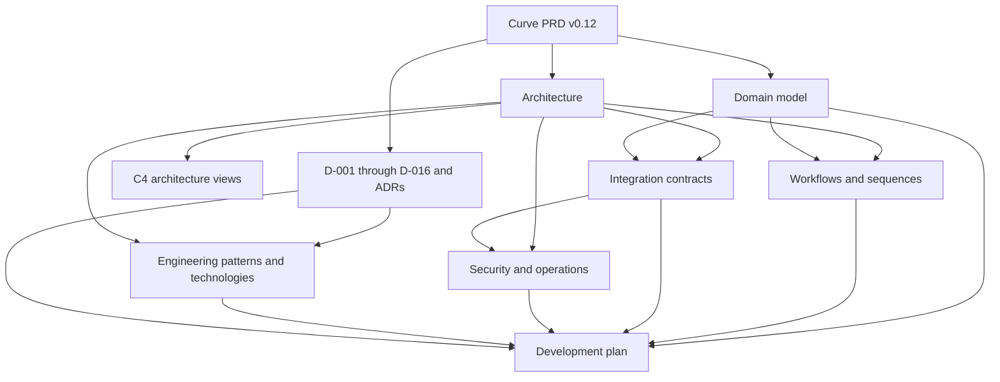

# Curve Technical Documentation

## Purpose

This directory is the architecture and implementation handoff derived from the [Curve PRD v0.12](../curve-ai-native-sdlc-prd.md) (product vision, Curve-first shell invariant, requirements, acceptance criteria, rollout, decision register, and accepted local Temporal proof). Together, these documents define the logical system, data model, workflows, integration boundaries, security posture, engineering patterns, technology decisions, and dependency-ordered development plan needed by human engineers and AI coding agents.

The suite is implementation-oriented. D-001 (Plane foundation, licensing, and
upgrade-boundary decision) is decided. D-003 (runtime topology and trust-zone
decision) is decided and implemented for `LOCAL_ONLY`; other agreed planning
directions remain `PROPOSED` until their named owners approve them. M0-S3
(local Temporal round-trip implementation packet), M0-S4 (API, SSE, and
minimal Curve-first UI implementation packet), and M0-S5A (telemetry kernel
and static observability assets) are accepted and merged. OBS-BIND-001 (local
Docker OTLP, Prometheus, Grafana, and path-health binding) is decided for local
development. M0-S5B (local observability integration proof) is accepted and
merged, completing M0-08 for `LOCAL_ONLY`. M0-S6A (durable parent/child
Temporal orchestration) is accepted and merged, completing the defined M0-06
(Temporal workflow-skeleton work package) for `LOCAL_ONLY`. M0-S9A (provider-neutral registry
and reconciliation foundation) has an approved synchronous-command and
explicit local outbox/inbox delivery model, published Option B registration
authority, and a previously authorized Plane implementation. [Curve PR #36](https://github.com/faocampo/curve/pull/36)
(six-finding M0-S9A contract correction) passed CI, received exact-head
approval, and squash-merged. Plane implementation remains paused until an
immutable external resumption record binds the canonical M0-S9A context,
revalidated Plane base, and Federico authorization. D-007 (MCP trust-model
decision) stays scoped to
MCP/Orca activation. An
implementation package
remains blocked until every decision scope named by its exact packet is
`DECIDED` and its remaining entry criteria pass. A separately authorized P0
proof may collect decision evidence under its bounded packet.

## Identifier readability convention

Every requirement, decision, work-package, or task-packet identifier is paired
with a short parenthetical description on first use in a section or compact
status update. Dense tables may use the identifier as the key when their
adjacent subject/deliverable cell supplies the same description. Common active
identifiers are:

- D-001 (Plane foundation, licensing, and upgrade-boundary decision).
- D-003 (runtime topology and trust-zone decision).
- D-007 (MCP trust and authorization decision).
- D-009 (retention, legal-hold, backup, and erasure decision).
- P0-06 (historical two-stage local Temporal proof work package).
- P0-06A (superseded isolated Temporal feasibility proof).
- P0-06B (superseded least-privilege Plane integration proof).
- M0-S1 (Curve module-shell implementation packet).
- M0-S2 (operation and delivery kernel implementation packet).
- M0-S3 (local Temporal round-trip implementation packet).
- M0-S4 (API, SSE, and minimal Curve-first UI implementation packet).
- M0-S5 (local audit and observability implementation packet).
- M0-S5A (telemetry kernel and static observability assets).
- M0-S5B (X3M local observability integration proof).
- M0-S6A (durable parent/child Temporal orchestration).
- M0-S9A (provider-neutral registry and reconciliation foundation).
- M0-S9B (external provider transport and administration).
- M0-03 (core authorization and policy kernel work package).
- M0-08 (audit and observability foundation work package).
- OBS-BIND-001 (local X3M OTLP/Prometheus/Grafana binding).

## Document set

| Document | Purpose | Primary authority |
| -------- | ------- | ----------------- |
| [Architecture](architecture.md) | Logical components, deployment profiles, trust zones, data/control flow, storage, orchestration, and operability | Component ownership and boundaries |
| [C4 architecture views](c4-architecture.md) | System context, containers, module components, actors, and relationships | Navigational diagrams derived from the Architecture and component contracts |
| [Domain model](domain-model.md) | Aggregates, entities, fields, cardinalities, invariants, persistence, versioning, and deletion | Curve data semantics |
| [Workflows and sequences](workflows-and-sequences.md) | Initiative, slice, agent, quality, VCS, contract, recovery, and Temporal execution flows | State-transition and orchestration behavior |
| [Integration contracts](integration-contracts.md) | Public API, commands, events, SSE, webhooks, adapters, idempotency, and reconciliation | Wire and provider boundaries |
| [Security and operations](security-and-operations.md) | Identity, authorization, data/evidence policy, isolation, threats, incident response, and service objectives | Security and production controls |
| [Engineering patterns and technologies](engineering-patterns-and-technologies.md) | Required implementation patterns, Plane extension strategy, technology baseline/candidates, and ADR rules | Engineering conventions and technology use |
| [Architecture decisions](architecture-decisions.md) | D-001-D-016 evidence, ownership, decision, and supersession process | ADR prerequisites and decision governance |
| [Development plan](development-plan.md) | Milestones, work packages, dependencies, traceability, tests, task packets, and AI-agent protocol | Delivery sequencing and Definition of Done |
| [Kanban delivery lifecycle](kanban-delivery-lifecycle.md) | User-facing delivery-board statuses from definition through monitored customer use and closure | Kanban projection and state-transition evidence |
| [M7 intelligence and automation extension](m7-intelligence-and-automation-extension.md) | Post-R1 charter for AI-expense governance, Gmail/Slack attention intake, and scheduled AI-agent jobs | Future-extension scope and entry gates; does not expand the active 70-item catalog |
| [Implementation-readiness review](review-analysis-and-remediation.md) | Prioritized gaps, closure evidence, owners, dependencies, and remediation status | Review record; never overrides the PRD or approved ADRs |
| [Plane foundation inventory](plane-foundation-inventory.md) (upstream, licensing, fork lineage, and accepted implementation base) | Selected upstream strategy, exact fork/upstream pins, candidate verification, community reuse/build matrix, commercial safeguards, and closure checks | Approved D-001 evidence; foundation `549db1a...`; current post-M0-S5A `preview` base `3992076...` |
| [ADR-001: Plane upstream foundation](adr-001-plane-upstream-foundation.md) | Decided updateable upstream baseline, fork workflow, proof results, consequences, rollback, approval, and review triggers | D-001 decision record; `DECIDED` on 2026-08-15 |
| [ADR-003: Runtime topology](adr-003-runtime-topology.md) | Local/non-local Temporal and Curve runtime boundary | SDK 1.31.0; shared local `dev_env`; direct loopback ports; private EKS/`ClusterIP`/VPN direction; authenticated non-local clients; M0-S3 proof and rollback |
| [D-003 local topology decision packet](d003-local-topology-decision-packet.md) | Historical 2026-08-18 least-privilege local network approval, proof, acceptance, and rollback evidence | `APPROVED_AND_MERGED` historical record; its two-network implementation contract is superseded by the amendment when effective |
| [D-003 private-platform connectivity amendment](d003-private-platform-connectivity-amendment.md) | Shared local network, private EKS deployment direction, service identity, security boundary, revised M0-S3 proof, and activation inputs | `EFFECTIVE`; approved head `5e165c...` merged as `aece539...` |
| [ADR-006: Orca human assistance](adr-006-orca-human-assistance.md) | Proposed developer-operated Orca MCP integration boundary | D-006 decision packet; owner/licensing approval pending |
| [ADR-007: MCP and Orca profile](adr-007-mcp-trust-and-orca-profile.md) | Proposed MCP trust registry and developer-operated Orca write-back allowlist | D-007 decision packet; security/platform approval pending |
| [ADR-009: Retention and erasure](adr-009-retention-and-erasure.md) | Required data-class/asset retention, hold, backup, and erasure decision | D-009 remains open and blocks protected storage/non-local activation |
| [M0 readiness board](m0-readiness-board.md) | Decision, package, owner, evidence, and blocking-state control | Operational coding-readiness source |
| [M0 authorization/state matrices](m0-authorization-and-state-matrices.md) | Core roles, authorization inputs, operation transitions, and Orca tool effects | M0 policy/state contract |
| [M0 traceability](m0-traceability.md) | Requirement-to-contract-to-test ownership | M0 verification control |
| [M0 local task packets](m0-local-skeleton-task-packets.md) (dependency-ordered local implementation packages and acceptance commands) | Independently reviewable Plane-fork implementation packages | M0-S1 through M0-S5B are complete for the local skeleton |
| [M0-S2 relational contract](../../contracts/database/m0-s2-relational-contract.md) | Physical persistence, uniqueness, lifecycle checks, transaction boundaries, relay recovery, and migration obligations for the operation and delivery kernel | Normative M0-S2 database contract |
| [M0-S2 implementation evidence](m0-s2-implementation-evidence.md) | Exact Curve contract revision, Plane base/head/merge, context digest, accepted tests, tree equivalence, status, and rollback | Accepted post-merge evidence for M0-02 and M0-05 |
| [M0-03 core policy task packet](m0-03-core-policy-task-packet.md) (dispatch contract for the authorization/policy kernel) | Exact Plane base, security decisions, scope, acceptance scenarios, commands, stop conditions, and rollback | `COMPLETED`; Plane PR #4 merged approved head `a807dd7...` as `922dd6d...` |
| [M0-03 implementation evidence](m0-03-implementation-evidence.md) (exact contract/context, Plane head/merge, validation, security acceptance, and rollback) | Post-merge acceptance record for the provider-neutral authorization kernel | `ACCEPTED_AND_MERGED`; required input to M0-S3 and downstream authorized packages |
| [M0-S3 implementation evidence](m0-s3-implementation-evidence.md) (exact context, Plane head/merge, tests, runtime proof, security acceptance, and rollback) | Post-merge acceptance record for the local Temporal round trip | `ACCEPTED_AND_MERGED`; Plane `preview` is `d99342f...`; M0-S4 and later Temporal packages consume this evidence |
| [M0-S4 implementation evidence](m0-s4-implementation-evidence.md) (exact context, Curve/Plane approvals and merges, API/SSE/UI tests, security/UX acceptance, and rollback) | Post-merge acceptance record for the Operation API, resumable SSE, and Curve-first Foundation experience | `ACCEPTED_AND_MERGED`; Plane `preview` is `e762fbb...`; M0-07 is complete and M0-S5A consumes this evidence |
| [M0-S5A implementation evidence](m0-s5a-implementation-evidence.md) (exact context, Curve/Plane approvals and merges, dual-mode full regression, telemetry security controls, and rollback) | Post-merge acceptance record for the local telemetry kernel and static observability assets | `ACCEPTED_AND_MERGED`; Plane `preview` is `3992076...`; M0-08 remains open for M0-S5B |
| [M0-S5B implementation evidence](m0-s5b-implementation-evidence.md) (exact context, CI, approved/merged trees, live OTLP, dashboard, alerts, redaction, disablement, cleanup, and rollback) | Post-merge acceptance record for the local observability platform binding | `ACCEPTED_AND_MERGED`; Plane `preview` is `1b06153...`; Curve evidence is `590a52e...`; M0-08 is `DONE_LOCAL` |
| [M0-S6A implementation evidence](m0-s6a-implementation-evidence.md) (exact contract, Plane head/merge, CI, runtime proof, acceptance boundary, and rollback) | Post-merge acceptance record for the model-free durable parent/child Temporal skeleton | `ACCEPTED_AND_MERGED / LOCAL_ONLY`; Plane `preview` is `ad5772c...`; M0-06 is `DONE_LOCAL` |
| [M0-03 policy relational contract](../../contracts/database/m0-03-policy-contract.md) (decision persistence, evaluation order, transactions, migration, and rollback) | Physical append-only policy-decision and audit-binding contract | Implemented in Plane merge `922dd6d...`; provider-specific extensions require their consuming decisions |
| [Core policy manifest](../../contracts/policy/core-policy-v1.json) (immutable v1 action allowlist and deny precedence) | Provider-neutral roles, classifications, environments, ACL/assignment requirements, target policy, and safe projections | Implemented immutable v1 policy ceiling; provider-specific policy remains gated |
| [Core policy v2 manifest](../../contracts/policy/core-policy-v2.json) (Option B role source and additive provider-registration action) | Plane workspace role `20` derives local M0-S9A `PLATFORM_ADMINISTRATOR`; registration evaluates existing workspace and exact fake-adapter target | Published by Curve PR #29; v1 remains byte-for-byte unchanged |
| [M0-S9A registration authorization decision](m0-s9a-registration-authorization-decision.md) (approved Option B Plane workspace-admin mapping and existing-workspace registration resource) | Human-readable security decision, exact allow/deny dimensions, alternatives, and implementation evidence | `PUBLISHED` at Curve squash commit `7ea9118...` |
| [M0-S4 foundation probe experience](ux-m0-s4-foundation-probe.md) (clickable local foundation-status flow, state contract, and review script) | Approved UX-004-M0-S4/UX-005-M0-S4 contract for the Operation API, resumable SSE, cancellation, recovery, and minimal workspace UI | `IMPLEMENTED_AND_ACCEPTED`; PR #17 head `a463876...` merged as `42ea329...`; Plane implementation and acceptance are recorded in the M0-S4 evidence document |
| [OBS-BIND-001 local observability binding](obs-bind-001-local-observability-binding.md) (decided Docker OTLP, Prometheus, Grafana, health, cleanup, and promotion contract) | Exact local platform binding and five-checkpoint M0-S5B implementation handoff | `DECIDED_LOCAL_ONLY`; published at Curve `43480ca...` and consumed by M0-S5B |
| [M0-S5 observability task packet](m0-s5-observability-task-packet.md) (safe telemetry kernel, local binding proof, tests, evidence, and rollback) | Independently reviewable M0-S5A telemetry-kernel and M0-S5B local-integration changes | `M0-S5A_ACCEPTED_AND_MERGED / M0-S5B_ACCEPTED_AND_MERGED` |
| [M0-S9A provider-registry task packet](m0-s9a-provider-registry-task-packet.md) (corrected local provider persistence, Option B authorization, synchronous reconciliation, delivery ordering/recovery, replay, event payloads, acceptance, stop conditions, and rollback) | First independently reviewable child of M0-09; excludes public administration, credentials, callbacks/webhooks, schedules, background execution, and real adapters | `CORRECTION_MERGED / IMPLEMENTATION_PAUSED`; [Curve PR #36](https://github.com/faocampo/curve/pull/36) (six-finding M0-S9A contract correction) is merged, and the previously authorized Plane implementation remains paused until an immutable external resumption record binds the canonical M0-S9A context, revalidated Plane base, and explicit Federico authorization; D-007 is MCP/Orca-specific |
| [M0-S5 telemetry manifest](../../contracts/observability/m0-s5-telemetry-v1.json) (fail-closed exporter, bounded metrics, spans, logs, dashboard, four alerts, and redaction contract) | Normative v1 instrumentation and operational-asset surface | Export defaults to disabled; exporter-failure diagnostics stay process-local; X3M endpoint/datasource/alert/path-health binding is supplied separately |
| [M1-M7 coding-agent task packets](m1-m7-task-packets.md) | Milestone package outcomes, material gates, executable evidence, rollback, and deterministic materialization rules | Prepared catalog; Federico Ocampo is default owner/reviewer until reassigned |
| [P0-06 local Temporal proof packet](p0-06-local-temporal-proof-task-packet.md) | Historical P0-06A/P0-06B standalone-proof design and supersession record | `SUPERSEDED`; retained for audit, with M0-S3 as the executable proof |
| [P0-06 stage record](proofs/p0-06-stage-record.json) | `curve.proof-stage-projection/v3` terminal supersession binding | `P0-06_SUPERSEDED`; D-003 `LOCAL_ONLY` and replacement M0-S3 are machine validated |
| [GitHub Project tracking map](github-project-execution-map.md) | Seventy-package visual catalog plus explicit packet checkpoints, read-only context inspection, and bounded status reconciliation | Administrative status tracking; status is informational, while task packets and execution controls remain authoritative |
| [Machine-readable contracts](../../contracts/README.md) | OpenAPI, JSON Schema, MCP, SSE, provider, operation, and Temporal contracts | Normative wire/schema source |

## Authority and conflict order

1. The PRD's scope invariants, numbered requirements, and acceptance criteria.
2. Approved ADRs resolving D-001-D-016.
3. Normative state/cardinality/security rules in this suite.
4. Generated and approved OpenAPI, event, JSON Schema, and provider-contract artifacts.
5. The development backlog and individual task packets.

A lower item cannot weaken a higher item. When a conflict is found, implementation stops, the conflict is recorded, and the owning document is corrected and reviewed. Silent interpretation by an AI coding agent is prohibited.

## Reading order

1. Read the PRD and its decision register.
2. Read Architecture, C4 Architecture Views, and Domain Model to understand boundaries and truth ownership.
3. Read Workflows and Sequences with Integration Contracts to understand commands, states, events, and failure behavior.
4. Read Security and Operations before selecting credentials, providers, destinations, runners, or deployment topology.
5. Read Engineering Patterns and Technologies before creating component designs or code conventions.
6. Use the Development Plan to materialize approved, repository-local task packets.

## Documentation dependency map

## Versioning

- Each document has its own version and source PRD version.
- A behavioral or wire-contract change increments the affected document and schema versions and includes migration/compatibility impact.
- A clarification with no behavior change may increment the patch version.
- Active task packets pin exact document, ADR, schema, policy, repository-base, and context versions.
- Updating documentation never changes an active task silently; the PRD impact process decides continue-pinned, pause, cancel, or re-plan.

## Architecture readiness versus coding readiness

This suite may be used to complete architecture while some decision-register items remain open. It is coding-ready only package by package:

- The package's decision prerequisites are approved.
- Its component, domain, API/event, workflow, security, migration, and test contracts are complete.
- It has one target repository and pinned base SHA.
- Its task packet meets the Development Plan entry criteria.

## Contract and generated artifacts

The normative M0 contract source is now versioned under [`contracts/`](../../contracts/README.md). Implementations and generated clients must record the exact Curve repository commit. Later milestones add:

- Generated API examples/clients from the Curve OpenAPI document.
- Additional JSON Schemas for Context Manifests, task packets, policy, and delivery contracts.
- Temporal workflow compatibility/replay fixtures.
- Provider adapter conformance suites and fake providers.
- Database migration and ERD outputs.
- Threat model and data-flow diagrams.
- SBOMs, provenance attestations, third-party notices, and corresponding-source manifest.
- Acceptance trace report for AC-01-AC-60.

Generated implementation paths in Plane depend on the reviewed D-001 module mapping; the normative source remains in the Curve repository.
