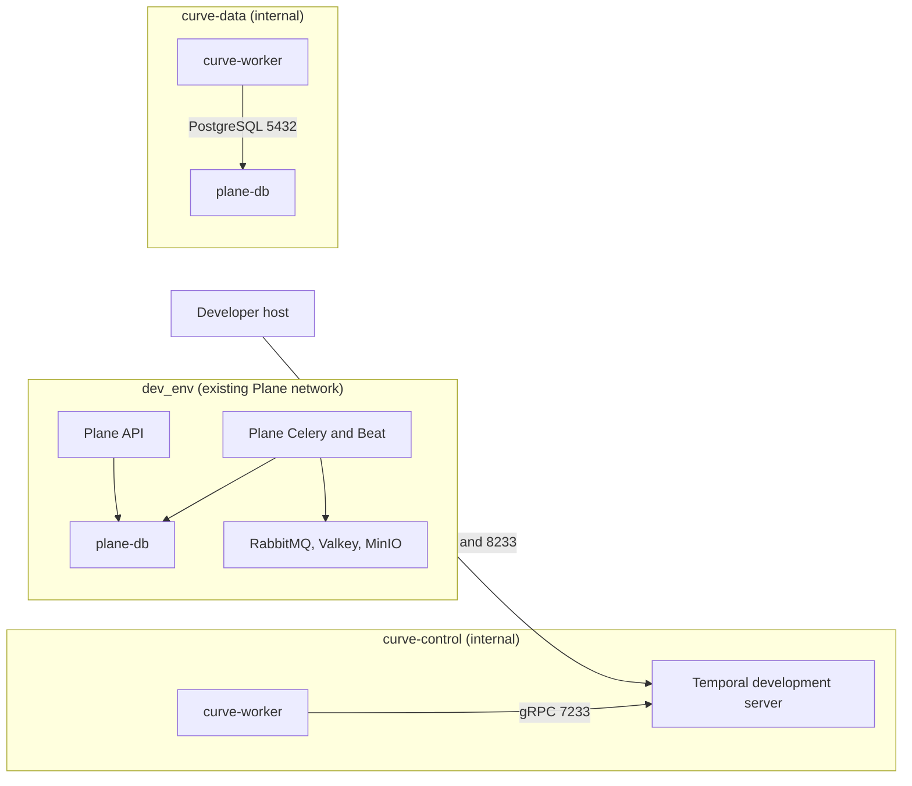

# ADR-003: Curve Runtime Topology and Temporal Profile

- Status: DECIDED for `LOCAL_ONLY`; non-local scopes remain OPEN
- PRD decision: D-003 (runtime topology and trust-zone decision)
- Owner: Federico Ocampo, CTO at X3M
- Reviewers: Federico Ocampo (`faocampo`) as Curve engineering approver and interim human reviewer
- Decision date: 2026-08-18
- Approved head: `7826f4031a6f3862ed29d48c9f16292e8a1ab8bb`
- Merge commit: `097016ffe2eb259cc780ad2a6cd41ca3422366b2`
- Required by: M0-S3 (local Temporal round-trip implementation packet)
- Supersedes: the shared-`dev_env` candidate and the standalone P0-06A/P0-06B proof sequence

## Context and constraints

X3M already provides its local, staging, and production topology on Kubernetes
and AWS, PostgreSQL, Secrets Manager, S3/KMS-compatible object storage,
identity, networking and egress controls, Prometheus/Grafana, logs, and
tracing. Curve adds Temporal, gVisor, and OpenHands. Plane's existing Celery
workers continue to own existing Plane behavior. Temporal owns durable Curve
lifecycle orchestration.

This decision is intentionally scoped to local development with synthetic data.
It supplies the topology required by M0-S3 (local Temporal round-trip
implementation packet). Staging and production remain fail closed pending
separate D-003 (runtime topology and trust-zone decision) scopes with named
Platform Operations, Security, database, and on-call owners.

## Decision drivers and weighted criteria

1. Durable, replay-safe human and provider waits.
2. Minimal network and credential reachability from the Curve worker.
3. Reuse of the existing Plane Docker stack without changing its default path.
4. Deterministic ARM64 and x86-64 local development.
5. Recoverability, versioned workflows, and simple rollback.
6. One implementation that also supplies the local proof evidence.

## Options considered

1. **Selected:** a Curve-only Compose overlay with a dedicated Temporal control
   network and a dedicated Curve data network.
2. Shared Plane `dev_env`: rejected because it exposes unrelated local Plane
   services and application settings to the Curve worker.
3. Isolated P0-06A followed by integrated P0-06B: superseded because P0-06B
   duplicates the M0-S3 implementation and acceptance evidence.
4. Temporal Cloud: deferred pending procurement, residency, security, support,
   and cost review.
5. Celery-only orchestration: rejected because it does not satisfy Curve's
   durable history, timer, replay, and workflow-versioning contract.

## Evidence and proof results

Curve PR #9 published the decision packet at approved head
`7826f4031a6f3862ed29d48c9f16292e8a1ab8bb`. Its documentation-contract check
passed, and it was squash-merged to `main` as
`097016ffe2eb259cc780ad2a6cd41ca3422366b2` on 2026-08-18.

The accepted Plane base is fork `preview` at
`eff8686a69aa112ea8fda79be0e1316dc1fd97d6`. It contains the existing Plane
Docker stack and completed M0-S2 (operation and delivery kernel implementation
packet). Temporal is not present at that base. Runtime evidence will therefore
be produced by M0-S3 itself against its exact dispatched Plane base.

## Decision

### Approved local component pins

| Component | Approved local pin | Source and constraint |
| --- | --- | --- |
| Temporal CLI development image | `docker.io/temporalio/temporal:1.8.1@sha256:59561b9ef060eaeb1f46cb6a1842d6cbdd8a393eb3b6d315ecef5fe2f0b1d7a6` | [Temporal CLI v1.8.1](https://github.com/temporalio/cli/releases/tag/v1.8.1); multi-architecture index pinned by digest. |
| Embedded Temporal Server | `1.31.2` | [Temporal Server v1.31.2](https://github.com/temporalio/temporal/releases/tag/v1.31.2); local development only. |
| Temporal Python SDK | `temporalio==1.31.0` | [Temporal Python SDK v1.31.0](https://github.com/temporalio/sdk-python/releases/tag/v1.31.0) and [PyPI 1.31.0](https://pypi.org/project/temporalio/1.31.0/); Python 3.10+ and musllinux wheels for x86-64 and ARM64. |

### Approved two-network Compose-overlay topology

Curve adds `docker-compose-curve.yml` (Curve-only local Compose overlay).
Developers invoke it with `docker-compose-local.yml` (existing Plane local
stack) and the `curve` profile. Running the existing Plane command without the
overlay leaves the baseline Compose model unchanged.

`curve-worker` is one container attached to `curve-control` and `curve-data`.
`plane-db` is the existing database container attached to `dev_env` and
`curve-data`. The Curve networks are Docker `internal` networks. Temporal has
no Plane-network attachment or Plane credential. The worker receives no
RabbitMQ, Valkey, MinIO, AWS, SMTP, VCS, provider, production, or
user-delegation endpoint or credential.

### Service and environment contract

| Boundary | Local contract |
| --- | --- |
| Activation | `curve` profile in the Curve-only overlay; disabled by default. |
| Temporal | `temporal server start-dev`; namespace `curve-local`; task queue `curve-control-plane-v1`; Curve-specific disposable SQLite volume; loopback-only host ports `7233` and `8233`; health check. |
| Worker | Dedicated entrypoint built from the compatible Plane API image; no Celery process or queue; no published port. |
| Worker settings | `DJANGO_SETTINGS_MODULE=plane.settings.curve_worker`; only database, Curve-enable/workspace allowlist, Temporal address/namespace/task queue/identity, and bounded log-level settings. |
| Database | Existing `plane-db`; PostgreSQL remains authoritative for Curve business state. |
| Temporal payloads | Workspace and operation IDs, versions, digests, classifications, safe enums, correlation IDs, and error codes only. |
| Data | Synthetic `INTERNAL` fixtures; sentinel values prove protected bodies and credentials do not enter history, logs, or telemetry. |
| Workflow identity | `curve:{workspace_id}:{operation_id}`. |

The exact Temporal CLI flags must be verified against the pinned image during
M0-S3 (local Temporal round-trip implementation packet). The lockfile records
the SDK package and artifact provenance when the dependency is added.

### Executable proof

M0-S3 (local Temporal round-trip implementation packet) is the sole executable
proof for this local decision. It must demonstrate:

1. the existing Plane stack remains healthy with the overlay absent;
2. the resolved overlay contains only the approved services, networks, ports,
   environment variables, volume, and image pins;
3. duplicate outbox delivery produces exactly one workflow effect;
4. a worker restart after a committed activity effect does not duplicate the
   database mutation;
5. cancellation reaches a terminal state without orphaned work;
6. committed histories replay without nondeterminism;
7. the worker cannot reach RabbitMQ, Valkey, MinIO, private/metadata
   destinations, or the public internet;
8. Temporal history, application state, logs, metrics, and traces contain none
   of the sentinel protected strings;
9. removing the overlay/profile returns to the unchanged Plane local stack.

P0-06A (isolated Temporal feasibility proof) and P0-06B (least-privilege Plane
integration proof) are `SUPERSEDED` standalone gates. Their historical packet
and Git history remain audit evidence; they provide no current dispatch or
execution authority.

## Security, privacy, licensing, and operational impact

The local profile uses synthetic data and loopback-only host access. Internal
networks and the environment allowlist bound the worker's reach. PostgreSQL
retains business truth; disposable Temporal SQLite retains only local workflow
history. The Temporal CLI image and Python SDK retain their upstream licenses
and notices in the implementation's dependency and image inventory.

Staging and production remain blocked until named owners decide region,
residency, Kubernetes namespace, image/chart digests, persistence and
visibility stores, credentials, mTLS and authorization, payload encryption,
backup/restore, RPO/RTO, disaster recovery, capacity, observability, on-call,
cost, and upgrade/rollback procedures.

## Data/API/event/migration compatibility impact

Temporal workflow inputs use versioned contract objects containing approved
identifiers and digests. Workflow changes use explicit version markers and
replay tests. M0-S3 adds no database migration unless its separately reviewed
contract demonstrates that an additive Curve-owned field or index is required.
Existing Plane tables, APIs, Celery tasks, services, and user-facing behavior
remain unchanged.

## Failure, rollback, and exit strategy

Disable relay dispatch, stop the Curve worker and Temporal service, and invoke
Plane without the Curve overlay. Preserve PostgreSQL operation and audit state
for inspection. The Temporal SQLite volume may be deleted only through an
explicit Curve-only cleanup command. Revert the M0-S3 implementation commit if
the local profile is not accepted. Existing Plane volumes and schemas are never
removed as part of this rollback.

## Implementation consequences and affected work packages

- M0-S3 (local Temporal round-trip implementation packet) may be materialized
  after M0-03 (core authorization and policy kernel) is implemented and its
  exact Plane base, Curve governance revision, owner, reviewer, context digest,
  commands, and Project item are pinned.
- M0-06 (Temporal workflow-skeleton work package) consumes the M0-S3 evidence.
- P0-06 (historical two-stage local Temporal proof work package) becomes
  `Done/SUPERSEDED` visual history.
- Staging/production M0, gVisor/OpenHands M4, and preview M6 packages still
  require their applicable non-local D-003 decisions.

## Approval record and review date

| Field | Value |
| --- | --- |
| Decision | D-003 (runtime topology and trust-zone decision), `LOCAL_ONLY` |
| Approver | Federico Ocampo, CTO at X3M |
| Approved exact head | `7826f4031a6f3862ed29d48c9f16292e8a1ab8bb` |
| Approval date | 2026-08-18 |
| Repository evidence | [Curve PR #9](https://github.com/faocampo/curve/pull/9), green `validate`, squash merge `097016ffe2eb259cc780ad2a6cd41ca3422366b2` |
| Approved SDK | `temporalio==1.31.0` |
| Approved topology | Curve-only Compose overlay; `curve-control` and `curve-data` internal networks |
| Superseded gates | P0-06A (isolated Temporal feasibility proof) and P0-06B (least-privilege Plane integration proof) |
| Executable proof | M0-S3 (local Temporal round-trip implementation packet) |
| Excluded authority | Staging, production, AWS/Kubernetes provisioning, gVisor, OpenHands, protected data, external providers, production credentials, and deployment |
| Review trigger | A new environment, network path, credential, data classification, persistence product, SDK/server major version, or rollback model requires a new scoped decision. |
