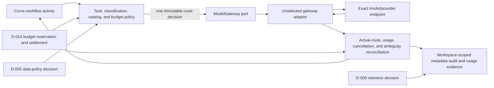

# ADR-004: Candidate Curve Model Gateway Architecture

## Document control

| Field | Value |
| --- | --- |
| Decision | D-004 (Model Gateway architecture decision) |
| Work package | M0-S9C1A (candidate Model Gateway architecture and data-policy contracts) |
| Status | `PROPOSED_NOT_NORMATIVE / UNSELECTED / NO_DISPATCH` |
| Version | 0.1 |
| Date | 2026-08-31 |
| Surveyed Curve base | `1c38a5398b9e6c7cf83c8ee7e8a4615f8f2450d1` |
| Decision owners | AI Platform, Platform Operations, Security, and FinOps; named humans unresolved |
| Activation | Candidate-contract review only; no implementation, provider access, model call, credential use, protected-data handling, deployment, or infrastructure change |

## Decision question

Select the Curve-owned architecture that mediates every future model call,
enforces the exact task/data/budget policy before transport, records requested
and actual routing, normalizes usage and failure, supports cancellation and
reconciliation, and remains replaceable behind one `ModelGateway` port.

This ADR supplies a closed decision surface. It does not select an option. The
[D-004 candidate decision record](../../contracts/governance/d004-model-gateway-architecture-v1.json)
(unselected architecture alternatives, exact port boundary, evidence gaps,
dependencies, approvals, and fail-closed activation) is the machine companion.

## Fixed invariants

Every non-deferred architecture must satisfy these invariants:

- Curve resolves workspace, task, classification, policy, catalog, prompt,
  context, and budget versions before transport.
- A caller cannot select a model, provider, endpoint, region, fallback, or
  provider policy.
- Provider defaults, floating aliases, and silent model/provider substitution
  are disabled.
- Requested and actual model/provider/endpoint identities are reconciled before
  success and usage settlement.
- An ambiguous charge is reconciled before another chargeable call.
- Credentials never reach coding agents, Temporal history, prompts, evidence,
  logs, traces, metrics, or safe errors.
- Raw prompts, completions, reasoning, and tool bodies stay out of ordinary
  telemetry and relational safe projections.
- Unknown provider errors are terminal or reconciliation-required until a
  reviewed normalizer classifies them.
- Every persisted key, policy evaluation, invocation, usage record, event, and
  authorization request is workspace scoped.
- This candidate decision can authorize only successor contract preparation.
  Runtime calls and implementation dispatch require separate task-packet and
  execution authority.

## Material alternatives

| Decision surface | Alternatives | Unselected consequence |
| --- | --- | --- |
| Component boundary | `IN_PROCESS_CURVE_GATEWAY`; `DEDICATED_CURVE_GATEWAY_SERVICE`; `DEFER` | No deployable component boundary exists. |
| Provider transport | `OPENROUTER_HTTP_V1`; `OPENROUTER_OFFICIAL_SDK_V1`; `PROVIDER_NEUTRAL_OTHER`; `DEFER` | No API/SDK, version, endpoint, or supply-chain profile is approved. |
| Chargeable-attempt routing | `SINGLE_EXACT_ROUTE_NEW_AUDITED_FALLBACK_ATTEMPT`; `IMMUTABLE_EQUIVALENT_ROUTE_ENVELOPE`; `DEFER` | No fallback or provider routing may occur. |
| Response delivery | `BUFFERED_ONLY`; `NORMALIZED_STREAM_EVENTS`; `DEFER` | Streaming behavior and replay semantics remain disabled. |
| Ambiguous-result reconciliation | `PROVIDER_REQUEST_ID_AND_USAGE`; `FAIL_AMBIGUOUS_NO_RETRY`; `DEFER` | Ambiguous calls pause without another charge. |
| Deployment shape | `API_PROCESS`; `DEDICATED_WORKER_PROCESS`; `DEDICATED_SERVICE`; `DEFER` | No runtime topology is implied. |
| Telemetry | `METADATA_ONLY_OTEL`; `PROTECTED_TRACE_STORE`; `DEFER` | Only existing non-model telemetry may run. |
| Replacement | `MODEL_GATEWAY_PORT_CONFORMANCE`; `DEFER` | No implementation is accepted behind the port. |

### Candidate recommendation, not a decision

`SINGLE_EXACT_ROUTE_NEW_AUDITED_FALLBACK_ATTEMPT` is the candidate routing
recommendation for owner review. One chargeable attempt receives one exact
model, provider, endpoint, prompt policy, data policy, and budget reservation.
A D-005 (model/provider data-policy decision)-approved equivalent fallback
creates a new attempt with a new idempotency digest, reservation, actual-route
record, and audit lineage.

This recommendation is deliberately unselected in both D-004 (Model Gateway
architecture decision) and D-005 (model/provider data-policy decision). The
alternative immutable equivalent-route envelope remains available for review.

## Candidate architecture

The `ModelGateway` port exposes exactly `GENERATE`, `STREAM`, `COUNT_TOKENS`,
`CANCEL`, and `REPORT_USAGE`. Every request binds:

- workspace and operation identity;
- task class and normalized classification;
- prompt-package and context digests;
- immutable task policy and model-catalog versions/digests;
- D-014 (budget accounting and exception policy) version;
- maximum input/output tokens, deadline, and idempotency digest.

Safe results expose invocation/status, requested route, actual model/provider/
endpoint, token usage, integer micro-USD cost, response digest, and normalized
error code. Protected bodies use separately authorized object references only
after D-009 (retention, backup, legal-hold, and erasure decision).

## Failure and recovery contract

| Condition | Candidate normalized result | Allowed next action |
| --- | --- | --- |
| Invalid policy or classification | `POLICY`, `DATA_CLASSIFICATION`, or `NO_ELIGIBLE_ROUTE` | Correct the governing input; no call or reservation. |
| Budget reservation denied | `BUDGET_EXHAUSTED` | Pause; D-014 (budget accounting and exception policy) governs any exception. |
| Authentication or authorization failure | `AUTHENTICATION` or `AUTHORIZATION` | Revoke/quarantine the connection and notify the owner. |
| Rate limit or bounded transient failure | `RATE_LIMIT` or `TRANSIENT` | Retry only when the selected architecture and same exact route permit it. |
| Timeout or cancellation | `TIMEOUT` or `CANCELLED` | Reconcile provider request and usage before terminal settlement. |
| Missing or contradictory actual route | `AMBIGUOUS_RESULT` | Reject success and reconcile; never accept the body as trusted output. |
| Missing or conflicting usage | `USAGE_UNSETTLED` | Hold reservation and pause later chargeable work under D-014. |
| Unknown provider failure | `TERMINAL` | No string-matched retry or fallback. |

## Required evidence before decision

The machine decision requires passing, digest-bound evidence for:

1. exact OpenRouter API/account/profile;
2. authentication secret-reference lifecycle;
3. request, stream, cancellation, and late-event behavior;
4. timeout, retry, rate-limit, and concurrency bounds;
5. actual-route and usage evidence;
6. telemetry redaction and body-leak scans;
7. availability ownership, kill switch, and recovery;
8. license, terms, and supply-chain review;
9. replacement-port conformance; and
10. D-014 budget reservation/settlement port binding.

Relevant capability descriptions are OpenRouter
[provider selection](https://openrouter.ai/docs/guides/routing/provider-selection)
(provider order, allowlists, fallback controls, and routing preferences),
[model fallbacks](https://openrouter.ai/docs/guides/routing/model-fallbacks)
(ordered model fallback behavior), and
[Zero Data Retention](https://openrouter.ai/docs/guides/features/zdr)
(request and endpoint ZDR controls). These sources do not establish X3M account
configuration, contract terms, exact endpoints, entitlements, or measured
behavior; those remain owner-provided decision evidence.

## D-014 dependency

D-014 (budget accounting and exception policy) remains a future material
decision. Every chargeable invocation must reserve a maximum integer micro-USD
amount before transport, settle actual usage against that reservation, preserve
ambiguous usage as unsettled, and pause on exhaustion. Provider failure cannot
change model, provider, price, policy, or budget. No candidate model or task
policy becomes active without a digest-bound D-014 decision.

## Promotion and stop conditions

D-004 (Model Gateway architecture decision) remains `PROPOSED` until all eight
material options, four named owners, ten evidence requirements, four distinct
human approvals, decision timestamp, review timestamp, and decision digest are
complete. `DEFER` is an explicit valid outcome.

Stop if a proposal selects an option, enables a model route, contains a
credential or protected body, relies on provider defaults, invents a budget,
or claims implementation/runtime authority. After a human decision, publish a
new reviewed normative revision and separately prepare M0-S9C1B (runtime Model
Gateway interface contracts) before any Plane implementation.
