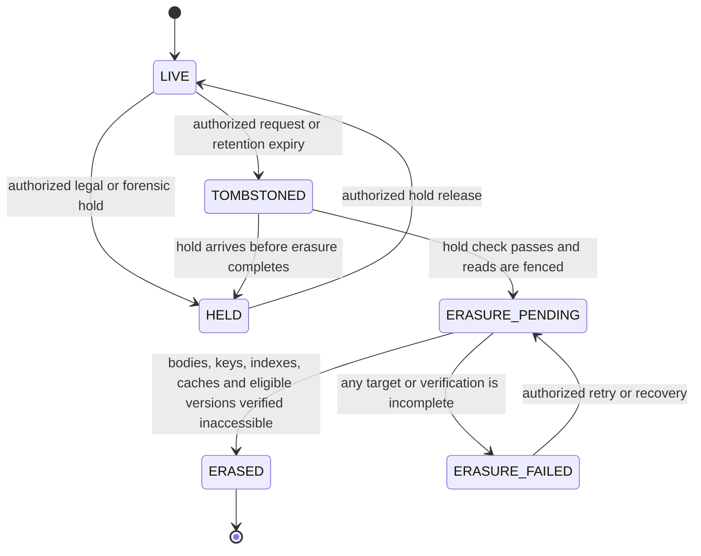

# ADR-009: Retention, Legal Hold, Backup, and Erasure

- Status: OPEN
- PRD decision: D-009
- Owner: Security, Privacy, and Legal
- Reviewers: Platform Operations, database operations, Curve engineering
- Decision date: Pending policy decision
- Required by: M0-04 and every staging/production activation
- Supersedes: None

## Context and constraints

Curve may handle evidence, prompts, transcripts, source code, patches, logs, reports, previews, exports, audit metadata, and provider observations across `INTERNAL`, `CONFIDENTIAL`, and `RESTRICTED` classifications. The implementation must not invent retention periods or claim erasure while recoverable copies remain outside the approved policy.

## Decision drivers and weighted criteria

1. X3M legal, privacy, contractual, and security obligations.
2. Data minimization and reliable deletion.
3. Evidence/audit integrity and legal-hold precedence.
4. Backup recoverability and post-restore re-erasure.
5. Operational feasibility and cost.

## Options considered

1. Class-by-asset policy with immutable non-sensitive audit metadata and separately erasable protected bodies.
2. One global retention period: rejected because asset/class obligations differ.
3. Permanent retention: rejected as the default because it violates minimization.
4. Ephemeral-only protected data: conservative fallback for approved local proofs, not a production policy.

## Required decision matrix

Named owners must supply a period and behavior for each classification and asset category: evidence bodies, derived artifacts, prompts/responses, transcripts, patches/candidate trees, quality logs/reports, previews, exports, provider payloads, audit metadata, tombstones, database backups, object-store versions, and forensic quarantine.

Each cell records active period, deletion eligibility, legal-hold behavior, body-versus-metadata split, backup expiry, cryptographic-erasure method, restore behavior, owner, authority, and review cadence. Blank cells block the affected capability.

### Asset inventory and storage boundary

| Asset class | Body location | Minimum retained metadata after lawful body erasure | External-copy concern |
| --- | --- | --- | --- |
| Evidence and research bodies | Protected object storage | Workspace, source/citation reference, digest, classification, envelope/policy version, creation and erasure receipt | Originating source and Onyx cache follow their own owner-approved policy; Curve must not claim their deletion. |
| Derived PRD, plan, roadmap, architecture and Context Pack bodies | Protected object storage; only sanitized Context Manifest may enter Git | Artifact/version IDs, digest, lineage, gate subject, policy version, tombstone/erasure receipt | Approved model/provider copies and explicitly planned repository-safe derivatives. |
| Prompts, model responses and model traces | Protected object storage or approved trace provider only | Request/result digest, provider/model/prompt-policy versions, classification, usage, outcome and erasure receipt | Provider retention/training/ZDR contract from D-005. |
| Human/agent transcripts and questions | Protected object storage | Attempt/question IDs, participants/effective principal, timestamps, state, digest and erasure receipt | MCP/Orca/OpenHands transient or provider-held copies. |
| Candidate trees, patches and sandbox output | Quarantine then protected object storage | Attempt, repository/base, candidate digest, provenance, disposition and erasure receipt | Developer-local/VCS copies are outside Curve unless linked; controller-created Git commits follow VCS policy. |
| Quality logs, reports, findings and attestations | Protected object storage plus normalized PostgreSQL metadata | Commit/tool/rulepack/policy digests, normalized findings/dispositions, outcome and erasure receipt | Scanner/provider logs and CI artifacts. |
| Previews | Ephemeral runtime/object storage | Build/source digest, access policy, created/expired/deleted time and receipt | CDN/gateway logs and caches. |
| Exports | Protected export staging; authorized recipient destination after delivery | Requester, purpose, scope/digest, destination class, delivery and expiry receipt | Delivered recipient copy is governed by destination policy and must be disclosed before export. |
| Raw provider callbacks/payloads | Quarantine/protected object storage only when required for reconciliation | Provider connection, external reference/digest, received time, normalized event and deletion receipt | Provider remains authoritative for its own state/copy. |
| Audit and lineage metadata | Append-only PostgreSQL and approved backup | Lawful non-sensitive event, actor/effective principal, action, subject/version/digest, result and erasure event | Log/SIEM projections must use the same or stricter approved policy. |
| Tombstones and erasure receipts | PostgreSQL; receipt body protected if necessary | Workspace, object/digest reference, policy/authority, requested/eligible/completed times, method, verification outcome | None beyond approved audit/backup projections. |
| Database backups/object versions | X3M-approved encrypted backup/version stores | Backup/catalog identifier, coverage window, key/policy version, expiry and destruction/restore ledger | Cross-region/archive/vendor copies must be enumerated before approval. |
| Forensic quarantine | Isolated security-owned encrypted store | Incident/case reference, classification, authority, hold, digest, custody and final disposition | Security tools or investigators receiving a copy must be named policy destinations. |

### Owner-completed period matrix

Every `TBD` is a deliberate blocking value. Periods use an explicit unit and start event; terms such as “short,” “standard,” or “indefinite” are invalid. `RESTRICTED` does not inherit a less restrictive period automatically.

| Asset class | `INTERNAL` active/backup period | `CONFIDENTIAL` active/backup period | `RESTRICTED` active/backup period | Start event | Deletion trigger and lawful metadata split | Accountable owner/authority |
| --- | --- | --- | --- | --- | --- | --- |
| Evidence/research body | `TBD` / `TBD` | `TBD` / `TBD` | `TBD` / `TBD` | `TBD` | `TBD` | Security + Privacy + Legal: named person required |
| Derived artifact/Context Pack body | `TBD` / `TBD` | `TBD` / `TBD` | `TBD` / `TBD` | `TBD` | `TBD` | Product records + Legal: named person required |
| Prompt/response/model trace | `TBD` / `TBD` | `TBD` / `TBD` | `TBD` / `TBD` | `TBD` | `TBD`; align provider contract | AI governance + Privacy: named person required |
| Transcript/question body | `TBD` / `TBD` | `TBD` / `TBD` | `TBD` / `TBD` | `TBD` | `TBD` | Product records + Privacy: named person required |
| Candidate/patch/sandbox output | `TBD` / `TBD` | `TBD` / `TBD` | `TBD` / `TBD` | `TBD` | `TBD`; distinguish linked Git copy | Engineering + Security: named person required |
| Quality log/report body | `TBD` / `TBD` | `TBD` / `TBD` | `TBD` / `TBD` | `TBD` | `TBD`; normalized finding retention separate | AppSec + Engineering: named person required |
| Preview body/runtime | `TBD` / N/A | `TBD` / N/A | Default denied unless explicitly approved | Create or last authorized use: `TBD` | Automatic TTL deletion plus receipt: `TBD` | Product + Security: named person required |
| Export staging/body | `TBD` / `TBD` | `TBD` / `TBD` | Default denied unless explicitly approved | Export completion: `TBD` | Staging deletion and destination disclosure: `TBD` | Privacy + Data owner: named person required |
| Raw provider payload | `TBD` / `TBD` | `TBD` / `TBD` | `TBD` / `TBD` or denied | Normalization/reconciliation: `TBD` | `TBD`; provider contract separate | Integration owner + Security: named person required |
| Audit/lineage metadata | `TBD` / `TBD` | Same non-sensitive schema; body excluded | Same non-sensitive schema; body excluded | Event time: `TBD` | Lawful field minimization/erasure exception: `TBD` | Legal + Security audit owner: named person required |
| Tombstone/erasure receipt | `TBD` / `TBD` | `TBD` / `TBD` | `TBD` / `TBD` | Erasure completion: `TBD` | Never contain recoverable body/key: `TBD` | Legal + Security audit owner: named person required |
| Forensic quarantine | Case-based `TBD` / `TBD` | Case-based `TBD` / `TBD` | Case-based `TBD` / `TBD` | Case closure or hold release: `TBD` | Custody/final disposition: `TBD` | Incident owner + Legal: named person required |

### Backup, object-version, hold, and restore matrix

| Decision field | Required approved value |
| --- | --- |
| PostgreSQL backup products, regions/accounts and catalog owner | `TBD`; enumerate full/incremental/PITR copies and replicas. |
| Object-store versioning/replication/archive products and regions/accounts | `TBD`; enumerate delete markers, non-current versions, multipart uploads and replication lag. |
| Backup period and destruction verification per data class | `TBD`; must not exceed the approved matrix without a documented lawful exception. |
| Envelope/key hierarchy for cryptographic erasure | `TBD`; define workspace/class/object key boundary, rotation, destruction authority and proof. |
| Legal-hold authority and scope | `TBD`; named roles/persons, case ID, objects/derivatives/backups covered, start/review/release procedure. |
| Hold precedence and conflicting requests | Hold blocks physical/key deletion but may fence reads; `TBD` authority resolves conflicts and records rationale. |
| Restore quarantine | Restored data is inaccessible to normal services until deletion/hold ledgers replay and post-restore verification passes. |
| Restore re-erasure maximum time | `TBD`; measured from restore completion and included in RTO feasibility. |
| Provider/external-copy deletion | `TBD` per approved connection; receipt or contract evidence required before Curve reports external-copy completion. |
| Failed/partial erasure escalation | `TBD` retry schedule, incident severity, owner, customer/data-owner notice and manual recovery. |
| Cost/capacity | `TBD` estimate for active bodies, versions, backups, quarantine, receipts and deletion scans. |

### Erasure state machine

`ERASED` is declared only for Curve-controlled copies covered by the receipt. External destinations have independent completion fields. A late hold cannot reconstruct an erased body. A restore never changes an `ERASED` ledger entry back to `LIVE`; restored bytes covered by it are quarantined and re-erased.

### Policy precedence and versioning

1. Applicable law, contract, litigation/forensic hold and approved authority determine eligibility; a product preference cannot shorten a required hold or lengthen retention without approval.
2. The most restrictive source Access Envelope propagates to derived bodies until an authorized, evidenced transformation produces a new envelope.
3. A policy update applies prospectively and schedules an impact scan. Shortening a period cannot delete held data; lengthening a period cannot resurrect erased data.
4. Every object pins the policy version used at creation and the current effective policy/hold resolution. Policy evaluation is server-side and uses trusted time.
5. Unknown classification, missing policy, missing owner, expired policy review, unavailable hold service or ambiguous provider deletion fails closed: deny new persistence/export and pause deletion whose legality cannot be proven.

## Conservative behavior until decided

- Use synthetic data only in the local M0 skeleton.
- Do not implement or enable protected-object persistence, evidence ingestion, sandbox artifact retention, previews, exports, or non-local activation.
- Automatically revoke ephemeral credentials and runner resources independently of content-retention policy.
- Preserve only minimum non-sensitive development audit metadata needed to prove the local workflow.

## Security, privacy, licensing, and operational impact

Legal hold always overrides scheduled deletion. Deletion must cover indexes, caches, replicas, object versions, provider-held copies under contract, and restored backups according to the approved matrix. Every deletion and failed deletion is auditable without retaining the deleted protected body.

## Data/API/event/migration compatibility impact

Data models carry `retention_class`, body/object reference, tombstone state, hold state, and policy version rather than hard-coded periods. Policy versions apply prospectively; historical actions retain the policy reference used.

## Failure, rollback, and exit strategy

Deletion failures retry safely and alert an owner; they never report completion prematurely. Restoring a backup reruns the deletion ledger before serving protected data. Cryptographic erasure requires documented key boundaries and proof that remaining ciphertext is unusable.

## Implementation consequences and affected work packages

D-009 blocks M0-04, protected M1 evidence, retained M4 artifacts, M6 previews/exports, and every staging/production activation.

## Validation and review date

The asset inventory, blocking matrix, state machine and proof requirements are ready for an owner workshop. This ADR remains `OPEN` pending all `TBD` cells, cost analysis, and named Security/Privacy/Legal approval.

Required acceptance evidence before `DECIDED`:

- table-driven policy tests for every asset/class/hold combination and missing-policy fail-closed behavior;
- workspace isolation and derived-envelope propagation tests;
- delete/index/cache/object-version/replica scans with non-retrievability verification;
- key-destruction proof showing the selected boundary does not erase unrelated workspace data;
- hold creation, conflict, periodic review, release and attempted-bypass tests;
- backup expiry/destruction evidence plus a witnessed restore, quarantine, ledger replay and re-erasure exercise within the approved time;
- partial failure, retry, alert, incident and truthful status-reporting tests;
- provider/external-copy receipt or explicit “outside Curve control” reporting;
- immutable, non-sensitive erasure receipt and audit-field minimization review; and
- named owners, decision date, next review date and policy/version change process.
