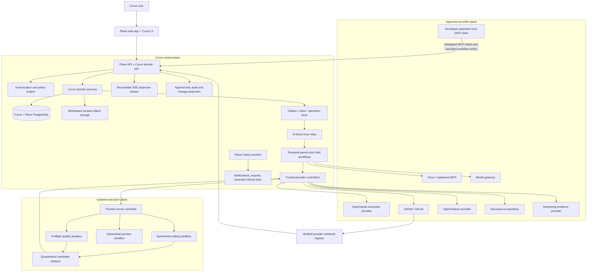
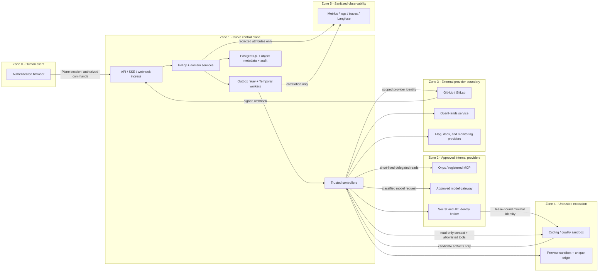
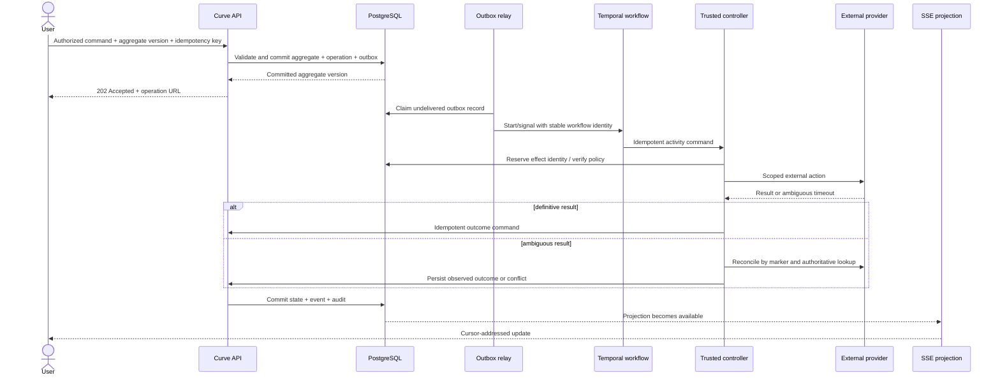
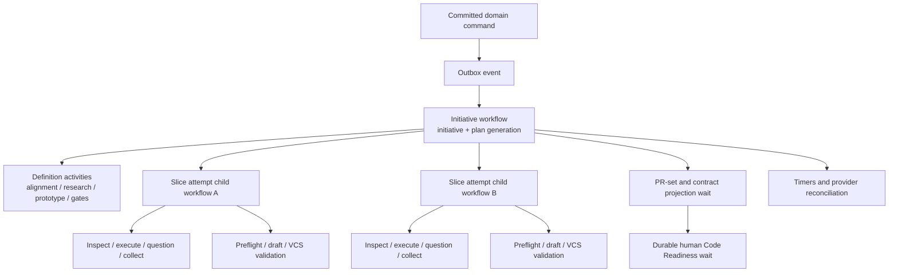
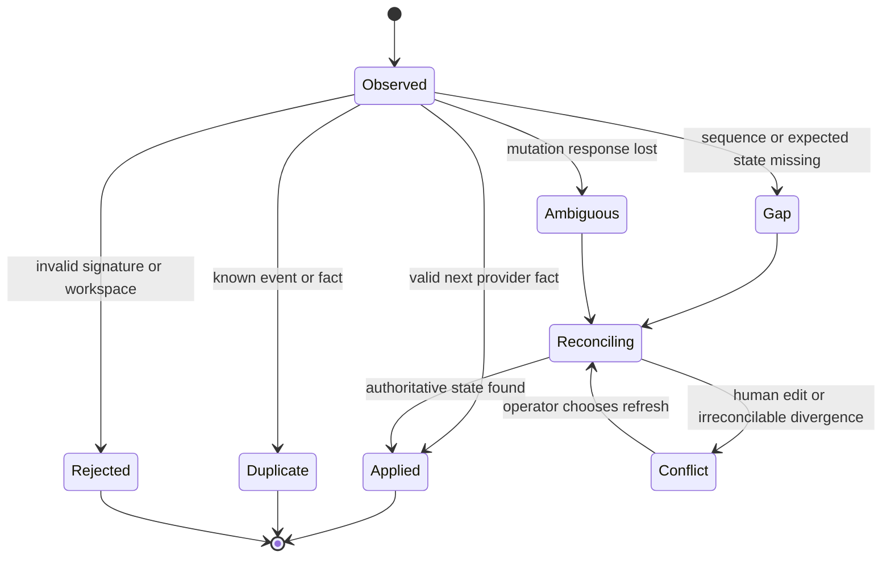
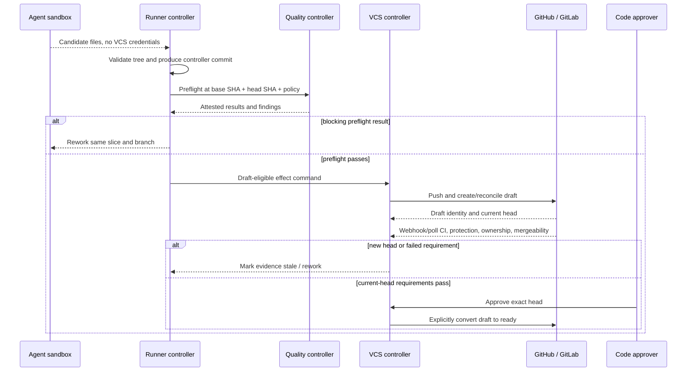
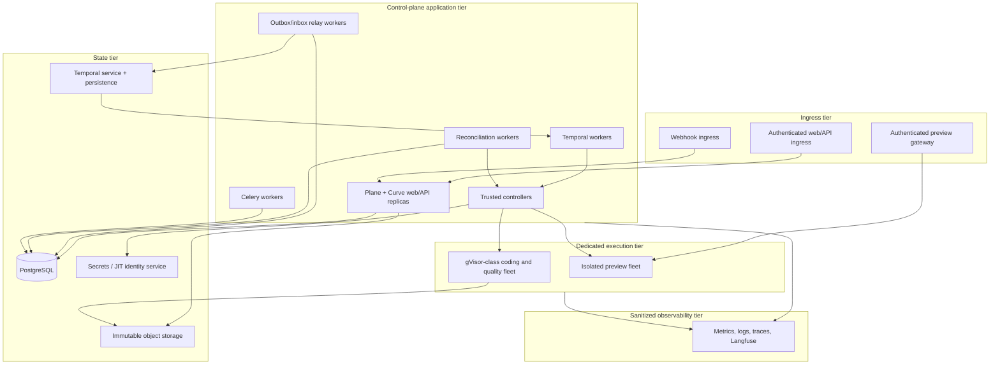

# Curve Technical Architecture

## Document control

| Field | Value |
| --- | --- |
| Status | Derived architecture baseline; implementation remains blocked by applicable non-decided decisions |
| Owner | X3M Curve engineering |
| Audience | Architecture, engineering, security, platform operations, product, and AI coding agents |
| Version | 0.9 |
| Last updated | 2026-08-30 |
| Normative source | [Curve PRD v0.13](../curve-ai-native-sdlc-prd.md) (product contract, approved Product core, Curve-first shell, decision register, and accepted local Temporal proof) |
| Companion | [Engineering Patterns and Technologies](./engineering-patterns-and-technologies.md) (component, workflow, data, and technology implementation patterns) |

## Purpose and authority

This document translates the product contract in the [Curve PRD v0.13](../curve-ai-native-sdlc-prd.md) (product requirements, approved Product core, Curve-first shell, invariants, acceptance criteria, decisions, and accepted local Temporal proof) into a logical architecture that can be refined into component, data, API, workflow, deployment, and implementation plans. It is not a replacement for the PRD.

The PRD's invariants, numbered requirements, lifecycle states, authorization rules, service objectives, acceptance criteria, and decision register are normative. If this document conflicts with the PRD, the PRD wins. In particular, this document:

- MUST NOT resolve or bypass an `OPEN` decision `D-001` through `D-016`.
- MUST NOT add an approval gate, authorize an agent to mutate a VCS, combine repositories in one slice, or automate merge or deployment.
- MUST preserve `workspace_id` at every data, event, cache, connection, execution, and audit boundary.
- MAY be elaborated through ADRs, diagrams, interface specifications, and implementation plans only when those artifacts preserve the linked PRD requirements.

## Scope

### Included architecture

The architecture covers the R1 control plane and its provider boundaries:

- Curve-branded product shell, Plane-backed work-management experience, and Curve domain APIs.
- Product, roadmap, initiative, artifact, evidence, gate, plan, execution, quality, delivery-contract, VCS, and audit domains.
- Durable orchestration, human waits, retries, cancellation, invalidation, and reconciliation.
- Knowledge, MCP, model, coding-agent, VCS, prototype, quality, feature-flag, documentation, export, and monitoring-evidence adapters.
- Trusted runner and VCS controllers plus isolated execution and preview environments.
- Relational, object, orchestration, provider, audit, and telemetry persistence.
- R0A, R0B, and R1 deployment capability profiles.

This architecture observes provider merges, deployments, and post-release evidence but does not perform merge or deployment in R1 (`NG-01`, `NG-02`, `NG-10`, `FR-020`, `AC-29`, `AC-30`, `AC-50`).

### Release views

| Release | Activated architecture slice | Deliberate exclusions |
| --- | --- | --- |
| R0A | Curve domain, policy, object/audit storage, Onyx evidence, artifact versions, SSE, Temporal definition workflow, and Gate 1 | No coding-agent or VCS-mutation promise |
| R0B | The named GitLab/OpenHands validation path through repository-local slices or an approved external contract/deployment prerequisite, trusted controller, preflight, automatic draft MR, VCS validation, and Gate 3 | Pilot configuration only; not provider-, roadmap-, or prototype-complete R1 |
| R1 | All M0-M6 components, both initiative modes, both VCS adapters, OpenHands automated execution, developer-operated Orca MCP assistance, coordinated slices, roadmaps, contracts, and both prototype paths | No autonomous merge, deployment, or M7 connector automation |
| R1.x | M7 adapters attached through existing provider and policy boundaries | No change to the three-gate lifecycle |

See the PRD release baseline, `FR-001` through `FR-044`, and milestone exit criteria M0-M7.

## Fixed architectural invariants

1. Curve PostgreSQL is authoritative for Curve business state. Temporal is authoritative only for orchestration execution; external providers are authoritative for their own facts.
2. Every external side effect is performed by a trusted controller after an authenticated command or bounded Gate 2 authorization. Agent sandboxes never receive VCS mutation credentials (`FR-019`, `FR-020`, `AC-22`).
3. Every slice is repository-local, has at most one active PR/MR binding, and reuses its branch and binding for retries and rework (`FR-011`, `AC-13`, `AC-31`).
4. Full evidence and Context Packs remain in access-controlled object storage. Only a sanitized Context Manifest may enter Git (`FR-004`, `FR-012`, `AC-15`, `AC-53`).
5. Preflight precedes draft creation; VCS-native validation follows draft creation. Both are commit-bound, and any new head invalidates prior results and readiness (`FR-018` through `FR-020`, `AC-23` through `AC-29`).
6. All asynchronous delivery is at least once. Receivers deduplicate, preserve per-aggregate ordering information, and reconcile provider truth before repeating an ambiguous mutation (`FR-044`, `NFR-005`, `AC-26`, `AC-33`).
7. Long operations never execute inside the database transaction that records their command. The transaction commits business state and an outbox record only.
8. Plane concepts are referenced rather than copied or repurposed. Curve additions are additive and independently versioned (`NFR-016`).
9. Restricted data fails closed at every model, trace, export, evidence, and gate boundary (`FR-043`, `NFR-010`, `AC-52` through `AC-60`).
10. Merge and deployment remain provider-observed external projections and never reopen a terminal R1 Initiative.

## Logical architecture

The boxes are logical components. D-003 decides their production placement, HA, persistence products, network topology, and operational ownership. D-004, D-006, D-008, and D-011 select unresolved provider details. The diagram does not decide them. The companion [C4 Architecture Views](c4-architecture.md) (context, container, and component diagrams) provides focused representations of these boundaries.

## Component ownership and contracts

| Logical component | Owns | Does not own | Primary PRD trace |
| --- | --- | --- | --- |
| Curve UI | Initiative, artifact-diff, gate-review, plan/DAG, execution, quality, roadmap, PR-set, and lineage experiences | Business truth or provider mutation | `FR-001`-`FR-007`, `FR-025`-`FR-031`, minimum R1 surfaces |
| Curve domain API | Commands, queries, aggregate validation, optimistic concurrency, operation resources, and API authorization | Long-running provider work | `FR-021`-`FR-024`, `FR-043`, public API contract |
| Authorization and policy engine | Effective-principal, workspace, object ACL, classification, risk tier, budget, gate, tool, and side-effect policy decisions | Source-provider ACL truth or human approval | Authorization matrix, `FR-003`, `FR-043`, `NFR-009`-`NFR-012` |
| Roadmap domain | Products, Roadmaps, Milestones, Features, Roadmap Items, snapshots, scope history, and independent projections | Plane work-item truth | `FR-025`-`FR-031`, `AC-37`-`AC-43` |
| Definition domain | Initiatives, artifacts, evidence references, versions, gates, assignments, and impact decisions | Raw source truth | `FR-001`-`FR-007`, Gate 1 and Gate 2 |
| Delivery domain | Plans, slices, dependencies, attempts, quality, contracts, waivers, PR sets, and readiness projections | Provider-native run or VCS truth | `FR-008`-`FR-020`, `FR-032`-`FR-042` |
| PostgreSQL | Curve metadata, aggregate versions, immutable histories, provider projections, operations, outbox/inbox, and idempotency records | Large protected bodies or Temporal history | Systems-of-record table, domain invariants, `NFR-018` |
| Object storage | Content-addressed artifact/evidence bodies, Context Packs, logs, reports, exports, and quarantined candidate artifacts | Queryable domain state | `FR-004`, `FR-012`, `NFR-018`, `NFR-020` |
| Temporal workflows | Durable waits, timers, activity sequencing, retry/cancellation propagation, and child-workflow coordination | Product truth or duplicate domain state | Temporal architecture, `FR-015`, `FR-042`, `NFR-004` |
| Outbox/inbox relay | At-least-once command/event delivery and deduplication | Workflow or domain decisions | `FR-044`, `NFR-005`, `AC-33` |
| Plane/Celery integration | Plane identity, membership, work items, comments, notifications, bounded exports and projection refreshes | Curve lifecycle orchestration | Responsibility boundaries, `NFR-016` |
| Knowledge/MCP adapters | Permission-aware retrieval and tool capabilities under the effective principal | Derived-data authorization | `FR-003`, `FR-004`, `AC-04`, `AC-60` |
| Model adapter | Policy-constrained generation, streaming, cancellation, token accounting, usage, and approved fallback | Product approval or evidence truth | `NFR-011`, `NFR-017`, `AC-19`, `AC-57` |
| OpenHands adapter | Provider capabilities, attempt lifecycle, questions, heartbeat, cancellation, and candidate collection | VCS credentials or acceptance of candidate output | `FR-013`-`FR-015`, `AC-16`-`AC-22` |
| Orca MCP profile | Approved task/context reads and developer-attributed claim, release, heartbeat, progress, question, completion, and VCS-reference updates | Automated execution, executable-artifact upload, VCS mutation, gates, waivers, re-planning, or deployment | `FR-013`-`FR-015`, `AC-16`-`AC-21` |
| Trusted runner controller | Sandbox lease, JIT identity, context mount, resource policy, candidate quarantine, termination, and cleanup | Gate decisions or VCS mutation | Scope invariant 8, `FR-042`, `NFR-007`, `AC-20`-`AC-22` |
| Trusted VCS controller | Tree validation, commit/sign, branch push, draft creation/update, ready conversion, and reconciliation | Merge or deployment | `FR-019`, `FR-020`, `FR-041`, `AC-22`, `AC-26`-`AC-33` |
| Quality controller | Versioned policy resolution, isolated execution, normalized results, finding disposition, and attestations | Waiver approval | `FR-016`-`FR-018`, `AC-23`-`AC-25`, `AC-48` |
| Provider reconciliation | Periodic polling, webhook-gap repair, ambiguity resolution, and conflict cases | Destructive overwrite of provider human edits | `FR-044`, systems-of-record rules, `AC-33` |
| Audit/lineage projection | Navigable evidence-to-ready chain and immutable mutation history | Raw trace bodies after retention | `FR-021`, `NFR-011`, `AC-34`, `AC-56` |
| Langfuse/telemetry | Permitted model traces, evaluation, cost, metrics, logs, and trace correlation | Approval, audit, or unrestricted content storage | `NFR-010`, `NFR-011`, `NFR-014`, `AC-53` |

## Trust zones and data movement

| Boundary | Required controls | Failure posture |
| --- | --- | --- |
| Client to control plane | Plane authentication, CSRF/session protection, workspace/object authorization, optimistic concurrency | Deny and audit |
| Webhook ingress | Provider signature, replay window, payload limit, deduplication, schema validation, reconciliation | Reject invalid input; poll provider truth |
| Control plane to knowledge/MCP | Effective-human short-lived delegation, source ACL, data classification, allowlisted capability | Fail closed; request reauthorization/redaction |
| Control plane to model | Approved task/data-class route, budget reservation, redaction, trace policy, cancellation | Pause; never silently use a non-equivalent model |
| Trusted controller to VCS | Workspace/repository allowlist, JIT scoped identity, idempotency marker, signed controller commit when supported | Reconcile ambiguous effects before retry |
| Trusted controller to runner | Lease, minimal secret set, read-only context, default-deny egress, resource/time limits | Revoke, terminate, quarantine, mark lost |
| Runner to control plane | Authenticated lease channel and candidate-artifact upload; no direct VCS mutation | Reject after lease expiry; quarantine output |
| Control plane to telemetry | Workspace-safe correlation and classified/redacted payload | Drop prohibited attributes rather than leak them |

D-002, D-003, D-005, D-007, and D-008 must provide the concrete identities, networks, destinations, and controls before their blocking milestones begin.

## Synchronous and asynchronous boundaries

### Boundary rules

- Synchronous API work is limited to authentication, authorization, validation, optimistic-concurrency checks, relational writes, outbox insertion, and fast reads.
- Provider access, model generation, repository inspection, sandbox work, exports, quality execution, and VCS mutations are asynchronous operations.
- An asynchronous command returns `202 Accepted` and an operation resource. The UI follows resumable SSE and may poll the operation as a fallback (`FR-023`, API contract, `NFR-002`, `NFR-003`).
- Incoming webhooks are authenticated, durably accepted, and acknowledged before downstream provider work. Processing is asynchronous.
- Temporal activities use idempotent application-service commands to persist outcomes. They never mutate domain tables directly through a second business-rule implementation.
- Celery never advances an Initiative lifecycle state. It may notify, export, or refresh a projection after the corresponding committed event.

| Interaction | Mode | Transaction boundary | Completion source |
| --- | --- | --- | --- |
| UI query or draft edit | Synchronous | One authorized database transaction | Curve API response |
| Submit artifact/gate decision | Synchronous command plus asynchronous consequences | Domain state and outbox commit atomically | Aggregate response, then SSE events |
| Evidence retrieval/model generation | Asynchronous | No provider call in the originating transaction | Temporal activity outcome persisted by application service |
| Agent dispatch/question/cancel | Asynchronous durable command | Authorization and outbox first | Agent event plus reconciliation |
| Candidate validation/commit/push/draft | Asynchronous trusted-controller command | Idempotency reservation before side effect | VCS observation bound to external ID/SHA |
| Quality run | Asynchronous child-workflow activity | QualityRun created before execution | Signed/attested result at exact SHAs |
| Roadmap export | Asynchronous bounded job | Snapshot version committed first | Object digest and export operation |
| Provider webhook | Fast synchronous verification and durable inbox write | Inbox commit before acknowledgement | Asynchronous normalized event/reconciliation |

### Command-to-effect sequence

## Temporal topology

### Workflow identity and generation

- The parent workflow identity is stable for one Initiative lifecycle generation. The pre-plan lifecycle uses the initial generation; each approved re-plan creates a new plan generation as required by the PRD's supersession rules.
- Each `AgentRunAttempt` uses a distinct child workflow identity and lease. Retry creates a new attempt; a `LOST` workflow never resumes concurrently (`AC-21`).
- The parent coordinates dependencies and waits, while PostgreSQL remains authoritative for whether a prerequisite is truly satisfied.
- Slice child workflows may run concurrently only when the approved DAG and policy allow it. Same-repository dependencies are sequential unless Gate 2 approves a supported stacked-branch strategy.
- Workflow signals carry IDs and versions, not unrestricted bodies. Activities resolve protected bodies after a fresh authorization check.

### Determinism and rollout

- Workflows use Temporal version markers for behavior changes and `continue-as-new` before history limits.
- Every worker release must replay representative archived histories for alignment, approvals, question waits, retries, lost runners, rework, cancellation, and supersession.
- Retry policies use the normalized provider error classes. Authentication, authorization, validation, policy, and budget errors are non-retryable; transient errors receive bounded exponential backoff with jitter (`NFR-008`).
- Activity heartbeats support loss detection. Cancellation is propagated, credentials are revoked immediately, and cleanup/reconciliation continues even if the main operation is cancelled (`FR-042`, `NFR-007`).
- Workflow code never assumes that an external side effect failed merely because its response was lost.

## Persistence and data placement

| Store | Data | Access pattern | Required properties |
| --- | --- | --- | --- |
| Plane/Curve PostgreSQL | Aggregate metadata, versions, assignments, decisions, normalized provider state, operations, outbox/inbox, idempotency, audit indexes | Transactional commands and queries | Workspace scoping, optimistic concurrency, append history, backup/RPO |
| Immutable object storage | Artifact and evidence bodies, Access Envelopes, Context Packs, reports, logs, exports, patches, quarantined candidates | Digest-addressed streaming; signed controller access | Encryption, workspace prefix, classification, integrity digest, retention/tombstone controls |
| Temporal persistence | Workflow histories, timers, activity state, search metadata | Temporal service only | Replay durability, backup/restore and HA selected by D-003 |
| Plane native tables | Membership, projects, work items, comments, estimates, relations | Existing Plane services | Referenced, never copied or redefined |
| Provider systems | Repositories, branches, commits, checks, reviews, raw agent state, source ACLs | Adapter read/reconcile | Provider fact wins; normalized observation remains append-only |
| Telemetry/Langfuse | Redacted metrics, traces, evaluations, model usage references | Operational queries and evaluation | Not an audit store; classification-aware export and retention |
| Ephemeral runner/preview storage | Checked-out repository, read-only context mount, build files, synthetic preview data | Lease-bound sandbox | Encrypted where supported, no persistence after policy cleanup, quarantined export only |

### Persistence invariants

- All relational rows and object metadata carry `workspace_id`; all joins and lookups enforce it before returning data (`AC-52`).
- Immutable bodies are content-addressed. PostgreSQL records digest, size, media type, schema version, classification, Access Envelope, retention class, and lineage.
- Object keys are workspace-scoped and must not expose source titles, user input, secrets, or predictable cross-workspace identifiers.
- Submitted artifacts, decisions, histories, events, findings, and provider observations are append-only. Supersession adds a record rather than rewriting history.
- Logical deletion creates a tombstone. D-009 defines physical deletion, legal hold, and cryptographic erasure. Protected-object persistence and every staging or production activation remain disabled while it is open; authorized local work uses synthetic data and minimum non-sensitive metadata only.
- Context Packs are mounted read-only outside the repository working tree. Context Manifests are separately generated, reviewed, digest-pinned, and sanitized.
- Quality and readiness records include repository, base SHA, head SHA, plan version, policy version, context digest, tools, rulepacks, and log/report digests.

The local PostgreSQL/Temporal boundary is fixed by D-003 (runtime topology and
trust-zone decision) and its [private-platform connectivity amendment](d003-private-platform-connectivity-amendment.md)
(shared local network, private EKS direction, service identity, and revised
proof): existing Plane PostgreSQL is business truth; disposable Temporal SQLite
stores synthetic local history; Plane, Curve, Temporal, and PostgreSQL use
existing `dev_env`. Non-local persistence, backup/restore, retention, and
activation evidence remain governed by D-003 and D-009.

## External synchronization and reconciliation

Signed webhooks are the fast path; polling is the correctness path. Every active provider binding is reconciled at least every 15 minutes and immediately after a detected gap, invalid signature, out-of-order event, ambiguous mutation, or operator request.

Reconciliation MUST:

- Read authoritative provider state before repeating a mutation.
- Match resources with a workspace-scoped external identity and idempotency marker.
- Preserve provider-side human edits and open a visible conflict rather than overwrite them.
- Append observations and correction events instead of altering prior observations.
- Keep one repository's truthful state independent when another repository in the PR set fails (`AC-32`).
- Re-evaluate commit-bound evidence whenever head, base, checks, mergeability, or applicable policy changes.

## Two-phase quality and VCS flow

The workspace baseline is non-reducible. Repository policy may add requirements but cannot weaken it without an authorized waiver. D-010 must pin the tools, versions, images, rulepacks, thresholds, license rules, suppressions, and non-waivable classes before M5.

## Deployment capability profiles

D-003 owns the concrete topology. Its connectivity direction selects X3M's
private AWS EKS/VPC/VPN environment, standard Kubernetes DNS/`ClusterIP`, a
dedicated Curve namespace by default, internal Temporal UI ingress, existing
X3M platform policy, workload identity/Secrets Manager, and authenticated
Temporal clients. Detailed persistence, certificate, HA, backup/recovery,
capacity, cost, and ownership remain environment-package inputs.

| Profile | Required logical services | Permitted data and integrations | Availability posture |
| --- | --- | --- | --- |
| Local development | Plane/Curve app, relational store, object-store substitute, Temporal development service, outbox relay, stub adapters, fake webhook receiver on shared Plane `dev_env` | Synthetic/unrestricted fixtures only; direct loopback Temporal ports; no production delegation or mutation identity | Developer convenience; no R1 SLA claim |
| Internal staging | Full control plane, durable Temporal, object storage, policy engine, provider test connections, isolated runner/preview fleet, reconciliation, sanitized telemetry in private X3M EKS using `ClusterIP` and authenticated Temporal clients | Operational activation requires D-009 plus reviewed persistence, certificate, HA, backup/recovery, ownership, and environment evidence. | Required recovery and security-test environment after its activation gates pass |
| R0A | Production-like definition/control-plane subset through Gate 1 | Manual-first definition remains available; live Onyx requires D-002 (Onyx delegated identity), protected bodies require D-009/M0-04 (retention and protected storage), and D-005 (model/data policy) applies only before a model destination; no VCS mutation | Must meet M0/M1 exit tests for enabled components |
| R0B pilot | Selected GitLab/OpenHands path with repository-local slices or an approved external prerequisite | Named pilot only after its blocking decisions and Gate 2 authorization | Pilot SLO measured, not advertised as R1 |
| R1 production | Full M0-M6 logical topology, both VCS adapters, OpenHands automated execution, Orca developer-operated MCP assistance, HA/persistence/backups, isolated execution, audited secrets and telemetry | Data and providers allowed by decided classification, residency, retention, and model policies | `NFR-001` through `NFR-020` and AC-01 through AC-60 |

### Production logical placement

The required replicas, zones, load balancers, queues, persistence engines, backup targets, registry, secret manager, egress gateways, and region remain D-003 outputs. The diagram intentionally shows roles, not vendor choices.

## Curve product shell and Plane extension strategy

Curve is the user-facing product surface and an additive bounded domain implemented in the Plane fork, with explicit anti-corruption seams to Plane-native concepts. Product-surface ownership and data authority remain separate: Curve owns the shell and lifecycle experience; Plane remains authoritative for its native work-management records and behavior.

- Add Curve-owned relational schemas and APIs; do not rename, overload, or repurpose Plane tables or status fields.
- Reference Plane workspace, user, project, work-item, estimate, and relationship identifiers through bindings. Plane remains authoritative for those native fields.
- Expose new APIs under `/api/v1/workspaces/{workspace_slug}/curve/`; do not make provider adapters or Temporal workflows depend on Plane's internal HTTP endpoints when a Curve application service can provide a stable contract.
- Make the approved Curve logo, name, global navigation, breadcrumbs, and lifecycle terminology the primary product identity whenever the Curve product profile is enabled.
- Organize global navigation into Product, Delivery, Work management, and Platform. Present Plane-backed projects, work items, cycles, views, and analytics inside Work management rather than as a peer product shell.
- Add Curve UI routes and navigation behind workspace feature enablement. Reuse accessible Plane components only after the D-001 (Plane foundation, licensing, and upgrade strategy) inventory proves they are present and license-compatible.
- Preserve visible Plane attribution, notices, and an exact-version AGPL source link through the Curve About, Open source, or equivalent product surface.
- Use Plane notifications and comments through a narrow integration service. Notification delivery never becomes lifecycle truth.
- Keep Celery jobs bounded and idempotent. Temporal exclusively owns durable lifecycle waits and orchestration.
- Seed workflow/policy v1 explicitly. Existing Plane data is referenced, not
  copied. D-013 (no-migration and new-initiative policy) keeps roadmap import
  absent in R1; any future import requires a new approved product decision,
  mapping, reconciliation owner, rollback design, and product acceptance trace.
- Rollback disables new entry points and dispatch while retaining Curve tables and external bindings for reconciliation. No destructive down-migration touches Plane data.
- Pin the supported Plane commit, API/UI reuse inventory, extension points, and upstream rebase process through D-001 before M0 architecture sign-off.

## Security architecture

The policy engine evaluates effective principal, active workspace membership, object ACL, Access Envelope, data classification, risk tier, integration scope, approved workflow/policy version, and current authorization before every protected operation.

Key controls are:

- Short-lived per-operation human delegation for Onyx and protected MCP access; creator credentials are never reused for another actor.
- Service identities only for exact controller effects authorized by Gate 2 or a later explicit human command.
- Lease-bound JIT runner identity with no production credential and no VCS mutation scope.
- Default-deny runner and preview egress, metadata-service blocking, unique preview origins, synthetic preview data, and automatic expiry.
- Model and telemetry destination checks against the Access Envelope; prohibited content is excluded rather than merely masked in logs.
- Signature, replay, SSRF, payload, schema, and workspace validation on webhooks and configured callback destinations.
- Append-only mutation audit with actor/effective principal, classification, causation, exact versions, policy decision, and outcome.
- Human-only approvals, reclassification, waivers, ready conversion, and classification removal under the risk-tier rules.

The derived threat model must cover all topics required by the PRD Architecture Handoff item 7 and acceptance scenarios `AC-52` through `AC-60`. D-002, D-005, D-007, D-008, D-009, and D-010 block their respective production controls.

## Observability architecture

### Correlation

Every allowed metric, log, and trace propagates opaque, workspace-safe identifiers for:

- `workspace_id` or a non-reversible telemetry surrogate.
- Initiative, workflow generation, artifact, slice, attempt, operation, quality run, PR binding, and reconciliation case.
- Correlation and causation identifiers from the event envelope.

Raw prompts, source code, evidence, secrets, patches, and tool output MUST NOT be ordinary telemetry attributes (`NFR-014`). Langfuse receives only data allowed by the applicable Access Envelope and D-005/D-009 policies.

### Required signals

| Area | Minimum signals |
| --- | --- |
| API | Request rate, latency, status, authorization denial, concurrency conflict, operation creation |
| Outbox/inbox | Oldest undelivered age, delivery attempts, duplicate rate, dead-letter count, sequence gaps |
| Temporal | Open workflows, task latency, activity retries/timeouts, waiting-human age, replay failures, history growth |
| Providers | Availability, rate-limit budget, callback lag, reconciliation divergence, token-expiry failures |
| Runners/previews | Queue/start time, heartbeat age, utilization, policy denial, termination lag, quarantine count |
| Quality | Duration, pass/fail/error/stale by check and policy, finding precision, waiver age/expiry |
| VCS | Draft creation latency, ambiguous mutations, head invalidations, checks latency, mergeability conflicts |
| Product | Idea-to-draft, idea-to-ready, active human time, cost, evidence coverage, retries, roadmap freshness |
| Security | Cross-workspace denial, invalid signature/replay, secret detection, blocked egress, privilege-policy violations |

Alerts must cover NFR/SLO risk, stuck workflows, expired leases, outbox backlog, reconciliation divergence, expiring waivers, credential failures, object-integrity failures, and prohibited-data export. Exact monitoring products and retention are D-003/D-009 outputs.

## Failure characteristics and recovery ownership

| Failure class | Detection | Safe automatic action | Durable state / owner |
| --- | --- | --- | --- |
| Authorization or source access revoked | Fresh policy/access check | Stop protected work; revoke delegation | `PAUSED`; authorized human reauthorizes or redacts (`AC-60`) |
| Validation/policy failure | Domain or controller check | No retry and no side effect | Failed operation; initiating user/approver corrects input |
| Model/provider transient failure | Normalized adapter error | Up to policy-bounded retry on an equally approved route | Visible paused activity; technical approver decides (`NFR-008`, `AC-57`) |
| Budget exhaustion | Reservation/check before call | Cancel outstanding activity; preserve incomplete output | `PAUSED`; technical approver revises authorization (`AC-19`) |
| Runner heartbeat loss | Lease heartbeat timeout | Revoke JIT identity, terminate, quarantine, mark `LOST` | New attempt only after controller cleanup (`AC-21`) |
| Cancellation | Authenticated command or policy | Signal workflows, revoke identities, terminate sandbox/preview, stop pushes | `CANCELLED`; reconcile and retain human-edited external resources (`AC-20`) |
| VCS timeout after mutation | Ambiguous response | Read/reconcile by marker before retry | Operation remains pending/conflicted; VCS controller owns |
| Missing/forged/out-of-order callback | Signature, inbox, sequence gap | Reject invalid; dedupe; poll provider | Reconciliation case; platform operator owns (`AC-33`) |
| Head/base change | Provider observation | Mark quality/readiness stale; evaluate freshness policy | Slice returns to validation/rework/replan (`AC-25`, `AC-28`) |
| Quality infrastructure unavailable | Heartbeat/exit/timeout | Bounded rerun preserving attempts | `ERROR`; only allowed expiring waiver may proceed |
| Partial PR-set failure | Independent binding projections | Continue truthful unaffected bindings; no rollback | Set `REWORK_REQUIRED`; technical/code owners decide (`AC-32`) |
| Database or Temporal disruption | Health, lag, recovery exercise | Stop new effects if authorization/business truth unavailable | Operations recovery owns NFR-004 and `AC-58` |
| Object digest mismatch | Read-time integrity verification | Quarantine and block dependent action | Security incident; never regenerate silently |

Runbooks required by the PRD Architecture Handoff item 13 must turn each operator-owned row into executable diagnosis, containment, reconciliation, and recovery steps.

## Capacity and service objectives

The architecture must qualify against `NFR-001` through `NFR-020`, including:

- 99.9% monthly control-plane availability excluding announced maintenance.
- p95 cached/read response at or below 500 ms and command acknowledgement at or below 1 second.
- p95 accepted-event projection at or below 5 seconds and webhook processing at or below 60 seconds.
- RPO at or below 5 minutes and RTO at or below 60 minutes.
- Qualification for 100 concurrent interactive users, 50 active initiative workflows, 20 concurrent sandboxes, 20 repositories and 100 slices per initiative, and 100 PR/MR bindings per set.
- Streaming support for 5 MiB API artifact bodies, 100 MiB evidence attachments, and 500 MiB mounted Context Packs without loading a complete object into an API process.

These figures are qualification targets. The approved private EKS/VPC/VPN
connectivity direction becomes deployable only through an environment package
that supplies the still-open persistence, certificate, backup, HA, recovery,
capacity, cost, and named-ownership evidence required by D-003 and D-009.

## Milestone architecture sequence

| Milestone | Architecture increment | Required decision/ADR state before implementation |
| --- | --- | --- |
| M0 | Additive domain shell, core policy enforcement, versioning, audit, API conventions, Temporal/outbox/inbox, SSE, and reconciliation; protected-object storage follows D-009 | D-001 plus applicable D-003/D-007 local profiles; D-009 before protected storage or non-local activation |
| M1 | Manual-first definition workflows, separately activated effective-principal Onyx/MCP retrieval and model assistance, evidence/access envelopes, artifact diff/versioning, Gate 1 | M0 foundation for every child; D-002 (Onyx delegation) only for Onyx, D-004/D-005/D-014 (model gateway/data/budget) only for model use, D-009/M0-04 (retention/protected storage) only for protected bodies, and `B-ARTIFACT-BODY-01` (manual artifact-body persistence contract) before manual body persistence |
| M2 | New Curve roadmap domain, Plane bindings, schedule projections, snapshots, deterministic export; no R1 import | D-013 (no-migration and new-initiative policy) plus M0 foundation; a future import requires a separate product decision |
| M3 | Repository inventory, deterministic typed-DAG/plan validation with separately activated model generation, Context Packs/Manifests, Gate 2 bounded authorizations, VCS read adapter | D-008 (trusted VCS decision) for repository access; `B-NO-MODEL-BUDGET-01` (explicit no-model and zero-budget representation) for deterministic plan persistence; M0-S9C plus D-004/D-005/D-014 only for model generation |
| M4 | Provider-neutral attempt model, OpenHands adapter, developer-operated Orca MCP profile, leases, trusted runner controller, questions, retries/cancellation | P0-07 (gVisor runner proof) and P0-08 (OpenHands provider/runtime proof) before runner/OpenHands activation; target-environment D-003 (runtime topology) and D-014 (budget policy); D-006/D-007 only for Orca/MCP |
| M5 | Versioned quality, trusted VCS controller, GitHub/GitLab adapters, two-phase validation, review rework, contract/PR-set projections | P0-10 (trusted VCS proof), P0-11 (quality/security/license proof), D-008 (trusted VCS), and D-010 (quality/security/license); D-004/D-005/D-014 plus M0-S9C only for AI review; D-011/D-012 only for applicable flag/documentation delivery |
| M6 | Isolated authenticated previews, Lovable packages, KPI/cost dashboards and qualification | P0-07 (gVisor runner proof) and approved non-local D-003 activation for preview runtime; D-014 (budget policy), D-015 (pilot profile), D-016 (KPI/rollout), and D-005 only for provider/model-coupled destinations or exhaustion |

No implementation backlog may move an unresolved decision past its blocking milestone by substituting a developer preference. Conservative defaults permit only the limited behavior stated in the PRD decision register.

Two cross-milestone architecture contradictions remain named and unresolved:

- `B-ARTIFACT-BODY-01` (manual artifact-body persistence contract) must reconcile
  manual Idea Brief/PRD durability with the current non-null ObjectRef boundary
  while D-009 (retention and erasure decision) and M0-04 (protected-object
  storage) remain unavailable. Until a versioned contract is approved, metadata
  and UI contracts may proceed but no manual artifact body may be persisted.
- `B-NO-MODEL-BUDGET-01` (explicit no-model and zero-budget representation) must
  define exact versioned values for non-null ExecutionPlan model, tool, and budget
  references in deterministic/manual planning. It cannot imply an approved model
  route or paid budget. Deterministic plan persistence and Gate 2 wait for this
  contract; model-assisted planning additionally waits for M0-S9C (Model Gateway),
  D-004 (model-gateway decision), D-005 (model/provider data-policy decision),
  and D-014 (budget-policy decision).

## ADR prerequisites and unresolved decisions

The PRD records agreed planning directions as `PROPOSED` and leaves genuinely unselected decisions `OPEN`. This document records their architectural impact but does not convert either state into owner approval.

| Decision | Required ADR output | Blocks |
| --- | --- | --- |
| D-001 | Pinned Plane commit, reuse/build inventory, extension seams, supported upgrade/rebase baseline | M0 architecture sign-off |
| D-002 | Onyx per-operation delegation protocol, token lifecycle, revocation, audit, failure proof | Live Onyx retrieval in M1; manual definition remains independent |
| D-003 | Dev/staging/prod topology, region/residency, trust zones, data services, HA, backups, secrets, Langfuse, ownership | Shared local `dev_env` plus private X3M EKS/VPC/VPN, `ClusterIP`, dedicated namespace by default, internal UI ingress, workload identity/Secrets Manager, and authenticated non-local Temporal clients are effective through the merged 2026-08-20 amendment. M0-S3 accepts the local implementation at Plane merge `d99342f...`; environment activation still requires its persistence, certificate, HA, backup/recovery, capacity, cost, and ownership evidence. |
| D-004 | In-process Curve Model Gateway and OpenRouter contract, allowlists, routing/fallback constraints, operations, security, license, and replacement evaluation | Model-enabled M1/M3/M5 |
| D-005 | Task/data-class model allowlist, residency/training/retention terms, fallback equivalence, evaluation baseline | Model-enabled M1/M3/M5 and provider/model destinations; manual/deterministic children remain independent |
| D-006 | Orca supported MCP client/version, delegated auth, bounded capability profile, ownership, support and license | Orca-enabled M4 / R1 human-assistance completeness |
| D-007 | MCP version/transports, trust registry, delegated auth, read/write risk, idempotency, transitions, and pre-authorized action allowlist | MCP-enabled M0/M1/M4 |
| D-008 | GitHub/GitLab controller identities, scopes, signing, rotation, repository allowlist, reconciliation permissions | M3 |
| D-009 | Retention/backup/legal hold/tombstone/erasure matrix and evidence of recoverability | M0-04 protected storage; protected M1/M4/M6 capabilities; every staging/production activation |
| D-010 | Pinned quality/security/license toolchain, images, rulepacks, thresholds, suppressions, non-waivable classes | M5 |
| D-011 | OpenFeature backend and flag naming, ownership, rollout, audit, expiry and cleanup conventions | M5 |
| D-012 | Docusaurus repository, branch, ownership, build/link/navigation/preview and release relationship | M5 |
| D-013 | No-migration/new-initiative adoption rule and reconciliation ownership; any future import requires a separate approved decision and mapping | M2 roadmap activation; M2-06 (future import) remains deferred post-R1 |
| D-014 | Workspace/initiative/research/model/tool/sandbox budgets and escalation authority | R0B/M4 |
| D-015 | Pilot Product, repository, initiative, users and baseline comparison method | R0A/R0B |
| D-016 | Numeric KPI targets based on pilot measurements | Broad R1 rollout |

Each ADR must include options, evidence, selection criteria, consequences, threat/licensing impact, migration/rollback, operational owner, approver, and status. Only the named owner in the PRD may mark it `DECIDED`.

## Required next technical artifacts

Before implementation, the architecture package must add the following without weakening this baseline:

1. Requirement traceability matrix covering every goal, `FR-001`-`FR-044`, `NFR-001`-`NFR-020`, `AC-01`-`AC-60`, risk, decision, component, command, entity, test, and milestone.
2. The [implemented entity-relationship model](implemented-entity-relationship-model.md) (versioned physical M0/M1 ERD, workspace ownership, indexes, uniqueness, immutable history, object-reference boundary, and migration semantics) is maintained against the accepted Plane migration head. The C4 context/container/component views are maintained in [C4 Architecture Views](c4-architecture.md) (context, container, and component diagrams).
3. Versioned OpenAPI, event, webhook, SSE, provider, and object schemas.
4. Temporal sequence diagrams for every happy, rework, cancellation, loss, stale-state, supersession, and reconciliation path.
5. Threat model, data-flow inventory, Access Envelope rules, and security-test fixtures.
6. D-003-approved deployment and operations architecture plus backup/restore and disaster-recovery proof.
7. Provider conformance suites and M0-M6 executable exit tests.
8. Additive Plane migration, feature-enabled rollout, rollback, and upstream rebase plan.
9. Dependency/license manifest, SBOM/provenance plan, corresponding-source procedure, and generated-code IP policy.

Implementation may begin for a milestone only when its blocking ADRs are decided, its API/data/workflow contracts are versioned, its threat-model findings are dispositioned, and its exit tests can run in the target environment.
