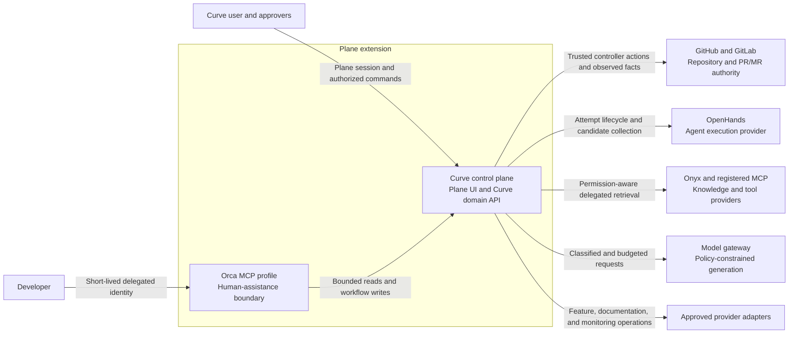
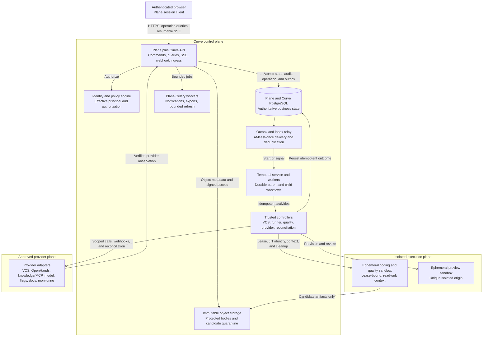
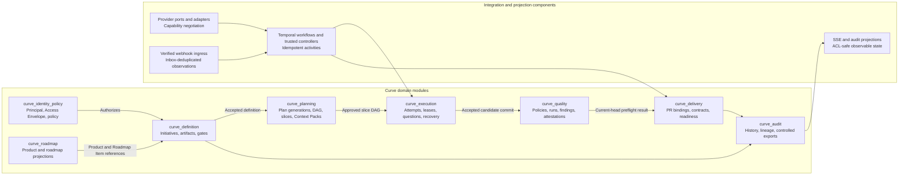

# Curve C4 Architecture Views

## Document control

| Field | Value |
| --- | --- |
| Status | Derived architecture baseline; implementation remains blocked by applicable non-decided decisions |
| Owner | X3M Curve engineering |
| Audience | Architecture, engineering, security, platform operations, product, and AI coding agents |
| Version | 0.2 |
| Last updated | 2026-08-29 |
| Normative source | [Curve PRD v0.13](../curve-ai-native-sdlc-prd.md) (current product, lifecycle, security, and acceptance contract) |
| Derived from | [Architecture](architecture.md) (logical components and deployment boundaries), [Engineering Patterns and Technologies](engineering-patterns-and-technologies.md) (implementation conventions and technology register), [Integration Contracts](integration-contracts.md) (API, event, and provider boundaries), and [Workflows and Sequences](workflows-and-sequences.md) (durable lifecycle and recovery behavior) |

## Purpose and authority

This document presents the C4 context, container, and component views of Curve.
It is a navigational representation of the logical architecture. The [Architecture](architecture.md), [Domain model](domain-model.md), [Workflows and Sequences](workflows-and-sequences.md), and [Integration Contracts](integration-contracts.md) remain authoritative for responsibilities, states, interfaces, and failure behavior.

The diagrams show logical boundaries. They do not select a production placement,
network topology, persistence product, capacity, provider implementation, or
operational owner that remains subject to an unresolved decision.

## C1: System context

Curve is an additive control-plane extension of Plane. It coordinates the
initiative-to-ready lifecycle while external providers retain authority over
their own facts. The Curve user and code approver work through the Plane-hosted
experience; a developer may use the bounded Orca human-assistance profile.

| System | Curve relationship | Authority boundary |
| --- | --- | --- |
| Plane | Hosts user experience, authentication, membership, and bounded existing worker behavior | Curve references Plane concepts and does not redefine Plane business truth. |
| GitHub and GitLab | Trusted controllers create or reconcile approved branches and draft PR/MR bindings; webhooks and polling return observations | Repository, branch, commit, check, review, mergeability, and PR/MR facts remain provider authority. |
| OpenHands | Supplies normalized attempt lifecycle events and candidate artifacts | It does not receive Curve-managed VCS mutation credentials. |
| Onyx and registered MCP | Supplies effective-principal-scoped retrieval and approved capabilities | Source ACLs and provider capability facts remain provider authority. |
| Model gateway | Supplies generation, streaming, token accounting, cancellation, and usage reporting | Curve policy controls task class, classification, destination, budget, and trace policy. |
| Orca MCP client | A developer-operated client for assigned work and bounded workflow updates | The developer uses normal VCS access outside Curve; Curve validates linked references through trusted controllers. |

## C2: Containers and runtime services

The synchronous boundary accepts authorized commands and queries. Long-running
or external effects start only after the domain transaction commits an outbox
record. Temporal coordinates durable work, while trusted controllers own
external side effects and untrusted execution is isolated from mutation
credentials.

| Container | Owns | Key boundary |
| --- | --- | --- |
| Plane plus Curve API | Command validation, optimistic concurrency, operation resources, API authorization, queries, SSE, and webhook ingress | Provider work never runs in the initiating database transaction. |
| Identity and policy engine | Workspace/object authorization, classification, risk, budget, gate, tool, and side-effect policy | Re-evaluates authorization at each protected action. |
| PostgreSQL | Curve metadata, aggregate versions, provider projections, operations, outbox/inbox, idempotency, and audit indexes | Curve business state is authoritative here. |
| Object storage | Content-addressed artifacts, evidence, Context Packs, reports, exports, logs, and quarantined candidates | Protected bodies remain outside Temporal history and Git. |
| Outbox and inbox relay | At-least-once delivery, deduplication, ordering information, and durable receipt | Reconciliation resolves gaps and ambiguous mutations. |
| Temporal | Durable waits, timers, child workflow coordination, retry and cancellation propagation | Orchestration state is distinct from Curve business truth. |
| Trusted controllers | Idempotent provider calls, VCS actions, runner lifecycle, quality execution, and reconciliation | Holds external-effect authority; agents do not. |
| Coding, quality, and preview sandboxes | Isolated, lease-bound execution and previews | Receive no Curve-managed VCS mutation credentials. |

## C3: Components and modules

The Curve modules are logical seams. An implementation may initially co-deploy
them with the Plane backend or frontend, subject to the approved D-001 mapping,
while preserving the ownership boundaries below.

| Module | Responsibility |
| --- | --- |
| `curve_identity_policy` | Workspace, role, risk, effective principal, Access Envelope, side-effect, and budget decisions. |
| `curve_roadmap` | Product, Roadmap, Milestone, Feature, Roadmap Item, history, snapshots, and schedule projections. |
| `curve_definition` | Initiative, activity, artifact/evidence versioning, three gate assignments/decisions, and impact assessment. |
| `curve_planning` | Repository inventory, plan generations, typed DAG, slices, Context Pack, and Context Manifest. |
| `curve_execution` | Runs, attempts, leases, provider events, questions, cancellation, and recovery. |
| `curve_quality` | Policy versions, quality runs/checks, findings, attestations, and invalidation. |
| `curve_delivery` | PR bindings/sets, delivery contracts/checks/waivers, review rework, and readiness projections. |
| `curve_integrations` | Provider ports, connections, adapters, controllers, webhooks, and reconciliation. |
| `curve_audit` | Append-only mutation history, lineage, and controlled exports. |

## Diagram maintenance

Update these views whenever a change affects an actor, system boundary,
container ownership, module responsibility, or relationship. Pair the diagram
update with its authoritative contract change and preserve the following
invariants:

1. `workspace_id` scopes every state, event, object, connection, execution,
   cache, and audit boundary.
2. Curve PostgreSQL remains authoritative for Curve business state; Temporal
   remains authoritative for orchestration execution; providers remain
   authoritative for their own facts.
3. External effects flow through trusted controllers after the authorizing
   domain transaction commits.
4. Untrusted sandboxes return candidate artifacts and do not receive VCS
   mutation credentials.
5. Provider observations, duplicate deliveries, and ambiguous effects enter
   the inbox/reconciliation path before a repeated mutation.
