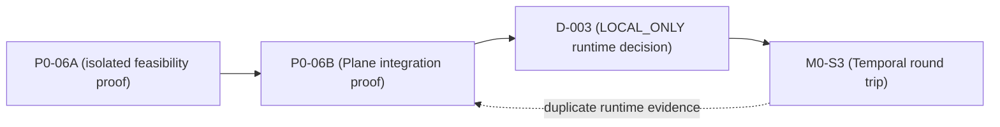
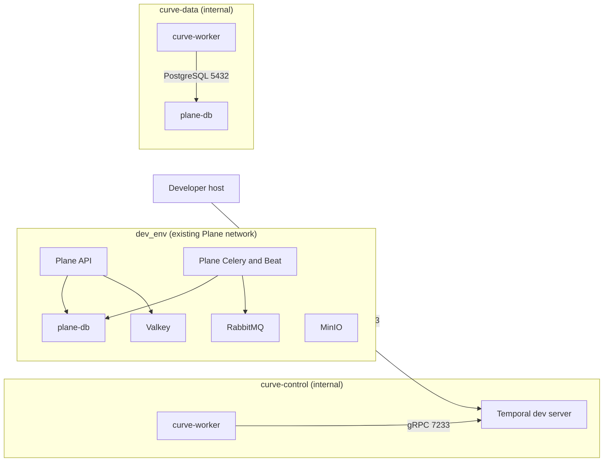

# D-003 (Local Runtime Topology and Trust-Zone Decision) Packet

## Document control

| Field | Value |
| --- | --- |
| Status | `APPROVED_AND_MERGED` |
| Version | 1.1 |
| Date | 2026-08-18 |
| Decision | D-003 (runtime topology and trust-zone decision), `LOCAL_ONLY` scope |
| Decision owner | Federico Ocampo, CTO at X3M |
| Human reviewer | Federico Ocampo (`faocampo`) |
| Curve baseline | Approved head `7826f4031a6f3862ed29d48c9f16292e8a1ab8bb`; merge `097016ffe2eb259cc780ad2a6cd41ca3422366b2` on `main` |
| Plane baseline | `eff8686a69aa112ea8fda79be0e1316dc1fd97d6` on `preview` |
| Consuming package | M0-S3 (local Temporal round-trip implementation packet) |
| Non-local scope | Staging and production remain undecided and fail closed |

## Approved decision

Federico Ocampo approved the least-privilege local topology in this packet at
exact head `7826f4031a6f3862ed29d48c9f16292e8a1ab8bb` and authorized the
following governance correction. Curve PR #9 merged the approved head as
`097016ffe2eb259cc780ad2a6cd41ca3422366b2` after its `validate` check passed:

1. D-003 (runtime topology and trust-zone decision) becomes `DECIDED` for
   `LOCAL_ONLY` at the exact approved and merged revision of this packet.
2. M0-S3 (local Temporal round-trip implementation packet) becomes the single
   implementation and proof of the approved local topology.
3. P0-06A (isolated Temporal feasibility proof) and P0-06B (least-privilege
   Plane integration proof) are retired as standalone execution gates. Their
   historical design records remain available for audit, marked `SUPERSEDED`.
4. The GitHub claim tag, independent start-grant broker, proof ticket, four
   VCS leases, terminal-projection publication flow, and mutable proof-stage
   projection are removed from the local proof path.
5. Ordinary exact-head review, repository CI, local runtime evidence, and the
   M0-S3 (local Temporal round-trip implementation packet) acceptance suite
   provide the implementation evidence.

This decision does not authorize staging, production, AWS, Kubernetes, gVisor,
OpenHands, protected data, provider credentials, or deployment.

## Problem being resolved

The current dependency graph is circular:



P0-06A (isolated Temporal feasibility proof) cannot decide the network or
worker boundary. P0-06B (least-privilege Plane integration proof) requires the
same Plane Compose, worker, database, workflow, retry, replay, cancellation,
and rollback behavior that M0-S3 (local Temporal round-trip implementation
packet) already requires. The separate proof path therefore adds another
implementation without producing distinct product or security evidence.

The previous proof contract also binds a synthetic local Docker run to a
special GitHub claim/broker/lease protocol. That protocol does not protect a
production system, credential, protected dataset, or shared deployment. Normal
repository review plus bounded local runtime controls provide the required
authority and audit trail for this scope.

## Verified repository facts

At Plane baseline `eff8686a69aa112ea8fda79be0e1316dc1fd97d6`:

- `docker-compose-local.yml` (existing Plane local stack) provides PostgreSQL
  15.7, Valkey 7.2.11, RabbitMQ 3.13.6, MinIO, the Django API, Celery worker,
  Beat worker, and migrator on `dev_env`.
- Plane's API and worker image uses Python 3.12.5 on Alpine.
- Plane's existing workers load broad `apps/api/.env` application settings.
- M0-S2 (operation and delivery kernel implementation packet) provides the
  workspace-scoped Operation, DomainEvent, OutboxEvent, InboxMessage,
  IdempotencyRecord, and AuditEvent persistence required by the round trip.
- Temporal is absent from Plane's dependency and Compose configuration.

## Verified upstream pins

| Component | Approved local candidate | Evidence |
| --- | --- | --- |
| Temporal CLI development image | `docker.io/temporalio/temporal:1.8.1@sha256:59561b9ef060eaeb1f46cb6a1842d6cbdd8a393eb3b6d315ecef5fe2f0b1d7a6` | Temporal CLI release 1.8.1 ([github.com/temporalio/cli](https://github.com/temporalio/cli/releases/tag/v1.8.1)); live OCI inspection on 2026-08-18 confirmed the index plus `linux/amd64` and `linux/arm64` manifests. |
| Embedded Temporal Server | `1.31.2` | Temporal Server release 1.31.2 ([github.com/temporalio/temporal](https://github.com/temporalio/temporal/releases/tag/v1.31.2)); contains the replication-stream authorization security correction. |
| Temporal Python SDK | `temporalio==1.31.0` | Temporal Python SDK release 1.31.0 ([github.com/temporalio/sdk-python](https://github.com/temporalio/sdk-python/releases/tag/1.31.0)); PyPI 1.31.0 ([pypi.org/project/temporalio](https://pypi.org/project/temporalio/1.31.0/)) supports Python 3.10+ and publishes musllinux wheels for x86-64 and ARM64, matching Plane's Alpine image. |

The staging/production Temporal Helm chart and server topology remain outside
this local decision.

## Approved local architecture

### Compose activation boundary

Curve extends the existing stack through `docker-compose-curve.yml`
(Curve-only local Compose overlay). Developers activate it together with
`docker-compose-local.yml` (existing Plane local stack) and the `curve` profile.
Running the existing Plane command without the overlay leaves the baseline
Compose model byte-for-byte unchanged.



`curve-worker` in both internal networks is one container; `plane-db` in
`dev_env` and `curve-data` is one container. The duplicated nodes make the two
network attachments explicit.

### Service contract

| Service | Local contract |
| --- | --- |
| `temporal` | `curve` profile; pinned CLI image by digest; `temporal server start-dev --ip 0.0.0.0 --namespace curve-local --db-filename /var/lib/temporal/temporal.db --ui-port 8233`; named disposable volume; loopback-only `7233` and `8233`; health check; no Plane network or credential. |
| `curve-worker` | `curve` profile; built from Plane's development API image; dedicated Temporal entrypoint; read-only source mount where compatible; no Celery process or queue; only `curve-control` and `curve-data`; no published port. |
| `plane-db` | Existing service; the Curve overlay adds `curve-data` while retaining `dev_env`; no schema, image, command, port, or volume change. |

The implementation must verify the exact CLI flags against the pinned image
before committing the Compose overlay. Temporal's official reference
applications demonstrate persistent local development with `server start-dev`,
`--db-filename`, and `--ui-port` ([github.com/temporalio/reference-app-orders-go](https://github.com/temporalio/reference-app-orders-go)).

### Worker environment allowlist

`curve-worker` does not load `apps/api/.env` (Plane application environment).
Its environment contains only:

| Variable | Purpose |
| --- | --- |
| `DJANGO_SETTINGS_MODULE=plane.settings.curve_worker` | Dedicated settings profile with local-memory cache, console email, local/no-op storage, and no external integration initialization. |
| `DATABASE_URL` | PostgreSQL connection to `plane-db` over `curve-data`; constructed from existing local database variables without passing unrelated secrets. |
| `CURVE_ENABLED=1` | Enables the local Curve worker path. |
| `CURVE_ENABLED_WORKSPACE_SLUGS` | Explicit synthetic workspace allowlist used by the proof. |
| `TEMPORAL_ADDRESS=temporal:7233` | Internal Temporal frontend address. |
| `TEMPORAL_NAMESPACE=curve-local` | Local namespace. |
| `TEMPORAL_TASK_QUEUE=curve-control-plane-v1` | Dedicated Curve task queue. |
| `TEMPORAL_WORKER_IDENTITY` | Safe local worker identity used for logs and diagnostics. |
| `LOG_LEVEL` | Local bounded logging level. |

The worker receives no RabbitMQ, Valkey, MinIO, AWS, SMTP, VCS, provider,
production, or user-delegation credential or endpoint.

### Network allowlist

| Source | Destination | Port | Purpose |
| --- | --- | --- | --- |
| Developer host | Temporal | `127.0.0.1:7233` | Local CLI/test client only. |
| Developer host | Temporal UI | `127.0.0.1:8233` | Local inspection only. |
| `curve-worker` | `temporal` | `7233/tcp` | Workflow/activity polling and commands. |
| `curve-worker` | `plane-db` | `5432/tcp` | Curve domain and delivery-kernel transactions. |

Both Curve networks use Docker's `internal: true`. Every other destination is
outside the selected topology. Negative acceptance tests prove RabbitMQ,
Valkey, MinIO, host metadata/private destinations, and the public internet are
unreachable from `curve-worker`.

### Data and authority boundary

- PostgreSQL remains authoritative for Curve business state.
- Temporal history stores only workspace/operation IDs, aggregate versions,
  digests, classifications, safe enums, correlation IDs, and error codes.
- The proof uses synthetic `INTERNAL` data and explicit sentinel strings to
  detect payload/log leakage.
- Temporal's SQLite file is disposable orchestration history for local replay;
  it is not a source of product truth.
- The worker may mutate only the reviewed Curve tables through idempotent
  activities. It receives no generic Plane application task authority.
- Existing Plane API, Celery, Beat, RabbitMQ, Valkey, MinIO, and user-facing
  behavior remain unchanged.

## M0-S3 (Local Temporal Round Trip) Implementation and Proof Contract

M0-S3 (local Temporal round-trip implementation packet) implements and proves
the decision in one repository-local change. Its task packet pins the merged
Curve decision revision and live Plane `preview` base before dispatch.

Required behavior:

1. Atomically create a harmless workspace-scoped Operation and outbox record.
2. Relay duplicate deliveries through an idempotent Temporal workflow start.
3. Transition the Operation through queued/running to a terminal state with
   matching DomainEvent, AuditEvent, and outbox/inbox evidence.
4. Retry an activity after a committed database effect without duplicating the
   effect.
5. Cancel an active workflow and reach `CANCELLED` without orphaned work.
6. Restart Temporal and the worker, then complete/replay existing synthetic
   histories deterministically.
7. Inspect histories, logs, environment, Compose networks, and container
   metadata to prove the selected payload and reachability boundaries.
8. Disable the overlay/profile and rerun the existing Plane health and test
   baseline.

Required commands after implementation:

```text
git diff --check
pnpm check
pnpm build
docker compose -f docker-compose-test.yml run --rm --build api-tests pytest plane/curve/tests -k "workflow or temporal or replay or cancellation"
docker compose -f docker-compose-local.yml -f docker-compose-curve.yml --profile curve config
docker compose -f docker-compose-local.yml -f docker-compose-curve.yml --profile curve up -d
docker compose -f docker-compose-local.yml -f docker-compose-curve.yml --profile curve ps
docker compose -f docker-compose-local.yml -f docker-compose-curve.yml --profile curve down
docker compose -f docker-compose-test.yml up --build --abort-on-container-exit --exit-code-from api-tests
```

The implementation PR must also preserve repository-native CI and record the
resolved Compose model, service health, negative network probes, history/log
sentinel scan, replay results, cancellation result, and baseline-disabled
result as reviewable evidence.

## Migration and compatibility

- Add the Python SDK through Plane's existing requirements/lock mechanism and
  record hashes and license metadata.
- Add no schema migration unless a reviewed M0-S3 (local Temporal round-trip
  implementation packet) field/index requirement cannot be represented by the
  existing M0-S2 (operation and delivery kernel implementation packet) schema.
- Workflow and activity names, inputs, results, search attributes, task queue,
  namespace, retry policy, timeouts, and version markers remain versioned in
  the Curve Temporal contract.
- Every committed synthetic history becomes a replay fixture for later worker
  changes.

## Failure and rollback

1. Disable outbox-to-Temporal dispatch.
2. Stop the `curve` profile through the two-file Compose command.
3. Preserve PostgreSQL Operation/Audit/Event records for diagnosis.
4. Remove only the explicitly named disposable Temporal local volume when a
   reset is intended; never remove Plane volumes implicitly.
5. Revert the M0-S3 (local Temporal round-trip implementation packet) commit
   if needed.
6. Start `docker-compose-local.yml` (existing Plane local stack) without the
   Curve overlay and rerun the baseline health/tests.

No rollback action rewrites immutable Curve history or requires a destructive
database migration.

## Residual risks and controls

| Risk | Control and acceptance evidence |
| --- | --- |
| Worker obtains broad Plane credentials | No application env file; exact environment-key assertion and container inspection. |
| Worker reaches unrelated Plane services | Separate internal networks plus negative reachability tests. |
| Protected data enters history or logs | Synthetic-only input, strict payload DTOs, sentinel scans, safe errors, and history inspection. |
| Duplicate relay/activity effects | Deterministic workflow ID, idempotent start, inbox/idempotency constraints, and retry-after-commit test. |
| Worker upgrade causes nondeterminism | Version markers, committed history fixtures, and replay-before-merge. |
| Curve changes baseline Plane behavior | Overlay absent by default, feature switch, baseline health and full test comparison. |
| Local design is mistaken for production approval | D-003 (runtime topology and trust-zone decision) is scoped `LOCAL_ONLY`; staging/production matrix remains fail closed. |

## Supersession reconciliation checklist

The governance reconciliation PR updates the following normative sources before
M0-S3 (local Temporal round-trip implementation packet) dispatch:

- `adr-003-runtime-topology.md` (runtime topology and Temporal profile) to
  `DECIDED/LOCAL_ONLY` with this topology and explicit non-local blockers;
- `p0-06-local-temporal-proof-task-packet.md` (historical two-stage proof
  packet) to `SUPERSEDED` with a pointer to M0-S3 (local Temporal round-trip
  implementation packet);
- `p0-06-stage-record.json` (historical machine-readable proof projection) to
  a terminal `SUPERSEDED` record or removal through an explicit schema/index
  migration;
- `m0-local-skeleton-task-packets.md` (M0 repository-local implementation
  packets) to make M0-S3 (local Temporal round-trip implementation packet)
  dispatchable once its people/context/base fields are pinned;
- `development-plan.md` (milestones, dependencies, and delivery sequencing),
  `m0-readiness-board.md` (M0 decision and package readiness), and
  `github-project-execution-map.md` (visual GitHub Project mapping) to remove
  the retired proof dependency while preserving status as visual metadata.

## Exact owner approval record

The owner can approve this material architecture/security decision with:

> I approve D-003 (runtime topology and trust-zone decision) for `LOCAL_ONLY`
> at exact head `7826f4031a6f3862ed29d48c9f16292e8a1ab8bb`, approve Temporal Python SDK `1.31.0`, approve the
> two-network Compose-overlay topology, retire P0-06A (isolated Temporal
> feasibility proof) and P0-06B (least-privilege Plane integration proof) as
> standalone gates, make M0-S3 (local Temporal round-trip implementation
> packet) the executable proof, and authorize squash merge of the decision
> packet while CI remains green.

Repository evidence: [Curve PR #9](https://github.com/faocampo/curve/pull/9),
merged 2026-08-18 as
`097016ffe2eb259cc780ad2a6cd41ca3422366b2` after the `validate` check passed.
