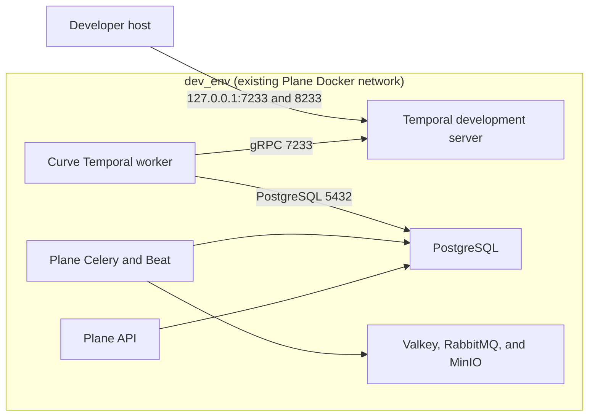
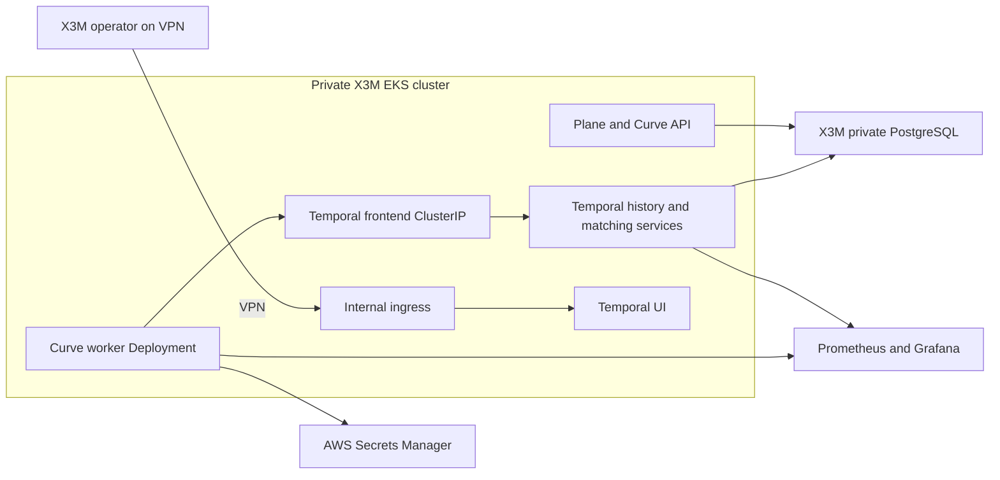

# D-003 Private-Platform Connectivity Amendment

## Document control

| Field | Value |
| --- | --- |
| Status | `EFFECTIVE`; exact head `5e165c502f5bf6c1900085be4388495d7c504b48` approved and squash-merged as `aece53943525c6e7f7993551453954fe27b00746` |
| Version | 1.1 |
| Date | 2026-08-20 |
| Decision | D-003 (runtime topology and trust-zone decision), local shared-network revision and private-EKS deployment direction |
| Decision owner | Federico Ocampo, CTO at X3M |
| Human reviewer | Federico Ocampo (`faocampo`) |
| Supersedes | The local two-internal-network topology in [ADR-003](adr-003-runtime-topology.md) (live runtime topology decision) and [D-003 local decision packet](d003-local-topology-decision-packet.md) (2026-08-18 historical least-privilege decision evidence) |
| Consuming package | M0-S3 (local Temporal round-trip implementation packet) |
| Data scope | Synthetic `INTERNAL` data for M0-S3; protected and production data remain governed by their separate decisions |

## Owner direction

Federico Ocampo approved this architecture direction on 2026-08-20:

1. Curve's local components use Plane's existing shared Docker network.
2. X3M's private AWS EKS, VPC, and VPN topology supplies the deployment
   perimeter for development, staging, and production.
3. Curve does not add component-specific Docker or Kubernetes network
   segmentation during M0 or the initial internal R1 rollout.
4. Security is enforced through private exposure, workload identity,
   authenticated Temporal clients outside local development, Secrets Manager,
   application authorization, audit, and the existing X3M platform controls.
5. OpenHands and coding-agent sandboxes retain their separate gVisor, egress,
   credential, repository, and cleanup isolation requirements.

This direction is the normative D-003 (runtime topology and trust-zone
decision) amendment. Federico approved exact Git head `5e165c502f...`, and
[Curve PR #15](https://github.com/faocampo/curve/pull/15) (private-platform
connectivity amendment) squash-merged it as `aece539...` on 2026-08-20.

## Decision drivers

1. Make local development match the service-discovery model used by EKS.
2. Remove a proxy and network topology that exist only to work around Docker
   Desktop port publication on internal-only bridges.
3. Reuse X3M's existing private-cluster, VPN, identity, secrets, observability,
   and operational controls.
4. Preserve a meaningful authenticated boundary around Temporal without
   encoding that boundary as bespoke container routing.
5. Keep the M0-S3 proof focused on durable workflow correctness, replay,
   cancellation, delivery idempotency, private host exposure, and rollback.

## Revised local topology

Curve continues to extend Plane with `docker-compose-curve.yml` (Curve-only
local Compose overlay) and the `curve` profile. Every enabled service uses the
existing `dev_env` network from `docker-compose-local.yml` (existing Plane
local stack).

### Local service contract

| Boundary | Revised contract |
| --- | --- |
| Activation | The `curve` profile remains disabled by default. Plane's ordinary local command remains unchanged. |
| Network | `temporal` and `curve-worker` join existing `dev_env`; no `curve-control`, `curve-data`, `curve-loopback`, or proxy service. |
| Temporal | Pinned development image and server versions remain unchanged; ports `7233` and `8233` bind directly to host loopback; the named local history volume and health check remain. |
| Worker | Dedicated entrypoint from the Plane API image; no published port; read-only filesystem and resource limits remain. |
| Worker configuration | Dedicated settings, explicit environment allowlist, synthetic workspace allowlist, and no provider/VCS/production credentials remain. |
| Database | Existing `plane-db` on `dev_env`; PostgreSQL remains authoritative for Curve business state. |
| Data | Synthetic `INTERNAL` fixtures only; protected bodies and credentials remain excluded from workflow history, logs, metrics, and traces. |

The shared network permits ordinary container connectivity. Capability and
credential boundaries remain explicit: network reachability does not grant a
provider token, VCS authority, AWS identity, approval role, or Curve mutation
permission.

## Private EKS deployment direction

The first deployed Curve environments use X3M's internal AWS EKS topology:

| Boundary | Deployment direction |
| --- | --- |
| Placement | Dedicated `curve` Kubernetes namespace unless X3M Platform Operations maps it to an equivalent governed namespace. |
| Service discovery | Standard Kubernetes DNS and `ClusterIP` Services. `ClusterIP` is cluster-internal by default; see Kubernetes Service documentation ([kubernetes.io](https://kubernetes.io/docs/concepts/services-networking/service/)). |
| Human access | Temporal UI through an internal ingress reachable from the X3M VPN. The Kubernetes API uses X3M's private or connected-network access model; see Amazon EKS endpoint documentation ([docs.aws.amazon.com](https://docs.aws.amazon.com/eks/latest/userguide/cluster-endpoint.html)). |
| Network policy | Existing X3M cluster policy is authoritative. Curve adds no package-specific `NetworkPolicy` in M0 or initial internal R1. Kubernetes permits pod traffic when no selecting policy exists; see Kubernetes NetworkPolicy documentation ([kubernetes.io](https://kubernetes.io/docs/concepts/services-networking/network-policies/)). |
| Temporal identity | Local development may use an unauthenticated development server. Development EKS, staging, and production use X3M service identity when available; otherwise the Temporal frontend requires client-authenticated TLS. |
| Secrets | Existing X3M Secrets Manager and EKS workload identity deliver only the credentials required by each workload; see AWS Secrets Manager for EKS Pods ([docs.aws.amazon.com](https://docs.aws.amazon.com/eks/latest/userguide/manage-secrets.html)). |
| Persistence | X3M PostgreSQL with Temporal-owned databases or schemas and dedicated credentials. PostgreSQL sizing, backup, restore, and schema-upgrade ownership are finalized before environment activation. |
| Temporal packaging | Use the pinned official Temporal Helm chart when the non-local deployment package is authorized; the chart deploys server components against externally supplied persistence ([github.com/temporalio/helm-charts](https://github.com/temporalio/helm-charts)). |
| Public exposure | Curve API follows X3M's existing internal ingress policy. Temporal frontend and UI have no public endpoint. |

Detailed Helm values, database placement, certificate issuer, internal-ingress
implementation, HA sizing, backup/restore, RPO/RTO, and on-call ownership are
inputs to the separately reviewable EKS deployment package. This amendment
approves the connectivity and trust model; it does not provision or activate
an environment.

## Security boundary

The revised model moves the control from bespoke network paths to explicit
platform and application controls:

1. X3M private VPC, EKS, and VPN define the environment perimeter.
2. Kubernetes service accounts and X3M workload identity define workload
   identities and AWS permissions.
3. Secrets Manager supplies scoped credentials without committing them to Git
   or Temporal payloads.
4. Authenticated Temporal clients protect workflow start, signal, query, and
   cancellation outside the synthetic local environment.
5. Curve policy evaluation, workspace authorization, optimistic concurrency,
   idempotency, and immutable audit remain mandatory for state mutations.
6. Temporal and Curve services retain read-only filesystems, resource limits,
   health checks, redaction, and version-pinned dependencies where supported.
7. Coding-agent execution remains a separate untrusted boundary governed by
   gVisor, JIT identity, read-only context, controlled egress, controller-only
   VCS mutation, cleanup, and quarantine.

Temporal's self-hosted guidance treats the service as a critical control and
persistence component that belongs on trusted internal networks
([github.com/temporalio/documentation](https://github.com/temporalio/documentation/blob/main/docs/production-deployment/self-hosted-guide/deployment.mdx)).
The official Helm chart supports existing TLS secrets and client-authenticated
frontend TLS
([github.com/temporalio/helm-charts](https://github.com/temporalio/helm-charts/blob/main/charts/temporal/values.yaml)).

## Revised M0-S3 acceptance

M0-S3 (local Temporal round-trip implementation packet) must prove:

1. Plane without the `curve` profile retains its existing service model and
   behavior.
2. The enabled Temporal and Curve worker services are healthy on `dev_env`.
3. The worker resolves and reaches `temporal:7233` and `plane-db:5432`.
4. Temporal gRPC and UI are reachable only through host loopback bindings on
   `127.0.0.1:7233` and `127.0.0.1:8233`.
5. Duplicate delivery produces one workflow and one application effect.
6. Restart after a committed activity effect completes without duplicate
   mutation.
7. Authorized cancellation reaches a durable terminal state.
8. Committed histories replay deterministically.
9. Temporal history, application state, logs, metrics, and traces contain no
   protected sentinel or credential values.
10. Stopping and removing the `curve` profile restores the ordinary Plane
    stack while preserving the explicitly retained Temporal proof volume.

Negative probes against RabbitMQ, Valkey, MinIO, metadata addresses, private
addresses, and the public internet are removed from M0-S3. Agent-sandbox
network-denial tests remain in the later gVisor/OpenHands packages.

## Compatibility, migration, and rollback

- No database migration is required for this networking amendment.
- Temporal workflow, activity, payload, replay, operation, event, outbox,
  inbox, policy, and audit contracts remain unchanged.
- The implementation removes only the proxy and dedicated Curve network
  configuration from the unmerged M0-S3 feature branch.
- Rollback disables relay dispatch, stops the Curve worker and Temporal
  services, invokes Plane without the Curve overlay, preserves PostgreSQL
  business/audit state, and retains or explicitly deletes only the named
  Temporal development volume.
- Reintroducing Curve-specific local or EKS network segmentation requires a
  documented security, compliance, or platform decision with executable
  acceptance evidence.

## Effectiveness and evidence

This amendment is approved and merged. Its effective consequences are:

1. [ADR-003](adr-003-runtime-topology.md) (live runtime topology decision) is
   interpreted through this amendment.
2. [D-003 local decision packet](d003-local-topology-decision-packet.md)
   (2026-08-18 historical least-privilege decision evidence) remains immutable
   historical context; its two-network implementation contract is superseded.
3. [P0-06 proof packet](p0-06-local-temporal-proof-task-packet.md) (historical
   standalone proof design) and its v3 terminal projection remain unchanged
   historical evidence.
4. M0-S3 (local Temporal round-trip implementation packet) is rematerialized
   from the merged Curve revision before Plane source changes continue.
5. [Plane PR #5](https://github.com/faocampo/plane/pull/5) (M0-S3 local
   Temporal round-trip implementation) provides the executable local evidence,
   recorded in [M0-S3 implementation evidence](m0-s3-implementation-evidence.md)
   (exact context, merge, tests, runtime proof, security acceptance, and
   rollback). A separate EKS deployment PR provides non-local activation
   evidence.
