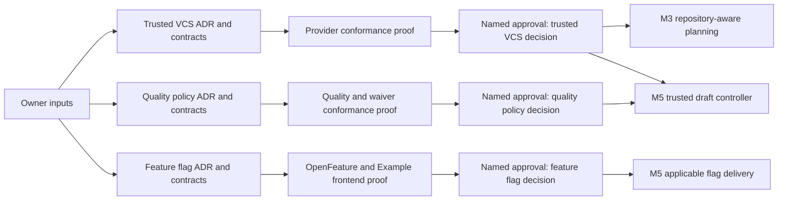

# Curve D-008 (Trusted VCS), D-010 (Quality Policy), and D-011 (Feature Flags) Decision Readiness Packet

> Sanitized public reference. Fictional identities cannot authorize execution.
> Historical approvals apply only to their original bytes; see
> [public contract edition](public-reference-sanitization.md) (sanitization, integrity and approval boundaries).

## Document control

| Field | Value |
| --- | --- |
| Status | `ANALYZED / OWNER INPUTS REQUIRED / NOT IMPLEMENTATION AUTHORITY` |
| Version | 1.0 |
| Prepared | 2026-08-27 |
| Product | Curve |
| Scope | D-008 (trusted VCS controller), D-010 (quality and waiver policy), and D-011 (feature-flag delivery) |
| Intended owners | Developer Platform and Security; Application Security; Platform Operations and Product |
| Prepared by | Codex |
| Governing baseline | Curve `main` plus the exact approved revision named by the eventual decision PR |
| Activation boundary | No VCS mutation, automatic draft, waiver, flag administration, deployment, or non-local activation is authorized by this packet |

## Executive outcome

The existing Curve baseline defines the safety invariants and the acceptance outcomes for all three decisions. It does not yet contain the provider-specific, versioned machine contracts required to implement M3 (repository-aware planning) or M5 (quality, trusted VCS mutation, draft PR/MR creation, and runtime flag delivery).

The decisions are ready for named-owner workshops when the inputs in this packet are supplied. They are not ready to become `DECIDED` because the following evidence remains missing:

1. D-008 (trusted VCS controller identity and permissions) needs exact GitHub and GitLab identities, minimum permissions, credential rotation, signing, webhook, allowlist, base-drift, reconciliation, and emergency-disable profiles.
2. D-010 (quality, security, license, and waiver policy) needs a licensed and pinned scanner set, rulepacks, severity normalization, policy precedence, disposition authority, prohibited-license policy, and deterministic waiver rules.
3. D-011 (OpenFeature backend and delivery conventions) needs the Curve control-plane flag backend, OpenFeature provider/runtime profile, environment conventions, failure behavior, targeting/audit controls, and a separately registered Example frontend Flipt delivery profile.

Each decision can be reviewed independently. D-008 (trusted VCS controller identity and permissions) and D-010 (quality, security, license, and waiver policy) must both be decided before M5 (quality and VCS delivery) can create an automatic draft. D-011 (OpenFeature backend and delivery conventions) is required only when a delivery contract contains an applicable runtime-flag obligation.

## Governing Curve sources

- `docs/curve-ai-native-sdlc-prd.md` (Curve product requirements, quality policy, delivery contracts, and decision register).
- `docs/technical/architecture-decisions.md` (decision lifecycle, owner approval, evidence, and fail-closed rules).
- `docs/technical/security-and-operations.md` (trusted-controller boundary, sandbox separation, quality dispositions, and production gates).
- `docs/technical/domain-model.md` (quality, finding, waiver, pull-request binding, and feature-delivery entities).
- `docs/technical/m1-m7-task-packets.md` (M3 and M5 implementation packages and prerequisites).
- `contracts/testing/ac-test-matrix-v1.json` (requirement-to-suite acceptance matrix for D-008 (trusted VCS controller identity and permissions), D-010 (quality, security, license, and waiver policy), and D-011 (OpenFeature backend and delivery conventions)).
- `docs/technical/review-analysis-and-remediation.md` (open licensing, quality-policy, and feature-flag remediation items).

The eventual decision PR must replace these path-only references with links pinned to its exact Curve commit.

## Official upstream evidence

### GitHub

- GitHub, [Choosing permissions for a GitHub App](https://docs.github.com/en/apps/creating-github-apps/registering-a-github-app/choosing-permissions-for-a-github-app) (minimum-permission model, installation/user tokens, webhook access, and HTTP Git requirements).
- GitHub, [Permissions required for GitHub Apps](https://docs.github.com/en/rest/authentication/permissions-required-for-github-apps) (endpoint-to-permission mapping for Contents, Pull requests, and Checks).
- GitHub, [REST API endpoints for pull requests](https://docs.github.com/en/rest/pulls/pulls) (draft pull-request creation and pull-request state operations).

GitHub Apps start with no permissions. HTTP Git requires the repository `Contents` permission, while pull-request and check operations require their corresponding repository permissions. The selected installation must therefore be restricted to explicitly approved repositories and the decision must name each required read/write permission.

### GitLab

- GitLab, [Project access tokens](https://docs.gitlab.com/user/project/settings/project_access_tokens/) (project-scoped bot identities, roles, expiry, rotation, and revocation).
- GitLab, [Access token scopes](https://docs.gitlab.com/security/tokens/access_token_scopes/) (`write_repository` Git access and `api` API access boundaries).
- GitLab, [Merge requests API](https://docs.gitlab.com/api/merge_requests/) (draft state, source/target/head observations, creation, update, and reconciliation fields).

GitLab `write_repository` permits Git-over-HTTP pull/push but cannot authenticate API calls. A project token with `api` can mutate APIs within the project and is broader than a draft-only permission. D-008 (trusted VCS controller identity and permissions) must therefore explicitly accept that GitLab limitation, separate Git and API credentials if required by Example Organization policy, and compensate with project isolation, Developer-level role, controller-side action allowlists, expiry, audit, and emergency revocation.

### Quality and CodeQL licensing

- GitHub, [CodeQL CLI license](https://github.com/github/codeql-cli-binaries/blob/main/LICENSE.md) (permitted use and restrictions for private/proprietary code and CI/CD).
- GitHub, [CodeQL CLI binaries](https://github.com/github/codeql-cli-binaries) (distribution and license notice).

The public CodeQL CLI terms permit analysis of OSI-licensed open-source code under specified conditions. They do not authorize ordinary automated analysis of private or proprietary repositories without a qualifying paid GitHub Advanced Security license or separate written rights. D-010 (quality, security, license, and waiver policy) must record Example Organization's applicable license evidence or select and validate an approved alternative for private GitLab repositories.

### OpenFeature and Flipt

- OpenFeature, [OpenFeature specification](https://openfeature.dev/specification/) (normative conformance requirements).
- OpenFeature, [Provider specification](https://openfeature.dev/specification/sections/providers/) (provider resolution interface and result metadata).
- OpenFeature, [Evaluation Context specification](https://openfeature.dev/specification/sections/evaluation-context/) (targeting key, custom attributes, and merge precedence).
- OpenFeature, [Hooks specification](https://openfeature.dev/specification/sections/hooks/) (evaluation lifecycle, audit, validation, and error hooks).
- Flipt, [OpenFeature integration](https://docs.flipt.io/v2/integration/openfeature) (official language providers and current environment-support caveat).
- Flipt, [OFREP configuration](https://docs.flipt.io/v1/reference/openfeature/configuration) (remote-provider capabilities and cache invalidation).
- Flipt, [OFREP single-flag evaluation](https://docs.flipt.io/v1/reference/openfeature/flag-evaluation) (targeting context and resolution result).

The OpenFeature API provides a provider-neutral evaluation boundary; provider behavior, storage, availability, audit, and targeting remain backend responsibilities. Flipt supplies OpenFeature providers, but its current documentation warns that its providers have not yet been updated for Flipt v2's `environments` concept. D-011 (OpenFeature backend and delivery conventions) must pin the Flipt major version and provider package versions used by Example frontend rather than assuming cross-version environment behavior.

## Fixed invariants

The following are already governed Curve requirements and are not reopened by these decisions:

| Area | Fixed invariant |
| --- | --- |
| Agent authority | Coding and review agents return candidate artifacts. They receive no push, PR/MR, approval, ready, merge, deployment, production, flag-administration, or waiver credentials. |
| VCS mutation | Only the trusted Curve controller may validate, commit, push, create/reconcile a draft, or convert the exact approved draft head to ready. |
| Merge and deployment | Curve R1 does not merge or deploy. |
| Repository scope | Each Slice targets one repository and has at most one active PR/MR binding. Each releasable vertical slice produces one draft PR/MR. |
| Exact-head evidence | Quality evidence, dispositions, waivers, and Code Readiness bind one head SHA. A head change marks prior evidence stale. |
| Quality threshold | Open `CRITICAL` or `MAJOR` findings block. External `HIGH` normalizes to Curve `MAJOR`. |
| Non-waivable classes | Verified secrets, authorization bypass, sandbox escape, destructive-data risk, restricted-data leakage, prohibited licenses, and explicit security-policy failures cannot be waived. |
| Human decisions | AI can report findings but cannot grant waivers, close security false positives, reclassify protected findings, approve Gate 3, or decide flag applicability. |
| Repository policy | Repository-native checks may strengthen the Example Organization baseline and cannot silently weaken it. |
| Runtime flags | Applicable new runtime behavior uses an OpenFeature-compatible flag, defaults off unless the approved PRD says otherwise, and has enabled/disabled tests. |
| Flag applicability | Product and Technical Approvers decide `NOT_APPLICABLE` at Gate 2. It is not a waiver. |
| Pilot flag | The Example frontend profile uses `example-feature-enabled`, default off and initially targeted to approved pilot organizations or users. |

## D-008 (trusted VCS controller identity and permissions)

### Decision statement

Select the service identities, provider permissions, signing and attribution model, repository allowlist, mutation protocol, base-drift behavior, reconciliation rules, credential lifecycle, webhook trust, and emergency-disable controls used by Curve's GitHub and GitLab adapters.

### Proposed capability boundary

| Capability | GitHub profile | GitLab profile | Curve rule |
| --- | --- | --- | --- |
| Inspect repository and commits | GitHub App installation token with repository `Contents: read` | Project access token with `read_repository`, or the approved write identity used in read mode | Workspace-approved repository and base branch only |
| Push Curve branch | `Contents: write` for selected repositories | `write_repository`, project-scoped, Developer role | Only controller-generated branch; protected/default branch denied |
| Create/reconcile draft | `Pull requests: write` | `api`, project-scoped, Developer role | One active binding per Slice; stable marker before mutation |
| Read checks/pipelines | `Checks: read` and required Actions/status read capability | `read_api` or accepted project `api` identity | Observation only; Curve cannot alter native results |
| Convert draft to ready | `Pull requests: write` | Project `api` | Exact-head Gate 3 human command only |
| Approve, merge, deploy | No permission | Controller denylist plus role/project protection | Always denied by Curve policy and conformance tests |
| Administer repository | No Administration permission | No Maintainer/Owner role | Always denied |

The final manifest must list the exact provider API endpoints and prove the minimum permission required by each. If GitLab requires the broad project `api` scope, the ADR must record this residual risk and the compensating action-level denylist.

### Owner inputs required

| Input | Required owner answer |
| --- | --- |
| GitHub installation | Owning account/organization, GitHub App owner, approved repositories, installation lifecycle, and support owner |
| GitHub permissions | Exact read/write permissions and webhook events after endpoint-to-permission proof |
| GitLab deployment | GitLab.com or Self-Managed version/tier and project-token availability |
| GitLab identities | One combined project token or separate Git/API tokens; role, scopes, expiry, and rotation owner |
| Repository allowlist | Repository IDs, canonical URLs, allowed base branches, allowed branch prefix, and fork policy |
| Commit attribution | Controller display name/email, GitHub/GitLab bot identity, and audit correlation format |
| Signing | Required providers/repositories, SSH or GPG mechanism, key owner, storage, rotation, verification, and failure behavior |
| Base drift | `FAIL_AND_REPLAN`, `TRUSTED_REBASE_AND_REVALIDATE`, or an explicitly bounded per-repository profile |
| Existing human edits | Divergence threshold and escalation owner; controller never force-pushes over human work |
| Webhook trust | Endpoint, secret type, rotation, replay window/event-ID dedupe, payload limit, and polling fallback |
| Kill switch | Global, workspace, provider, and repository disable authorities and expected revocation time |
| Credential lifecycle | Secrets Manager references, issuance, TTL/expiry, rotation rehearsal, revoke-on-cancel, and incident owner |

### Required machine contracts

The D-008 (trusted VCS controller identity and permissions) decision PR must publish and validate:

1. A VCS provider-profile JSON Schema with provider, environment, immutable repository ID, canonical URL, allowed base branches, branch prefix, installation/token reference, scopes, role, signing profile, webhook profile, and disable state.
2. One sanitized GitHub profile and one sanitized GitLab profile fixture.
3. A capability matrix mapping every Curve VCS command to provider endpoint, minimum permission, provider response, idempotency strategy, audit event, and prohibited adjacent actions.
4. Command/result schemas for `VALIDATE_CANDIDATE`, `CREATE_COMMIT`, `PUSH_BRANCH`, `ENSURE_DRAFT`, `RECONCILE_BINDING`, `MARK_READY`, and `DISABLE_CONNECTION`.
5. An immutable mutation-intent record binding workspace, Slice, plan generation, repository, base SHA, expected head, candidate digest, branch, idempotency marker, actor/policy versions, and expiry.
6. A provider-observation schema preserving event ID, signature result, provider version/cursor, source/target branch, base/head SHA, draft state, checks, mergeability, received time, and raw protected evidence reference.
7. A reconciliation state machine covering duplicate requests, lost responses, stale callbacks, reordered events, branch deletion, closed/merged external PRs, non-fast-forward push, base movement, and manual changes.
8. A credential and webhook runbook covering bootstrap, rotation, revocation, incident disable, recovery, and evidence capture.

### D-008 (trusted VCS controller identity and permissions) acceptance suite

| Proof | Required result |
| --- | --- |
| Agent credential inspection | No agent or sandbox environment contains a GitHub/GitLab push, PR/MR, ready, merge, deployment, or production credential. |
| Repository isolation | A valid token cannot mutate a non-allowlisted repository, protected/default branch, or unapproved fork. |
| Action isolation | Controller can perform the approved command and receives denial for approval, merge, deployment, repository administration, and workflow mutation. |
| Exact-head ready transition | A valid human Gate 3 command marks only the matching draft/head ready; stale, service, agent, and replayed commands fail. |
| Ambiguous draft creation | Lost response plus retry and authoritative readback produce exactly one active draft. |
| Head change | Webhook and polling observations for head B mark all head-A quality/readiness evidence stale. |
| Base drift | Each selected policy path produces the declared re-plan or trusted-rebase result and reruns the entire current-head policy. |
| Webhook forgery/replay | Invalid signature, expired/replayed delivery, oversize payload, wrong repository, and unknown event cannot mutate business state. |
| Rotation/revocation | Old credentials stop working inside the approved bound; in-flight operations pause/reconcile without duplicate mutation. |
| Controller restart | Durable mutation intent and reconciliation recover without force-push, duplicate draft, or lost audit evidence. |

## D-010 (quality, security, license, and waiver policy)

### Decision statement

Pin the Example Organization baseline checks, scanner images and versions, rulesets, license rights, severity normalization, policy precedence, required evidence, false-positive/reclassification authority, waiver eligibility, prohibited licenses, update cadence, and emergency response behavior.

### Required baseline composition

| Layer | Contents | Precedence |
| --- | --- | --- |
| Curve mandatory controls | Secrets, authorization, sandbox/data leakage, destructive change, prohibited license, and exact-head evidence checks | Cannot be disabled or weakened by a repository |
| Example Organization quality baseline | Approved static, dependency, image/configuration, secret, license, AI code-review, and security-review checks | Minimum organization baseline |
| Repository-native policy | Build, lint, type, test, compatibility, migrations, CI, ownership, and additional security checks | Additive; stricter result wins |
| Delivery-contract checks | Observability, documentation, feature toggle, and initiative-specific obligations | Apply when Gate 2 declares them applicable |

The policy resolver must retain every source, version, conflict, and resolution. An unavailable required check produces `ERROR` and blocks; it never becomes a pass.

### Tool and license decision table

| Function | Current candidate | Required owner evidence |
| --- | --- | --- |
| Secret scanning | Gitleaks | Image digest, version, rules/config digest, license review, baseline fixture, update owner |
| Dependency/image/configuration | Trivy | Image digest, version, databases and update timestamp, rules/config digest, license review, fixture |
| Static analysis | Opengrep or Example Organization-approved equivalent | Image digest, version, rulepack digest, language coverage, license review, false-positive baseline |
| CodeQL | Licensed GitHub Code Security/Advanced Security use or replacement | Written entitlement for each private/proprietary repository and CI mode, or explicit exclusion plus equivalent coverage |
| License policy | Example Organization-approved scanner/source | Detected-license taxonomy, source/package confidence, unknown handling, prohibited/review lists, legal owner |
| AI code review | Approved model/provider through D-004 (Curve Model Gateway decision) and D-005 (model/provider data-policy decision) | Prompt/model/policy digest, independence rule, data class, deterministic-check precedence |
| Repository checks | Repository-declared commands and native CI | Exact command discovery, trusted execution, required-check mapping, timeout and evidence rules |

### Severity and disposition rules to approve

| External result | Curve severity | Default readiness effect |
| --- | --- | --- |
| Critical | `CRITICAL` | Block |
| High | `MAJOR` | Block |
| Medium in security, authorization, data, sandbox, destructive, compatibility, or required-correctness rule | `MAJOR` | Block |
| Other Medium | `MINOR` | Visible; policy may require remediation |
| Low | `MINOR` | Visible; policy may require remediation |
| Info | `INFO` | Visible |
| Unknown severity or unknown required-license result | Conservative blocking result selected by D-010 (quality, security, license, and waiver policy) | Block until classified |

The decision must keep four operations distinct:

1. `FIXED`: a new run on a new or unchanged head proves remediation.
2. `FALSE_POSITIVE`: an authorized human closes a reproducible invalid result with independent evidence.
3. `RECLASSIFIED`: an authorized human changes normalized severity with evidence; the original value remains immutable history.
4. `WAIVED`: an authorized human temporarily accepts an eligible open failure with rationale, expiry, exact policy/tool/rule/head, and follow-up work item.

A waiver never changes the finding's severity and never applies to another head SHA.

### Owner inputs required

| Input | Required owner answer |
| --- | --- |
| Scanner set | Exact tools, editions, versions/images, rulepacks, vulnerability databases, and approved alternatives |
| CodeQL rights | GitHub product/license, covered organizations/repositories, CI mode, evidence owner, and expiry/renewal |
| Prohibited licenses | Exact SPDX expressions and categories that block, require review, or are permitted; treatment of unknowns |
| Required coverage | Languages/artifact types and minimum checks per repository class |
| Severity mapping | Acceptance or stricter replacement for the current Curve normalization table |
| False positives | Which named role can decide each security/non-security class and what independent evidence is required |
| Reclassification | Named authority, allowed direction, second-review threshold, and audit/evidence requirements |
| Waivers | Exact eligible classes/severities, approver, maximum duration, expiry behavior, follow-up owner, and renewal rule |
| Tool outage | Pause duration, incident escalation, fail-closed behavior, and whether any local-only development proof may continue |
| Policy updates | Owner, review cadence, emergency-rule path, compatibility window, and active-initiative re-evaluation behavior |
| Repository precedence | Conflict-resolution rules when repository-native and Example Organization results disagree |
| Evidence retention | D-009 (retention, backup, legal-hold, tombstone, and erasure decision)-compatible references for logs/reports, while digests and immutable audit remain queryable |

### Required machine contracts

The D-010 (quality, security, license, and waiver policy) decision PR must publish and validate:

1. A versioned Quality Policy JSON Schema and resolved policy manifest.
2. A tool manifest schema containing image digest, binary version, rulepack/config/database digests, license evidence reference, supported languages/artifacts, timeout, and result parser version.
3. A severity-normalization table with stable reason codes and explicit unknown behavior.
4. A policy-precedence resolver contract with mandatory, organization, repository, and delivery-contract inputs.
5. Finding and disposition transition matrices, including exact role, evidence, independence, expiry, and head-binding requirements.
6. A non-waivable class registry and prohibited-license policy with stable identifiers.
7. Quality evidence envelopes binding repository, base/head SHA, plan/context/policy, tool/rule/image, commands, timestamps, report digest, and execution environment.
8. A policy update and rollback runbook that preserves replayability of historic decisions.

### D-010 (quality, security, license, and waiver policy) acceptance suite

| Proof | Required result |
| --- | --- |
| Severity normalization | Every external severity/category fixture resolves to one stable Curve severity and reason. |
| Mandatory blocking | Required-check failure/error, open `CRITICAL`/`MAJOR`, unknown required license, and every non-waivable class block. |
| Repository precedence | A repository can add or strengthen checks and cannot remove or weaken the Curve/Example Organization minimum. |
| AI review boundary | AI may create a finding and rationale; it cannot make deterministic evidence pass or decide a disposition. |
| False-positive authority | Authorized independent evidence can close the exact result; unauthorized, agent, stale-head, and insufficient-evidence attempts fail. |
| Waiver authority | Only the approved human role can waive an eligible class; rationale, expiry, follow-up, policy/tool/rule/head are mandatory. |
| Non-waivable rejection | Secret, authorization, sandbox, destructive-data, restricted-data, prohibited-license, and selected security-policy waivers always fail. |
| Expiry | Pre-release expiry returns readiness to failed; post-release observed expiry marks delivery non-compliant and alerts its owner. |
| Head invalidation | Head B makes all head-A runs, findings dispositions, waivers, manual evidence, and Gate 3 approval stale. |
| Tool/license pin | A missing/mismatched image, ruleset, database, parser, policy digest, or license entitlement blocks instead of silently substituting. |

## D-011 (OpenFeature backend and delivery conventions)

### Decision statement

Select Curve's control-plane flag backend and provider profiles, environment/naming conventions, evaluation locations, targeting attributes, availability and cache behavior, audit/ownership, rollout/kill-switch controls, expiry/cleanup, and the separately registered Example frontend Flipt delivery profile.

### Boundary between two flag uses

| Use | Owner | Backend/profile | Purpose |
| --- | --- | --- | --- |
| Curve control-plane flags | Curve/Example Organization Platform Operations | Unresolved D-011 (OpenFeature backend and delivery conventions) backend behind OpenFeature | Enable Curve capabilities by workspace/environment without coupling Curve code to one vendor |
| Target-repository delivery flags | Owning product/service team | Registered provider profile; the target repository uses its approved provider integration | Satisfy a Feature Delivery Contract for runtime behavior implemented in that repository |

Curve does not administer a target repository's flags through an agent. A trusted provider adapter may create or validate a flag only when D-011 (OpenFeature backend and delivery conventions) explicitly authorizes that capability; otherwise Curve consumes human-provided flag evidence and evaluates the delivery contract.

### Proposed convention fields

| Field | Required convention |
| --- | --- |
| Stable key | Lowercase kebab case, globally namespaced as required by the selected backend; immutable after first use |
| Owner | Named team plus one accountable human/rotation |
| Environment | Explicit local, development, staging, and production mapping; no implicit cross-environment copy |
| Default | Boolean safe value, normally `false`, stored in code and contract |
| Targeting | Minimal approved attributes with `targetingKey`; no protected data or unrestricted email/group attributes |
| Rollout | Approved audience, percentage or rule, start, stop/review date, and rollback threshold |
| Kill switch | Named human/on-call role, expected propagation time, and provider-independent default behavior |
| Audit | Flag/config version, actor, reason, before/after digest, environment, rollout, and evidence timestamp |
| Expiry | Review date and mandatory cleanup work item; expired flags produce visible non-compliance |
| Tests | Default-off, targeted-on, provider outage, invalid context, expiry, cleanup, and both code paths |

### Owner inputs required

| Input | Required owner answer |
| --- | --- |
| Existing Example Organization backend | Product/version, ownership, license, deployment topology, HA/SLO, data store, backup/recovery, and API/provider support |
| OpenFeature runtime | SDK/provider package and exact version for Python/Django, TypeScript/React, and any target runtime |
| Evaluation location | Server, browser, or hybrid per flag class; exposure and consistency consequences |
| Environment model | Backend projects/namespaces/environments and promotion/copy process |
| Context allowlist | Approved targeting fields, source of truth, normalization, privacy classification, and missing-field behavior |
| Outage behavior | Per flag class: code default, last-known-good cache, maximum staleness, alert, and recovery |
| Administration | Human roles and trusted service capabilities allowed to create/update/disable flags |
| Audit integration | Provider audit source, Curve evidence ingestion, immutable digest, and D-009 (retention, backup, legal-hold, tombstone, and erasure decision) mapping |
| Lifecycle | Naming, owner, review date, maximum lifetime, cleanup definition, and stale-flag escalation |
| Example frontend profile | Flipt major/server version, provider packages, namespace/environment mapping, API endpoint, auth, evaluation location, and owner |
| Pilot targeting | Exact organization/user identifiers or approved derived attributes and removal date |
| Flag evidence | What proves creation, default-off behavior, targeted-on behavior, propagation, outage safety, and cleanup |

### Required machine contracts

The D-011 (OpenFeature backend and delivery conventions) decision PR must publish and validate:

1. An OpenFeature provider-profile JSON Schema with backend/version, SDK/provider versions, evaluation mode, endpoint/secret reference, environment mapping, context allowlist, cache/outage policy, capabilities, owner, audit source, and disabled state.
2. A flag-definition schema with key, type, code default, owner, environments, rollout/targeting, kill switch, review/expiry, cleanup work item, and data classification.
3. A flag-evaluation evidence envelope containing provider/config version, context-field names and sanitized digest, result value/variant/reason/error, evaluated time, environment, and application/head version.
4. An applicability decision contract binding Product and Technical Approvers, Gate 2, plan generation, and rationale for `NOT_APPLICABLE`.
5. A provider-outage and stale-cache policy with observable reason codes and metrics.
6. A Curve control-plane profile and a distinct Example frontend Flipt profile.
7. A lifecycle runbook for create, target, expand, disable, expire, remove, and verify cleanup.

### D-011 (OpenFeature backend and delivery conventions) acceptance suite

| Proof | Required result |
| --- | --- |
| Default off | Missing provider, missing flag, invalid context, and fresh installation produce the approved safe default and observable reason. |
| Targeted on | Only an approved workspace/organization/user target receives enabled behavior. |
| Context minimization | Unapproved or protected targeting attributes are rejected and never logged. |
| Dual-path behavior | Enabled and disabled paths pass repository and browser/API tests at the exact head. |
| Outage/cache | Provider loss follows the selected per-class default/cache/staleness policy and raises observable failure evidence. |
| Environment isolation | A local/development/staging change cannot silently alter another environment. |
| Authorization | Agents, Orca, and unapproved services cannot administer flags or decide applicability. |
| Audit | Every configuration change records attributable before/after evidence and provider version. |
| Expiry/cleanup | Expired flags create non-compliance; verified code/config removal closes the cleanup item without leaving dead branches. |
| Example frontend pilot | `example-feature-enabled` is default off, targeted only to the approved pilot cohort, blocks direct access when ineligible, and has four-state regression evidence. |

## Required decision records and ownership

| Decision | Accountable owner to name | Required reviewers | Status after this packet |
| --- | --- | --- | --- |
| D-008 (trusted VCS controller identity and permissions) | One named Developer Platform owner | Security, repository owners, Designated reviewer as Curve engineering approver | `PROPOSED / OWNER INPUTS REQUIRED` |
| D-010 (quality, security, license, and waiver policy) | One named Application Security owner | Legal/licensing, Developer Platform, repository owners, Designated reviewer | `PROPOSED / OWNER INPUTS REQUIRED` |
| D-011 (OpenFeature backend and delivery conventions) | One named Platform Operations owner | Product, Security/Privacy, Example frontend owner, Designated reviewer | `OPEN / OWNER INPUTS REQUIRED` |

Designated reviewer may prepare and review all three decisions under the current project convention. A named accountable person for each specialist owner role must approve its evidence before the decision record becomes `DECIDED`. A coding agent cannot perform that transition.

## Dependency and execution order

Recommended preparation order without implying approval:

1. Inventory Example Organization's current GitHub/GitLab service identities, quality services/licenses, and feature-flag backend versions.
2. Draft three separate ADRs and machine-contract sets from this packet.
3. Validate schemas and run provider fakes before any live credential or provider proof.
4. Authorize bounded proofs separately for GitHub, GitLab, the quality toolchain, Curve flags, and Example frontend Flipt.
5. Record proof evidence and residual risks against the exact decision PR head.
6. Obtain named-owner approvals and merge the decision contracts.
7. Generate implementation task packets pinned to the resulting Curve `main` revision and context digest.

## Stop conditions

Preparation stops without implementation mutation when any of the following is true:

- A required owner, license entitlement, provider version, repository allowlist, or secret lifecycle is unknown.
- A proposed GitHub/GitLab identity can approve, merge, deploy, administer repositories, or reach an unapproved repository without an independently enforced denial.
- A private/proprietary CodeQL use lacks documented rights.
- The quality policy can treat an unavailable required check as a pass, waive a fixed non-waivable class, or reuse evidence across head SHAs.
- A flag profile lacks a safe code default, environment isolation, attributable audit, target-field allowlist, outage behavior, or cleanup owner.
- A proof would use protected data, production credentials, staging/production state, or external mutation without exact bounded authorization.

## Definition of decision-complete

Each of D-008 (trusted VCS controller identity and permissions), D-010 (quality, security, license, and waiver policy), and D-011 (OpenFeature backend and delivery conventions) is decision-complete only when:

- its ADR follows the governed Curve ADR structure;
- every owner input is answered by a named accountable person;
- exact provider/tool/SDK versions, licenses, permissions, images, rules, endpoints, and environments are pinned;
- machine schemas, sanitized examples, state/authorization matrices, and conformance fixtures validate;
- a bounded proof has reproducible commands and immutable evidence;
- fail-closed, rollback, disable, rotation/revocation, incident, and exit behavior are explicit;
- acceptance criteria map to executable tests;
- the owner and required reviewers approve the exact PR head;
- the merged Curve commit and generated context digest are recorded in every consuming task packet.

Until then, Curve retains these effective boundaries: repository inspection only for D-008 (trusted VCS controller identity and permissions)-dependent flows; Critical/Major and unknown-license results block under D-010 (quality, security, license, and waiver policy); and applicable flag-delivery checks cannot pass without a registered D-011 (OpenFeature backend and delivery conventions) profile.
