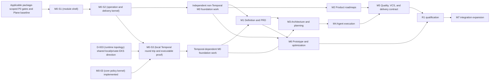

# Curve Technical Development Plan

## Document control

| Field | Value |
| ----- | ----- |
| Status | Execution blueprint for architecture approval and AI coding-agent delivery |
| Version | 1.4 |
| Last updated | 2026-08-22 |
| Source | [Curve PRD v0.12](../curve-ai-native-sdlc-prd.md) (product requirements, Curve-first shell invariant, lifecycle, security invariants, acceptance criteria, and accepted D-003 local implementation) |
| Audience | Engineering leads, architects, security, operations, QA, and AI coding agents |
| Planning unit | Repository-local work package materialized against the approved public Plane fork and an exact merged base SHA under D-001 (Plane upstream foundation decision) |

## Purpose and authority

This plan turns the PRD and the companion technical documents into a dependency-ordered implementation backlog. It is deliberately component-level rather than file-level because the Plane baseline, repository layout, and several infrastructure decisions remain `OPEN` or `PROPOSED`. An AI coding agent must not infer approval from a proposed direction.

The PRD is authoritative for product behavior. The technical documents are authoritative for the approved architecture. This plan is authoritative for delivery order, work-package boundaries, quality evidence, and milestone exit criteria. A work package that conflicts with a PRD invariant must be corrected before implementation.

## Non-negotiable delivery rules

1. No application implementation begins until the package's blocking D-001 through D-016 (controlled architecture and product decisions) are `DECIDED` and linked ADRs are approved. A bounded P0 decision-proof package may run while its decision is `OPEN` or `PROPOSED` only because its sole output is decision evidence; it receives separate proof authorization, cannot use production data, and cannot enable production behavior.
2. Every implementation slice affects one repository and has at most one active PR or MR. A work package spanning repositories is decomposed into a typed DAG of repository-local slices.
3. Every slice is linked to PRD FR/NFR/AC IDs and to the exact approved technical-document versions.
4. Database and event changes are additive and backward compatible until the rollback window closes.
5. External mutations use an outbox/inbox, idempotency key, trusted controller, and reconciliation path before feature code may call them.
6. Agents have no approval, waiver, VCS mutation, merge, deploy, production, or policy-administration authority.
7. A package is not complete when code compiles; its deterministic tests, contract tests, security tests, observability, migration/rollback evidence, documentation, and traceability must pass.
8. New head commits invalidate commit-bound validation. Human readiness remains a separate gate.
9. No package may introduce a second general knowledge index, a second lifecycle authority, or a provider-specific domain model.
10. R0A and R0B are validation configurations. Only completion of M0-M6 and AC-01-AC-60 constitutes R1.
11. A package that creates or materially changes a user-facing flow may begin implementation only after its [Curve Experience Blueprint](curve-experience-blueprint.md) record is approved. The record supplies the intended user outcome, information-architecture placement, role and permission model, screen/state flow, progressive-disclosure rules, and task-based prototype review evidence.

## Planning assumptions

- The Curve repository is the documentation/contract authority and the public Plane fork is the implementation repository under decided D-001 (Plane upstream foundation decision). Accepted candidate `d380678912e9b46805ef852d2e05411f1fea6d8b` is merged; fork `preview` foundation `549db1aea8f3307b337b3686dbb844a87549cd95` remains the historical foundation, and accepted descendant `39920769daf78fce29a10c7f4e4bb8779671b004` is the current post-M0-S5A implementation base.
- Federico Ocampo decided the original D-003 (runtime topology and trust-zone decision) local scope at approved head `7826f403...`, merged as `097016f...`, and approved the [private-platform connectivity amendment](d003-private-platform-connectivity-amendment.md) (shared local network, private EKS direction, service identity, controls, and revised proof) at head `5e165c...`, merged as `aece539...`. Temporal Python SDK 1.31.0 remains fixed. M0-S3 (local Temporal round-trip implementation packet) accepted Plane `dev_env`, direct loopback ports, replay, restart, cancellation, security, and rollback at merge `d99342f...`; P0-06A (isolated Temporal feasibility proof) and P0-06B (least-privilege Plane integration proof) remain superseded standalone gates. Environment activation remains package-gated.
- Component names in this plan are logical. The architecture may co-deploy compatible components, but ownership, contracts, trust boundaries, and failure isolation remain distinct.
- Relative sizes are planning signals: `S` is a bounded adapter/schema/UI slice, `M` is a component with several contracts, and `L` must be decomposed before dispatch. They are not calendar estimates.
- Every milestone has a production-like demonstration environment even when the capability is not production-enabled.

## Delivery dependency graph



M1 and M2 may proceed in parallel after the relevant M0 contracts stabilize. M6 preview work may proceed after M1, but R1 cannot exit until M5 and M6 both pass. Schema, API, event, and workflow contracts must be reviewed before consumers start; consumer-first implementation against an unapproved draft is prohibited.

## Entry criteria for coding

A work package is `READY` only when it has:

- Approved PRD and technical-document versions.
- Resolved blocking decision/ADR IDs.
- One repository, target branch, and pinned base SHA.
- A named owner and human reviewer.
- Scope, non-scope, user/system outcome, and risk tier.
- Linked FR/NFR/AC IDs and Given/When/Then tests.
- Approved data/API/event/provider contracts and migration strategy.
- Dependency edges with explicit satisfaction states.
- Repository instructions and required build/lint/type/test/security commands.
- Model/tool/sandbox budgets and data classification.
- Rollback or disablement behavior.
- A unique item in [Curve GitHub Project #2](https://github.com/users/faocampo/projects/2) whose stable ID matches the package and whose status is maintained as visual progress metadata.
- For a user-facing flow, an approved [Curve Experience Blueprint](curve-experience-blueprint.md) record linked from the work package. The record includes the target role/job, primary task flow, normal/loading/empty/error/permission-limited states, primary actions, accessibility behavior, and prototype-review outcome.

If any item is absent, the coding agent stops before mutation and reports the missing prerequisite.

Preparing a task packet and maintaining its GitHub Project status require no
separate project-management approval. A packet blocks implementation only for a
missing dependency or a material unresolved product, architecture, security,
data-policy, licensing, infrastructure, or external-side-effect decision. Build
commands, test decomposition, visual status, and other routine delivery details
are owned by Federico Ocampo as the current package owner/reviewer and may be
updated without an additional governance gate.

Project status follows the [GitHub Project tracking map](github-project-execution-map.md) (visual work-package projection and status-maintenance rules). Federico Ocampo or authorized automation may update any package status directly to keep the board visually useful. Project status is informational and is not a dispatch prerequisite, execution authority, gate, waiver, or lifecycle state for Curve itself. This plan, approved ADRs, contracts, and immutable task packets remain normative.

## Work-package catalog

### P0A: Foundation readiness

| ID | Size | Deliverable | Dependencies | Completion evidence |
| -- | ---- | ----------- | ------------ | ------------------- |
| P0-01 | M | Plane community baseline and reuse/build inventory covering backend, web, auth, work items, pages, estimates, relationships, Gantt, notifications, APIs, webhooks, licensing, and extension points | D-001 | Approved inventory and compatibility ADR; no commercial-only assumption. |
| P0-02 | M | Repository and deployment topology: logical component-to-repository mapping, owner-reviewed local topology, and fail-closed staging/production decision matrix covering trust zones, persistence, backup, security, and ownership | D-003 local decision and private-platform connectivity amendment | Named owner approval of the local C4/deployment views, repository map, shared-`dev_env` Compose overlay, worker environment/credential allowlists, loopback exposure, private EKS/`ClusterIP`/VPN direction, authenticated non-local Temporal clients, and explicit environment-activation inputs. |
| P0-03 | M | Decision ADR set for D-002-D-016 with selected versions, licenses, owners, security/data policy, and milestone block status | P0-01, P0-02 | Every D item is approved or explicitly blocks its package; no implicit default in code. |
| P0-04 | S | Documentation, schema, ADR, and generated-contract conventions plus CI validation for Markdown, Mermaid, OpenAPI, JSON Schema, and architecture links | P0-01 | CI fails on invalid docs/contracts and produces rendered artifacts. |
| P0-05 | M | Test harness strategy: unit, database, contract, fake providers, Temporal replay, browser, security fixtures, migration, load, and recovery | P0-02 | Test matrix maps every AC to an owning suite and environment. |
| P0-06 | M | Historical two-stage local Temporal proof design, superseded by the M0-S3 executable proof | D-003 (runtime topology and trust-zone decision) `LOCAL_ONLY`; [historical proof packet](p0-06-local-temporal-proof-task-packet.md) (superseded proof design and audit history); v3 terminal stage record | `DONE/SUPERSEDED`: approved head `7826f403...` and merge `097016f...` retire P0-06A/P0-06B as standalone gates and bind M0-S3 as the executable local proof. No non-local enablement. |

`P0A` is complete only when P0-01 through P0-06, the architecture Definition
of Done for the enabled subset, and the applicable named-owner decisions are
complete. This phase-exit criterion is not a blanket entry gate for every local
M0 packet. A bounded local M0 packet may be dispatched earlier only when every
dependency and decision scope named by its immutable task packet is satisfied
and every `READY` field passes. Under the current local-skeleton packets, M0-S1
and M0-S2 do not depend on P0-06. P0-06 is complete through supersession.
M0-S3 and its downstream packets require the effective D-003
private-platform connectivity amendment, the implemented M0-03 policy kernel,
and their packet-specific base, context, owner/reviewer, Project, and
acceptance evidence.

### P0B: Just-in-time integration proofs

| P0-07 | M | gVisor/EKS runner-pool proof with one disposable untrusted workload | D-003 proposal; proof authorization | Node OS/architecture/containerd/runsc/shim and AMI/bootstrap manifest; `RuntimeClass`; denied metadata/private/production/registry egress; resource/timeout enforcement; cancellation, cleanup, quarantine, observability, upgrade/rollback, and measured overhead. |
| P0-08 | M | OpenHands provider and workspace-runtime proof | P0-07; D-003 proposal; proof authorization | Pinned Agent Server/SDK/image, Curve pod-per-attempt provisioner, no Docker socket, normalized event/artifact/question/heartbeat/cancel flow, duplicate/lost/out-of-order reconciliation, candidate-only output, and no VCS/production credential proof. |
| P0-09 | M | Onyx initiating-user delegation proof | D-002 proposal; proof authorization | Issuer/audience/scopes, exchange or pass-through sequence, expiry/revocation, source ACL parity for two users, durable-wait reauthorization, audit/redaction, threat fixtures, and owner recommendation. |
| P0-10 | M | GitLab trusted-controller proof in a disposable approved project | D-008 proposal; proof authorization | Project-token scopes, secret reference/rotation/revocation, signed attribution where supported, candidate validation, idempotent branch/push/draft, webhook verification, ambiguous-response reconciliation, and proof that the sandbox cannot mutate VCS. |
| P0-11 | M | Quality/security/license baseline proof for representative TypeScript and Kotlin repositories | D-010 proposal; P0-07; proof authorization | AppSec/legal tool selection, license entitlement, pinned images/rules, language/build modes, severity normalization, non-waivable and false-positive fixtures, CodeQL-or-equivalent evidence, performance/cost, and update owner. |
| P0-12 | M | Retention, backup, legal-hold, tombstone, and erasure decision package | D-009; data inventory; owner workshops | Approved class-by-asset periods, deletion eligibility, audit/body split, backup expiry, legal-hold precedence, cryptographic-erasure feasibility, restore/erasure tests, cost, and owner signatures. |

P0B proofs are completed immediately before their consuming milestone: gVisor and OpenHands before M4, Onyx before protected M1 retrieval, GitLab/GitHub before M3/M5 VCS work, quality before M5, and retention before M0-04 or any non-local activation. Proof packages may run in parallel when their environments and owners are independent, but an evidence consumer waits for the producer's immutable result.

### P0 decision-proof protocol

Every proof package has one named decision owner and one technical operator. Before execution it records the hypothesis, alternatives, exact environment, allowed data, allowed resources/mutations, budget, cleanup deadline, expected evidence, pass/fail thresholds, and stop conditions. The operator reports the action before performing it and stores commands/results without secrets.

A proof package may create only disposable local or staging resources explicitly named in its authorization. It cannot change a production cluster, shared repository history, provider policy, legal classification, or user access. Failure, ambiguity, or an unsupported capability is valid evidence and leaves the decision blocked; it must not be hidden behind an implementation fallback.

The final proof report contains exact versions/digests, topology/configuration, reproducible commands, raw protected evidence references, sanitized summary, threat/license/cost/operations analysis, cleanup result, recommendation, and ADR link. Only the named owner can accept it and mark the ADR `DECIDED`.

### M0: Foundation and control plane

| ID | Size | Deliverable | Dependencies | PRD trace | Completion evidence |
| -- | ---- | ----------- | ------------ | --------- | ------------------- |
| M0-01 | M | Curve module boundary integrated with Plane identity/workspace references and feature-flagged navigation/API exposure | P0-01, P0-02 | FR-001, FR-022, NFR-015-NFR-016, AC-01, AC-35 | Workspace isolation tests, disabled behavior with unchanged Plane routes/navigation, forward/backward/forward additive Curve migration proof, rollback path, and supported Plane upgrade test. This package owns the implementation proof allocated by D-001. |
| M0-02 | M | Core aggregate persistence, opaque IDs, UTC timestamps, aggregate versions, tombstones, append-only histories, and migrations | M0-01 | FR-007, FR-021, NFR-004, NFR-018, AC-08, AC-34, AC-56 | Forward/backward migration and optimistic-concurrency suites. |
| M0-03 | M | Core authorization/policy kernel for roles, object ACLs, risk tier, assignments, separation of duties, classification, trusted evaluation time, versioned contexts, and deny-by-default generic allowlists | M0-01 | FR-043, NFR-009-NFR-012, AC-09, AC-35, AC-52 | `DONE`: Plane PR #4 merged approved head `a807dd7...` as `922dd6d...`. [M0-03 implementation evidence](m0-03-implementation-evidence.md) (exact context, implementation tree, tests, security acceptance, and rollback) records reversible migration, 113 Curve tests, 629 Plane tests, and equivalent approved/merge trees. Provider-specific policy follows its decided ADR. |
| M0-04 | M | Workspace-scoped object storage, AccessEnvelope, digest service, retention hooks, upload/download intents, and cryptographic-erasure workflow | M0-02, M0-03, D-009 | FR-004, FR-021, NFR-010-NFR-011, NFR-018, NFR-020, AC-53, AC-56 | Classification, ACL, integrity, size, tombstone, erasure, and backup tests. |
| M0-05 | M | Transactional outbox, inbox, idempotency store, Operation resource, dead-letter state, and replay-safe relay | M0-02 | FR-021, FR-023, FR-044, NFR-004-NFR-005, AC-26, AC-33 | Duplicate/lost/out-of-order test suite with no duplicate effects. |
| M0-06 | L | Temporal parent-workflow skeleton, version markers, child-attempt workflow, signals, timers, cancellation, continue-as-new, and replay corpus | M0-05, M0-03, D-003 | FR-015, FR-022, NFR-004, AC-17-AC-21, AC-58 | M0-S3 (local Temporal round-trip implementation packet) is `DONE` at Plane merge `d99342f...`: SDK 1.31.0, shared-`dev_env` Compose overlay, direct loopback ports, duplicate/restart/replay/cancellation/leakage/dependency-connectivity proof, and disablement rollback are accepted in [M0-S3 implementation evidence](m0-s3-implementation-evidence.md) (exact context, merge, tests, runtime proof, security acceptance, and rollback). Broader parent/child behavior remains later M0-06 scope. |
| M0-07 | M | Public API conventions, Problem Details, ETag/If-Match, idempotency headers, cursor pagination, SSE resume, and OpenAPI generation | M0-02, M0-03, M0-05 | FR-023, NFR-002-NFR-005, NFR-013, AC-35 | API contract tests and generated client fixture. |
| M0-08 | M | Audit and observability foundation with safe correlation, classification-aware redaction, metrics, traces, alerts, and operational dashboards | M0-03-M0-07; OBS-BIND-001 for local X3M export/provisioning only | FR-021, FR-024, NFR-001-NFR-014, AC-34, AC-36, AC-53 | M0-S5A is accepted in [M0-S5A implementation evidence](m0-s5a-implementation-evidence.md) (exact context, merge, dual-mode full regression, security controls, and rollback). [M0-S5 observability task packet](m0-s5-observability-task-packet.md) (telemetry-kernel and X3M integration split) and [telemetry manifest v1](../../contracts/observability/m0-s5-telemetry-v1.json) (closed telemetry and static asset surface) remain normative. M0-S5B still proves the owner-approved live binding and independent platform path-health signal. |
| M0-09 | M | Provider registry, connection lifecycle, capability documents, common error taxonomy, callback ingress, outgoing webhooks, and reconciliation scheduler | M0-03, M0-05, M0-07, D-007 | FR-003, FR-023, FR-044, NFR-005, NFR-008, NFR-013, AC-33, AC-57 | Fake-provider conformance suite and 15-minute reconciliation proof. |

The current Plane implementation base is M0-S5A merge
`39920769daf78fce29a10c7f4e4bb8779671b004`; M0-S1, M0-S2, M0-03, M0-S3,
M0-S4, and M0-S5A are complete.
M0-S2 satisfies M0-02 (core aggregate persistence) and M0-05 (transactional
delivery kernel) through [M0-S2 implementation evidence](m0-s2-implementation-evidence.md)
(exact contract, context, implementation, validation, and merge binding).
M0-03 (core authorization and policy kernel) is accepted through
[M0-03 implementation evidence](m0-03-implementation-evidence.md) (exact
context, Plane implementation/merge, validation, security acceptance, and
rollback). M0-S3 (local Temporal round-trip implementation packet) is accepted
through [M0-S3 implementation evidence](m0-s3-implementation-evidence.md)
(exact context, Plane head/merge, tests, runtime proof, security acceptance, and
rollback). M0-S4 (API, SSE, and minimal Curve-first UI implementation packet)
and the local M0-07 (public API and resumable SSE foundation work package) are
accepted through [M0-S4 implementation evidence](m0-s4-implementation-evidence.md)
(exact context, approvals, Curve/Plane merges, full regression, UX/security
acceptance, and rollback). Federico approved Plane head `a1748c7...`, and Plane
PR #6 squash-merged it into `preview` as `e762fbb...` with an identical Git
tree. The exact merge tree passed 27 Curve frontend tests, 148 Curve backend
tests, 664 Plane backend tests, all 60 monorepo checks, all 16 build tasks,
CodeQL, copyright, and migration-drift verification. The five-packet local M0
checkpoint remains packet-scoped. Downstream packets
consume the decided D-003 shared local profile and accepted M0-S3 runtime proof. D-007
does not gate M0-S1 through M0-S5 because those packets expose no
MCP capability. D-007 remains required by M0-09 and later MCP-enabled
capabilities under its current proposal; its dependency ordering with D-006
requires Security and Platform approval before either is implemented. D-009 gates M0-04,
protected-body or retention-dependent capabilities, and every staging or
production activation. Until D-009 is decided, local packets may persist only
synthetic data and the minimum non-sensitive operation and audit metadata
defined by their contracts. M0 exit also requires control-plane SLOs, the
applicable recovery proof, replay safety, and no cross-workspace or telemetry
leakage.

### M1: Alignment, evidence, and PRD

The implementation-oriented packet catalog for M1-M7 is
[M1-M7 coding-agent task packets](m1-m7-task-packets.md) (milestone outcomes,
material gates, deterministic evidence, and rollback contracts). Federico Ocampo is the
default owner and reviewer until explicitly reassigned. GitHub Project status
is visual metadata; only the material decision classes defined by that catalog
can gate packet materialization.

| ID | Size | Deliverable | Dependencies | PRD trace | Completion evidence |
| -- | ---- | ----------- | ------------ | --------- | ------------------- |
| M1-01 | M | Initiative aggregate and APIs for mode, Product, keyword, risk proposal, ownership, three assignments, lifecycle, pause, and cancel | M0-02, M0-03, M0-06-M0-07 | FR-001, FR-042-FR-043, AC-01-AC-02, AC-20 | State-transition, authorization, cancellation, and keyword uniqueness tests. |
| M1-02 | M | Idea Brief schema and conversation-plus-artifact UI with attributed manual/model updates, blockers, assumptions, and contradictions | M1-01, D-005 | FR-002, G-01, AC-03 | Browser/accessibility tests and regeneration-diff audit. |
| M1-03 | M | Onyx KnowledgeProvider and per-operation delegation with access recheck, revocation, source metadata, and policy-safe retrieval | M0-09, D-002, D-005 | FR-003-FR-004, FR-043, AC-04, AC-09, AC-53-AC-54, AC-60 | Onyx adapter contract, revoked-token, inaccessible-approver, and prompt-injection fixtures. |
| M1-04 | M | Evidence Snapshot/Item, AccessEnvelope propagation, citation validation, DLP/redaction, freshness, and artifact evidence view | M0-04, M1-03 | FR-004, FR-021, NFR-010-NFR-012, AC-09, AC-34, AC-53 | Claim-to-evidence trace and destination-leakage tests. |
| M1-05 | S | Optional research activity with bounded questions, sources, budget, stop conditions, partial results, and skip history | M1-03-M1-04, D-014 | FR-005, AC-05 | Budget, skip, provider-failure, and fact/inference separation tests. |
| M1-06 | L | Artifact and PRD versioning, generation/editing, structural diff, submission, completeness, supersession, and approval UI | M0-02, M1-02, M1-04, D-005 | FR-007, FR-021, AC-08-AC-09 | Immutable-version, source-access, diff, and concurrent-edit suites. Decompose into schema/API/UI slices. |
| M1-07 | M | Gate 1 assignment/decision workflow, notifications, changes requested/rejection, risk confirmation, and evidence-access enforcement | M1-06, M0-06 | FR-007, FR-015, AC-08-AC-09 | Exact-version approval and unauthorized/agent decision rejection. |

M1 exit is R0A: an X3M user completes an evidence-backed PRD with their own delegated access, and every material approver can access the evidence used.

### M2: Product roadmap and schedule

| ID | Size | Deliverable | Dependencies | PRD trace | Completion evidence |
| -- | ---- | ----------- | ------------ | --------- | ------------------- |
| M2-01 | M | Product, Roadmap, Milestone, Feature, Roadmap Item, and movement-history aggregates with enums/cardinalities | M0-02-M0-03, D-013 | FR-025-FR-027, AC-02, AC-37, AC-40 | Invariant, same-Feature/multi-Milestone, and movement audit tests. |
| M2-02 | M | Roadmap-backed Initiative/PRD linkage and one Feature Delivery identity | M1-01, M1-06-M1-07, M2-01 | FR-026, FR-032, FR-038, AC-02, AC-43-AC-44, AC-51 | Mode conversion and classification-removal authorization tests. |
| M2-03 | M | Plane WorkItemBinding and Execution Completion projection with estimate/count formulas and no feedback loop | M0-09, M2-01 | FR-028, FR-037, AC-38, AC-42 | Formula fixtures for nested, blocked, cancelled, and unestimated work. |
| M2-04 | L | Portfolio Roadmap and period Gantt queries/UI with filtering, health/confidence, dependency graph, schedule impact, and critical path | M2-01-M2-03, P0-01 | FR-030-FR-031, NFR-015, AC-37-AC-42 | Browser/accessibility and critical-path/not-calculable scenarios. Decompose view and scheduling engine. |
| M2-05 | M | Immutable Roadmap Snapshot, copied render values, object export, PDF/image renderer, and publication authority | M0-04, M2-01-M2-04 | FR-029, NFR-018, AC-39-AC-40 | Byte/digest reproducibility, immutability, ACL, and export tests. |
| M2-06 | S | Validated manual/import workflow selected by D-013 with source references and reconciliation report | M2-01, D-013 | Migration assumptions, AC-37 | Import fixture, rollback, and error report. |

M2 can run parallel to M1 after M0, but M2-02 waits for the Initiative/PRD contracts. Published snapshots cannot depend on mutable working-roadmap fields.

### M3: Repository understanding and execution planning

| ID | Size | Deliverable | Dependencies | PRD trace | Completion evidence |
| -- | ---- | ----------- | ------------ | --------- | ------------------- |
| M3-01 | M | Read-only GitHub and GitLab repository discovery adapters with base SHA, instructions, CODEOWNERS, CI, build/test commands, and allowlist enforcement | M0-09, D-008 | FR-008-FR-009, FR-043, AC-10, AC-52 | Both providers pass read-only conformance and revoked-scope tests. |
| M3-02 | L | Deterministic repository analyzer for packages, services, symbols, schemas, migrations, dependencies, Tree-sitter extraction, and Zoekt search | M3-01, D-001 | FR-009-FR-010, AC-10 | Golden-repository corpus and freshness/digest tests. Decompose index, extractor, and report. |
| M3-03 | M | Context Pack builder and signer with exact versions, bounded inputs, read-only mount contract, and sanitized Context Manifest | M0-04, M1-04, M3-01-M3-02 | FR-012, FR-021, NFR-010-NFR-011, AC-15, AC-53 | No restricted evidence in Git; mount/digest/access/revocation tests. |
| M3-04 | L | Architecture Delta, Repository Impact Map, typed DAG, plan/slice schemas, acceptance/test/rollback obligations, and plan generation workflow | M1-06-M1-07, M3-02-M3-03, D-005 | FR-010-FR-011, AC-11-AC-14 | Schema completeness, cycle, one-repository, and requirement-trace tests. Decompose generation and deterministic validator. |
| M3-05 | M | Plan review UI and Gate 2 with exact versions, base-update policy, providers, budgets, contract applicability, and authorized side effects | M3-04, M0-06, D-008, D-014 | FR-010-FR-012, FR-032-FR-040, AC-11-AC-15, AC-44-AC-48 | Exact-plan authorization, scope-expansion denial, and re-plan invalidation tests. |
| M3-06 | M | PRD/plan supersession impact assessment with continue-pinned, pause, cancel, and re-plan per slice | M1-06, M3-04-M3-05 | FR-007, FR-021, AC-08, AC-25 | Active context never changes silently; decision/audit/replay tests. |

M3 exit is an approved two-repository plan with no cycles, exact base SHAs, typed dependencies, complete slice packets, bounded authorization, and no permissioned evidence in Git.

### M4: Agent execution and isolated runners

| ID | Size | Deliverable | Dependencies | PRD trace | Completion evidence |
| -- | ---- | ----------- | ------------ | --------- | ------------------- |
| M4-01 | M | AgentExecutionProvider SDK, fake provider, normalized attempt/events, leases, heartbeat, questions, usage, candidate artifacts, and contract suite | M0-09, M3-04 | FR-013-FR-015, NFR-007-NFR-008, NFR-013, AC-16-AC-21 | Shared automated-provider conformance, lease exclusivity, callback/poll, and replay tests. |
| M4-02 | M | Developer-operated Orca MCP profile for task/context reads and claim, release, heartbeat, progress, question, completion, and VCS-reference writes | M0-09, M3-04, D-006-D-007 | FR-013-FR-015, AC-16-AC-21 | Delegated-auth, workspace/object authorization, transition, attribution, idempotency, stale-version, revocation, and prohibited-action fixtures. Orca receives no Curve-managed VCS credential. |
| M4-03 | M | OpenHands adapter pinned to approved API/version and sandbox mode | M4-01 | FR-013-FR-015, AC-16 | Complete shared suite plus OpenHands-specific recovery fixtures. |
| M4-04 | L | Trusted runner controller, JIT identity/secrets, namespace/worktree lifecycle, context mount, resource policy, heartbeat, cancellation, cleanup, and quarantine | M0-03-M0-04, M3-03, M4-01, D-003, D-014 | FR-013-FR-015, FR-042-FR-043, NFR-007-NFR-010, AC-20-AC-22, AC-52-AC-55 | Isolation/SSRF/egress/secret/cross-run/resource/lost-runner tests. Decompose control plane and runtime profile. |
| M4-05 | M | Slice dispatch child workflow, dependency satisfaction, attempt retry/replacement, durable question/answer, budget pause, and cancellation | M0-06, M3-05, M4-01-M4-04 | FR-013-FR-015, FR-042, AC-17-AC-21 | Temporal replay and fault-injection suite. |
| M4-06 | M | Execution Console for state, safe activity, questions, costs, errors, attempts, pause/cancel/retry, and lineage | M4-05, M0-07-M0-08 | FR-014-FR-015, FR-024, NFR-012, NFR-015, AC-17-AC-21 | Live SSE, accessibility, redaction, and authorization tests. |

M4 exit requires OpenHands to pass `AgentExecutionProvider` conformance and Orca to pass the distinct human-assistance MCP suite. OpenHands returns only a candidate tree. A developer using Orca pushes with normal developer credentials outside Curve, then links a branch/head or MR; the trusted controller validates it and may create the draft MR when none exists. Neither path can satisfy quality or Code Readiness by itself.

### M5: Quality, VCS, Code Readiness, and Feature Delivery Contract

| ID | Size | Deliverable | Dependencies | PRD trace | Completion evidence |
| -- | ---- | ----------- | ------------ | --------- | ------------------- |
| M5-01 | M | QualityPolicyVersion merge engine with non-reducible X3M baseline, additive repository policy, tool/rulepack/image pins, applicability, and D-010 thresholds | M0-02, M3-01, D-010 | FR-016-FR-018, NFR-013, AC-23-AC-25 | Policy precedence, unknown-license, and non-waivable fixtures. |
| M5-02 | L | Isolated preflight executor for repository commands, builds/types/lint/tests, Playwright, Gitleaks, Trivy, Opengrep, protected logs, and result attestation | M4-04-M4-05, M5-01 | FR-016, FR-018, NFR-009-NFR-011, AC-23-AC-25, AC-55 | Seeded pass/fail/flaky/malicious fixtures and exact-SHA attestation. Decompose command runner and scanners. |
| M5-03 | M | Independent AI code/security review, normalized findings, fingerprinting, severity, dispositions, reclassification, re-review, and evaluation corpus | M4-01, M5-01-M5-02, D-005 | FR-017-FR-018, NFR-011-NFR-012, AC-23-AC-25, AC-48 | Model/prompt pin, precision dataset, no self-approval, and deterministic-check precedence. |
| M5-04 | M | Waiver and `NOT_APPLICABLE` decision workflows with authority, non-waivable matrix, expiry, follow-up, and non-compliant projection | M0-03, M5-01, M2-02 | FR-039-FR-040, AC-47-AC-48 | Unauthorized/agent/non-waivable denial and clock-expiry tests. |
| M5-05 | L | Trusted VCS controller and GitHub adapter: validated candidate, commit attribution/signing, branch push, draft create/update, current state, explicit ready conversion, and reconciliation | M3-01, M4-04-M4-05, M5-02, D-008 | FR-018-FR-020, FR-044, AC-22, AC-25-AC-33 | GitHub conformance, ambiguous response, stale head/base, and no-agent-token tests. Decompose controller and provider. |
| M5-06 | M | GitLab VCS adapter with behavior parity and provider-specific webhook/auth mapping | M5-05, D-008 | FR-008, FR-019-FR-020, FR-044, AC-26-AC-33 | Same VCS contract suite as GitHub. |
| M5-07 | M | Post-draft validation projection: CI/checks, protection/configuration, CODEOWNERS resolution, mergeability, draft-capable findings, head invalidation, and reconciliation | M5-05-M5-06 | FR-020, FR-041, FR-044, AC-25, AC-27-AC-28, AC-31-AC-33 | New-commit invalidation, delayed/missing webhook, and post-ready approval separation. |
| M5-08 | M | Review-comment synchronization and authorized actionable rework on the same branch/PR with rerun orchestration | M5-03, M5-05-M5-07 | FR-041, AC-31 | Human/bot comments, thread authorization, same-binding, and stale-result tests. |
| M5-09 | M | Gate 3 Code Readiness UI/workflow for exact heads and explicit trusted-controller draft-to-ready; repository approvals remain external | M5-03-M5-08, M0-06 | FR-020, FR-037, AC-25, AC-27-AC-30 | Head-race fail-closed, role separation, no-auto-ready/merge/deploy tests. |
| M5-10 | L | Feature Delivery, versioned contract, aggregate checks/evidence, Pull Request Set, independent binding state, and release-readiness projection | M2-02, M3-05, M5-04-M5-09 | FR-032-FR-040, AC-32, AC-42, AC-44-AC-51 | Multi-repository partial failure, contract cardinality, applicability, and readiness tests. Decompose aggregate and UI. |
| M5-11 | M | Observability contract check and R1 manual post-release evidence with trusted MonitoringProvider boundary | M5-10 | FR-033, AC-45, AC-49-AC-50 | Pre/post separation and no-sandbox-production-access tests. |
| M5-12 | M | Docusaurus DocumentationProvider and documentation slices/build/link/navigation evidence | M3-01, M5-10, D-012 | FR-034, FR-036, AC-46, AC-49 | Applicable/N-A authority, build failure, and coordinated-set tests. |
| M5-13 | M | OpenFeature validation adapter, flag lifecycle schema, applicability, dual-path evidence, and cleanup projection | M5-10, D-011 | FR-035-FR-036, AC-47-AC-49 | Backend contract, disabled/enabled tests, N-A authority, expiry/cleanup. |
| M5-14 | M | Quality/Contract/PR Set UI and draft-body/check-summary renderer with lineage, waivers, dependencies, and current-head state | M5-03-M5-13 | FR-019-FR-021, FR-036-FR-040, NFR-012, NFR-015, AC-29-AC-34, AC-44-AC-51 | Browser/accessibility, redaction, update, and coordinated-state tests. |

M5 exit proves the entire supported flow through both VCS providers, both agent providers, a coordinated multi-repository set, two-phase quality, human Code Readiness, contract evidence, review rework, and replay-safe recovery.

### M6: Prototypes, feedback, KPI, and optimization

| ID | Size | Deliverable | Dependencies | PRD trace | Completion evidence |
| -- | ---- | ----------- | ------------ | --------- | ------------------- |
| M6-01 | L | Separate preview controller/runtime with declared build/start/health contract, synthetic data, authentication, unique origin, deny egress, limits, TTL, teardown, and feedback channel | M0-03-M0-09, M1-06, D-003, D-014 | FR-006, NFR-019, AC-06, AC-55 | Supported-repo golden tests, isolation, expired URL, cleanup, and no control-plane route. Decompose controller/runtime/gateway. |
| M6-02 | S | Lovable prompt-package generator/export with exact artifact/evidence versions and untrusted-return handling | M1-04, M1-06 | FR-006, AC-07 | Golden package, redaction, version, and no-trusted-code tests. |
| M6-03 | M | Prototype feedback aggregate/UI and selective promotion into a new PRD version | M6-01-M6-02, M1-06 | FR-006-FR-007, AC-06-AC-08 | Attributed feedback, immutable prototype version, and PRD supersession tests. |
| M6-04 | M | KPI event definitions and computation for idea-to-draft, idea-to-ready, observed merge, human time, cost, quality, evidence, retry, roadmap, and contract measures | M0-08, M1-01, M5-10, D-016 | FR-024, G-09, AC-36 | Versioned metric fixtures, baseline dashboard, and no historical rewrite. |
| M6-05 | M | Budget administration, cost dashboards, alerts, and performance/capacity optimization to R1 NFR targets | M0-08, M4-05, M6-04, D-014 | NFR-001-NFR-008, NFR-017, AC-19, AC-36, AC-58 | Load, cost-exhaustion, SLO, and capacity qualification. |

### R1: Qualification and controlled rollout

| ID | Size | Deliverable | Dependencies | Completion evidence |
| -- | ---- | ----------- | ------------ | ------------------- |
| R1-01 | M | Full AC-01-AC-60 trace run in production-like environment with evidence archive | M0-M6 | Every AC passes or the PRD is revised; no blanket waiver. |
| R1-02 | M | Security assessment, threat-model closure, runner/preview isolation test, IDOR/DLP/webhook/SSRF/secret fixtures, and residual-risk acceptance | R1-01 | No open Critical/Major security finding and non-waivable controls proven. |
| R1-03 | M | Disaster recovery, Temporal replay/upgrade, provider outage, reconciliation, backup/restore, and cancellation cleanup exercise | R1-01 | RPO/RTO and NFR-004/NFR-008 pass with runbook evidence. |
| R1-04 | M | AGPL corresponding-source workflow, third-party notices, dependency manifest, SBOMs, provenance, generated-code IP checks, and release-owner sign-off | P0-01, all build artifacts | AC-59 passes and counsel-approved process is documented. |
| R1-05 | S | R0A/R0B pilot comparison, KPI baseline/targets, operating ownership, support/runbooks, training, and gradual workspace enablement | R1-01-R1-04, D-015-D-016 | Product, engineering, security, operations, and licensing sign-off. |

### M7: Future integration expansion

M7 is post-R1 scope and is intentionally outside the current 70-item GitHub Project catalog. Its product charter is [M7 intelligence and automation extension](m7-intelligence-and-automation-extension.md). It adds three controlled capabilities: AI-execution expense governance; attention intake from user-authorized Gmail and selected Slack channels; and scheduled AI-agent jobs.

Each M7 capability requires a separately approved scope/decision record, repository-local work packages, policy and data-classification review, provider contracts, rollback/disablement behavior, and a catalog revision before it is materialized in GitHub Project #2. M7 preserves Curve’s existing human gates, workspace isolation, immutable audit trail, and trusted-controller boundaries.

## Cross-cutting implementation patterns

Each package uses the patterns defined in [engineering-patterns-and-technologies.md](engineering-patterns-and-technologies.md): aggregate command handlers, transactional outbox/inbox, idempotent activities, ports/adapters, append-only evidence and decisions, content-addressed objects, trusted mutation controllers, policy-as-versioned-data, projections, and reconciliation.

The following concerns are delivered with the first package that needs them and reused thereafter:

| Concern | Owning package | Consumer rule |
| ------- | -------------- | ------------- |
| Workspace and object authorization | M0-03 | No endpoint/provider call implements an alternate authorization path. |
| Object storage and AccessEnvelope | M0-04 | Protected bodies are references, not copied into ordinary tables/logs. |
| Idempotency/outbox/inbox | M0-05 | No external mutation bypasses it. |
| Temporal workflow conventions | M0-06 | All long-running state uses approved workflow/activity patterns and replay tests. |
| API/error/SSE conventions | M0-07 | All public surfaces are schema-first. |
| Audit/redaction/telemetry | M0-08 | Every later package adds its audit events and safe metrics before completion. |
| Provider SDK/conformance | M0-09 | Provider-specific code stays behind an adapter. |
| Trusted runner and VCS boundaries | M4-04 and M5-05 | Agents never receive controller credentials or invoke mutations directly. |

## Test and evidence strategy

### Required test layers

| Layer | Required coverage |
| ----- | ----------------- |
| Domain unit | Aggregate invariants, state transitions, policy evaluation, formulas, invalidation, and deterministic projections. |
| Persistence | Constraints, concurrency, tenant keys, append history, tombstones, migrations, outbox/inbox, and object digests. |
| API/schema | OpenAPI/JSON Schema validation, stable errors, auth, ETags, idempotency, pagination, SSE resume, and generated clients. |
| Provider contract | Shared fake-provider suite plus GitHub/GitLab VCS parity, OpenHands execution conformance, and separate Orca MCP conformance. |
| Workflow | Temporal unit/time-skipping, replay of archived histories, signals/timers, retries, cancellation, continue-as-new, and worker upgrade. |
| Integration | PostgreSQL, object storage, Temporal, policy, gateway, controllers, runners, and representative provider sandboxes. |
| Security | IDOR, evidence leakage, prompt injection, SSRF, egress, secrets, runner escape, webhook forgery/replay, prohibited license, and non-waivable policy. |
| Browser/accessibility | Primary surfaces, keyboard flow, WCAG 2.2 AA, stale state, long-running progress, and error recovery. |
| Load/reliability | R1 qualification capacity, provider latency/rate limit, backpressure, reconciliation, RPO/RTO, and cancellation deadlines. |
| Compliance | AGPL source offer/bundle, notices, SBOM, provenance, model/dependency licenses, attribution, retention, and erasure. |

Every test result stores test suite/version, environment, base/head SHA, schema/policy/tool versions, timestamp, logs/artifact digests, and requirement IDs. Flaky tests are treated as failures until their infrastructure status is proven and handled under the waiver policy.

## AI coding-agent task packet

Before dispatch, the planner creates this immutable packet:

```yaml
task_id: CURVE-<work-package>-<slice>
objective: <one demonstrable repository-local outcome>
repository: <approved repository>
base_branch: <approved target>
base_sha: <exact SHA>
prd_version: "0.7"
technical_doc_versions: {}
requirements: [FR-000, NFR-000, AC-00]
decisions_and_adrs: []
in_scope: []
out_of_scope: []
dependencies: []
contracts: []
data_classification: INTERNAL
risk_tier: STANDARD
context_pack_digest: sha256:...
required_commands: []
acceptance_tests: []
migration_and_rollback: <explicit behavior>
model_policy: <approved model and no-substitution rule>
tool_policy: <explicit allowlist and prohibited side effects>
sandbox_policy: <limits, egress, credentials, timeout, and cleanup>
budgets: <cost, duration, CPU, memory, and attempt limits>
human_owner: <identity>
human_reviewer: <identity>
```

The packet must contain repository-specific instructions discovered at the pinned base SHA. An AI agent may identify a plan defect, but it may not broaden scope, add a repository, change a contract, raise a budget, choose an `OPEN` decision, or reinterpret acceptance criteria.

## Coding-agent execution protocol

1. Validate the task packet and repository state before editing. Report a blocker if the base, context digest, contracts, dependencies, or required command is unavailable.
2. Inspect only the approved repository/context and restate the intended change, invariants, and test plan in the run record.
3. Implement the smallest cohesive slice without unrelated refactors or dependency upgrades.
4. Add or update tests at the same abstraction level as the behavior. Negative authorization/idempotency/failure tests are mandatory when relevant.
5. Run repository-required checks and the package-specific commands locally in the sandbox.
6. Produce a candidate tree, summary, migrations, risks, commands/results, and unresolved findings. Do not push or create a draft.
7. The trusted controller validates scope and secrets, creates the attributed commit, and starts Curve preflight.
8. Any rework updates the same branch and PR/MR binding and produces a new head-bound result.

## Slice Definition of Done

A slice is done only when:

- All linked acceptance tests pass at the current head SHA.
- Required repository commands and X3M preflight pass.
- No open Critical or Major finding remains.
- API/event/schema changes are generated, compatible, documented, and covered by contract tests.
- Migrations are forward/backward tested and rollback/disable behavior is demonstrated.
- Authorization, workspace isolation, audit, metrics, logs, traces, redaction, budgets, and error behavior are implemented.
- User-facing flows pass accessibility and failure/recovery scenarios.
- User-facing flows conform to their approved Curve Experience Blueprint; material interaction changes include an updated screen/state flow and prototype-review disposition.
- Documentation and ADRs are updated without restricted evidence.
- The implementation report maps every changed behavior to requirement/test IDs.
- The trusted controller, not the agent, created the draft; Code Readiness remains a human decision.

## Change control

- A PRD supersession triggers product and plan impact analysis before any affected package receives new context.
- An architecture contract change increments the document/schema version and adds a compatibility/migration plan.
- A new repository, provider, external side effect, data destination, permission, or budget requires Gate 2 re-approval.
- An accepted base-update policy may allow a conflict-free trusted rebase with full rerun; anything beyond its bounds requires re-plan.
- A deferred package must leave schemas and flags in a backward-compatible disabled state, not partially activate behavior.

## Progress reporting

Milestone dashboards report packages by `NOT_READY`, `READY`, `IN_PROGRESS`, `BLOCKED`, `IN_REVIEW`, `DONE`, or `SUPERSEDED`, with blocker type, decision IDs, current repository/head, test evidence, residual risk, and owner. Percent complete is derived from package weights only for engineering reporting and never overwrites Roadmap declared progress.

## Per-packet dispatch checklist

Before dispatching each coding task:

- [ ] Every P0 dependency explicitly named by the exact task packet is approved or complete.
- [ ] Every decision scope explicitly named by the exact task packet is `DECIDED`; unrelated just-in-time decisions remain gated at their consuming packages.
- [ ] The companion technical documents referenced by the packet are versioned and mutually consistent.
- [ ] The API, event, provider, persistence, and migration contracts consumed by the packet are approved.
- [ ] Fake providers and local dependencies required by the packet can run in the agent sandbox.
- [ ] Repository instructions and exact verification commands are captured.
- [ ] Trusted-controller paths exist before a packet is permitted to cause an external mutation.
- [ ] The packet uses only data and environments allowed by decided policy; D-009-dependent protected storage and non-local activation remain excluded while D-009 is open.
- [ ] Security, licensing, model-destination, and unresolved retention behavior fail closed.
- [ ] The dispatched slice has an immutable task packet, named human owner, named reviewer, pinned repository base, and pinned Curve context; its GitHub Project item exists for visual tracking and its current status is informational.
