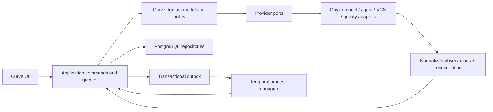
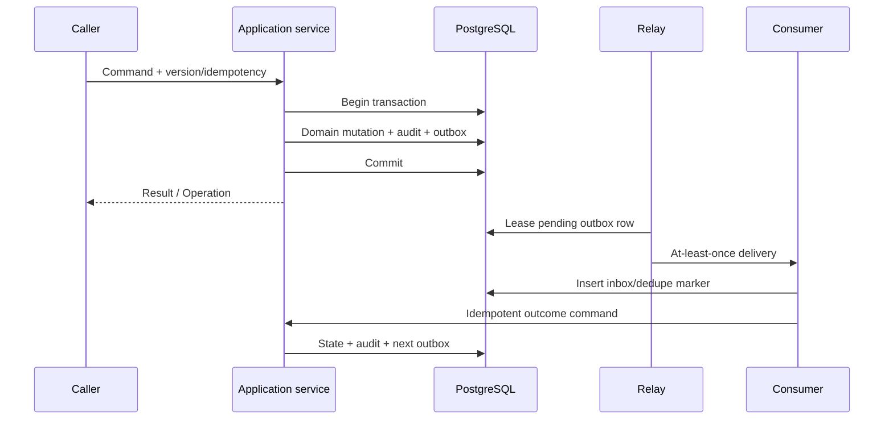
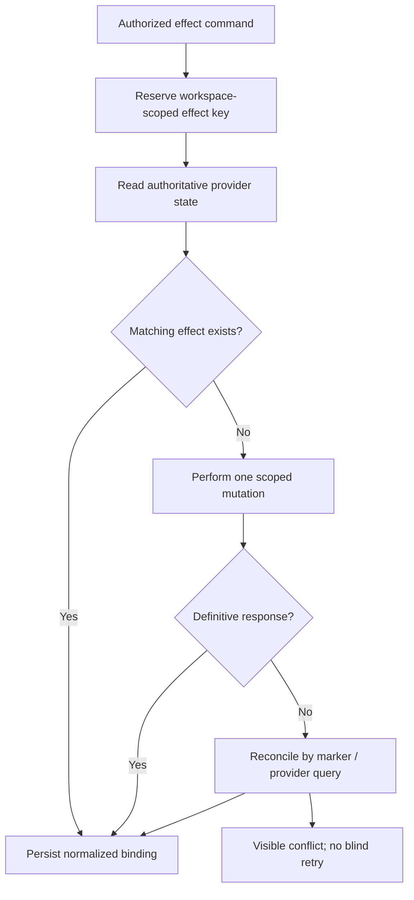

# Curve Engineering Patterns and Technologies

## Document control

| Field | Value |
| --- | --- |
| Status | Engineering baseline; implementation remains blocked by applicable non-decided decisions |
| Owner | X3M Curve engineering |
| Audience | Engineers, reviewers, security and platform teams, and AI coding agents |
| Version | 0.4 |
| Last updated | 2026-08-15 |
| Normative source | [Curve PRD v0.8](../curve-ai-native-sdlc-prd.md) |
| Architecture | [Curve Technical Architecture](./architecture.md) |

## Purpose

This document defines the implementation patterns, technology status, contract conventions, failure semantics, and coding guardrails that must be applied when deriving Curve's detailed design and backlog. It is subordinate to the [PRD](../curve-ai-native-sdlc-prd.md) and the [technical architecture](./architecture.md).

An AI coding agent may use this document to choose among already-authorized implementation techniques. It MUST NOT:

- Treat an `OPEN` decision `D-001` through `D-016` as decided.
- Pin a production provider, deployment product, image, model, rulepack, retention period, identity mechanism, or budget on behalf of its owner.
- Move external calls into database transactions, give an agent VCS credentials, or make Temporal a second business database.
- Weaken workspace, object, evidence, classification, approval, quality, or current-head checks.
- Implement a blocking milestone until its required ADRs are `DECIDED` by their named owners.

## Decision vocabulary

Technology statements use these statuses:

| Status | Meaning |
| --- | --- |
| `FIXED_CONTRACT` | The PRD requires this abstraction, boundary, or technology category. An implementation may not remove it. |
| `PRD_SELECTED` | The PRD names the technology for R1, subject to version, digest, license, and deployment validation. |
| `OPEN_DECISION` | A named decision owner must select and approve an option in D-001 through D-016. |
| `CONSERVATIVE_DEFAULT` | Safe behavior while a decision is open; it is not a production selection. |
| `DEFERRED` | Explicitly outside R1 or postponed by the PRD. |
| `REJECTED` | Explicitly unsuitable for the stated R1 role. |

No document or code comment may relabel an `OPEN_DECISION` as selected without linking the approved ADR.

## Engineering style

Curve uses an additive domain extension with ports-and-adapters boundaries and durable process orchestration:



The core domain does not import provider SDK models. Adapters translate provider facts into normalized Curve types and error classes. Temporal workflows call application-level activities; they do not bypass authorization, version, idempotency, or audit services.

## Required patterns

### 1. Additive bounded-domain extension

**Use for:** all Curve functionality built on Plane.

- Curve owns separate domain modules, tables, routes, APIs, policies, migrations, and tests.
- Plane workspace, user, project, work-item, estimate, relation, comment, and notification identifiers are referenced through explicit bindings.
- No Curve state is stored by reinterpreting a Plane status, label, custom field, or commercial-only feature.
- An anti-corruption service translates between Plane native records and Curve projections. It prevents bidirectional status loops.
- Reusable Plane UI and API capabilities are limited to those proven by D-001 in the pinned community inventory; unproven or commercial-only seams require a later approved compatibility decision.

This pattern implements `NFR-016` and the PRD Plane compatibility and migration rules.

### 2. Command/query separation without duplicate truth

**Use for:** public APIs, controllers, activities, and UI reads.

- Commands are imperative, authorized requests that validate an expected aggregate version and produce a new committed version or a stable Problem Details error.
- Queries read Curve/Plane-authoritative data and derived projections but cause no provider side effect.
- Long-running commands create an `Operation`, commit an outbox record, and return `202 Accepted`.
- Projections may be rebuilt from authoritative rows and append-only observations. They are never a competing write model for approvals or policy.

This is a pragmatic command/query split, not permission to introduce a separate event-sourced database.

### 3. Optimistic concurrency and exact-subject decisions

**Use for:** every mutable aggregate and all gates.

- Every aggregate carries an integer or opaque version.
- API mutations require `If-Match` or an explicit aggregate version (`FR-023`, `AC-35`).
- A conflict returns an RFC 9457 response and performs no side effect.
- Gate decisions reference exact artifact, evidence, plan, policy, context, base SHA, and head SHA values required by the relevant gate.
- A new head, controlling artifact, policy, or authorization never inherits an older decision silently.

### 4. Immutable version plus supersession

**Use for:** submitted artifacts, plans, workflow/policy definitions, evidence snapshots, Context Packs, quality policies/reports, contracts, roadmap snapshots, decisions, and waivers.

- Draft content may be edited until submission. Submitted content is immutable.
- Change creates a new version and an explicit `supersedes` relationship.
- Selection of a new controlling version triggers the PRD impact and invalidation rules; it never rewrites active-run context.
- Content-addressed bodies use a verified digest and schema version.
- Logical deletion uses a tombstone; physical deletion and cryptographic erasure follow D-009.

### 5. Transactional outbox and inbox

**Use for:** every domain-to-workflow/event transition and every accepted provider callback.



- The domain mutation and its outbox record commit atomically.
- The relay delivers at least once and uses a lease so crashed workers do not lose records.
- A consumer records an inbox/deduplication key before applying an effect.
- Delivery order is not assumed globally; per-aggregate sequence supports buffering or reconciliation.
- Relay success means accepted by the next durable boundary, not that the external effect completed.

This pattern supports `FR-044`, `NFR-004`, `NFR-005`, and `AC-33`.

### 6. Durable process manager with Temporal

**Use for:** initiative lifecycle generations, slice attempts, human waits, timers, retries, cancellation, rework, and coordinated partial failure.

- One parent workflow coordinates an Initiative lifecycle/plan generation; one child workflow represents one slice attempt.
- Workflows store identifiers and deterministic coordination state, not protected object bodies or a second domain model.
- Activities use application commands to read/commit business state.
- Human questions and gates are durable signals whose authorization is rechecked by the application service.
- Retry policy is based on normalized errors, not raw provider exceptions.
- Workflow changes use Temporal version markers and replay tests; long histories use `continue-as-new`.

See the [Temporal topology](./architecture.md#temporal-topology), `FR-015`, `FR-042`, and `AC-16` through `AC-21`.

### 7. Idempotent external-effect controller

**Use for:** agent starts, branches, commits, pushes, drafts, comments, ready conversion, preview publication, and provider writes.



- Generate and persist the idempotency/effect identity before contacting the provider.
- Use native provider idempotency where available and a controller marker plus uniqueness constraint where it is not.
- After any ambiguous response, read provider truth before another write.
- Never infer failure from a transport timeout.
- Preserve human-edited provider resources and surface conflicts rather than replacing or deleting them.

### 8. Provider port, capability negotiation, and conformance suite

**Use for:** every interface listed in the PRD Provider Interfaces section.

Each adapter MUST:

- Declare provider name, adapter version, supported API/protocol versions, capabilities, and known limits.
- Authenticate through a workspace-scoped connection and effective principal or service identity appropriate to the operation.
- Accept a stable idempotency key for mutations.
- Emit normalized observations/events and retain the raw provider reference or permitted digest.
- Map errors to `VALIDATION`, `AUTHENTICATION`, `AUTHORIZATION`, `POLICY`, `RATE_LIMIT`, `TRANSIENT`, or `TERMINAL`.
- Fail capability validation before Gate 2 when the approved plan requires unsupported behavior.
- Pass common tests for callbacks and polling, duplication, loss, ordering, rate limiting, token expiry, cancellation, and reconciliation (`NFR-013`, `AC-16`, `AC-26`, `AC-33`).

Provider-specific optional features remain inside the adapter. They must not leak into the core domain as provider-named state.

### 9. Effective-principal and Access Envelope

**Use for:** evidence, MCP, model, export, trace, artifact, and gate operations.

- Compute an effective principal for every protected operation; do not reuse the Initiative creator's delegation.
- Retrieve through a short-lived user delegation. A service identity may execute only a controller effect already authorized by policy.
- Bind every protected body to an Access Envelope containing workspace, source ACL snapshot, classification, allowed destinations, retention class, and redaction state.
- Before every reuse, gate, export, model call, or trace emission, re-evaluate the current actor and destination against the envelope.
- Unknown classification inherits the most restrictive applicable class.
- Prompt-injected text remains untrusted data and cannot expand tools, egress, filesystem, VCS, or approval authority (`AC-54`).

D-002, D-005, D-007, and D-009 must decide the concrete mechanisms and policies.

### 10. Content-addressed protected object

**Use for:** artifact/evidence bodies, Context Packs, logs, reports, exports, patches, and candidate artifacts.

- Stream the object while calculating and validating its digest; do not load large bodies into an API process (`NFR-020`).
- Store identity and policy metadata in PostgreSQL and the body in workspace-scoped object storage.
- Verify the digest on protected reads and before a dependent controller action.
- Keep object names opaque and free of user/source content.
- Store sanitized Context Manifests separately from full Context Packs.
- A digest mismatch quarantines the object and opens a security/operations incident; it is never repaired silently.

### 11. Lease-bound isolated execution

**Use for:** coding, quality, research tools that execute code, and runnable previews.

- At most one active lease exists per slice attempt. Lease identity, sandbox identity, context digest, policy version, budget, and heartbeat deadline are persisted.
- The controller mounts approved context read-only and gives the sandbox a writable repository worktree only.
- JIT credentials are minimal, task-specific, immediately revocable, and never include VCS mutation or production access.
- Egress is denied by default and destinations are policy allowlisted. Metadata and internal-network access are blocked.
- Loss revokes identity, quarantines output, terminates the sandbox, and marks the attempt `LOST`; retry creates a new attempt (`AC-21`).
- Preview sandboxes use unique origins, authentication, synthetic data, rate/resource limits, denied egress, and automatic expiry (`NFR-019`, `AC-06`).

The production isolation and deployment profile must be approved by D-003; budgets are D-014.

### 12. Candidate-output and trusted-controller promotion

**Use for:** all coding-agent output.

- Agent output is an untrusted candidate artifact, never a commit merely because the provider reports success.
- The runner controller checks lease, workspace, file scope, symlink/path traversal, size, prohibited files/secrets, and context/base consistency.
- The quality controller performs preflight at an exact base/head candidate.
- Only after policy passes may the trusted VCS controller create/sign a commit, push the approved branch, and create/reconcile the draft.
- The controller must re-read the remote repository before any current-head decision.
- Agents may propose actions but never approve, waive, reclassify, push, create drafts, convert ready, merge, or deploy (`AC-22`, `AC-30`).

### 13. Commit-bound attestation and invalidation

**Use for:** quality, review, delivery evidence, and Code Readiness.

A quality attestation includes:

- Workspace, repository, base SHA, head SHA, plan and policy versions, Context Pack digest, and attempt.
- Command/tool/image/rulepack versions and input/output artifact digests.
- Start/end time, exit/result, normalized findings, logs/report references, and controller identity.
- Applicability, suppression, waiver, and disposition references.

A new head SHA sets prior results and Code Readiness to `STALE`. Base movement follows the approved freshness/rebase policy and may force a full rerun or re-plan (`AC-25`, `AC-28`).

### 14. Two-phase quality

**Use for:** every delivery slice.

- **Preflight:** repository commands, baseline scans, independent AI/security review, and applicable contract evidence run before a draft. Blocking failures prevent draft creation (`FR-018`, `AC-23`, `AC-24`).
- **VCS validation:** after the draft exists, Curve observes draft-triggered CI, branch-protection configuration, ownership resolution, mergeability, and draft-capable review findings (`FR-020`, `AC-27`).
- Gate 3 binds the current head and explicitly converts the draft to ready. Repository approvals available only after ready remain external policy and are not faked by Curve.
- Rework uses the same branch and PR binding, produces a new head and quality run, and invalidates the former decision (`FR-041`, `AC-31`).

The workspace baseline is a non-reducible minimum. Repositories may add checks but may not weaken the baseline without a permitted waiver. D-010 selects the concrete baseline.

### 15. Authoritative-provider reconciliation

**Use for:** VCS, agent, preview, flag, documentation, monitoring, and other provider state.

- Webhooks are the latency path; periodic/provider-triggered reads are the correctness path.
- Active bindings are polled at least every 15 minutes and after a webhook gap, invalid signature, out-of-order sequence, or ambiguous write.
- Persist normalized observations append-only and derive the current projection.
- Provider facts win for external state; Curve decisions remain separately authoritative.
- Reconciliation preserves human edits, detects unexpected resources, and opens an operator-visible case when precedence cannot resolve a conflict.

### 16. Explicit compensation, not distributed rollback

**Use for:** cancellation, supersession, and partial multi-repository failure.

- A Pull Request Set is coordination, not an atomic transaction.
- A successful repository is never rolled back automatically because another fails (`AC-32`).
- Compensation means revoke credentials, stop work, expire previews, mark/supersede bindings, and reconcile resources.
- Branches or drafts with possible human edits remain intact and labeled. Deletion is a separate authorized action.
- Re-plan creates a new generation and explicit reuse/supersession decisions rather than mutating prior history.

### 17. Projection with independent status dimensions

**Use for:** roadmap, execution, PR-set, contract, and UI status.

Do not compress these into one status field:

- Roadmap Item status and declared progress.
- Plane-derived Execution Completion.
- Slice and Agent Run state.
- PR/MR provider state.
- Curve Code Readiness.
- Feature Release Ready.
- Post-release Verified.

Each projection documents its formula, inputs, freshness, and unavailable state (`FR-028`, `FR-037`, `AC-38`, `AC-42`).

## API, event, and schema conventions

### HTTP API

- Root path: `/api/v1/workspaces/{workspace_slug}/curve/`.
- Authentication: Plane session/identity plus workspace/object authorization.
- Errors: RFC 9457 Problem Details with a stable Curve error code, correlation ID, and safe field violations.
- Collections: cursor pagination and stable filters; never expose cross-workspace counts.
- Mutation concurrency: `If-Match` or explicit aggregate version.
- External-effect commands: mandatory `Idempotency-Key` scoped to workspace, actor, command type, and target.
- Long operations: `202 Accepted` with an operation URL and latest event cursor.
- Streaming: resumable SSE with opaque cursor; WebSocket is not an R1 requirement.
- Sensitive writes and decisions: audit actor, effective principal, exact subject versions, policy result, and causation.

Concrete OpenAPI schemas remain a required architecture artifact; they must preserve the command families in the PRD Public API section.

### Domain and integration events

All event envelopes include the PRD-required fields:

```text
event_id, schema_version, workspace_id,
aggregate_type, aggregate_id, aggregate_version, sequence,
initiative_id, workflow_version,
actor_type, actor_id,
occurred_at, recorded_at,
correlation_id, causation_id, idempotency_key,
classification, payload
```

- Event IDs are globally opaque; sequence is monotonic only within an aggregate.
- Consumers deduplicate by event ID and validate all referenced objects share the workspace.
- Backward-compatible schema evolution remains within a major version. Incompatible changes get a new schema version and dual-publish migration.
- Payloads contain references/digests instead of unrestricted protected bodies.
- Outgoing webhooks use HMAC-SHA-256, delivery ID and timestamp headers, administrator-approved SSRF-safe HTTPS destinations, retry for 24 hours, and a visible dead-letter state.

### Normalized adapter result

Provider operations return or emit a normalized result containing:

- Provider connection and operation IDs.
- Adapter/provider version and declared capabilities.
- Workspace, effective identity type, target, classification, and policy reference.
- Idempotency key for mutations.
- Provider external reference and permitted raw-response digest.
- Normalized state or observation time.
- Usage/cost where applicable.
- Normalized error class, retry hint, and provider correlation ID on failure.

Exact provider-specific wire schemas are ADR and adapter-spec outputs, especially D-002, D-006, D-007, and D-008.

## Technology register

The table distinguishes a fixed contract from an unresolved production selection. No version or image is approved merely by appearing here.

| Capability | Technology or boundary | Status | Decision / implementation constraint |
| --- | --- | --- | --- |
| Work-management foundation | Plane community edition | `ADR_DECIDED`; accepted base pinned | D-001 approves candidate `d380678912e9b46805ef852d2e05411f1fea6d8b`, the reuse boundary, and upstream process; fork `preview` foundation is `549db1aea8f3307b337b3686dbb844a87549cd95` |
| Curve relational state | PostgreSQL category used by Plane/Curve | `FIXED_CONTRACT`; topology open | D-003 selects topology, persistence, HA, backup, and operations |
| Large immutable bodies | Workspace-scoped immutable object storage | `FIXED_CONTRACT`; product open | D-003/D-009 select product, topology, retention, erasure, and backup |
| Durable orchestration | Temporal | `PRD_SELECTED`; deployment open | D-003 selects service/persistence/HA; workflow version/replay rules are fixed |
| Bounded background work | Plane Celery infrastructure | `PRD_SELECTED` existing capability | Notifications, exports, and bounded refresh only; no lifecycle state ownership |
| Internal knowledge | X3M Onyx | `PRD_SELECTED`; identity open | D-002 selects per-operation delegation; no user PAT storage |
| Tool interoperability | MCP behind `ToolProvider` | `FIXED_CONTRACT`; protocol policy open | D-007 selects protocol/transports, registry, auth, risk, and allowlist |
| Model traffic | `ModelGateway` port | `FIXED_CONTRACT` | Direct production calls outside the gateway are prohibited |
| Model gateway | Thin in-process Curve Model Gateway over X3M's approved OpenRouter access | `PROPOSED` | D-004 pins the upstream contract, allowlists, routing/fallback constraints, usage normalization, failure behavior, owner, and replacement strategy; use a development stub until decided |
| Models/providers | Task/data-class allowlist | `OPEN_DECISION` | D-005; only approved self-hosted development models under the conservative default |
| LLM traces/evaluation | Langfuse | `PRD_SELECTED`; placement/policy open | D-003/D-005/D-009 control deployment, exported data, and retention |
| Automated coding execution | OpenHands | `PRD_SELECTED` | Sole initial `AgentExecutionProvider`; pin supported API/version/image/license in the provider manifest |
| Human-assisted coding | X3M Orca over MCP | `PRD_SELECTED`; profile approval open | D-006/D-007 block Orca-enabled M4/R1 completeness; use delegated developer identity and the bounded read/write tool profile; do not invent an execution-provider API |
| VCS providers | GitHub and GitLab | `PRD_SELECTED` | D-008 selects identities, signing, rotation, repository allowlists, and scopes |
| Sandbox boundary | gVisor-class isolated Linux runner; Firecracker is a future option | `PRD_SELECTED` boundary; topology open | D-003 must approve production isolation; ordinary container isolation alone is insufficient |
| Structural repository analysis | Tree-sitter | `PRD_SELECTED` recommendation | Pin grammars and versions in the dependency manifest; unsupported languages fail explicitly |
| Exact code search | Zoekt | `PRD_SELECTED` recommendation | Define index lifecycle and workspace/repository authorization in detailed design |
| Browser/E2E validation | Playwright | `PRD_SELECTED` recommendation | Pin browser images; run only in isolated quality/preview profiles |
| Security/quality scanning | Trivy, Gitleaks, Opengrep | `OPEN_DECISION` as concrete baseline | D-010 pins images, rulepacks, thresholds, license rules, suppressions, and non-waivable findings |
| PR annotation | reviewdog or VCS-native comments | `FIXED_CONTRACT` reporting need; tool not fixed | Adapter choice must not determine blocking policy |
| Feature flag API | OpenFeature | `PRD_SELECTED` | Interface and evidence contract are fixed |
| Feature flag backend | Existing X3M backend selected by D-011; registered delivery profiles may target existing repository providers such as Sachiel Flipt | `OPEN_DECISION` | Do not provision a new backend while open; D-011 selects Curve conventions and proves each registered provider profile |
| Product documentation | Docusaurus repository through VCS | `PRD_SELECTED`; repository open | D-012 selects repository, branch, ownership, commands, navigation, and release relationship |
| Telemetry protocol | OpenTelemetry | `PRD_SELECTED` recommendation | Raw prompts/code/evidence/tool output excluded from ordinary attributes (`NFR-014`) |
| Metrics/dashboards | Prometheus/Grafana-compatible operational stack | `PRD_SELECTED` recommendation; topology open | D-003 establishes product and ownership; contract remains vendor-neutral where practical |
| Roadmap export | Internal deterministic PDF/image renderer | `FIXED_CONTRACT`; implementation open | Must reproduce an immutable snapshot and obey Access Envelopes |
| Post-release monitoring | Manual evidence in R1; `MonitoringProvider` in M7 | `FIXED_CONTRACT` for R1 scope | No automatic production verification claim before M7 integration |
| Prototype handoff | Authenticated internal preview plus manual Lovable package | `PRD_SELECTED` | Direct Lovable API automation is deferred |

### Rejected or deferred technologies and approaches

| Item | Status | Constraint |
| --- | --- | --- |
| Daytona as core sandbox | `REJECTED` | The PRD rejects dependence on its changed open-source posture |
| LiteLLM for R1 gateway | `REJECTED` | The PRD records supply-chain confidence concerns |
| New Portkey or Envoy service for R0B | `REJECTED_FOR_R0B` | The selected direction is an in-process Curve boundary over existing OpenRouter access; a new service requires a superseding D-004 ADR |
| LangGraph as top-level lifecycle engine | `DEFERRED` | Temporal remains authoritative for durable business workflows and human waits |
| Second general vector database | `REJECTED` | Onyx remains the knowledge/search authority |
| General visual workflow builder | `DEFERRED` | Versioned X3M workflow templates are the R1 model |
| Multi-repository agent transaction | `REJECTED` | Slices and PRs are repository-local; coordination is non-atomic |
| Autonomous merge/deployment | `REJECTED` for R1 | Explicitly outside the trusted-controller authority |
| Full evidence committed to Git | `REJECTED` | Only sanitized Context Manifests may enter a repository |
| Ordinary container as sole untrusted-code boundary | `REJECTED` | A gVisor-class or comparably reviewed boundary is required |

## Plane implementation strategy

### Module boundaries

D-001 establishes the public Plane fork as the implementation repository. Detailed design preserves these logical modules when they are initially co-deployed in the Plane backend or frontend:

- `curve_identity_policy`: workspace, role, risk, effective-principal, Access Envelope, side-effect and budget decisions.
- `curve_roadmap`: Product, Roadmap, Milestone, Feature, Roadmap Item, history, snapshot, schedule projections.
- `curve_definition`: Initiative, activity, artifact/evidence versioning, three gate assignments/decisions, impact assessment.
- `curve_planning`: repositories, inventory, plan generations, typed DAG, slices, Context Pack/Manifest.
- `curve_execution`: run/attempt/lease, provider events, questions, cancellation and recovery.
- `curve_quality`: policy versions, quality runs/checks, findings, attestations and invalidation.
- `curve_delivery`: PR bindings/sets, contracts/checks/waivers, review rework and readiness projections.
- `curve_integrations`: ports, connections, adapters, controllers, webhooks and reconciliation.
- `curve_audit`: append-only mutation history, lineage and controlled exports.

These are domain seams, not prescribed directory names. A code plan maps them additively to the approved Plane fork after the candidate is merged and the resulting `preview` base SHA is pinned.

### Database and migration rules

- Use additive, Curve-owned migrations with workspace-aware indexes and constraints.
- Reference Plane IDs; do not copy identities or infer authority from stale snapshots.
- Seed workflow and policy version 1 explicitly and idempotently.
- Deploy schema changes before code that requires them; maintain forward/backward compatibility across the supported rolling window selected by the deployment plan.
- Feature-enable UI/API/workflow dispatch by workspace. Disabling dispatch must retain state and external bindings for reconciliation.
- Rollback never destructively drops Plane or Curve business data. Physical cleanup is a later authorized retention action.
- Roadmap import remains D-013; use the conservative manual recreation path while it is open.

### Frontend integration rules

- Preserve the minimum R1 surfaces defined by the PRD and Plane accessibility conventions.
- Read statuses as independent projections; do not synthesize a single misleading progress state.
- Display stale, paused, failed, inaccessible, redacted, expired, and reconciliation-conflict states explicitly.
- Gate screens bind the exact version/head being approved and refresh before decision submission.
- Long-running screens use resumable SSE and operation resources rather than holding an HTTP request open.
- Primary flows meet WCAG 2.2 AA and include automated plus manual accessibility coverage (`NFR-015`).

## Error, retry, and recovery semantics

| Error class | Automatic retry | Required behavior |
| --- | --- | --- |
| `VALIDATION` | Never | Return stable field/problem details; no outbox effect |
| `AUTHENTICATION` | Never without refreshed credentials | Pause protected activity and request reauthentication |
| `AUTHORIZATION` | Never | Deny, audit, and preserve prior state |
| `POLICY` | Never | Display exact failed rule and remediation/approval path |
| `BUDGET` | Never | Stop outstanding work, preserve partial output as incomplete, require revised authorization |
| `RATE_LIMIT` | Bounded when retry time fits policy | Honor provider delay with jitter; pause after limit |
| `TRANSIENT` | At most three automatic attempts by default | Exponential backoff with jitter, then visible pause/failure (`NFR-008`) |
| `TERMINAL` | Never | Persist failure evidence and operator/user recovery choices |
| `AMBIGUOUS_EFFECT` | No repeated mutation until read reconciliation | Query provider by marker/external identity; open conflict if unresolved |
| `LOST_LEASE` | Never resume old attempt | Revoke identity, quarantine, terminate, create a new attempt after cleanup |
| `STALE_SUBJECT` | Never reuse result | Invalidate exact-SHA/version evidence and restart required validation |

Provider adapters may attach provider-specific diagnostics, but retry policy consumes only the normalized class plus approved retry metadata.

## Observability and audit patterns

### Telemetry

- Instrument API, domain commands, outbox/inbox, Temporal, controllers, adapters, sandboxes, quality, VCS, reconciliation, and projections with OpenTelemetry-compatible spans and metrics.
- Propagate correlation and causation IDs across synchronous requests, events, workflows, and provider calls.
- Use opaque telemetry identifiers or approved workspace-safe surrogates.
- Record sizes, counts, durations, statuses, retry counts, and cost without recording prohibited content.
- Enforce an attribute allowlist; do not rely on best-effort regex redaction after emission.

### Audit

Audit is a domain control, not a log stream. Every material AI output, policy/gate decision, external mutation, authorization failure, reclassification, waiver, classification change, and erasure action records the fields required by `NFR-011`.

- Audit writes commit with the corresponding domain mutation when possible.
- Audit bodies reference content digests and protected objects rather than duplicating secrets/evidence.
- Corrections append a new record linked to the previous record.
- Telemetry expiration does not remove the minimum Curve audit reference.
- Audit export re-evaluates workspace, object, evidence, and classification permissions.

## Testing patterns

| Test layer | Required coverage | Primary trace |
| --- | --- | --- |
| Domain unit tests | State transitions, cardinalities, role/risk policy, version invalidation, contract/readiness projections, schedule formulas | Lifecycle tables, `AC-01`-`AC-03`, `AC-08`, `AC-11`-`AC-14`, `AC-37`-`AC-51` |
| API contract tests | Problem Details, `If-Match`, idempotency, 202 Operations, cursor pagination/SSE resume, workspace denial | `FR-023`, `AC-35`, `AC-52` |
| Event schema tests | Required envelope, compatibility, dedupe, ordering gap, dual-publish migration | `FR-044`, `NFR-005`, `AC-33` |
| Provider conformance tests | Capabilities, normalization, callback/poll, timeout, rate limit, auth expiry, cancellation, reconciliation | `NFR-013`, `AC-04`, `AC-16`, `AC-18`, `AC-26`-`AC-33` |
| Temporal replay tests | Version markers, archived histories, questions, retries, cancellation, supersession, continue-as-new | `FR-015`, `FR-042`, `NFR-004`, `AC-17`-`AC-21` |
| Persistence/migration tests | Workspace constraints, uniqueness, append history, object digest, forward/backward deployment, non-destructive rollback | `NFR-016`, `NFR-018`, `AC-52`, `AC-56` |
| Security tests | Cross-workspace access, prompt injection, source revocation, SSRF/metadata, egress, secret leakage, webhook replay, sandbox escape fixtures | `FR-043`, `AC-52`-`AC-60` |
| Quality/VCS integration tests | Exact-SHA preflight, stale invalidation, draft idempotency, CI reconciliation, rework same binding, human ready conversion | `AC-22`-`AC-34` |
| UI/E2E tests | Minimum R1 surfaces, happy/recovery journeys, SSE reconnect, gate exactness, roadmap/Gantt, preview expiry | J-01-J-14, `AC-01`-`AC-51` |
| Accessibility tests | Keyboard, focus, names, semantics, contrast and non-color status; manual assistive-tech review | `NFR-015` |
| Load/resilience tests | NFR concurrency, projection latency, webhook load, large streaming objects, provider outage, RPO/RTO recovery | `NFR-001`-`NFR-008`, `NFR-020`, `AC-58` |
| Supply-chain/license tests | Locked dependencies/images, digest verification, SBOM, provenance, notices, corresponding source | `AC-59`, licensing section |

Every acceptance criterion `AC-01` through `AC-60` must map to at least one executable test or an explicitly named human verification procedure. No requirement may be marked complete solely because a unit test exists.

## Supply-chain and dependency rules

- Pin packages, tools, model/runner/browser images, grammars, rulepacks, and infrastructure images to reviewed versions and immutable digests where supported.
- Generate SBOMs and provenance for the Curve application, workers, controllers, and runner/preview images.
- Verify signatures/checksums and scan before promotion into a controlled artifact registry.
- Review license compatibility, notices, source availability, and redistribution obligations before adoption.
- Preserve the Plane/Curve AGPL corresponding-source offer, build/install scripts, notices, and source mapping required by `AC-59` and the PRD licensing section.
- Generated code retains provider/model/run/context lineage and must pass the same IP, provenance, secret, and license policy as human code.
- D-010 decides the prohibited-license and scanning baseline; an unknown license blocks under the conservative default.

## Anti-patterns

The following implementations violate the PRD or architecture:

- Calling a model, MCP tool, agent, VCS, object store, or other provider inside a domain database transaction.
- Letting Temporal, Celery, Langfuse, or a provider become the source of Curve approvals or lifecycle truth.
- Giving a coding/review agent a push token, ready/merge scope, production credential, or waiver authority.
- Creating a new PR for retry or review rework instead of reusing the slice's branch and active binding.
- Treating a provider timeout as proof that a write did not happen.
- Retrying authentication, authorization, validation, policy, budget, stale-subject, or terminal errors automatically.
- Copying protected evidence into Git, PR text, telemetry, logs, or Langfuse without Access Envelope permission.
- Reusing the Initiative creator's Onyx delegation for another user or later operation.
- Allowing repository configuration to weaken the workspace quality minimum silently.
- Marking a draft ready based on stale CI, quality, policy, base, or head evidence.
- Coupling core state names or schemas to GitHub-, GitLab-, Orca-, OpenHands-, Onyx-, or model-specific terminology.
- Using Plane labels/custom fields as hidden Curve business entities.
- Using destructive down-migrations or cleanup to make rollback appear successful.
- Collapsing roadmap, execution, PR, Code Ready, Feature Release Ready, and post-release status into one field.
- Claiming production readiness while a milestone-blocking decision remains `OPEN`.

## ADR prerequisites

Before writing implementation code in the affected milestone, link the approved ADR for each applicable decision:

| Decision | Engineering artifact required before implementation |
| --- | --- |
| D-001 | Approved Plane pin/reuse inventory, module mapping, upstream-rebase rules, and M0-01 ownership of additive migration/disabled-state/rollback proof |
| D-002 | Delegation sequence, token storage/revocation, SDK/protocol proof and access-failure tests |
| D-003 | Deployment diagrams, concrete state services, trust/network policy, HA, backup/restore, RPO/RTO and owners |
| D-004 | Gateway adapter profile, selected image/digest, routes/fallback, operations and license record |
| D-005 | Model policy matrix by task/classification, evaluation thresholds and fallback equivalence tests |
| D-006 | Orca supported MCP client/version, ownership/support/license record, delegated-auth profile, capability map, and conformance fixtures |
| D-007 | MCP transport/profile, trust-registry schema, capability risk model, delegated auth, idempotency, transition policy, and pre-authorization allowlist |
| D-008 | GitHub/GitLab identity/scopes, signing, rotation, branch/repository allowlists and integration fixtures |
| D-009 | Data-class retention matrix, legal hold, backup retention, tombstone/erasure jobs and verification tests |
| D-010 | Quality policy schema populated with pinned tools/images/rules/thresholds/licenses and waiver restrictions |
| D-011 | Feature-flag backend adapter, naming/ownership/environments, rollout/audit/expiry/cleanup policy |
| D-012 | Documentation provider configuration and deterministic build/link/navigation/preview contract |
| D-013 | Roadmap migration mapping, validation/reconciliation report and rollback approach |
| D-014 | Budget-policy values, reservation/accounting/escalation rules and exhaustion tests |
| D-015 | Pilot fixture, users/repositories, comparison protocol, data authorization and exit review |
| D-016 | KPI target configuration and rollout decision criteria after baseline |

Until an ADR is decided, use only the conservative behavior in the PRD decision register. A development stub must be labeled as such and cannot satisfy a production acceptance criterion.

## AI coding-agent implementation checklist

Before proposing a change, an AI coding agent must verify:

- The target milestone's blocking decisions are decided and linked.
- The work maps to explicit PRD IDs and a repository-local vertical slice.
- The pinned Plane baseline and local repository instructions are available.
- The relevant API/event/data/provider schemas are versioned.
- Every data access starts with `workspace_id` and passes authorization/classification checks.
- Every mutation uses optimistic concurrency; every external effect has a persisted idempotency key.
- No provider call occurs in a database transaction.
- Protected bodies are streamed through object storage and never emitted to ordinary telemetry.
- Workflow code is deterministic, versioned, replay-tested, and delegates business writes to application services.
- Failure, retry, cancellation, stale-state, and reconciliation paths have tests.
- VCS mutation is confined to the trusted controller and current-head evidence is revalidated.
- Migrations are additive and rollback does not destroy Plane or Curve business data.
- Dependency/image pins, license records, SBOM/provenance, and AGPL source obligations are included.
- The slice's acceptance criteria have executable tests and the required NFR/security coverage.

An implementation is not complete until code, schema, contracts, tests, operational signals, migration/rollback behavior, threat-model controls, documentation, and requirement traceability agree at the same version.
