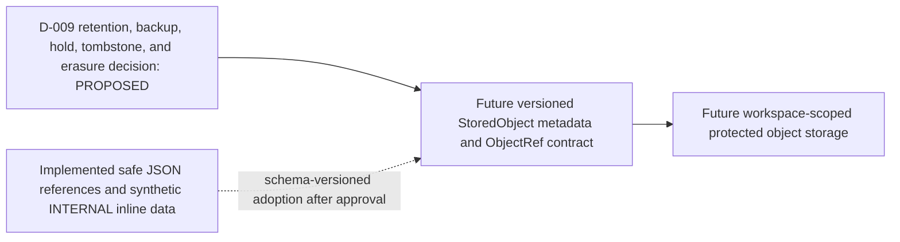

# Curve Implemented Entity-Relationship Model

## Document control

| Field | Value |
| --- | --- |
| Status | `IMPLEMENTED_PHYSICAL_SNAPSHOT / LOCAL_ONLY / PRODUCT_CONFORMANCE_VARIANCE_OPEN`; R-027 (Product timestamp/schema-version contract reconciliation) remains undecided |
| Version | 1.2 |
| Last updated | 2026-08-30 |
| Contract derivation baseline | Curve `main` `a0d21bee7f98f2477d9cfe69708a8ac043c4fc69`; the exact accepted Plane snapshot below is unchanged |
| Publication identity | The regular Git blob and merged commit containing these exact bytes are the publication receipt; consumers resolve them from Git history rather than a self-referential future-revision field |
| Plane implementation | `preview` at `99a73b4eab5ee21fd012d7358bc9259252d47f71` |
| Migration boundary | `curve.0001_initial` through `curve.0007_initiative_gateassignment` |
| Audience | Backend, data, security, migration reviewers, and AI coding agents |

## 1. Scope and authority

This document is the versioned physical ERD for the Curve tables implemented in
the public Plane fork. It is derived from the
[Curve PRD v0.13](../curve-ai-native-sdlc-prd.md) (product scope and acceptance
contract), the [domain model](domain-model.md) (logical entities and persistence
invariants), the [architecture](architecture.md) (runtime authority and data
placement), the [M0-S2 relational contract](../../contracts/database/m0-s2-relational-contract.md)
(operation and delivery-kernel schema), and the
[M0-03 policy relational contract](../../contracts/database/m0-03-policy-contract.md)
(append-only authorization evidence).

The implementation snapshot is the exact Plane
[`models.py`](https://github.com/faocampo/plane/blob/99a73b4eab5ee21fd012d7358bc9259252d47f71/apps/api/plane/curve/models.py)
(implemented Curve ORM model) and
[`migrations/`](https://github.com/faocampo/plane/tree/99a73b4eab5ee21fd012d7358bc9259252d47f71/apps/api/plane/curve/migrations)
(applied Curve schema history) at the pinned Plane revision. When a later Plane
migration changes a table, relationship, constraint, or index in this document,
the ERD version MUST advance in the same reviewed Curve contract change.

This ERD is observational physical evidence. For Product, it records the two
known differences governed by R-027 (Product timestamp/schema-version contract
reconciliation) without approving either resolution.

The diagram contains only implemented Curve tables. `EXTERNAL_PLANE_WORKSPACE`
and `EXTERNAL_PLANE_USER` are context anchors for Plane-owned identities; they
are not Curve tables and no Curve migration creates a foreign key to them.
Relationships labeled `no SQL FK` are enforced by workspace-first services and
transaction tests. The planned object store and later R1 aggregates are listed
separately and are not represented as implemented persistence.

## 2. Implemented physical ERD

```mermaid
erDiagram
    EXTERNAL_PLANE_WORKSPACE ||--o{ OPERATION : "opaque workspace_id; no SQL FK"
    EXTERNAL_PLANE_WORKSPACE ||--o{ PRODUCT : "opaque workspace_id; no SQL FK"
    EXTERNAL_PLANE_WORKSPACE ||--o{ INITIATIVE : "opaque workspace_id; no SQL FK"
    EXTERNAL_PLANE_WORKSPACE ||--o{ GATE_ASSIGNMENT : "opaque workspace_id; no SQL FK"
    EXTERNAL_PLANE_WORKSPACE ||--o{ PROVIDER_CONNECTION : "opaque workspace_id; no SQL FK"
    EXTERNAL_PLANE_WORKSPACE ||--o{ PROVIDER_CAPABILITY : "opaque workspace_id; no SQL FK"
    EXTERNAL_PLANE_WORKSPACE ||--o{ DOMAIN_EVENT : "opaque workspace_id; no SQL FK"
    EXTERNAL_PLANE_WORKSPACE ||--o{ OUTBOX_EVENT : "opaque workspace_id; no SQL FK"
    EXTERNAL_PLANE_WORKSPACE ||--o{ INBOX_MESSAGE : "opaque workspace_id; no SQL FK"
    EXTERNAL_PLANE_WORKSPACE ||--o{ IDEMPOTENCY_RECORD : "opaque workspace_id; no SQL FK"
    EXTERNAL_PLANE_WORKSPACE ||--o{ POLICY_DECISION : "opaque workspace_id; no SQL FK"
    EXTERNAL_PLANE_WORKSPACE ||--o{ AUDIT_EVENT : "opaque workspace_id; no SQL FK"

    EXTERNAL_PLANE_USER ||--o{ PRODUCT : "owner_user_id; no SQL FK"
    EXTERNAL_PLANE_USER ||--o{ INITIATIVE : "creator_user_id; no SQL FK"
    EXTERNAL_PLANE_USER ||--o{ GATE_ASSIGNMENT : "approver_user_id; no SQL FK"

    PRODUCT ||--o{ INITIATIVE : "product_id; validated ref; no SQL FK"
    INITIATIVE ||--|{ GATE_ASSIGNMENT : "initiative_id; PROTECT FK; exactly three by command"
    PROVIDER_CONNECTION ||--o{ PROVIDER_CAPABILITY : "connection_id; PROTECT FK history"
    PROVIDER_CAPABILITY o|--o{ PROVIDER_CONNECTION : "may_be_current_for; nullable PROTECT FK"
    DOMAIN_EVENT ||--o{ OUTBOX_EVENT : "event_id; transactional ref; no SQL FK"
    DOMAIN_EVENT o|--o{ INBOX_MESSAGE : "event_id; local consumer ref; no SQL FK"
    OPERATION o|--o{ DOMAIN_EVENT : "aggregate_type and aggregate_id; no SQL FK"
    PRODUCT o|--o{ DOMAIN_EVENT : "aggregate_type and aggregate_id; no SQL FK"
    INITIATIVE o|--o{ DOMAIN_EVENT : "aggregate_type and aggregate_id; no SQL FK"
    PROVIDER_CONNECTION o|--o{ DOMAIN_EVENT : "aggregate_type and aggregate_id; no SQL FK"

    EXTERNAL_PLANE_WORKSPACE {
        uuid id PK "Plane-owned workspace identity"
    }

    EXTERNAL_PLANE_USER {
        uuid id PK "Plane-owned human identity"
    }

    OPERATION {
        uuid id PK
        uuid workspace_id "indexed opaque scope"
        bigint aggregate_version "positive optimistic version"
        string operation_type
        string status
        string command_type
        json target
        string idempotency_key_digest
        string workflow_id "nullable"
        json policy_version_ref "nullable"
        json result_ref "nullable ResourceRef"
        json error "nullable safe error"
        datetime completed_at "required when terminal"
        string correlation_id
        datetime tombstoned_at "nullable"
    }

    PRODUCT {
        uuid id PK
        string schema_version "1.0 application contract"
        uuid workspace_id "indexed opaque scope"
        string key "workspace-unique immutable key"
        string name
        string timezone "IANA identifier"
        string state "ACTIVE or ARCHIVED"
        uuid owner_user_id "opaque Plane user"
        bigint version "positive optimistic version"
        datetime created_at "Django application UTC; auto_now_add"
        datetime updated_at "Django application UTC; auto_now"
        datetime archived_at "state-dependent nullable"
        json archived_by "state-dependent nullable"
    }

    INITIATIVE {
        uuid id PK
        uuid workspace_id "indexed opaque scope"
        uuid product_id "indexed validated ref; no FK"
        string mode
        uuid roadmap_item_id "nullable planned ref; no FK"
        string keyword "workspace-unique case-insensitive"
        string title
        json description "synthetic INTERNAL local body"
        string risk_tier
        string state
        string paused_from_state "nullable"
        uuid workflow_version_id "nullable planned ref; no FK"
        uuid creator_user_id "opaque Plane user"
        bigint version "positive optimistic version"
    }

    GATE_ASSIGNMENT {
        uuid id PK
        uuid workspace_id "indexed opaque scope"
        uuid initiative_id FK "PROTECT"
        string gate_type "one of three mandatory gates"
        uuid approver_user_id "opaque Plane human"
        datetime valid_from
        datetime valid_until "nullable"
        string delegation_reason "nullable"
    }

    PROVIDER_CONNECTION {
        uuid id PK
        uuid workspace_id "indexed opaque scope"
        bigint aggregate_version "positive optimistic version"
        string provider_type
        string adapter_key
        string adapter_version
        string environment
        string configuration_digest
        json configuration_ref "nullable; local fake requires null"
        string secret_reference "nullable; local fake requires null"
        uuid current_capability_id FK "nullable PROTECT"
        json allowed_classifications
        string status
        datetime next_reconcile_at "state-dependent nullable"
        json last_error "state-dependent nullable"
    }

    PROVIDER_CAPABILITY {
        uuid id PK
        uuid workspace_id "indexed opaque scope"
        uuid connection_id FK "PROTECT"
        bigint connection_version
        bigint capability_version "append-only version"
        string provider_type
        string adapter_key
        string adapter_version
        json protocol_versions
        json capabilities
        json allowed_classifications
        datetime validated_at
        datetime expires_at "nullable"
    }

    DOMAIN_EVENT {
        uuid id PK
        uuid workspace_id "indexed opaque scope"
        string event_type
        string aggregate_type "generic aggregate ref"
        uuid aggregate_id "generic aggregate ref"
        bigint aggregate_version
        bigint sequence "append-only per aggregate"
        uuid initiative_id "nullable opaque ref; no FK"
        uuid workflow_version_id "nullable planned ref; no FK"
        string classification
        string payload_schema
        json payload "validated safe payload"
        datetime recorded_at
    }

    OUTBOX_EVENT {
        uuid id PK
        uuid workspace_id "indexed opaque scope"
        uuid event_id "DomainEvent identity; no FK"
        string destination
        string state
        integer attempt_count
        datetime next_attempt_at "state-dependent nullable"
        string claimed_by "state-dependent nullable"
        datetime claimed_until "state-dependent nullable"
        datetime delivered_at "state-dependent nullable"
        json last_error "state-dependent nullable"
    }

    INBOX_MESSAGE {
        uuid id PK
        uuid workspace_id "indexed opaque scope"
        string consumer_id
        uuid event_id "event identity; no FK"
        string state
        datetime received_at
        datetime processed_at "state-dependent nullable"
        string result_digest "state-dependent nullable"
        json last_error "state-dependent nullable"
    }

    IDEMPOTENCY_RECORD {
        uuid id PK
        uuid workspace_id "indexed opaque scope"
        string principal_scope
        string command_scope
        string key_digest "raw key never persisted"
        string request_digest
        string state
        integer response_status "state-dependent nullable"
        string response_digest "state-dependent nullable"
        json response_resource_ref "state-dependent ResourceRef"
        json external_effect_refs
        datetime completed_at "state-dependent nullable"
        datetime expires_at
    }

    POLICY_DECISION {
        uuid id PK
        uuid workspace_id "indexed opaque scope"
        bigint sequence "append-only per resource"
        string action
        string resource_type "generic resource ref"
        uuid resource_id "generic resource ref"
        bigint resource_version "nullable"
        json subject
        json effective_principal
        string effect
        string policy_key
        integer policy_version
        string policy_manifest_digest
        string input_digest
        string normalized_classification
        json permitted_projection
        datetime evaluated_at
        datetime recorded_at
    }

    AUDIT_EVENT {
        uuid id PK
        uuid workspace_id "indexed opaque scope"
        bigint sequence "append-only per target"
        string action
        string target_type "generic target ref"
        uuid target_id "generic target ref"
        json target_ref
        string outcome
        json actor
        json policy_decision_ref "nullable logical ref; no FK"
        string before_digest "nullable"
        string after_digest "nullable"
        json details_ref "nullable planned object ref"
        string classification
        datetime recorded_at
    }
```

The ERD shows the fields that establish ownership, identity, cardinality,
versioning, lifecycle, or durable references. The Django migrations remain the
exhaustive column definition. Every implemented table has a UUID primary key and
`workspace_id`; repository lookups require workspace first even where a
database relationship is intentionally opaque.

### Known Product contract variance

The physical `Product` row includes application-managed `schema_version = "1.0"` and
uses Django application UTC for `created_at` and `updated_at`. The historical
[M1-00A relational contract](../../contracts/database/m1-00a-product-core-relational-contract.md)
(dispatched Product table, constraints, transaction, and migration target)
omitted `schema_version` and specified trusted database UTC. R-027 (Product
timestamp/schema-version contract reconciliation) must choose the common
timestamp authority and the required schema-version enforcement boundary.
This snapshot supplies evidence for that decision; exact relational
conformance, successor Product persistence, and production qualification remain
fail closed until it is decided.

## 3. Relationship and ownership rules

| Relationship | Cardinality | Physical enforcement | Required application invariant |
| --- | --- | --- | --- |
| Plane Workspace to every Curve row | One workspace to zero or more rows of each implemented table | Required `workspace_id`, indexed on every table; no cross-app SQL FK | Resolve Plane membership first and query with `(workspace_id, id)`; an ID in another workspace is indistinguishable from absence. |
| Plane User to Product | One human may own zero or more Products; one Product has one active owner | Opaque `owner_user_id`; no SQL FK | The command service resolves an active human in the same Plane workspace. |
| Plane User to Initiative | One human may create zero or more Initiatives; one Initiative has one immutable creator | Opaque `creator_user_id`; no SQL FK | Creation resolves the actor from trusted Plane identity. |
| Product to Initiative | One Product may own zero or more Initiatives; each Initiative belongs to one Product | Indexed `product_id`; no SQL FK | The Initiative service locks the Product by workspace and rejects archived or cross-workspace Products. |
| Initiative to GateAssignment | One Initiative has exactly three initial assignments; each assignment belongs to one Initiative | `PROTECT` FK plus unique `(workspace_id, initiative_id, gate_type)` | Creation is atomic and supplies exactly `PRD_APPROVAL`, `PLAN_APPROVAL`, and `CODE_READINESS`; workspace equality is checked before save. |
| ProviderConnection to capability history | One connection has zero or more immutable capability observations; each observation belongs to one connection | `PROTECT` FK and unique `(workspace_id, connection_id, capability_version)` | Capability workspace and adapter coordinates equal the connection; classification cannot exceed the connection ceiling. |
| ProviderConnection to current capability | One connection has zero or one current-capability pointer; SQL permits one capability row to be referenced by zero or more connection rows | Nullable `PROTECT` FK; no database uniqueness or composite same-connection constraint | Locked service updates require the pointed capability to belong to that connection's history and validate workspace, provider type, adapter key, and adapter version. Direct SQL bypass remains outside the service invariant. |
| DomainEvent to OutboxEvent | One domain event may have zero or more destination deliveries | Opaque `event_id`; unique `(workspace_id, event_id, destination)`; no SQL FK | Accepted commands write aggregate, event, destination row, audit, and idempotency result in one transaction. |
| Event identity to InboxMessage | One event may have zero or more consumer records, at most one per consumer | Unique `(workspace_id, consumer_id, event_id)`; no SQL FK | Consumer processing validates the workspace/event envelope before claiming the deduplication record. |
| Aggregate to DomainEvent | One mutable aggregate may produce an ordered append-only event stream | Generic `(aggregate_type, aggregate_id)`; no SQL FK | Unique `(workspace_id, aggregate_type, aggregate_id, sequence)` is the race fence; services allocate sequence while holding the aggregate transaction boundary. |
| Resource to PolicyDecision | One resource may have an ordered append-only decision stream | Generic `(resource_type, resource_id)`; no SQL FK | Trusted resolvers establish workspace, existence, version, subject, and policy input before persistence. |
| Target to AuditEvent | One target may have an ordered append-only audit stream | Generic `(target_type, target_id)`; no SQL FK | Workspace-scoped sequence allocation and safe target references prevent protected-body disclosure. |

## 4. Indexes and uniqueness

Every table has its primary-key index. A Django `db_index=True` index exists on
every `workspace_id`; foreign-key columns also receive Django's normal FK index.
The table lists the additional implemented indexes and all non-primary-key
uniqueness fences.

| Table | Additional indexes | Uniqueness fence |
| --- | --- | --- |
| `curve_operation` | `(workspace_id, status)` | None beyond primary key |
| `curve_product` | `curve_product_workspace_state_key_idx (workspace_id, state, key)`; `curve_product_workspace_owner_state_idx (workspace_id, owner_user_id, state)` | `curve_product_workspace_key_uniq (workspace_id, key)` |
| `curve_initiative` | `product_id`; `(workspace_id, state, created_at)`; `(workspace_id, product_id, state)` | Functional unique `(workspace_id, lower(keyword))` |
| `curve_gate_assignment` | `initiative_id` | `(workspace_id, initiative_id, gate_type)` |
| `curve_provider_connection` | `current_capability_id`; `(workspace_id, status, next_reconcile_at)` | `(workspace_id, environment, adapter_key)` |
| `curve_provider_capability` | `connection_id`; `(workspace_id, validated_at DESC)` | `(workspace_id, connection_id, capability_version)` |
| `curve_domain_event` | None beyond workspace and primary-key indexes | `(workspace_id, aggregate_type, aggregate_id, sequence)` |
| `curve_outbox_event` | `(workspace_id, state, next_attempt_at, created_at)` | `(workspace_id, event_id, destination)` |
| `curve_inbox_message` | None beyond workspace and primary-key indexes | `(workspace_id, consumer_id, event_id)` |
| `curve_idempotency_record` | None beyond workspace and primary-key indexes | `(workspace_id, principal_scope, command_scope, key_digest)` |
| `curve_policy_decision` | `(workspace_id, evaluated_at DESC)`; `(workspace_id, resource_type, resource_id, evaluated_at DESC)`; `(workspace_id, effect, evaluated_at DESC)` | `(workspace_id, resource_type, resource_id, sequence)` |
| `curve_audit_event` | None beyond workspace and primary-key indexes | `(workspace_id, target_type, target_id, sequence)` |

Uniqueness always begins with `workspace_id`. Opaque IDs may be globally unique
in practice, but authorization, relationship resolution, idempotency, event
ordering, and replay never rely on global-ID lookup.

The two Product query indexes are physical `RunSQL` operations in released
migration `0006_product.py`; they are not declared in `Product.Meta.indexes`.
The migration remains the physical authority for those index definitions. The
[M1-00A physical-schema evidence](../../contracts/database/m1-00a-product-physical-schema-evidence-v1.json)
(commit-bound Product index attestation) binds its exact Git blob,
SHA-256 digest, names, ordered columns, forward SQL, and reverse SQL.
Its `INDEX_EXISTENCE` scope establishes only that no successor index migration
is needed; R-027 determines whether another kind of additive migration is
required.

## 5. Mutable aggregates and immutable history

| Persistence role | Implemented records | Mutation rule |
| --- | --- | --- |
| Mutable versioned aggregates | `Operation`, `Product`, `Initiative`, `ProviderConnection` | Commands lock by workspace and ID, validate the expected positive version, apply one accepted transition, increment the version once, and append durable evidence atomically. Product and Initiative also prohibit bulk command bypasses. |
| Append-only history | `DomainEvent`, `PolicyDecision`, `AuditEvent`, `ProviderCapability` | Instance update/delete and queryset update/delete fail in the ORM. A correction or supersession appends a new record. Database uniqueness supplies the concurrent-write fence. |
| M1 assignment snapshot | `GateAssignment` | The M1-01A ORM rejects update and bulk mutation. Replacement/delegation history requires a later additive contract; the nullable validity fields reserve that evolution. |
| Delivery state machines | `OutboxEvent`, `InboxMessage` | Controlled claim, retry, acknowledgment, processing, and terminal transitions mutate delivery state. Check constraints require the fields associated with claimed, retry, delivered, dead-letter, processed, and terminal-failure states. |
| Idempotency state machine | `IdempotencyRecord` | Mutable under a locked command until terminal; terminal rows reject further ORM mutation. Terminal state requires status, response digest, database `ResourceRef`, and completion time. |

The current physical `Product` and `Initiative` models use `version`; the common
M0 aggregate base used by `Operation` and `ProviderConnection` uses
`aggregate_version`. Both are positive optimistic-concurrency counters. The
wire contract maps the persisted counter to the resource ETag/version expected
by its command API.

## 6. Object references and protected-storage boundary

The current schema stores safe, schema-validated JSON references or inline
synthetic `INTERNAL` data. It does not contain a `StoredObject`, `Artifact`,
`ArtifactVersion`, `EvidenceItem`, `ContextPack`, or protected-body table.

| Implemented column | Current meaning | Future boundary |
| --- | --- | --- |
| `Operation.result_ref` | Safe operation result projection or database resource reference | May reference separately governed immutable result metadata after its owning package is implemented. |
| `IdempotencyRecord.response_resource_ref` | Database `ResourceRef`, initially an `Operation`; explicitly not an object-storage reference | Remains a database replay pointer. |
| `IdempotencyRecord.external_effect_refs` | Safe list of normalized external-effect references; empty for current local-only packages | Later provider packages define versioned reference schemas. |
| `ProviderConnection.configuration_ref` | Nullable non-secret configuration reference; required null for the implemented fake-local adapter | Real adapter configuration remains decision- and provider-contract gated. |
| `ProviderConnection.validation_result_ref` | Safe validated reconciliation result metadata | Protected reports require the future object metadata contract. |
| `AuditEvent.details_ref` | Nullable safe details reference; absent in the protected-storage-disabled profile | Protected audit details require approved retention/erasure and object metadata. |
| `DomainEvent.payload` | Versioned safe JSON payload identified by `payload_schema` | Large or protected payloads may use a governed `ObjectRef` after the object contract exists. |
| `Initiative.description` | Bounded inline Markdown JSON for synthetic `INTERNAL` local use | Staging or protected content uses `RichTextRef` after M0-04 and D-009 approval. |

D-009 (retention, backup, legal-hold, tombstone, and erasure policy) remains the
activation gate for M0-04 (protected object-storage foundation), protected
bodies, and staging/production persistence. Until it is decided, the system
fails closed to those capabilities and the diagram above remains a future
boundary rather than a persisted entity relationship.

## 7. Migration boundaries

| Migration | Introduced or changed physical contract | Boundary preserved |
| --- | --- | --- |
| `0001_initial` | Establishes the additive Curve Django application migration root with no tables. | Existing Plane tables and behavior remain unchanged. |
| `0002_initial` | Creates `Operation`, `DomainEvent`, `OutboxEvent`, `InboxMessage`, `IdempotencyRecord`, and `AuditEvent`, including lifecycle checks, indexes, and uniqueness fences. | Synthetic `INTERNAL` metadata only; no provider, object-store, Temporal, or Plane-table FK. |
| `0003_policydecision` | Creates append-only `PolicyDecision` plus query indexes and validation constraints. | Policy evidence is safe metadata and has no Plane-table FK. |
| `0004_policydecision_recorded_at_default` | Changes `recorded_at` to an explicit trusted default so `recorded_at >= evaluated_at` is enforceable. | No data rewrite or new authority. |
| `0005_providerconnection_providercapability` | Creates `ProviderConnection` and `ProviderCapability`, their two `PROTECT` FKs, local fake-adapter checks, v2 core-policy allowance, indexes, and uniqueness. | `LOCAL_ONLY`, `FAKE_LOCAL`, configuration-free, credential-free, `INTERNAL`-only. |
| `0006_product` | Creates `Product`, archive-state checks, workspace key uniqueness, two physical `RunSQL` query indexes, and Product policy v1 allowance. | Minimum Product core only; roadmap entities remain M2. |
| `0007_initiative_gateassignment` | Creates `Initiative` and `GateAssignment`, standalone/manual-first lifecycle checks, exact gate-type uniqueness, indexes, and Initiative policy v1 allowance. | Roadmap mode, external resources, protected bodies, and later lifecycle stages remain fail closed. |

Released migrations are append-only history. A later change MUST add a new
migration; it MUST NOT edit, reorder, or squash `0001` through `0007`. Expansion
uses forward-compatible nullable columns or new tables before writers depend on
them. Contraction stops writers and readers before a later cleanup migration.
Disposable local migration proofs may reverse to zero; deployed rollback uses
Curve disablement and forward repair unless a separately reviewed environment
runbook authorizes schema reversal.

## 8. Planned logical entities

The [domain model](domain-model.md) (complete R1 logical entity contract)
defines roadmap, workflow, artifact/evidence, planning, execution, quality,
delivery, VCS, budget, object, and projection entities. They remain planned
until a task packet pins approved decisions, schema and migration versions,
repository/base revision, acceptance tests, and rollback behavior. Their names
in the PRD or logical domain model do not imply a deployed table.

The next physical ERD version must classify every new entity as one of:

- an implemented Curve table with its migration and constraints;
- an opaque Plane/provider identity reference with no Curve FK;
- an immutable object-store metadata record after D-009 approval; or
- a planned logical entity with no persistence claim.

## 9. Verification contract

An ERD revision is acceptable only when:

1. every implemented Curve model at the pinned Plane revision appears once;
2. every SQL FK, workspace boundary, cardinality, index, and uniqueness fence
   agrees with the migrations;
3. generic or opaque references are not mislabeled as SQL foreign keys;
4. mutable versus append-only ownership is explicit;
5. object references and protected-storage activation remain fail closed while
   D-009 is open;
6. the migration boundary names the latest applied Curve migration; and
7. the observed Product timestamp and schema-version variance is explicit and
   cannot be interpreted as R-027 approval; and
8. Markdown, local links, heading hierarchy, and every Mermaid block pass the
   repository documentation validators.

The [implemented-ERD consistency test](../../scripts/tests/implemented-erd-consistency.test.mjs)
(exact Plane/migration binding, entity inventory, relationship, index,
uniqueness, and protected-storage-boundary assertions) enforces this committed
snapshot. A Plane schema change still requires commit-bound migration evidence;
the documentation test does not substitute for inspecting the pinned Plane
models and migrations.
