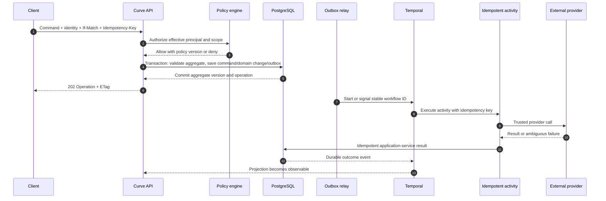

# Curve Integration Contracts

## Document control

| Field | Value |
| ----- | ----- |
| Status | Architecture baseline; implementation is subject to the PRD decision register |
| Version | 0.1 |
| Source | [Curve PRD v0.8](../curve-ai-native-sdlc-prd.md) |
| Audience | API, workflow, integration, platform, security, and test engineers; AI coding agents |
| Scope | Curve public API, internal commands/events, provider adapters, webhooks, SSE, idempotency, and reconciliation |

## Contract authority

This document translates PRD FR-003, FR-008, FR-013-FR-023, FR-032-FR-044, NFR-003-NFR-005, NFR-008-NFR-014, and AC-04, AC-16-AC-36, AC-44-AC-60 into technical contracts. It does not override the PRD's invariants, authorization rules, or non-decided decisions D-002 and D-004-D-012.

The generated OpenAPI, JSON Schema, and provider conformance suites are executable contract artifacts. If generated code and this prose disagree, the approved schema version is authoritative for wire format while the PRD remains authoritative for product behavior.

## Contract principles

1. Every request, event, object, provider connection, idempotency record, and external binding is scoped by `workspace_id`.
2. Plane authentication establishes the human identity. Curve authorization additionally evaluates workspace membership, object ACL, role, risk tier, data classification, repository allowlist, and policy version.
3. A command is accepted only after authorization, optimistic-concurrency, policy, and idempotency validation.
4. External mutations are asynchronous, idempotent, and performed only by trusted controllers after the authorizing domain transaction commits.
5. Queries never create external side effects. Provider reads that refresh projections are explicit commands or reconciliation activities.
6. Events are facts in past tense. Commands express intent and can be rejected.
7. Provider-specific states and identifiers never leak into domain state without a normalized representation plus the raw provider reference.
8. Unsupported provider capabilities fail before Gate 2; adapters never silently degrade behavior.

## Public API conventions

### Base and media types

- Base path: `/api/v1/workspaces/{workspace_slug}/curve/`.
- Request and response media type: `application/json` unless an endpoint explicitly streams or returns an artifact.
- Timestamps: RFC 3339 UTC with sub-second precision.
- IDs: opaque strings; clients must not infer type, ordering, or tenancy from their shape.
- Field names: `snake_case` to align with the Curve backend domain and event schemas.
- Unknown response fields must be ignored by clients. Unknown request fields are rejected unless a schema explicitly allows extensions.

### Required headers

| Header | Applies to | Rule |
| ------ | ---------- | ---- |
| `Authorization` | All protected calls | Plane/session or approved service authentication. The token never supplies authorization by itself. |
| `Idempotency-Key` | Every command that may create a resource or external effect | Unique within workspace, actor, command type, and target for the configured replay window. Reuse with a different payload returns `409`. |
| `If-Match` | Mutations of an existing aggregate | Contains the current aggregate ETag. Missing header returns `428`; stale value returns `412`. |
| `X-Correlation-ID` | Optional inbound, required internal | Accepted only if syntactically valid; otherwise Curve creates one. It is not trusted for authorization. |
| `Last-Event-ID` | SSE resume | Resumes from a workspace-authorized stream cursor. |

`workspace_id` is present in the path and checked against the authenticated principal. An arbitrary caller-supplied workspace header never changes authorization scope.

### Response behavior

- Synchronous creation returns `201 Created`, a `Location`, representation, and ETag.
- Synchronous state change returns `200 OK` or `204 No Content` plus the new ETag.
- Long-running work and any external mutation return `202 Accepted` with an `Operation` resource.
- Collection queries use cursor pagination with `limit`, `after`, stable filters, and `next_cursor`; offset pagination is not used for mutable histories.
- Artifact and audit history ordering is deterministic by aggregate sequence and ID.
- Deleting a logical resource returns a tombstoned representation; it does not imply immediate physical erasure.

### Problem Details

Errors use [RFC 9457](https://www.rfc-editor.org/rfc/rfc9457) with `application/problem+json` and these required extensions:

```json
{
  "type": "urn:curve:problem:stale-head",
  "title": "Candidate head is stale",
  "status": 409,
  "detail": "The requested decision targets a head SHA that is no longer current.",
  "instance": "/api/v1/workspaces/example/curve/operations/00000000-0000-4000-8000-000000000001",
  "code": "STALE_HEAD",
  "correlation_id": "...",
  "workspace_id": "...",
  "retryable": false,
  "violations": []
}
```

Stable problem codes include `AUTHENTICATION_REQUIRED`, `FORBIDDEN`, `CROSS_WORKSPACE_REFERENCE`, `NOT_FOUND`, `VALIDATION_FAILED`, `PRECONDITION_REQUIRED`, `VERSION_CONFLICT`, `IDEMPOTENCY_CONFLICT`, `POLICY_DENIED`, `DECISION_REQUIRED`, `EVIDENCE_ACCESS_DENIED`, `CAPABILITY_UNSUPPORTED`, `BUDGET_EXHAUSTED`, `STALE_BASE`, `STALE_HEAD`, `PROVIDER_RATE_LIMITED`, `PROVIDER_UNAVAILABLE`, and `EXTERNAL_STATE_CONFLICT`.

## Resource and command surface

Paths below are normative families. The architecture deliverable must publish the complete OpenAPI document before implementation of a family starts.

| Capability | Method and path | Behavior |
| ---------- | --------------- | -------- |
| Create Initiative | `POST /workspaces/{workspace_id}/initiatives` | Creates `DRAFT` with Product, mode, risk proposal, keyword, and three assignments. |
| Edit Initiative | `PATCH /workspaces/{workspace_id}/initiatives/{initiative_id}` | Draft-only JSON Merge Patch with `If-Match`. |
| Lifecycle action | `POST /workspaces/{workspace_id}/initiatives/{initiative_id}/actions/{action}` | Supports `accept-refinement`, `pause`, `resume`, or `cancel`; creates an immutable command record and is asynchronous when workflows or external cleanup are involved. |
| Artifact version | `POST /workspaces/{workspace_id}/initiatives/{initiative_id}/artifacts/{artifact_type}/versions` | Creates immutable submitted content or a mutable draft according to request state. Large bodies use object-storage upload intents. |
| Submit artifact | `POST /workspaces/{workspace_id}/artifact-versions/{version_id}/actions/submit` | Runs completeness and evidence-access checks. |
| Gate decision | `POST /workspaces/{workspace_id}/gate-assignments/{assignment_id}/decisions` | Accepts only the exact subject versions displayed to the approver. Gate 3 also includes base/head SHA set. |
| Generate plan | `POST /workspaces/{workspace_id}/initiatives/{initiative_id}/actions/generate-plan` | Returns an Operation; output is a new ExecutionPlan draft. |
| Slice action | `POST /workspaces/{workspace_id}/slices/{slice_id}/actions/{action}` | Supports `dispatch`, `retry`, `cancel`, or `rework`; requires approved plan authorization and creates a new attempt only where defined. |
| Answer question | `POST /workspaces/{workspace_id}/agent-questions/{question_id}/answers` | Validates responder permission and records one attributed answer version. |
| Quality run | `POST /workspaces/{workspace_id}/slices/{slice_id}/quality-runs` | Starts preflight or post-draft validation for exact base/head/policy/context versions. |
| Finding disposition | `POST /workspaces/{workspace_id}/review-findings/{finding_id}/dispositions` | Enforces severity, separation of duties, evidence, and non-waivable policy. |
| Draft command | `POST /workspaces/{workspace_id}/slices/{slice_id}/actions/create-or-reconcile-draft` | Trusted-controller action; idempotently creates or locates one binding. |
| Code Readiness | `POST /workspaces/{workspace_id}/pull-request-bindings/{binding_id}/code-readiness-decisions` | Human decision for exact head; approval may return an Operation for explicit draft-to-ready conversion. |
| Waiver | `POST /workspaces/{workspace_id}/delivery-contract-checks/{check_id}/waivers` | Requires scope, reason, expiry, follow-up task, and authorized actor. |
| Roadmap publication | `POST /workspaces/{workspace_id}/roadmaps/{roadmap_id}/snapshots` | Independent Roadmap-owner action; creates immutable rendered payload. |
| Reconciliation | `POST /workspaces/{workspace_id}/provider-bindings/{binding_id}/actions/reconcile` | Administrator or policy-triggered authoritative refresh; never overwrites ambiguous human edits. |
| Operation query | `GET /workspaces/{workspace_id}/operations/{operation_id}` | Returns command state, progress, result/error reference, timestamps, and correlation ID. |
| Audit query | `GET /workspaces/{workspace_id}/audit-events` | ACL-filtered cursor stream; export is a distinct asynchronous command. |

Read endpoints exist for every resource and history. Collection expansion is explicit through `include`; default responses do not embed raw evidence, prompts, logs, or large artifacts.

## Command-processing pattern



No provider call occurs inside the command transaction. An activity that receives an ambiguous result must reconcile by external idempotency marker before retrying the mutation.

## Operation resource

`Operation.status` is `PENDING`, `QUEUED`, `RUNNING`, `WAITING_FOR_HUMAN`, `CANCEL_REQUESTED`, `SUCCEEDED`, `FAILED`, or `CANCELLED`. The synthetic M0 foundation probe uses `PENDING`, `QUEUED`, `RUNNING`, `CANCEL_REQUESTED`, and terminal states; later long-running operations may use `WAITING_FOR_HUMAN`. The resource contains:

- `workspace_id`, `operation_id`, command type, target type/ID, and actor.
- Correlation, causation, idempotency, workflow, and policy identifiers.
- Aggregate version accepted by the command.
- Progress summary safe for the caller's ACL.
- Result resource link or Problem Details reference.
- Created, started, last-heartbeat, and terminal timestamps.

Operation success means the command's defined effect completed, not that the entire Initiative advanced.

## Server-sent events

R1 uses SSE at `GET /workspaces/{workspace_id}/events`. Clients may filter by Initiative and resource types but cannot widen workspace access.

Each SSE item has:

```text
id: <opaque workspace cursor>
event: <schema-qualified event type>
data: <authorized event projection JSON>
```

The server sends a heartbeat at least every 20 seconds and supports cursor resume for the retention window. A cursor older than the window returns `409 CURSOR_EXPIRED`, after which the client refreshes resource projections and reconnects. Raw domain-event payloads are not sent when they would reveal protected data; the SSE projection retains event ID, type, resource, state, and safe summary.

## Domain event envelope

All internal and outgoing events use a versioned envelope:

```json
{
  "event_id": "evt_...",
  "event_type": "pull_request.draft_created",
  "schema_version": 1,
  "workspace_id": "ws_...",
  "aggregate_type": "pull_request_binding",
  "aggregate_id": "prb_...",
  "aggregate_version": 7,
  "sequence": 7,
  "initiative_id": "ini_...",
  "workflow_version": "curve-lifecycle/1",
  "actor": {"type": "SERVICE", "id": "vcs-controller"},
  "occurred_at": "2026-08-11T20:00:00.000Z",
  "recorded_at": "2026-08-11T20:00:00.050Z",
  "correlation_id": "cor_...",
  "causation_id": "cmd_...",
  "idempotency_key": "...",
  "classification": "INTERNAL",
  "payload": {}
}
```

Consumers deduplicate `event_id`, enforce workspace consistency on every referenced ID, and process a given aggregate in sequence. A sequence gap is buffered for a bounded interval, then triggers reconciliation. Schema changes are additive within a version; incompatible changes use a new version and a dual-publish migration.

## Incoming provider webhooks

The ingress adapter performs these steps before a payload reaches domain logic:

1. Enforce HTTPS, body-size, content-type, endpoint-provider, and workspace-connection constraints.
2. Capture the raw body in protected short-retention storage only when incident policy permits.
3. Verify provider signature and timestamp with the selected rotating secret/key.
4. Reject stale payloads outside the five-minute replay window when the provider supplies a timestamp.
5. Resolve the workspace and connection from the endpoint secret, never from an untrusted body field.
6. Write an inbox record keyed by provider delivery ID or a canonical payload digest.
7. Normalize the observation without treating it as a Curve command.
8. Apply in sequence or create a reconciliation request when state is missing or ambiguous.

Forged payloads are rejected and audited without echoing secrets. Duplicate delivery returns a successful acknowledgement after inbox persistence. Provider-specific acknowledgement deadlines are met by deferring business processing.

## Outgoing Curve webhooks

Outgoing endpoints are workspace-admin allowlisted HTTPS URLs that pass DNS/IP and redirect-based SSRF checks. Requests contain:

- `X-Curve-Delivery-ID`.
- `X-Curve-Timestamp`.
- `X-Curve-Schema-Version`.
- `X-Curve-Signature-256: sha256=<hex HMAC>`.

The signature covers timestamp, delivery ID, and exact body. Secrets rotate with an overlap period. Deliveries use exponential backoff for 24 hours, then enter a visible dead-letter state. A receiver replay never causes duplicate Curve state because outgoing delivery is a notification, not a command.

## Common provider adapter contract

Every call receives a `ProviderCallContext` containing:

| Field | Purpose |
| ----- | ------- |
| `workspace_id` and `connection_id` | Tenant and credential boundary. |
| `effective_principal` | Human delegation or approved service identity; absent for agent authority. |
| `classification` and `destination_policy` | Enforces allowed provider/model/trace destinations. |
| `correlation_id`, `causation_id`, and `idempotency_key` | End-to-end trace and mutation safety. |
| `deadline` and `cancellation_token` | Bounded execution and cancellation propagation. |
| `policy_version`, `context_digest`, and `workflow_version` | Reproducibility and audit. |

Adapters implement `capabilities()` and publish a versioned capability document. Every response includes provider request ID where available, normalized status, usage/rate-limit metadata, and raw-state reference. The adapter error taxonomy is:

| Class | Retry | Expected behavior |
| ----- | ----- | ----------------- |
| `VALIDATION` | Never | Fail command with field violations. |
| `AUTHENTICATION` | Never automatically | Pause binding; require credential repair. |
| `AUTHORIZATION` | Never | Fail closed and audit denied scope. |
| `POLICY` | Never | Require an authorized policy or plan change. |
| `NOT_SUPPORTED` | Never | Block before Gate 2 or explicit command. |
| `RATE_LIMIT` | At provider-advised time within deadline | Preserve provider reset metadata. |
| `TRANSIENT` | Bounded exponential retry | Default maximum three attempts. |
| `AMBIGUOUS_MUTATION` | Reconcile first | Never repeat before checking external idempotency marker. |
| `TERMINAL` | Never | Visible failure with retained evidence. |

## Provider-specific minimum interfaces

### Knowledge and MCP

`KnowledgeProvider` implements `search`, `retrieve`, `get_source_metadata`, `check_access`, and `refresh_delegation`. Every result carries source identity, digest, classification, access metadata, retrieval time, and effective principal. `ToolProvider` implements `list_capabilities`, `authorize`, `invoke`, `status_or_callback`, and `cancel`, with explicit `READ` or `SIDE_EFFECT` risk. D-002 and D-007 select transport/authentication details.

### Model gateway

`ModelGateway` implements `generate`, `stream`, `count_tokens`, `cancel`, and `report_usage`; embeddings are a separate policy capability. Requests name task class, maximum cost/tokens, data classification, allowed models/providers, prompt version, and trace policy. Fallback can use only a destination approved for the same task and classification. D-004 and D-005 select the implementation and permitted models.

### Agent execution

`AgentExecutionProvider` implements `capabilities`, `start_attempt`, `stream_or_poll_events`, `answer_question`, `heartbeat`, `cancel`, and `collect_candidate_artifacts`.

Normalized events are `ATTEMPT_STARTING`, `ATTEMPT_RUNNING`, `ACTIVITY`, `QUESTION`, `USAGE`, `HEARTBEAT`, `CANDIDATE_AVAILABLE`, `SUCCEEDED`, `FAILED_RETRYABLE`, `FAILED_TERMINAL`, `TIMED_OUT`, `LOST`, and `CANCELLED`. Provider success never means that code passed preflight. Candidate output crosses the trusted-controller validation boundary without agent VCS credentials.

OpenHands is the first implementation of this interface. Orca does not implement it.

### Developer-operated Orca MCP

Orca acts as an MCP client under a short-lived token delegated by the signed-in developer. The proposed profile uses MCP revision `2026-07-28` over authenticated Streamable HTTP and the D-007 OAuth protected-resource flow; unsupported clients fail closed rather than silently broadening or downgrading the write contract. Reads are limited to the developer's assigned slices, approved task packets, acceptance criteria, sanitized Context Manifests, questions, and current workflow state. The only write tools are `claim_slice`, `release_slice`, `heartbeat_attempt`, `report_progress`, `ask_question`, `complete_manual_attempt`, and `link_vcs_reference`.

The normative v1.1 invocation and result schemas use closed per-tool objects. Every write supplies `workspace_id`, target ID, expected aggregate version, idempotency key, and client event time. Curve derives the actor from the delegated token, rechecks workspace/object authorization before loading the target, validates the transition, and appends an audit event. The client timestamp is evidence only; server time controls leases and ordering. Orca cannot upload code or executable artifacts, approve a gate, grant or request a waiver as an approver, change a plan, mutate VCS, register a provider, or deploy.

The developer pushes through normal VCS access outside Curve. `link_vcs_reference` accepts only an approved repository plus branch/head SHA or MR/PR reference. The trusted VCS controller re-reads and validates the reference. If a valid branch has no active draft, the controller may create one under the approved plan; Orca never creates it directly.

`complete_manual_attempt` produces only `COMPLETION_DECLARED`. The normalized attempt becomes `CANDIDATE_AVAILABLE` only after the trusted VCS controller validates the exact approved binding and head. The state matrix defines claim, release, lease expiry, completion, reference validation, rejection, cancellation, and terminal late-write behavior.

### VCS

`VcsProvider` reads repository metadata, default/base branches, commits, ownership, protection/configuration, checks, reviews, mergeability, and PR/MR state. Trusted-controller mutations are create branch, commit/sign, push, create/update draft, comment, and explicit draft-to-ready. Merge, release, deploy, branch-protection modification, reviewer impersonation, and silent thread resolution are absent.

Every controller-owned branch and draft carries a stable Curve external marker. Creation first searches by marker and external binding before mutating. The provider's current base/head/check/review state remains authoritative; Curve's Gate 3 decision remains Curve-authoritative.

### Quality, prototype, documentation, flags, and monitoring

- `QualityProvider`: resolve policy, execute, stream protected logs, normalize findings, cancel, and attest results for exact base/head/tool digests.
- `PrototypeProvider`: build, publish authenticated, health check, collect attributed feedback, expire, and delete.
- `DocumentationProvider`: resolve configured Docusaurus repository, propose a documentation slice, validate paths/navigation/links/build, and contribute evidence through VCS.
- `FeatureFlagProvider`: validate provider, flag schema, lifecycle, environments, rollout metadata, and dual-path evidence; no production targeting mutation in R1.
- `MonitoringProvider`: accept observed deployment identity and authorized manual evidence in R1; automated trusted queries are M7.

## Reconciliation contracts

Webhook-driven projection is the fast path. A scheduler reconciles every active VCS, agent, preview, and other callback-capable binding at least every 15 minutes and immediately after sequence gaps, ambiguous mutations, authentication recovery, or suspected webhook loss.

Reconciliation:

1. Reads authoritative external state with a workspace-scoped connection.
2. Compares provider observation, last normalized observation, and current Curve projection.
3. Applies monotonic facts such as a new commit or closed PR.
4. Marks commit-bound results stale when the head differs.
5. Creates `EXTERNAL_STATE_CONFLICT` for ambiguous human edits instead of overwriting them.
6. Never reopens, deletes, force-pushes, marks ready, or changes reviewers without a distinct authorized command.

## Contract testing

Each adapter must pass a shared suite before its milestone exits:

- Capability discovery and unsupported-capability failure.
- Authentication expiry, revocation, rotation, and wrong-workspace denial.
- Pagination, rate limiting, timeout, cancellation, and bounded retry.
- Duplicate, lost, delayed, forged, stale, and out-of-order callbacks.
- Ambiguous mutation followed by reconciliation without duplication.
- External human edit preservation.
- Data-classification and redaction enforcement.
- Correlation, audit, usage, and raw-provider-reference completeness.
- Provider-specific state mapped to every normalized state and terminal outcome.

GitHub and GitLab pass the same VCS behavior suite. OpenHands passes the automated agent suite. Orca passes a separate MCP suite covering delegated authentication, workspace/object authorization, allowed and prohibited tools, transitions, attribution, idempotency, stale versions, revocation, and VCS-reference validation. A provider-specific exemption requires an ADR and must not weaken a PRD invariant.

## Implementation handoff

Before this contract is coded, the architecture plan must:

1. Resolve or explicitly block on D-002 and D-004-D-012 as applicable.
2. Publish OpenAPI and JSON Schemas with example fixtures for success and every stable error.
3. Define the inbox, outbox, idempotency, Operation, provider-connection, and external-binding persistence models.
4. Define adapter SDK interfaces and a fake provider used by contract and Temporal replay tests.
5. Threat-model every ingress, outgoing URL, credential, effective-principal, and trusted-controller mutation.
6. Map commands/events to domain transitions in [workflows-and-sequences.md](workflows-and-sequences.md) and entities in [domain-model.md](domain-model.md).
7. Add every contract suite and failure fixture to the milestone backlog in [development-plan.md](development-plan.md).
