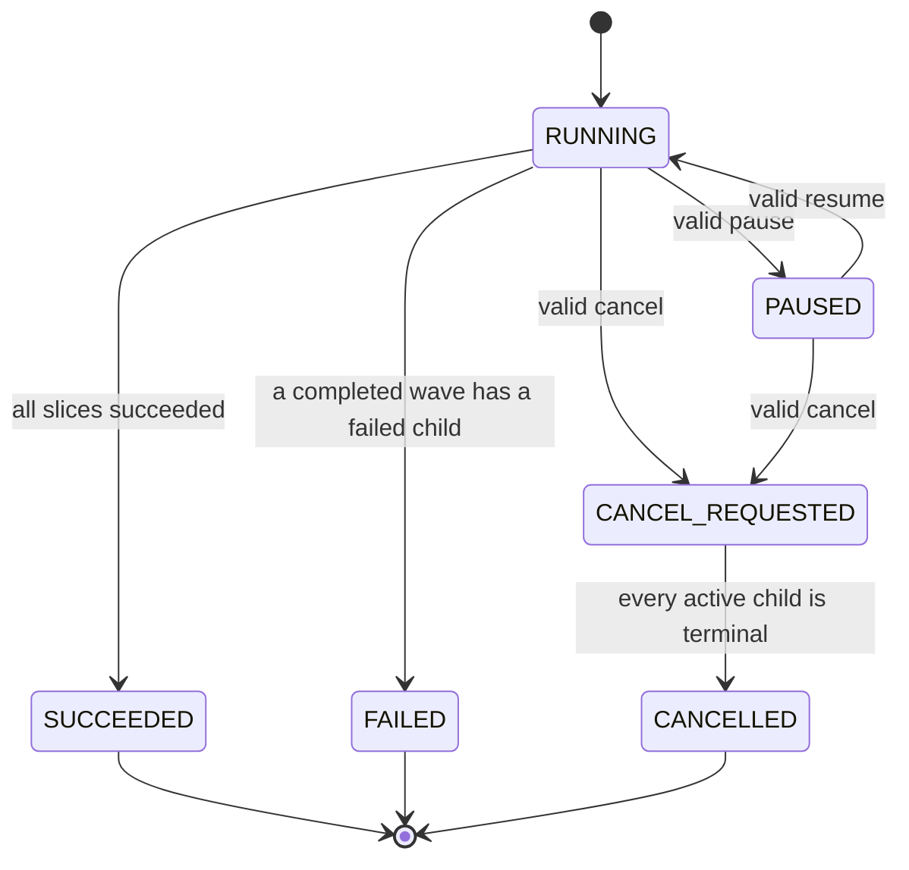
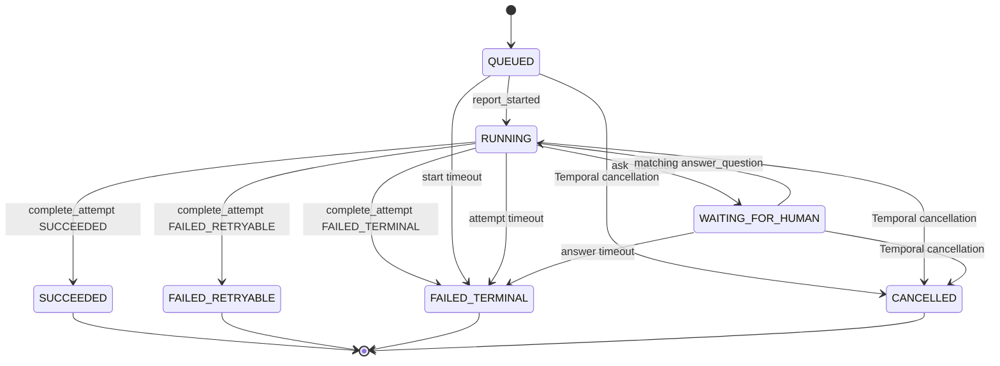

# M0-S6A Durable Temporal Orchestration Task Packet

## Document control

| Field | Dispatch specification |
| --- | --- |
| Package | M0-S6A (model-free parent/child Temporal orchestration substrate), an independently reviewable slice of M0-06 (Temporal workflow-skeleton work package) |
| Task ID | `CURVE-M0-S6A-DURABLE-ORCHESTRATION` |
| Status | `ACCEPTED_AND_MERGED / LOCAL_ONLY` |
| Version | 0.4 (post-merge lifecycle reconciliation; dispatch contract remains pinned to v0.3) |
| Date | 2026-08-26 |
| Product | Curve |
| Contract repository | `git@github.com:faocampo/curve.git` |
| Implementation repository | `git@github.com:faocampo/plane.git` |
| Curve base | `main` at `fdae85b33a235cd494dd36565698b2b5033a3389`, containing accepted P0-05 (test strategy and audit closure) |
| Approved Curve contract | `d97cc053a5d0eac7bc2aa9bebe263a245c95894f` |
| Canonical context digest | `sha256:fcde6b95800c6bf657afe0cdf10cc28e1ddbb44aa16257833ca84f43714eedde` |
| Plane base | `preview` at `cb17734280260361cc3c8eccf44170a4bfbcb840`, containing accepted M0-S1 through M0-S5B plus M0-03A (policy timestamp-ordering regression fix) |
| Plane branch | `curve/m0-s6a-durable-orchestration` |
| Approved Plane head | `af8335c42fa3c57e66f76c6ebd80220640630cf8` |
| Plane squash merge | `ad5772c0565c934e64ea90f892be1374819979be` on `preview` |
| Owner and human reviewer | Federico Ocampo, CTO at X3M |
| Implementer | Codex, distinct from the human reviewer |
| Risk | `STANDARD`; durable asynchronous state and cancellation, using synthetic `INTERNAL` data only |
| Product decisions | No new material product decision; D-003 (local runtime topology and trust-zone decision) is already `DECIDED / LOCAL_ONLY` |
| Acceptance record | [M0-S6A implementation evidence](m0-s6a-implementation-evidence.md) (approved contract/context, Plane implementation and merge, local runtime proof, CI, security acceptance, and rollback) |
| Parent closure | The defined local M0-06 (Temporal workflow-skeleton work package) deliverable is satisfied; formal `DONE_LOCAL` projection awaits a non-conflicting post-PR-#31 documentation reconciliation |

Version 0.3 of this packet remains immutable at the approved Curve contract
revision. Version 0.4 changes no implementation requirement or dispatch
authority. It records the completed lifecycle and points to the separately
reviewable acceptance evidence after Plane PR #10 merged.

## Outcome

Implement an additive, model-free Temporal control substrate that proves Curve
can orchestrate a bounded dependency graph as deterministic waves, create one
child workflow per immutable synthetic attempt, pause and resume dispatch,
handle reference-only questions and answers, propagate cancellation, continue
as new at a safe barrier, and replay every retained history.

PostgreSQL application services remain the future business-state authority.
Temporal history contains only orchestration state. The implementation creates
no new business aggregate, API, migration, provider connection, sandbox, VCS
mutation, protected evidence persistence, or production/staging activation.

## Historical readiness and stop conditions

### Entry gates

The following rows governed the authorized implementation dispatch. Their
satisfaction is recorded in the
[M0-S6A implementation evidence](m0-s6a-implementation-evidence.md)
(approved inputs, implementation, verification, merge, and rollback record).

| Gate | Required evidence |
| --- | --- |
| `B-CURVE` (approved contract revision) | Exact merged Curve commit containing this packet, [M0-S6A orchestration manifest](../../contracts/temporal/m0-orchestration-v1.json) (machine workflow, payload, scheduling, cancellation, and replay contract), its schema, fixtures, validator, and context-pack manifest |
| `B-P005` (accepted test-strategy baseline) | Satisfied by P0-05 (test strategy and audit closure) at Curve `main` `fdae85b33a235cd494dd36565698b2b5033a3389`; its matrix remains broader than this packet and assigns only partial AC-17, AC-20, and AC-58 evidence here |
| `B-PLANE` (implementation base) | Plane `preview` resolves exactly to `cb17734280260361cc3c8eccf44170a4bfbcb840`; existing M0-S3 (local Temporal round-trip implementation), M0-S5B (local observability integration), and M0-03A (policy timestamp-ordering regression fix) behavior remains present |
| `B-D003` (local runtime authority) | D-003 (local runtime topology and trust-zone decision) remains `DECIDED / LOCAL_ONLY`; `temporalio==1.31.0`, namespace `curve-local`, and task queue `curve-control-plane-v1` remain unchanged |
| `B-OWNER` (human accountability) | Federico Ocampo remains named owner and reviewer; the coding agent is the separate implementer |
| `B-CONTEXT` (immutable dispatch context) | The dispatcher records the exact Curve commit, every M0-S6A context path and SHA-256, and the aggregate context digest before Plane mutation |
| `B-COMMANDS` (executable verification) | Every required command below is available in the pinned Plane base or explicitly added by this packet |

Stop before mutation if any gate is missing, if a required context file differs
from its recorded digest, or if the implementation would require a migration,
new API, provider call, protected payload, network policy, repository mutation
outside the Plane branch, or infrastructure change.

### Dispatch policy

| Control | Required value |
| --- | --- |
| Data | Synthetic `INTERNAL` identifiers and fixed sentinel strings only |
| Model/tool use | Dispatcher-approved coding model; no runtime LLM, OpenRouter, OpenHands, Orca, Onyx, or MCP call |
| Budget | US$25 maximum automated coding attempt; pause before exceeding it |
| Repository authority | Read/write only on the named Plane branch; no merge, deployment, GitHub Project mutation, or external repository write by the coding agent |
| Runtime authority | Existing local Plane Docker stack and Curve overlay only; no staging, production, AWS, EKS, or X3M infrastructure mutation |
| Network | Existing dependency/build access and local Docker service connectivity only |
| Credentials | Existing local stack configuration only; workflow inputs, histories, fixtures, logs, and PR evidence contain no credential |

## Normative sources

| Source | Authority for this packet |
| --- | --- |
| [Curve PRD v0.12](../curve-ai-native-sdlc-prd.md) (product lifecycle, Temporal durability, cancellation, workspace isolation, and acceptance criteria) | Product and non-functional invariants |
| [Development plan](development-plan.md) (M0 through M7 work packages, dependencies, tests, and completion rules) | M0-06 parent/child workflow scope and later provider boundary |
| [Workflow and sequence specification](workflows-and-sequences.md) (aggregate states, parent/child topology, activity policy, cancellation, and replay) | Target orchestration semantics; M0-S6A implements only its model-free control subset |
| [M0 Temporal workflow contract](../../contracts/temporal/m0-workflow-contract.md) (accepted M0-S3 operation workflow, payload, activity, trace-header, cancellation, and replay rules) | Backward-compatibility boundary for `CurveOperationWorkflowV1` |
| [M0-S6A orchestration manifest](../../contracts/temporal/m0-orchestration-v1.json) (exact new workflow types, safe fields, handlers, scheduling, timeouts, cancellation, continue-as-new, and tests) | Normative machine contract for this implementation |
| [M0-S6A orchestration schema](../../contracts/schemas/temporal-orchestration.schema.json) (closed machine validation of the orchestration manifest) | Rejects broadened environment, payload, provider, side-effect, and workflow behavior |
| [M0-S3 implementation evidence](m0-s3-implementation-evidence.md) (accepted SDK/topology, runtime proof, tests, security boundary, and rollback) | Existing local Temporal substrate and proof commands |
| [M0-S5B implementation evidence](m0-s5b-implementation-evidence.md) (accepted local telemetry binding and live proof) | Existing worker observability behavior that the new workflow registration must preserve |
| [M0 traceability](m0-traceability.md) (M0 requirement-to-contract-to-test ownership) | M0-06 verification categories |
| [Temporal Python SDK 1.31.0 source](https://github.com/temporalio/sdk-python/tree/1.31.0) (pinned workflow, worker, replayer, and testing APIs) | Exact dependency source |
| [Temporal Python workflow API](https://python.temporal.io/temporalio.workflow.html) (signals, queries, deterministic conditions, child workflows, cancellation, and continue-as-new) | API usage and determinism rules |
| [Temporal Python Replayer API](https://python.temporal.io/temporalio.worker.Replayer.html) (recorded-history compatibility verification) | Replay implementation and acceptance |
| [Temporal Continue-As-New guidance](https://docs.temporal.io/develop/python/continue-as-new) (history rollover and SDK suggestion behavior) | Continue-as-new trigger and safe-checkpoint guidance |

The implementation pins the exact Curve commit containing these sources. A
later documentation change cannot alter an active coding-agent instruction.

## Requirement trace

| Requirement | Packet interpretation |
| --- | --- |
| FR-015 (durable execution, retries, questions, and cancellation) | Prove parent/child control, reference-only question/answer, pause/resume, bounded timers, and cancellation without a provider |
| FR-022 (durable workflow and event orchestration) | Register additive Temporal workflows on the accepted task queue and preserve deterministic state across restart and continue-as-new |
| NFR-004 (durability and recovery) | Replay old and new histories, tolerate worker restart, deduplicate commands, and end cancellation without active children |
| AC-17 (same durable workflow resumes after a human answer) | Partial enabling evidence only: retain reference/digest-only question and answer state, survive restart, and resume the same synthetic child. M4-05 (provider-backed slice execution) retains ownership of authorized-human attribution and exact context-version proof. |
| AC-18 (bounded retry and visible pause after delegation/provider failure) | No claim. M0-S6A has no delegation, provider activity, or retry policy; M4-05 (provider-backed slice execution) owns the criterion. |
| AC-19 (budget exhaustion pauses without silent substitution) | No claim. M0-S6A has no budget, model, or provider selection; M6-05 (budget administration and capacity optimization) owns the criterion. |
| AC-20 (cancellation revokes authority and reconciles runtimes/VCS) | Partial enabling evidence only: stop synthetic child starts, propagate Temporal cancellation, and settle the parent deterministically. M4-04 (trusted runner lifecycle and cleanup) owns JIT revocation, sandbox/preview termination, push prevention, and VCS reconciliation. |
| AC-21 (lost runner quarantine and distinct retry attempt) | No claim. M0-S6A has no runner lease, quarantine, concurrent resume, or retry-attempt creation; M4-04 (trusted runner lifecycle and cleanup) owns the criterion. |
| AC-58 (cross-dependency recovery meets RPO/RTO and reconciliation behavior) | Partial enabling evidence only: replay retained Temporal histories and recover the local worker without duplicate child starts. R1-03 (disaster recovery and reconciliation exercise) owns database, gateway, Onyx, runner, VCS, measured RPO/RTO, and complete recovery proof. |

## Scope

### Included

- Add `CurveInitiativeOrchestrationWorkflowV1` as the parent workflow.
- Add `CurveSliceAttemptWorkflowV1` as the synthetic child workflow.
- Add closed dataclasses and validators for every input, signal, query result,
  and workflow result declared by the machine manifest.
- Validate UUIDs, positive versions, `sha256:<64 lowercase hex>` digests,
  bounded enum codes, opaque references, collection size, dependency existence,
  duplicate slice IDs, self-dependencies, and cycles before starting a child.
- Schedule a deterministic topological wave and sort every child command by
  `slice_id`; unordered collection iteration cannot create workflow commands.
- Start children with stable workflow IDs, `ParentClosePolicy.REQUEST_CANCEL`,
  and `ChildWorkflowCancellationType.WAIT_CANCELLATION_COMPLETED`.
- Support typed parent `pause`, `resume`, and `request_cancel` signals.
- Support typed child `report_started`, `ask_question`, `answer_question`, and
  `complete_attempt` signals.
- Require every signal to bind the workflow target, a command ID, and the
  expected workflow state version. An identical replay is idempotent; a reused
  command ID with different fields or a stale expected version changes no
  control state and records only the bounded command ID and rejection code.
- Keep question and answer bodies outside Temporal; store only an opaque
  reference and SHA-256 digest in workflow history.
- Add deterministic timers for child-start, attempt-terminal, question-answer,
  and parent cancellation completion behavior.
- Continue the parent as new only between completed waves, when there are zero
  active children and all handlers are finished, after ten completed waves or
  when the SDK recommends it.
- Carry the exact manifest-listed safe state into the new run and increment
  `continue_as_new_count` once.
- Register both workflows additively in the existing Curve Temporal worker;
  keep `CurveOperationWorkflowV1`, its handlers, and its task queue unchanged.
- Add retained synthetic replay histories and unit/time-skipping/integration
  tests for every acceptance scenario.
- Preserve M0-S5A (telemetry kernel and static assets) trace propagation,
  redaction, bounded-cardinality, and worker-heartbeat behavior.

### Excluded

- Initiative, ExecutionPlan, Slice, Attempt, Question, Evidence, GateDecision,
  Budget, ProviderConnection, or VCS persistence and migrations.
- General Curve API, UI, SSE, or webhook additions.
- OpenHands, Orca, Onyx, MCP, OpenRouter, repository, sandbox, VCS, flag,
  preview, quality, merge-request, deployment, or external callback behavior.
- Reading protected bodies or application records from workflow code.
- New activities or application-service writes. Later packages attach versioned
  activities to the same control semantics after their domain contracts exist.
- Staging or production Temporal configuration and activation.
- Retrying a failed attempt by reviving its child. M4-05 (provider-backed slice
  execution workflow) creates a new immutable attempt and child workflow.

## Exact implementation contract

### Workflow identities

| Kind | Workflow type | Stable workflow ID |
| --- | --- | --- |
| Parent | `CurveInitiativeOrchestrationWorkflowV1` | `curve:{workspace_id}:initiative:{initiative_id}:plan:{plan_generation}` |
| Child | `CurveSliceAttemptWorkflowV1` | `curve:{workspace_id}:initiative:{initiative_id}:plan:{plan_generation}:slice:{slice_id}:attempt:{attempt_id}` |

Both use namespace `curve-local` and task queue `curve-control-plane-v1`. The
worker registers them next to `CurveOperationWorkflowV1`; it does not replace
or dynamically route the accepted operation workflow.

The parent start uses `WorkflowIDReusePolicy.REJECT_DUPLICATE`. A duplicate
start for either an open or closed stable parent ID returns Temporal's
already-started failure and creates no second execution. A later trusted
application package may attach to the existing handle after validating the
workspace and plan binding; this packet exposes no API and performs no attach.

### Input and history policy

The [M0-S6A orchestration manifest](../../contracts/temporal/m0-orchestration-v1.json)
(closed workflow and payload contract) is authoritative for every field name.
Dataclasses use `schema_version="1.0"`, reject unknown fields, and perform
validation in both the caller-facing constructor and workflow entry path.

| Primitive | Exact contract |
| --- | --- |
| UUID | Canonical lowercase RFC 4122 textual form matching the machine-manifest regex |
| Positive integer | Inclusive range `1` through `2147483647`; used for versions and generations |
| Non-negative integer | Inclusive range `0` through `2147483647`; used for zero-based wave indices and continue-as-new counters |
| Digest | `sha256:` followed by exactly 64 lowercase hexadecimal characters |
| Opaque reference or command ID | Lowercase letter followed by at most 127 lowercase letters, digits, `.`, `_`, `:`, `/`, or `-` |
| Enum | One exact value from `phase_values` or `command_codes` in the machine manifest |
| Processed command | Ordered `{command_id, payload_digest, disposition, rejection_code}` record; `payload_digest` hashes canonical JSON for the complete validated signal, `disposition` is `ACCEPTED` or `REJECTED`, and `rejection_code` is null only for an accepted command |
| Nullable state | Only the fields in `primitive_contracts.state_dependent_null_fields` may be null, and only when their lifecycle prerequisite is absent |

Every first-seen, structurally valid signal appends one processed-command
record up to the manifest limit, including a signal rejected for target,
expected-version, or transition state. Its accepted transition or first
rejection increments `state_version` exactly once. An identical command ID and
payload digest is a no-op after either disposition. A reused command ID with a
different digest is a conflict: it never dispatches or changes workflow state,
and the application command boundary records the bounded conflict. Callers
observe a first-seen asynchronous rejection through the safe `state` query and
the authoritative application command audit; signals provide no synchronous
result. Signal handling checks an existing command ID and matching payload
digest before expected-version validation, preserving idempotency after the
original accepted or rejected command increments `state_version`.

### Authoritative initialization and continuation

The parent distinguishes a new execution from continue-as-new using
`workflow.info().continued_run_id`; a caller-supplied flag cannot establish
continuation authority. A new execution accepts plan identity and immutable
slice descriptors, then initializes all lifecycle state internally to the
manifest defaults: `RUNNING`, state version 1, empty terminal/command lists,
zero next-wave index, zero continue-as-new count, and null rejection metadata.
Externally preloaded lifecycle state is rejected.

A continued execution requires a non-null server-provided continued-run ID and
the exact manifest carry-forward fields. The plan identity and immutable slices
remain unchanged, state version is monotonic, and `continue_as_new_count`
increases exactly once. Tests reject initial inputs that forge completion,
failure, cancellation, wave position, processed commands, or continuation.

`slices` is an ordered tuple of at most 64 immutable descriptors:

```json
{
  "slice_id": "00000000-0000-0000-0000-000000000101",
  "dependency_slice_ids": ["00000000-0000-0000-0000-000000000100"],
  "attempt_id": "00000000-0000-0000-0000-000000000201",
  "attempt_version": 1,
  "attempt_digest": "sha256:0000000000000000000000000000000000000000000000000000000000000001"
}
```

All lists are copied, sorted where order is not semantically supplied, and
serialized deterministically. A field name containing a manifest-listed
forbidden fragment fails contract tests. The sentinel
`CURVE_PROTECTED_SENTINEL_M0_S6A` must be absent from exported histories, logs,
traces, metrics, query results, failure details, and committed fixtures.

### Parent transition rules



- `PAUSED` prevents the next wave from starting and lets active children reach
  a signal/timer/cancellation terminal outcome.
- `resume` is valid only from `PAUSED`.
- `request_cancel` is valid from `RUNNING` or `PAUSED`; duplicate identical
  commands create no additional cancellation request.
- A terminal parent records a bounded rejection for a state-changing signal.
- A failed or cancelled dependency never satisfies a downstream dependency.
  The parent settles the active wave, records its safe result, and becomes
  `FAILED` or `CANCELLED` without starting downstream children.
- If active children do not acknowledge cancellation within 120 workflow
  seconds, the parent records `CANCEL_TIMEOUT`, finishes `FAILED`, and relies on
  `ParentClosePolicy.REQUEST_CANCEL` to preserve the cancellation request for
  any still-open child. The acceptance proof must keep this path empty.

### Child transition rules



- One active question is allowed. A matching answer must bind its
  `question_ref`; no question or answer body enters the workflow.
- `complete_attempt` accepts the closed outcomes `SUCCEEDED`,
  `FAILED_RETRYABLE`, and `FAILED_TERMINAL`. `failure_code` is a bounded enum
  and is absent for success.
- The child does not automatically retry. The parent treats any failure as a
  failed wave in this substrate.
- Temporal cancellation is caught only to record the synthetic terminal state
  and return a safe result. The child performs no external cleanup activity.

### Continue-as-new contract

The parent evaluates continue-as-new only after an entire wave settles and
before another wave starts. It must verify all of these predicates:

1. `active_slice_ids` is empty.
2. No child handle or awaitable remains active.
3. `workflow.all_handlers_finished()` is true.
4. The parent is `RUNNING`, has remaining slices, and has no failed/cancelled
   wave requiring a terminal result.
5. Ten waves have completed in the current run or
   `workflow.info().is_continue_as_new_suggested()` is true.

The new run receives exactly the fields listed in the machine manifest. It
cannot infer completion from a query or external state. Tests must force the
ten-wave threshold so the branch is executable without manipulating server
internals.

### Determinism and compatibility

- Workflow modules perform no network, filesystem, environment, clock, random,
  database, telemetry-exporter, or process I/O.
- Use Temporal workflow time and durable conditions/timers only.
- Every dictionary/set used to create commands is converted to a stable sorted
  sequence first.
- Register patch markers `curve-m0-s6a-parent-v1` and
  `curve-m0-s6a-child-v1` at the initial versioned decision points.
- Replay the existing `curve-operation-v1.json` fixture unchanged.
- Retain one parent, one child, and one continued parent history generated by
  the accepted implementation. CI replays all four fixtures with the same
  worker workflow registration and data converter.
- A later incompatible semantic change uses a new workflow type or an approved
  patched compatibility branch. It cannot rewrite a retained v1 decision.

## Implementation sequence

Each commit is independently reviewable and keeps the existing worker usable.

1. **Contracts and validation.** Add frozen dataclasses, enums, target/version
   validation, graph validation, signal idempotency helpers, and focused unit
   tests. Do not register a workflow yet.
2. **Synthetic child.** Implement the child state machine, durable conditions,
   timers, question/answer references, completion, cancellation result, query,
   and time-skipping tests.
3. **Parent scheduler.** Implement deterministic DAG waves, stable child IDs,
   child policy, pause/resume/cancel, result aggregation, continue-as-new, and
   time-skipping tests.
4. **Worker and replay.** Register both workflow types additively, generate and
   review the three new synthetic histories, and replay the old and new corpus.
5. **Runtime acceptance.** Run the existing local Curve profile, exercise one
   multi-wave success, one question/answer, one cancellation, one forced
   continue-as-new, and one worker restart; capture sanitized evidence.

## Acceptance tests

| ID | Given / When / Then |
| --- | --- |
| `M0-S6A-AT-01` | Given two independent root slices and one dependent slice, when the parent runs, then both roots start in the first wave in ascending `slice_id` order and the dependent starts only after both succeed. |
| `M0-S6A-AT-02` | Given a missing dependency, duplicate slice, self-dependency, cycle, more than 64 slices, or more than 16 dependencies, when input is validated, then no child starts and a bounded validation code is returned. |
| `M0-S6A-AT-03` | Given the same parent start is delivered twice for an open or closed stable workflow ID, when `WorkflowIDReusePolicy.REJECT_DUPLICATE` is applied, then the second start fails as already started, one workflow execution exists, and each attempt has at most one child. |
| `M0-S6A-AT-04` | Given accepted and first-seen rejected signal commands, when either is delivered identically again, then its processed record and state-version change occur once; a reused ID with another digest, stale expected version, target mismatch, or invalid transition dispatches nothing. |
| `M0-S6A-AT-05` | Given a running child asks a question by reference and digest, when the worker restarts and a matching answer arrives, then the same child resumes without any question/answer body in history. |
| `M0-S6A-AT-06` | Given the parent is paused between waves, when root children finish, then no next-wave child starts until a valid resume command arrives. |
| `M0-S6A-AT-07` | Given active children, when a valid parent cancel arrives, then no new child starts, every active child reaches `CANCELLED`, and the parent reaches `CANCELLED` within the configured timer. |
| `M0-S6A-AT-08` | Given ten completed waves and remaining work, when the parent reaches the wave barrier, then it continues as new once, the server-provided continued-run ID authorizes exact carry-forward, plan identity/slices remain unchanged, the count increments once, and no duplicate child starts. |
| `M0-S6A-AT-09` | Given the Curve worker stops while children wait or a parent is between waves, when it restarts, then all workflows recover from history without duplicate state or commands. |
| `M0-S6A-AT-10` | Given the retained operation, parent, child, and continued-parent histories, when the candidate `Replayer` runs, then all replay with zero nondeterminism errors. |
| `M0-S6A-AT-11` | Given protected-field negative fixtures and the sentinel, when contracts and runtime evidence are inspected, then forbidden fields and sentinel values are absent from history, queries, outputs, logs, traces, metrics, and safe errors. |
| `M0-S6A-AT-12` | Given Curve is disabled or the Curve overlay is absent, when Plane builds and its existing stack runs, then existing Plane behavior, `CurveOperationWorkflowV1`, APIs, UI, Celery workers, and repository-native checks remain unchanged. |

## Required Plane commands

Run from the Plane repository root at the pinned implementation head.

```text
git diff --check
node apps/api/plane/curve/contracts/check-integrity.mjs
docker compose -f docker-compose-test.yml run --rm api-tests ruff check plane/curve
docker compose -f docker-compose-test.yml run --rm api-tests ruff format --check plane/curve
docker compose -f docker-compose-test.yml run --rm --build api-tests pytest plane/curve/tests/test_temporal_contracts.py plane/curve/tests/test_temporal_orchestration.py plane/curve/tests/test_temporal_replay.py
docker compose -f docker-compose-test.yml run --rm api-tests pytest plane/curve/tests
docker compose -f docker-compose-test.yml run --rm api-tests python manage.py makemigrations --check --dry-run
docker compose -f docker-compose-test.yml up --build --abort-on-container-exit --exit-code-from api-tests
docker compose -f docker-compose-local.yml -f docker-compose-curve.yml --profile curve config
docker compose -f docker-compose-local.yml -f docker-compose-curve.yml --profile curve build api curve-worker
docker compose -f docker-compose-local.yml -f docker-compose-curve.yml --profile curve up -d
docker compose -f docker-compose-local.yml -f docker-compose-curve.yml --profile curve exec curve-worker python -m plane.curve.temporal.health
docker compose -f docker-compose-local.yml -f docker-compose-curve.yml --profile curve exec api pytest plane/curve/tests -k "orchestration or temporal or replay or cancellation"
docker compose -f docker-compose-local.yml -f docker-compose-curve.yml --profile curve restart curve-worker
docker compose -f docker-compose-local.yml -f docker-compose-curve.yml --profile curve ps
pnpm check:contracts
pnpm check
pnpm build
docker compose -f docker-compose-local.yml -f docker-compose-curve.yml --profile curve down
docker compose -f docker-compose-local.yml ps
```

If a listed test file is introduced by this packet, its path becomes available
in the first contracts-and-validation commit. No command may be silently
replaced; a base change that invalidates a command returns the packet to review.

## Required evidence

| Evidence | Required contents |
| --- | --- |
| Dispatch context | Exact Curve and Plane SHAs, ordered context paths, per-file SHA-256 values, aggregate digest, owner, reviewer, branch, and timestamp |
| Contract evidence | Manifest/schema validation, valid manifest acceptance, invalid fixture rejection, context-pack test, and no-forbidden-field semantic check |
| Unit/time-skipping evidence | Test IDs `M0-S6A-AT-01` through `M0-S6A-AT-12` mapped to exact test names and results |
| Replay evidence | Digests of all four retained histories, workflow types registered by the replayer, SDK version, and zero nondeterminism failures |
| Runtime evidence | Sanitized workflow IDs, run IDs, phases, continue-as-new chain, child count, cancellation result, restart result, and command output summaries |
| Regression evidence | Full Curve backend suite, `pnpm check`, `pnpm build`, existing stack health with and without the Curve profile, and unchanged old replay fixture digest |
| Security evidence | Sentinel scan, workflow-field allowlist, no credential/protected field, no provider/VCS/network activity, and bounded errors/logs/telemetry |
| Review evidence | Plane PR number, exact head, green required checks, Federico review, and explicit ready/merge authorization before merge |

Evidence uses identifiers, digests, counts, enum states, commands, and links. It
does not include protected payloads, full histories in PR comments, credentials,
or free-form question/answer content.

## Rollback and disablement

Before merge, revert the additive Plane commits or discard the feature branch.
After merge, set `CURVE_ENABLED=0` or omit the `curve` Compose profile, stop the
Curve worker, and keep existing Temporal history for inspection and replay.
Because this packet adds no migration, API, domain record, or external effect,
rollback requires no destructive database action. Re-registering the earlier
worker set preserves `CurveOperationWorkflowV1`; unfinished new workflow types
remain unpolled until the compatible worker is restored.

## Completion and handoff

M0-S6A was accepted after all twelve acceptance tests passed, the replay corpus
was committed and replayed deterministically, the local
restart/cancellation/continue-as-new proof passed, the complete Plane regression
was green, and Federico Ocampo approved Plane PR #10 at exact head
`af8335c42fa3c57e66f76c6ebd80220640630cf8`. The PR squash-merged into
`preview` as `ad5772c0565c934e64ea90f892be1374819979be`; the
[M0-S6A implementation evidence](m0-s6a-implementation-evidence.md)
(exact contract, context, runtime, CI, approved and merged trees, security
acceptance, and rollback) is the authoritative post-merge record.

Completion satisfies the defined local M0-06 (Temporal workflow-skeleton work
package) deliverable. Its formal Project/readiness projection remains
`IN_PROGRESS` until a separate reconciliation after Curve PR #31 updates the
shared development-plan and readiness files. No additional M0-S6B child is
required. M4-05 (provider-backed slice execution workflow) remains responsible
for real Initiative/Plan/Slice/Attempt integration, provider dispatch, retries
as new attempts, attributed questions, application-service writes, and
external reconciliation; M4-04 (trusted runner lifecycle) and M6-05 (budget
administration and capacity) retain their declared runtime and budget scope.
