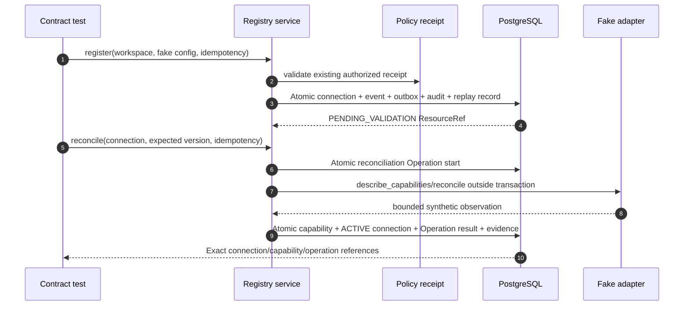
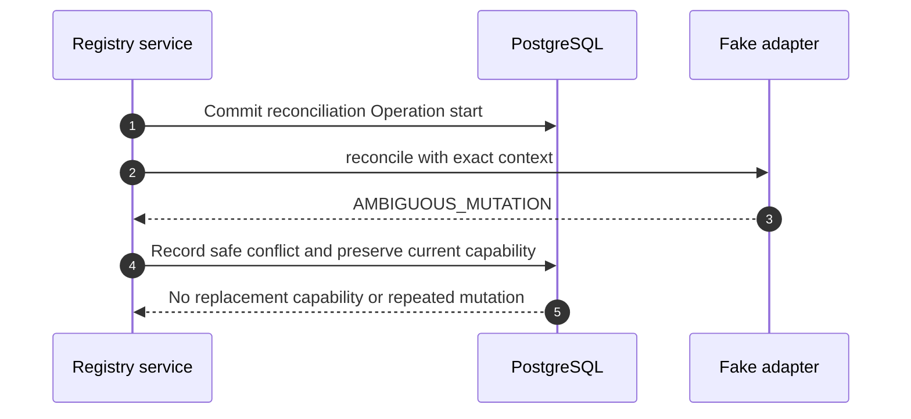

# M0-S9A Provider-Neutral Registry and Reconciliation Task Packet

## Document control

| Field | Value |
| --- | --- |
| Package | M0-S9A (provider-neutral registry and reconciliation foundation) / child of M0-09 (provider integration foundation) |
| Status | `REVIEW_DRAFT / NOT_DISPATCHABLE` |
| Version | 1.3 |
| Date | 2026-08-22 |
| Product | Curve |
| Contract repository | `git@github.com:faocampo/curve.git` |
| Implementation repository | `git@github.com:faocampo/plane.git` |
| Curve review base | `main` at `590a52ef006fd1d83bef5c76dfdab9ce9080a168`, stacked on P0-05 (acceptance-test strategy) candidate `aa82735eaa02995116e6671d1a52b087db084068` until that prerequisite merges |
| Target branch | `preview` |
| Minimum Plane base | Exact future `preview` merge descendant of `a7cf44b0e01a470c94b59f1c2ce5297dacd81d45` that contains Plane PR #9's policy timestamp-ordering fix |
| Implementation branch | `curve/m0-s9a-provider-registry-foundation` |
| Owner and human reviewer | Federico Ocampo, CTO at X3M |
| Implementer | One AI coding agent distinct from the human reviewer |
| Risk | `STANDARD`; local synthetic provider metadata only |
| Product trace | FR-003, FR-023, FR-044; NFR-005, NFR-008, NFR-013; partial AC-33 |

## Outcome

Implement a provider-neutral registry substrate in Plane's additive
`plane.curve` Django application. One workspace can register one deterministic
local fake-provider connection, validate an immutable capability document, run
explicit reconciliation through Curve's existing operation/delivery kernel,
and observe safe lifecycle/audit evidence.

This is the first independently reviewable child of M0-09 (provider integration
foundation). M0-S9B (external provider transport and administration) later adds
the human administration API/role source, credentials, authenticated callback
ingress, outgoing webhooks, scheduled reconciliation, and real adapters under
their applicable decisions. D-007 (MCP/Orca trust policy) applies to MCP-enabled
work only and is not an M0-S9A dependency.

AC-57 (model-failover policy and actual-routing evidence) stays at the M0-09
(provider integration foundation) parent until a dedicated Model Gateway child
package is defined under D-004 (model catalog and data-policy decision) and
D-005 (model task-routing decision). M0-S9A performs no model call, selects no
model or provider, and produces no routing decision; its fake-provider tests
cannot satisfy any part of AC-57.

## Normative sources

| Source | Authority in this packet |
| --- | --- |
| [Curve PRD v0.12](../curve-ai-native-sdlc-prd.md) (product integrations, provider isolation, workspace scope, audit, and reconciliation requirements) | Product invariants and acceptance boundaries |
| [Architecture](architecture.md) (logical components, trust zones, and PostgreSQL/Temporal ownership) | Provider adapter boundary and authoritative state ownership |
| [Domain model](domain-model.md) (workspace-scoped ProviderConnection and immutable history rules) | Aggregate and reference semantics |
| [Integration contracts](integration-contracts.md) (provider call context, normalized errors, adapter ports, callbacks, and reconciliation) | Shared provider behavior; M0-S9A consumes only the local subset |
| [M0 authorization and state matrices](m0-authorization-and-state-matrices.md) (core policy actions, roles, and fail-closed evaluation) | Existing provider-administration permission ceiling; public role resolution remains later scope |
| [M0-S9A relational contract](../../contracts/database/m0-s9a-provider-registry-contract.md) (tables, constraints, transactions, adapter port, state machine, migration, and rollback) | Normative Plane implementation contract |
| [M0-S9A provider-registry manifest](../../contracts/providers/m0-s9a-provider-registry-v1.json) (machine-readable local authority, lifecycle, adapter, retry, persistence, and events) | Fail-closed constants |
| [Provider-registry manifest schema](../../contracts/schemas/provider-registry-manifest.schema.json) (machine validation of the local-only package boundary) | Rejects external access, real providers, wider capability risk, and changed lifecycle |
| [Provider connection schema](../../contracts/schemas/provider-connection.schema.json) (workspace-scoped connection metadata and lifecycle requirements) | Safe serialized aggregate projection |
| [Provider capability schema](../../contracts/schemas/provider-capability.schema.json) (immutable versioned adapter capability observation) | Safe serialized capability projection |
| [M0-S2 relational contract](../../contracts/database/m0-s2-relational-contract.md) (operation, event, outbox, idempotency, and audit transaction kernel) | Existing delivery/idempotency primitives; no duplicate implementation |
| [M0-03 policy relational contract](../../contracts/database/m0-03-policy-contract.md) (authorization receipt and immutable policy evidence) | Existing policy boundary; no parallel authorization path |
| [M0-S5 task packet](m0-s5-observability-task-packet.md) (redaction, correlation, telemetry, and alert boundaries) | Safe instrumentation rules |
| [P0-05 test strategy](m0-test-strategy.md) (acceptance-test suites, commands, environments, ownership, and evidence gates) | Exact cross-repository verification baseline and AC-33 ownership boundary |
| [P0-05 AC test matrix](../../contracts/testing/ac-test-matrix-v1.json) (machine-readable AC-01 through AC-60 ownership and evidence mapping) | Normative acceptance ownership; M0-S9A contributes partial AC-33 evidence only |

The coding agent pins one exact merged Curve commit containing every source
above and the deterministic M0-S9A context digest. A later documentation edit
cannot silently change active implementation scope.

The ProviderConnection and ProviderCapability projections use schema version
`2.0`. They replace unimplemented v1 drafts before any persisted row, endpoint,
generated client, or adapter exists; there is no data migration. Future
incompatible changes require a new schema version and compatibility plan.

## Dispatch readiness

Implementation remains blocked until all rows are satisfied:

| Gate | Current state | Required evidence |
| --- | --- | --- |
| P0-05 (R1 acceptance-test strategy and acceptance-criteria ownership) | Draft PR under review | Merged Curve revision establishing test ownership and exact suite commands |
| M0-S9A contract publication | This review draft | Exact Curve merge SHA and context-pack digest |
| Plane base | Pending | Merge Plane PR #9's policy timestamp-ordering fix, confirm the resulting `preview` contains `a7cf44b...`, and record that exact dispatch base SHA |
| Owner/reviewer | Satisfied | Federico Ocampo |
| Material decisions | Satisfied for this local subset | No network, credentials, protected body, public admin API, scheduler, or external mutation; D-007 remains MCP-specific |
| Exact-head implementation authorization | Pending | Federico Ocampo approves the final merged contract revision and dispatch base |

No coding agent mutates Plane while any row is pending.

## Dispatch policy

| Field | Required value |
| --- | --- |
| Data | Synthetic `INTERNAL` identifiers and fixed fake observations only |
| Model/tool budget | Maximum US$25 automated attempt; no runtime model/provider call |
| Repository authority | Named Plane feature branch only; no merge, deployment, GitHub Project, or infrastructure mutation by the coding agent |
| Network | Repository dependency/build access only when required by the pinned lock; provider runtime network is prohibited and tested |
| Secrets | No secret reference lookup, value, environment read, token, credential, or protected object body |
| Sandbox | Repository-local build/test limits; no Docker topology or X3M service change |
| Stop behavior | Missing exact base/context, owner/reviewer, command, test, budget, policy, or migration value stops before mutation |

## Scope

### Included

- `ProviderConnection` mutable aggregate and append-only `ProviderCapability`
  history in the dedicated Django `plane.curve` application.
- One additive Curve migration with workspace-scoped indexes, uniqueness, state
  checks, and reversible disposable-database proof.
- A typed provider-adapter protocol, static registry, normalized error types,
  call context, and deterministic `FAKE_LOCAL` adapter.
- Application services for register, explicit validate/reconcile, disable,
  enable, and terminal revoke using optimistic concurrency and the existing
  policy/operation/event/outbox/idempotency/audit kernel.
- Capability validation against exact connection/workspace/adapter/version,
  supported protocol, known risk, classification ceiling, and closed schemas.
- Explicit fake reconciliation with success, byte-equivalent result, changed
  result, transient, terminal, timeout/cancellation, unsupported capability,
  and ambiguous-observation fixtures.
- Safe correlation, audit, and existing operation telemetry integration.
- Contract, migration, repository, service, policy-boundary, concurrency,
  recovery, isolation, redaction, and full regression tests.

### Excluded

- Public REST/GraphQL/UI provider administration or a new user-facing flow.
- Persistence/resolution of `PLATFORM_ADMINISTRATOR`; provider-specific policy
  adapters; any caller-supplied role/target/authorization context.
- Onyx, MCP, Orca, OpenHands, model, VCS, quality, flag, documentation,
  monitoring, or prototype adapter implementation.
- Credentials, Secrets Manager, delegated OAuth, tokens, endpoint/origin/TLS
  configuration, network egress, callbacks, outgoing webhooks, or third-party
  API calls.
- Celery Beat, Temporal Schedule, cron, polling loop, or automatic 15-minute
  reconciliation. The persisted `next_reconcile_at` value is advisory only.
- Protected object storage, evidence bodies, customer data, staging/production
  activation, external mutation, or infrastructure change.
- New frontend component, navigation item, or screen.

## Implementation slices

The Plane work is one independently reviewable PR and must be committed in this
order:

1. **Persistence and migration.** Add model enums, `ProviderConnection`,
   `ProviderCapability`, constraints, admin-free repositories, migration, and
   model/migration tests.
2. **Adapter and lifecycle services.** Add immutable typed values, static
   registry, fake adapter, normalized errors, register/reconcile/disable/enable/
   revoke services, and command-kernel/audit tests.
3. **Conformance and observability.** Add the fixture-driven shared suite,
   race/recovery/network-denial tests, safe instrumentation, copied
   context/contract integrity checks, and full regression evidence.

If review shows these cannot remain one coherent PR, split after slice 1 while
keeping one active PR at a time and preserving the same exact context revision.

## Required Plane implementation boundaries

| Boundary | Required implementation |
| --- | --- |
| Models | Add only under `apps/api/plane/curve`; no Plane model change or hard FK to Plane workspace tables |
| Repository lookup | Every method requires `workspace_id` and uses it in the first query predicate; absent/wrong-workspace IDs share the same result |
| Policy | Services accept only an unforgeable authorized policy receipt from the existing kernel; public role resolution/API stays absent |
| Transactions | Adapter calls never occur inside `transaction.atomic()`; each accepted state mutation atomically writes domain event, outbox, audit, and aggregate version |
| Idempotency | Store only key/request digests and replay the original PostgreSQL `ResourceRef`; changed digest conflicts without another effect |
| Capability history | Append-only; byte-equivalent observations reuse current capability; changed valid observations append the next version |
| Registry | Exact static mapping for `curve.fake-local`; no dynamic import, entry-point discovery, arbitrary class path, or configuration-selected module |
| Fake adapter | Pure deterministic in-memory implementation; no socket, filesystem, environment, subprocess, Docker, or credential access |
| Observability | Existing M0-S5 redaction/correlation helpers; bounded state/error code only; no raw IDs, configuration, capabilities, or exception text in telemetry |
| Disablement | Registry service unavailable when Curve is disabled; existing Plane and Curve operation behavior unchanged |

## Execution sequences

### Registration and validation



### Ambiguous observation



## Executable acceptance scenarios

1. **Disabled baseline.** Given Curve/provider registry is disabled, when Plane
   starts and existing routes/tests run, then no registry background work,
   route, network access, or behavior change occurs.
2. **Migration.** Given a disposable PostgreSQL database, forward/backward-one/
   forward succeeds with exact tables, indexes, constraints, and no migration
   drift.
3. **Workspace isolation.** Given connections in workspaces A and B, every
   read/write/reconcile with a foreign ID returns the same result as absent and
   writes no cross-workspace evidence.
4. **Registration replay.** Given a successful registration, the same key and
   request digest returns the original connection `ResourceRef`; a changed
   digest conflicts with no second connection/event/outbox effect.
5. **Exact adapter registry.** Unknown key, provider mismatch, version mismatch,
   or dynamic module path is rejected before adapter invocation.
6. **Successful validation.** A valid fake observation appends capability v1,
   moves the connection to `ACTIVE`, completes the Operation, and atomically
   records exact event/outbox/audit evidence.
7. **Equivalent reconciliation.** A byte-equivalent observation updates safe
   reconciliation timestamps/version without appending capability v2.
8. **Changed capability.** A valid changed observation appends exactly one next
   capability version and never rewrites v1.
9. **Unsupported capability.** Enabled non-`READ`, unknown schema/protocol, or
   classification beyond `INTERNAL` fails closed and does not make the
   connection active.
10. **Failure normalization.** Transient/terminal/timeout failures expose only
    the stable taxonomy, respect maximum three attempts and 15-second deadline,
    and move an active connection to `DEGRADED` only after exhaustion.
11. **Ambiguity.** An ambiguous observation records conflict evidence, retains
    the prior capability, and performs no blind retry or external mutation.
12. **Lifecycle.** Disable stops use; enable returns to
    `PENDING_VALIDATION`; revoke is terminal; invalid/stale-version transitions
    return stable conflict and safe no-effect audit.
13. **Race.** Two reconciliations at the same expected version produce one
    accepted transition and one stale-version no-effect result without duplicate
    capability/event effects.
14. **No external access.** Socket, subprocess, filesystem/environment secret,
    object-store, and credential-broker probes fail the test if called.
15. **Redaction.** Logs, metrics, traces, Problem Details, audit safe payloads,
    and test reports contain no raw idempotency key, configuration body,
    capability payload, secret, workspace UUID label, or exception text.
16. **Full regression.** Required Curve/backend/frontend/monorepo/build/security
    suites pass from the exact implementation head.

## Exact verification commands

Run from the Plane repository root using its pinned toolchains:

```bash
./setup.sh
docker compose -f docker-compose-test.yml up -d test-db test-redis test-mq test-minio
docker compose -f docker-compose-test.yml run --rm --build api-tests python manage.py migrate
docker compose -f docker-compose-test.yml run --rm api-tests pytest plane/curve/tests
docker compose -f docker-compose-test.yml run --rm api-tests python manage.py makemigrations curve --check --dry-run
docker compose -f docker-compose-test.yml run --rm api-tests python manage.py migrate curve 0004
docker compose -f docker-compose-test.yml run --rm api-tests python manage.py migrate curve 0005
docker compose -f docker-compose-test.yml up --build --abort-on-container-exit --exit-code-from api-tests
pnpm check
pnpm build
docker compose -f docker-compose-test.yml down -v
```

The implementation migration is exactly
`apps/api/plane/curve/migrations/0005_providerconnection_providercapability.py`
and its predecessor is exactly
`apps/api/plane/curve/migrations/0004_policydecision_recorded_at_default.py`;
any changed predecessor/name stops for contract revision. P0-05 (R1
acceptance-test strategy and acceptance-criteria ownership) may add stricter
commands; it cannot remove the repository-native full backend command above.

## Required PR evidence

- Exact Curve contract SHA and deterministic M0-S9A context digest.
- Exact Plane base/head/tree and changed-file inventory.
- Generated migration and SQL, forward/backward-one/forward logs, and
  `makemigrations --check --dry-run` result.
- Named test counts for every acceptance scenario and full Plane regression.
- Proof that fake adapter runtime cannot open a socket, launch a subprocess,
  read credentials/environment, or call a real provider.
- CodeQL/copyright/dependency results and an AGPL source-link regression check.
- Clean disablement/restart proof and rollback result.

## Rollback

Turn off the Curve/provider-registry feature and restart API/worker processes.
No scheduled task or external connection exists to clean up. Persistent rollback
keeps the additive tables in place until the compatibility window closes; the
disposable migration proof alone runs the reverse migration. A failed package
reverts only the Plane feature branch and leaves current `preview`, GitHub
Project state, X3M infrastructure, and external systems unchanged.

## Completion boundary

M0-S9A is complete only when the exact implementation head passes all scenarios
and its post-merge evidence is accepted. M0-09 remains open until M0-S9B proves
the applicable administration/transport, real adapter, callback/webhook, and
scheduled reconciliation behaviors and a separately defined Model Gateway
child proves AC-57 (model-failover policy and actual-routing evidence). M0-S9A
completion grants no MCP, Orca, OpenHands, Onyx, model, VCS, credential,
staging, or production authority.
