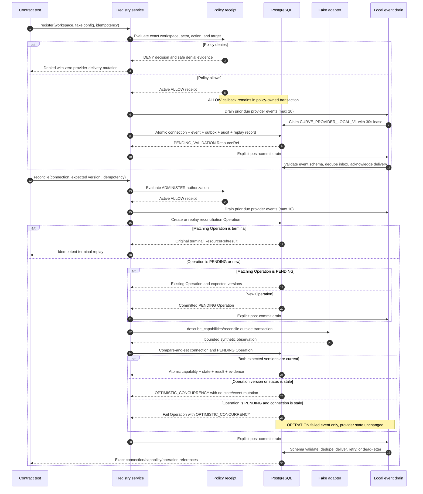
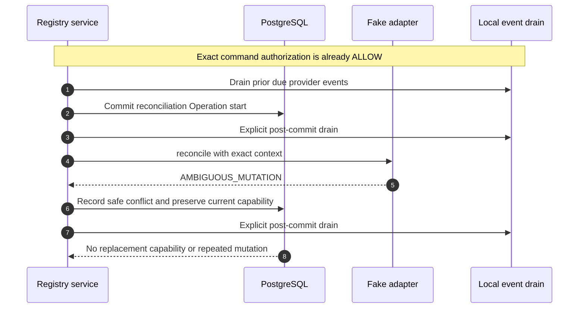

# M0-S9A Provider-Neutral Registry and Reconciliation Task Packet

## Document control

| Field | Value |
| --- | --- |
| Package | M0-S9A (provider-neutral registry and reconciliation foundation) / child of M0-09 (provider integration foundation) |
| Status | `REVIEW / AWAITING_EXACT_HEAD_APPROVAL` |
| Version | 1.9 |
| Date | 2026-08-28 |
| Product | Curve |
| Contract repository | `git@github.com:faocampo/curve.git` |
| Implementation repository | `git@github.com:faocampo/plane.git` |
| Published Curve contract baseline | `main` at `13cec5e99889c68b885a57a8a98609885b1e27b3`, containing accepted P0-05 (test strategy and audit closure), M0-S6A (durable parent/child Temporal orchestration contract), the approved M0-S9A contract publication, and the policy-v2 contract correction |
| Target branch | `preview` |
| Plane base | Exact `preview` commit `ad5772c0565c934e64ea90f892be1374819979be`, containing merged Plane PR #10 (M0-S6A durable parent/child Temporal orchestration implementation) and reserving provider migration `0005` after policy migration `0004` |
| Implementation branch | `curve/m0-s9a-provider-registry-foundation` |
| Owner and human reviewer | Federico Ocampo, CTO at X3M |
| Implementer | One AI coding agent distinct from the human reviewer |
| Risk | `STANDARD`; local synthetic provider metadata only |
| Product trace | FR-003, FR-023, FR-044; NFR-005, NFR-008, NFR-013; partial AC-33 |

Version 1.9 resolves the six findings from the independent implementation
review without expanding M0-S9A scope. It requires authorization before the
next-command drain, zero delivery mutation on denial, resumption of a replayed
pending reconciliation, guarded ORM bulk writes for workspace-bound provider
references, dead-lettering after the third abandoned claim, one
`OPTIMISTIC_CONCURRENCY` result for stale success or failure, and a closed
versioned payload schema for every provider event. Provider commands remain
synchronous; committed provider events use destination
`CURVE_PROVIDER_LOCAL_V1`, consumer `curve-provider-local-v1`, and explicit
post-commit/authorized-next-command drains. Approved Option B derives
`PLATFORM_ADMINISTRATOR` from active Plane workspace role `20` in the exact
target workspace only for provider registration/administration actions.

All product, architecture, security, data, licensing, infrastructure, scope,
test, budget, and rollback inputs required by this package are resolved. This
correction remains under review and grants no renewed Plane execution authority
until its exact head is approved, CI is green, it is merged, and a replacement
canonical M0-S9A context digest is generated. The dispatcher pins that exact
merged revision and digest, fetches both remotes, and stops before Plane
mutation if either base has advanced.

Plane implementation remains paused pending those correction gates.

## Outcome

Implement a provider-neutral registry substrate in Plane's additive
`plane.curve` Django application. One workspace can register one deterministic
local fake-provider connection, validate an immutable capability document, run
explicit reconciliation through Curve's existing operation/delivery kernel,
deliver its committed local events through the outbox/inbox kernel, and observe
safe lifecycle/audit evidence.

This is the first independently reviewable child of M0-09 (provider integration
foundation). M0-S9B (external provider transport and administration) later adds
the human administration API/role source, credentials, authenticated callback
ingress, outgoing webhooks, scheduled reconciliation, and real adapters under
their applicable decisions. D-007 (MCP/Orca trust policy) applies to MCP-enabled
work only and is not an M0-S9A dependency.

AC-57 (model-failover policy and actual-routing evidence) stays at the M0-09
(provider integration foundation) parent until a dedicated Model Gateway child
package is defined under D-004 (model catalog and data-policy decision) and
D-005 (model task-routing decision). M0-S9A performs no model call, selects no
model or provider, and produces no routing decision; its fake-provider tests
cannot satisfy any part of AC-57.

## Normative sources

| Source | Authority in this packet |
| --- | --- |
| [Curve PRD v0.12](../curve-ai-native-sdlc-prd.md) (product integrations, provider isolation, workspace scope, audit, and reconciliation requirements) | Product invariants and acceptance boundaries |
| [Architecture](architecture.md) (logical components, trust zones, and PostgreSQL/Temporal ownership) | Provider adapter boundary and authoritative state ownership |
| [Domain model](domain-model.md) (workspace-scoped ProviderConnection and immutable history rules) | Aggregate and reference semantics |
| [Integration contracts](integration-contracts.md) (provider call context, normalized errors, adapter ports, callbacks, and reconciliation) | Shared provider behavior; M0-S9A consumes only the local subset |
| [M0 authorization and state matrices](m0-authorization-and-state-matrices.md) (core policy actions, trusted role sources, and fail-closed evaluation) | Core v1 permission ceiling plus the approved local M0-S9A Option B extension |
| [M0-S9A registration authorization decision](m0-s9a-registration-authorization-decision.md) (approved Plane workspace-admin role mapping and registration resource) | Exact Option B role source and deny boundary |
| [Core policy v2 manifest](../../contracts/policy/core-policy-v2.json) (Option B trusted role source and provider-registration action) | Exact versioned policy consumed by registration |
| [Core policy v2 schema](../../contracts/schemas/core-policy-manifest-v2.schema.json) (closed machine validation for the Option B policy extension) | Prevents role-source or action widening |
| [M0-S9A relational contract](../../contracts/database/m0-s9a-provider-registry-contract.md) (tables, constraints, transactions, adapter port, state machine, migration, and rollback) | Normative Plane implementation contract |
| [M0-S9A provider-registry manifest](../../contracts/providers/m0-s9a-provider-registry-v1.json) (machine-readable local authority, lifecycle, adapter, retry, persistence, and events) | Fail-closed constants |
| [Provider-registry manifest schema](../../contracts/schemas/provider-registry-manifest.schema.json) (machine validation of the local-only package boundary) | Rejects external access, real providers, wider capability risk, and changed lifecycle |
| [Provider connection schema](../../contracts/schemas/provider-connection.schema.json) (workspace-scoped connection metadata and lifecycle requirements) | Safe serialized aggregate projection |
| [Provider capability schema](../../contracts/schemas/provider-capability.schema.json) (immutable versioned adapter capability observation) | Safe serialized capability projection |
| [Provider connection event schema](../../contracts/schemas/provider-connection-event-v1.schema.json) (versioned payload contract for connection lifecycle and reconciliation-result events) | Closed payload validation for `PROVIDER_CONNECTION` events |
| [Provider reconciliation event schema](../../contracts/schemas/provider-reconciliation-event-v1.schema.json) (versioned payload contract for reconciliation-operation result events) | Closed payload validation for `OPERATION` reconciliation events |
| [M0-S2 relational contract](../../contracts/database/m0-s2-relational-contract.md) (operation, event, outbox, idempotency, and audit transaction kernel) | Existing delivery/idempotency primitives; no duplicate implementation |
| [M0-03 policy relational contract](../../contracts/database/m0-03-policy-contract.md) (authorization receipt and immutable policy evidence) | Existing policy boundary; no parallel authorization path |
| [M0-S5 task packet](m0-s5-observability-task-packet.md) (redaction, correlation, telemetry, and alert boundaries) | Safe instrumentation rules |
| [P0-05 test strategy](m0-test-strategy.md) (acceptance-test suites, commands, environments, ownership, and evidence gates) | Exact cross-repository verification baseline and AC-33 ownership boundary |
| [P0-05 AC test matrix](../../contracts/testing/ac-test-matrix-v1.json) (machine-readable AC-01 through AC-60 ownership and evidence mapping) | Normative acceptance ownership; M0-S9A contributes partial AC-33 evidence only |

The coding agent pins one exact merged Curve commit containing every source
above and the deterministic M0-S9A context digest. A later documentation edit
cannot silently change active implementation scope.

The ProviderConnection and ProviderCapability projections use schema version
`2.0`. They replace unimplemented v1 drafts before any persisted row, endpoint,
generated client, or adapter exists; there is no data migration. Future
incompatible changes require a new schema version and compatibility plan.

## Dispatch readiness

Implementation remains blocked until all rows are satisfied:

| Gate | Current state | Required evidence |
| --- | --- | --- |
| P0-05 (test strategy and audit closure) | Satisfied | Curve `main` `fdae85b33a235cd494dd36565698b2b5033a3389` establishes exact AC-01 through AC-60 ownership and suite commands |
| M0-S9A independent-review correction | Pending exact-head approval | The correction PR must be green, approved at its exact head, squash-merged, and present on `origin/main`; a replacement canonical M0-S9A context digest must then be generated from that merge |
| Plane base | Satisfied | Plane `preview` `ad5772c0565c934e64ea90f892be1374819979be` contains merged Plane PR #10 (M0-S6A durable parent/child Temporal orchestration implementation); dispatch stops if `preview` advances before implementation authorization |
| Owner/reviewer | Satisfied | Federico Ocampo |
| Material decisions | `PUBLISHED / SATISFIED` | The local outbox/inbox delivery model and Option B registration authority are published. D-007 (MCP trust model and Orca access profile) remains MCP-specific and is not a dependency. |
| Renewed exact-head implementation authorization | Pending | After the correction merge and context regeneration, Federico Ocampo approves resumption against the final merged contract revision, canonical digest, and still-current Plane base |

No coding agent mutates Plane while any row is pending.

## Dispatch policy

| Field | Required value |
| --- | --- |
| Data | Synthetic `INTERNAL` identifiers and fixed fake observations only |
| Model/tool budget | Maximum US$25 automated attempt; no runtime model/provider call |
| Repository authority | Named Plane feature branch only; no merge, deployment, GitHub Project, or infrastructure mutation by the coding agent |
| Network | Repository dependency/build access only when required by the pinned lock; provider runtime network is prohibited and tested |
| Secrets | No secret reference lookup, value, environment read, token, credential, or protected object body |
| Sandbox | Repository-local build/test limits; no Docker topology or X3M service change |
| Stop behavior | Missing exact base/context, owner/reviewer, command, test, budget, policy, or migration value stops before mutation |

## Scope

### Included

- `ProviderConnection` mutable aggregate and append-only `ProviderCapability`
  history in the dedicated Django `plane.curve` application.
- One additive Curve feature migration with workspace-scoped indexes,
  uniqueness, state checks, the backward-compatible policy identity expansion
  from policy version `1` to reviewed versions `1` and `2`, and reversible
  disposable-database proof.
- A typed provider-adapter protocol, static registry, normalized error types,
  call context, and deterministic `FAKE_LOCAL` adapter.
- Application services for register, explicit validate/reconcile, disable,
  enable, and terminal revoke using optimistic concurrency and the existing
  policy/operation/event/outbox/idempotency/audit kernel.
- Bounded local provider-event delivery through destination
  `CURVE_PROVIDER_LOCAL_V1`, consumer `curve-provider-local-v1`, and only the
  explicit post-commit and authorized-next-provider-command drain points.
- Closed versioned event payloads: `PROVIDER_CONNECTION` events validate
  against `provider-connection-event-v1.schema.json`, and reconciliation
  `OPERATION` events validate against
  `provider-reconciliation-event-v1.schema.json`, through the manifest's
  aggregate-aware `event_payload_contracts` mapping.
- Capability validation against exact connection/workspace/adapter/version,
  supported protocol, known risk, classification ceiling, and closed schemas.
- Explicit fake reconciliation with success, byte-equivalent result, changed
  result, transient, terminal, timeout/cancellation, unsupported capability,
  and ambiguous-observation fixtures.
- Safe correlation, audit, and existing operation telemetry integration.
- Contract, migration, repository, service, policy-boundary, concurrency,
  recovery, isolation, redaction, and full regression tests.

### Excluded

- Public REST/GraphQL/UI provider administration or a new user-facing flow.
- A dedicated Curve platform-administrator assignment aggregate or public role
  administration surface; any caller-supplied role/target/authorization context.
- Onyx, MCP, Orca, OpenHands, model, VCS, quality, flag, documentation,
  monitoring, or prototype adapter implementation.
- Credentials, Secrets Manager, delegated OAuth, tokens, endpoint/origin/TLS
  configuration, network egress, callbacks, outgoing webhooks, or third-party
  API calls.
- Temporal workflow, Celery task or Beat, scheduler, cron, polling/background
  loop, or automatic 15-minute reconciliation. The persisted
  `next_reconcile_at` value is advisory only.
- Protected object storage, evidence bodies, customer data, staging/production
  activation, external mutation, or infrastructure change.
- New frontend component, navigation item, or screen.

## Implementation slices

The Plane work is one independently reviewable PR and must be committed in this
order:

1. **Persistence and migration.** Add model enums, `ProviderConnection`,
   `ProviderCapability`, constraints, admin-free repositories, migration, and
   model/migration tests.
2. **Adapter, lifecycle, and local delivery services.** Add immutable typed values, static
   registry, fake adapter, normalized errors, register/reconcile/disable/enable/
   revoke services, explicit bounded outbox drain, inbox deduplication, and
   command-kernel/audit/delivery tests.
3. **Conformance and observability.** Add the fixture-driven shared suite,
   race/recovery/network-denial tests, safe instrumentation, copied
   context/contract integrity checks, and full regression evidence.

If review shows these cannot remain one coherent PR, split after slice 1 while
keeping one active PR at a time and preserving the same exact context revision.

## Required Plane implementation boundaries

| Boundary | Required implementation |
| --- | --- |
| Models | Add only under `apps/api/plane/curve`; no Plane model change or hard FK to Plane workspace tables |
| Repository lookup | Every method requires `workspace_id` and uses it in the first query predicate; absent/wrong-workspace IDs share the same result. Enforce manifest `workspace_reference_guard = INSTANCE_AND_QUERYSET` and `bulk_workspace_reference_mutation = PROHIBITED`: `ProviderCapability` rejects `bulk_create`, `bulk_update`, `update`, and delete; `ProviderConnection` rejects `bulk_create` and any `bulk_update`/`update` of `workspace_id` or `current_capability_id`. Repository writes lock and validate both sides before assigning a provider reference. |
| Policy and command ordering | Services use the existing policy-owned authorization boundary, which alone issues an active unforgeable receipt. Registration pins core policy v2 digest `sha256:2895b63392236afa07e6f0572d6ddb1c91aa7f40d37282f250019d2829ed5787` and action `CURVE.PROVIDER_CONNECTION.REGISTER` against the existing `WORKSPACE` version `1`; an authenticated human's live active Plane role `20` in that exact workspace derives `PLATFORM_ADMINISTRATOR` only for the register/administer actions; static target is `curve.fake-local@1.0.0`. Caller-supplied roles/targets, roles `15`/`5`, inactive/wrong-workspace membership, agent/service actors, unrelated actions, non-local environment, and non-internal classification deny. Existing connection commands retain `CURVE.PROVIDER_CONNECTION.ADMINISTER`. Enforce manifest `next_command_drain_order = AFTER_ALLOW_RECEIPT_BEFORE_COMMAND_MUTATION` and `denied_command_delivery_mutation = NONE`: the `ALLOW` callback invokes the drain before provider mutation, while denial returns before any provider outbox claim, inbox insert/update, retry scheduling, delivery acknowledgement, or dead-letter mutation. Denial-policy and safe denial-audit evidence remain permitted. |
| Transactions | Adapter calls never occur inside `transaction.atomic()`; each accepted state mutation atomically writes domain event, outbox, audit, and aggregate version |
| Idempotency and reconciliation replay | Store only key/request digests and replay the original PostgreSQL `ResourceRef`; changed digest conflicts without another effect. Enforce manifest `same_command_replay = RETURN_TERMINAL_OR_RESUME_PENDING` and `pending_command_replay = RESUME_FROM_DURABLE_PHASE`: a terminal reconciliation Operation returns its original result, while a matching replay of a `PENDING` Operation resumes adapter execution and compare-and-set result application instead of returning early. Concurrent resumptions may invoke the deterministic local adapter more than once but apply one terminal result. |
| Capability history | Append-only; byte-equivalent observations reuse current capability; changed valid observations append the next version |
| Registry | Exact static mapping for `curve.fake-local`; no dynamic import, entry-point discovery, arbitrary class path, or configuration-selected module |
| Fake adapter | Pure deterministic in-memory implementation; no socket, filesystem, environment, subprocess, Docker, or credential access |
| Retry and time | One 15-second monotonic deadline covers at most three attempts; only `RATE_LIMIT` and `TRANSIENT` retry while time remains; all other normalized errors, ambiguity, cancellation, and deadline exhaustion stop immediately |
| Reconciliation cadence | Successful result acceptance sets advisory `next_reconcile_at` to trusted acceptance time plus exactly 900 seconds; no scheduler consumes it in M0-S9A |
| Result concurrency | Success and failure use the same result compare-and-set. Enforce manifest `stale_result_outcomes = [SUCCESS, FAILURE]`, `stale_result_error_code = OPTIMISTIC_CONCURRENCY`, and `stale_result_provider_mutation = NONE`; never expose the stale adapter result as the governing error. If the Operation version/status is stale, enforce `stale_operation_result = OPTIMISTIC_CONCURRENCY_NO_MUTATION`: preserve provider and Operation state and append only safe no-effect audit. If the Operation is current `PENDING` but the connection is stale, enforce `stale_connection_operation_settlement = FAIL_PENDING_WITH_OPTIMISTIC_CONCURRENCY`: preserve connection/capability/last-error state, terminalize only the Operation as `FAILED`, and emit its `OPERATION` reconciliation-failed event/outbox plus safe audit; emit no `PROVIDER_CONNECTION` event. |
| Local event delivery | Synchronous provider commands; destination `CURVE_PROVIDER_LOCAL_V1`; consumer `curve-provider-local-v1`; explicit drains after commit and after `ALLOW` but before the next provider mutation; inbox uniqueness `(workspace_id, consumer_id, event_id)`; batch 10; claim lease 30 seconds; retry after five seconds. Claiming atomically increments the attempt count; expired claims one and two may be reclaimed. Enforce manifest `expired_claim_at_maximum_attempts = DEAD_LETTER`: expiry of claim three moves directly to `DEAD_LETTER` and no fourth claim is permitted. Explicit consumer failure on attempt three also dead-letters. |
| Event payload contracts | Manifest `required_events` remains the eight-name allowlist. Its `event_payload_contracts` maps `PROVIDER_CONNECTION` to `provider-connection-event-v1.schema.json` for the six lifecycle events plus reconciliation completed/failed, and maps `OPERATION` to `provider-reconciliation-event-v1.schema.json` for reconciliation completed/failed. The registered connection payload includes its `configuration_digest`; active connection payloads include the accepted capability digest/version pair. Validate the closed versioned payload before DomainEvent/outbox persistence; an event-name array is not a payload schema. |
| Runtime exclusion | Provider-event delivery invokes no Temporal workflow, Celery task, scheduler, background loop, network, credential, or external side effect |
| Projection | Database `current_capability_id` serializes as wire `capability_document_ref`; absent nullable resource references are omitted, while state-required references are non-null |
| Observability | Existing M0-S5 redaction/correlation helpers; bounded state/error code only; no raw IDs, configuration, capabilities, or exception text in telemetry |
| Disablement | Registry service unavailable when Curve is disabled; existing Plane and Curve operation behavior unchanged |

## Execution sequences

### Registration and validation



### Ambiguous observation



## Executable acceptance scenarios

1. **Disabled baseline.** Given Curve/provider registry is disabled, when Plane
   starts and existing routes/tests run, then no registry background work,
   route, network access, or behavior change occurs.
2. **Migration.** Given a disposable PostgreSQL database, forward/backward-one/
   forward succeeds with exact tables, indexes, constraints, and no migration
   drift. Migration `0005` replaces `curve_policy_identity_ck` with an exact
   `CURVE_CORE_POLICY` version-in-`[1, 2]` constraint, preserves PolicyDecision
   schema version `1.0` and model default `1`, and rejects version `3` or
   greater.
3. **Workspace isolation.** Given connections in workspaces A and B, every
   read/write/reconcile with a foreign ID returns the same result as absent and
   writes no cross-workspace evidence.
4. **Registration replay.** Given a successful registration, the same key and
   request digest returns the original connection `ResourceRef`; a changed
   digest conflicts with no second connection/event/outbox effect.
5. **Exact adapter registry.** Unknown key, provider mismatch, version mismatch,
   or dynamic module path is rejected before adapter invocation.
6. **Successful validation.** A valid fake observation appends capability v1,
   moves the connection to `ACTIVE`, completes the Operation, and atomically
   records exact event/outbox/audit evidence.
7. **Equivalent reconciliation.** A byte-equivalent observation updates safe
   reconciliation timestamps/version without appending capability v2.
8. **Changed capability.** A valid changed observation appends exactly one next
   capability version and never rewrites v1.
9. **Unsupported capability.** Enabled non-`READ`, unknown schema/protocol, or
   classification beyond `INTERNAL` fails closed and does not make the
   connection active.
10. **Failure normalization.** Transient/terminal/timeout failures expose only
    the stable taxonomy, respect maximum three attempts and 15-second deadline,
    and move an active connection to `DEGRADED` only after exhaustion.
11. **Ambiguity.** An ambiguous observation records conflict evidence, retains
    the prior capability, and performs no blind retry or external mutation.
12. **Lifecycle.** Disable stops use; enable returns to
    `PENDING_VALIDATION`; revoke is terminal; invalid/stale-version transitions
    return stable conflict and safe no-effect audit.
13. **Race and stale result normalization.** Two reconciliations at the same
    expected version produce one accepted provider transition. Whether the
    later adapter result is success or failure, a stale Operation version/status
    produces `OPTIMISTIC_CONCURRENCY` with no state/event mutation. A still-
    `PENDING` current Operation with a stale connection also produces
    `OPTIMISTIC_CONCURRENCY`, preserves connection capability/last-error state,
    terminalizes only that Operation as `FAILED`, emits exactly its `OPERATION`
    reconciliation-failed event, and emits no provider-connection event.
14. **No external access.** Socket, subprocess, filesystem/environment secret,
    object-store, and credential-broker probes fail the test if called.
15. **Redaction.** Logs, metrics, traces, Problem Details, audit safe payloads,
    and test reports contain no raw idempotency key, configuration body,
    capability payload, secret, workspace UUID label, or exception text.
16. **Full regression.** Required Curve/backend/frontend/monorepo/build/security
    suites pass from the exact implementation head.
17. **Post-commit delivery.** Given an accepted provider mutation, its committed
    `CURVE_PROVIDER_LOCAL_V1` outbox event is drained immediately after commit,
    consumed once by `curve-provider-local-v1`, and marked delivered.
18. **Authorized next-command recovery.** Given a crash or injected failure
    after commit and before delivery, the durable event stays pending. After the
    next provider command receives `ALLOW`, it drains the old event before its
    new provider mutation.
19. **Inbox deduplication.** Given duplicate delivery of one event, the unique
    `(workspace_id, consumer_id, event_id)` inbox tuple permits one local effect
    and acknowledges every replay safely.
20. **Bounded claim and abandoned-claim exhaustion.** Given more than 10
    eligible events, one drain claims at most 10 and increments each claimed
    row's attempt count atomically. Abandoned claims one and two become eligible
    after their 30-second leases expire. Expiry of claim three moves the event
    directly to `DEAD_LETTER`; the selector never grants a fourth claim.
21. **Retry and dead letter.** Given deterministic local-consumer failure, the
    event is ineligible until five seconds have elapsed after attempts one and
    two. Failure on attempt three enters `DEAD_LETTER` with safe inspectable
    evidence and permits no fourth attempt.
22. **Destination isolation.** Given provider and Temporal-relay events in the
    outbox, the local provider consumer claims only
    `CURVE_PROVIDER_LOCAL_V1`; no Temporal workflow, Celery task, scheduler, or
    background loop starts.
23. **Registration authorization allow.** Given an authenticated human with
    active Plane role `20` in the exact target workspace, `LOCAL`, `INTERNAL`,
    and the static `curve.fake-local@1.0.0` target, registration evaluates the
    existing workspace at resource version `1` and records an allow receipt
    pinned to core policy v2.
24. **Workspace-role denial.** Plane roles `15` and `5`, inactive membership,
    absent membership, or role `20` in another workspace deny before any
    connection, event, provider outbox claim/update, inbox insert/update,
    retry/dead-letter, idempotency-completion, or audit-success effect. A
    pre-existing due provider event remains byte-equivalent and unclaimed.
25. **Authority forgery denial.** Caller-supplied
    `PLATFORM_ADMINISTRATOR`, caller-selected target, agent, service, unknown
    adapter, non-provider action, non-local environment, or wider
    classification denies with stable safe evidence and zero provider-delivery
    mutation.
26. **Resource lifecycle authorization.** Registration evaluates an existing
    `WORKSPACE`; validate/reconcile/disable/enable/revoke evaluate the persisted
    workspace-scoped `PROVIDER_CONNECTION` through the unchanged administer
    action.
27. **Pending reconciliation replay.** Given a matching idempotency key and
    request digest whose original reconciliation Operation remains `PENDING`,
    replay returns that Operation identity and resumes the adapter/result path.
    Concurrent resumptions may execute the deterministic fake adapter more than
    once, but compare-and-set accepts one terminal result and emits no duplicate
    capability or result events. A terminal Operation replays its original
    terminal result without adapter invocation. After a stale-connection
    conflict settles a current `PENDING` Operation as
    `FAILED/OPTIMISTIC_CONCURRENCY`, replay returns that terminal result and
    never invokes the adapter again.
28. **ORM bulk-write defense.** Direct `bulk_create`, `bulk_update`,
    `QuerySet.update`, or delete paths that could bypass append-only or
    same-workspace connection/capability validation are rejected. Repository
    writes lock both workspace-bound records and reject foreign-workspace
    references before persistence.
29. **Versioned event payload contracts.** Every required event validates
    before persistence against the manifest's aggregate-aware
    `event_payload_contracts`: `PROVIDER_CONNECTION` uses
    `provider-connection-event-v1.schema.json` for six lifecycle events and
    reconciliation completed/failed; reconciliation `OPERATION` uses
    `provider-reconciliation-event-v1.schema.json` for completed/failed. An
    unknown event, aggregate/event mismatch, absent schema reference, or
    schema-invalid payload fails before DomainEvent/outbox creation.

## Exact verification commands

Run from the Plane repository root using its pinned toolchains:

```bash
./setup.sh
docker compose -f docker-compose-test.yml up -d test-db test-redis test-mq test-minio
docker compose -f docker-compose-test.yml run --rm --build api-tests python manage.py migrate
docker compose -f docker-compose-test.yml run --rm api-tests pytest plane/curve/tests
node apps/api/plane/curve/contracts/check-integrity.mjs
docker compose -f docker-compose-test.yml run --rm api-tests python manage.py makemigrations curve --check --dry-run
docker compose -f docker-compose-test.yml run --rm api-tests python manage.py migrate curve 0004
docker compose -f docker-compose-test.yml run --rm api-tests python manage.py migrate curve 0005
docker compose -f docker-compose-test.yml up --build --abort-on-container-exit --exit-code-from api-tests
pnpm check
pnpm build
docker compose -f docker-compose-test.yml down -v
```

The implementation migration is exactly
`apps/api/plane/curve/migrations/0005_providerconnection_providercapability.py`
and its predecessor is exactly
`apps/api/plane/curve/migrations/0004_policydecision_recorded_at_default.py`;
the migration also replaces `curve_policy_identity_ck` with the exact
policy-version-`1`-or-`2` constraint described above. Any changed
predecessor/name or wider accepted policy version stops for contract revision.
The accepted P0-05
(test strategy and audit closure) baseline may add stricter
commands; it cannot remove the repository-native full backend command above.

## Required PR evidence

- Exact Curve contract SHA and deterministic M0-S9A context digest.
- Exact Plane base/head/tree and changed-file inventory.
- Generated migration and SQL, forward/backward-one/forward logs, and
  `makemigrations --check --dry-run` result.
- Named test counts for every acceptance scenario and full Plane regression.
- Proof that fake adapter runtime cannot open a socket, launch a subprocess,
  read credentials/environment, or call a real provider.
- Proof of exact destination/consumer routing, post-commit delivery,
  authorization-before-next-command recovery, denial with byte-equivalent
  delivery rows, inbox deduplication, batch/lease/retry/dead-letter limits,
  third-abandoned-claim exhaustion without a fourth claim, and isolation from
  Temporal/Celery/background execution.
- Proof that matching `PENDING` reconciliation replay resumes and accepts one
  result, ORM bulk paths cannot bypass same-workspace/append-only checks, and
  stale success and stale failure both normalize to
  `OPTIMISTIC_CONCURRENCY` without provider-state mutation. The proof separates
  stale-Operation no-mutation from current-Operation/stale-connection terminal
  settlement and verifies terminal replay after settlement.
- Contract-integrity and negative-validation evidence for both versioned event
  payload schemas, every aggregate/event mapping in
  `event_payload_contracts`, unknown events, mismatched aggregates, and invalid
  payloads.
- CodeQL/copyright/dependency results and an AGPL source-link regression check.
- Clean disablement/restart proof and rollback result.

## Rollback

Turn off the Curve/provider-registry feature and restart API/worker processes.
No scheduled task or external connection exists to clean up. Pending/retry/
dead-letter local outbox rows remain inspectable and inert while the feature is
disabled. Persistent rollback keeps the additive tables in place until the
compatibility window closes; the disposable migration proof alone runs the
reverse migration. A failed package reverts only the Plane feature branch and
leaves current `preview`, GitHub Project state, X3M infrastructure, and external
systems unchanged.

## Completion boundary

M0-S9A is complete only when the exact implementation head passes all scenarios
and its post-merge evidence is accepted. M0-09 remains open until M0-S9B proves
the applicable administration/transport, real adapter, callback/webhook, and
scheduled reconciliation behaviors and a separately defined Model Gateway
child proves AC-57 (model-failover policy and actual-routing evidence). M0-S9A
completion grants no MCP, Orca, OpenHands, Onyx, model, VCS, credential,
staging, or production authority.
