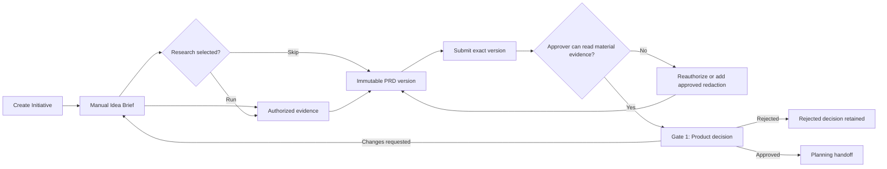

# M1 Alignment, Evidence, and PRD Task Packet

## Document control

| Field | Value |
| --- | --- |
| Milestone | M1 (alignment, evidence, immutable PRD versions, and Gate 1) |
| Status | `PREPARED_NOT_DISPATCHABLE`; task decomposition is complete; M0 dependencies and named material decisions remain open |
| Version | 1.0 |
| Date | 2026-08-21 |
| Product | Curve |
| Product baseline | [Curve PRD v0.12](../curve-ai-native-sdlc-prd.md) (product requirements, Curve-first shell, lifecycle, identity, evidence, and Gate 1 acceptance) |
| Architecture baseline | [Architecture](architecture.md) (definition domain, trust boundaries, asynchronous commands, and Temporal ownership) and [Domain model](domain-model.md) (Initiative, Activity, ArtifactVersion, Evidence, AccessEnvelope, and Gate entities) |
| Delivery baseline | [Development plan](development-plan.md) (M1 dependencies, traceability, and completion evidence) and [M1-M7 packet catalog](m1-m7-task-packets.md) (later-milestone materialization controls) |
| Minimum Curve ancestor | `e8dc8a32f884d6b9e5601e3cf44fab3859e05eac`, containing the proposed M0-S5 observability contract; dispatch pins the eventual merged Curve revision and context digest |
| Implementation repository | `git@github.com:faocampo/plane.git`, target `preview`, exact live base assigned only after the consuming M0 evidence merges |
| Owner and reviewer | Federico Ocampo (`faocampo`) until explicitly reassigned; the coding agent cannot satisfy human review |
| Default data | Synthetic `INTERNAL` fixtures; protected bodies and live provider access disabled |
| Default model/tool policy | No runtime model or external research call; fake providers only |
| Migration policy | Additive forward migration with pre-release reverse proof; no existing Plane roadmap or project migration |

## Outcome

Deliver the Curve product-definition path from a workspace-scoped Initiative to
an exact-version PRD Approval decision:



M1 supports a manual-first path and separately gated provider enhancements.
Manual Idea Brief and PRD authoring never depend on a model. Onyx retrieval,
model generation, protected evidence storage, and chargeable research each
activate only after their material decision and exact provider contract pass.

## Milestone entry and exit

### Entry gates

| Gate | Required evidence |
| --- | --- |
| M0 foundation | Accepted M0-02 (workspace persistence), M0-03 (core authorization), M0-05 (delivery kernel), M0-06 (Temporal skeleton), M0-07 (API/SSE), M0-08 (audit/observability), and M0-09 (provider registry) evidence at one exact Plane base |
| Curve contracts | One merged Curve revision containing the final M1 schemas, OpenAPI, event, workflow, authorization, and state-transition contracts plus a deterministic context digest |
| Human ownership | Federico Ocampo or a recorded replacement owns and reviews each exact packet |
| Runtime | Curve-enabled local Plane stack healthy; feature disabled by default; no live provider or model credential in the coding-agent environment |
| Protected evidence | D-009 (retention and erasure decision) `DECIDED` plus accepted M0-04 (protected storage) evidence before any protected body is persisted |
| Onyx | D-002 (Onyx delegated-identity decision) `DECIDED` and its two-user ACL/revocation proof accepted before live retrieval |
| Models | D-004 (model-gateway decision), D-005 (model/provider data-policy decision), and D-014 (budget-policy decision) `DECIDED` before any model call |

### Exit evidence

An authorized X3M user creates an Initiative, authors an attributed Idea Brief,
uses currently authorized evidence, creates and submits an immutable PRD version,
and receives a human Gate 1 decision bound to that exact version and evidence
snapshot. Two permitted users prove source-access isolation. Revoked evidence
fails closed at the next protected use. Research may be explicitly skipped.

## Delivery lanes

| Lane | Capabilities | Activation boundary |
| --- | --- | --- |
| Manual-first | Initiative, manual Idea Brief, manual PRD versions/diff, research skip/partial disposition, Gate 1 | M0 dependencies and M1 contracts; synthetic evidence may be used before protected storage activation |
| Delegated knowledge | Live Onyx read, evidence metadata/body, citation and source-access recheck | D-002 (Onyx delegated-identity decision), D-009 (retention and erasure decision), M0-04 (protected storage), and M0-09 (provider registry) |
| Model-assisted | Idea Brief refinement, bounded research, PRD generation/regeneration | D-004 (model-gateway decision), D-005 (model/provider data-policy decision), D-014 (budget-policy decision), plus destination permissions in every AccessEnvelope |

Model or Onyx disablement preserves the manual-first lane and immutable history.

## Repository-local implementation packets

Each row becomes a separately dispatchable Plane PR after its listed contracts
and dependencies are merged. Combining rows requires Federico's exact packet
approval and cannot cross a material activation boundary.

| Packet | Scope | Dependencies and material gates | Required evidence |
| --- | --- | --- | --- |
| M1-01A (Initiative domain/API) | Add workspace-scoped Initiative, three GateAssignments, lifecycle commands, optimistic concurrency, audit/outbox events, and OpenAPI | Accepted M0 core/API/Temporal/audit foundation; final M1 contracts | Migration forward/reverse, uniqueness, workspace isolation, actor/role denial, idempotency, state, pause/resume/cancel, and OpenAPI tests |
| M1-01B (Initiative shell) | Curve-first Initiatives list/create/detail experience with assignment and lifecycle controls | M1-01A (Initiative domain/API); approved screen contract | Browser, keyboard, screen-reader, responsive, error/retry, empty/loading, disabled-state, and role-visibility tests |
| M1-02A (manual Idea Brief) | `IDEA_BRIEF` Artifact and immutable/manual draft versions with attributed structured edits for problem, users, outcomes, assumptions, contradictions, blockers, and unknowns | M1-01A (Initiative domain/API); no model gate | Schema, attribution, concurrent edit, canonical digest, diff, validation, browser, and accessibility tests |
| M1-02B (model refinement) | Generate/regenerate a new Idea Brief version without overwriting human edits | M1-02A; D-004 (model-gateway decision), D-005 (model/provider data-policy decision), D-014 (budget-policy decision) | Prompt/model/policy/budget pins, no silent fallback, provenance, cancellation, redaction, diff, and failure tests |
| M1-03A (KnowledgeProvider contract) | Provider-neutral read-only search/access-check interface, fake provider, normalized citations, operation lifecycle, and reconciliation | M0-09 (provider registry); synthetic data only | Contract, timeout, retry, rate-limit, duplicate, cancellation, malformed result, injection, and workspace tests |
| M1-03B (Onyx adapter) | Live initiating-user Onyx search and source-access recheck | M1-03A; D-002 (Onyx delegated-identity decision) and approved deployed OpenAPI/profile; D-009 (retention and erasure decision) for persisted bodies | Two-user ACL, expiry/revocation, durable-wait reauthorization, source deletion, rate limit, outage, redaction, and credential-leakage tests |
| M1-04A (evidence metadata) | EvidenceItem metadata, immutable EvidenceSnapshot and ordered members, AccessEnvelope metadata, citations, claim links, freshness, and authorized UI | M1-03A; synthetic metadata only | Digest/order, claim trace, ACL propagation, classification, material flag, inaccessible approver, and cross-workspace tests |
| M1-04B (protected evidence bodies) | Content-addressed evidence/excerpt storage, streaming reads, DLP/redaction, retention hooks, hold/tombstone/erasure projection | M1-04A; D-009 (retention and erasure decision); accepted M0-04 (protected storage); M1-03B for Onyx bodies | Object digest, authorization-before-read, size/stream, retention, hold, erasure, backup/restore, destination leakage, and cleanup tests |
| M1-05A (research lifecycle) | Optional `RESEARCH` Activity state, required/optional question classification, explicit skip, partial coverage, cancellation, and manual dossier version | M1-01A, M1-02A, M1-04A | Skip, mandatory-question blocker, partial/failed coverage, state, audit, cancellation, and immutable dossier tests |
| M1-05B (provider/model research) | Bounded asynchronous research using only approved destinations and budgets | M1-05A, M1-03B, M1-04B; D-004 (model-gateway decision), D-005 (model/provider data-policy decision), D-014 (budget-policy decision) | Budget reserve/exhaustion/release, citations, fact/inference split, provider outage, cancellation, provenance, and no-claim-without-source tests |
| M1-06A (PRD contracts/domain) | `PRD` Artifact, immutable versions, completeness rules, evidence snapshot, parent/supersession, structural diff, and submit command | M1-02A, M1-04A | Schema, canonical digest, immutable submitted body, diff, completeness, concurrency, source-access, and supersession tests |
| M1-06B (PRD authoring UI) | Manual author/edit/diff/submit/revise experience with evidence side panel and material-claim mapping | M1-06A; approved screen contract | Browser, accessibility, large-document performance, stale edit, evidence-denied, diff, and submission tests |
| M1-06C (PRD generation) | Generate a new PRD version from exact Idea Brief/research/evidence versions | M1-06A; D-004 (model-gateway decision), D-005 (model/provider data-policy decision), D-014 (budget-policy decision) | Exact input/model/prompt/policy/budget provenance, redaction, cancellation, deterministic structural validation, and no-overwrite tests |
| M1-07A (Gate 1 workflow/API) | Exact-version Product Approval submission, assignment, access recheck, risk confirmation, approval/changes-requested/rejection, and planning handoff | M1-06A, M0-06 (Temporal skeleton), M0-03 (core policy) | Human-only decision, assignment, exact-version invalidation, evidence access, risk/separation, idempotency, audit/outbox, replay, and notification-intent tests |
| M1-07B (Gate 1 review UI) | Product-approver review with exact PRD/diff/evidence, access failures, decision rationale, and immutable history | M1-07A; approved screen contract | Role/visibility, inaccessible evidence, exact-version race, keyboard/screen-reader, responsive, and decision-confirmation tests |

## Normative contract set to publish before dispatch

The Curve repository owns these versioned contracts. The Plane implementation
records the exact merged Curve revision and generated-client digest.

| Contract | Minimum content |
| --- | --- |
| Initiative JSON Schema | Common workspace record, mode, Product reference, keyword/title/description, risk, lifecycle, paused-from state, workflow version, creator, current artifact pointers, three assignments, optimistic version, timestamps |
| Artifact and ArtifactVersion JSON Schemas | Stable kind, immutable numbered version, state, body schema/version/ref/digest, evidence snapshot, parent, provenance, submit/supersede invariants |
| Idea Brief body schema | Problem, affected users, desired outcomes, non-goals, constraints, assumptions, contradictions, blockers, unknowns, attribution, validation action, owner, and due stage |
| PRD body schema | Executive summary, problem/context, goals/non-goals, personas, workflow, requirements, gates, integrations, data/security, quality, rollout, KPIs, acceptance, risks, assumptions, open questions, and requirement IDs |
| EvidenceItem/EvidenceSnapshot schemas | External source/version, principal, retrieval, digest, classification, AccessEnvelope, trust/redaction/retention state, ordered snapshot membership, material flag, claim references, and deterministic digest |
| Research Activity and dossier schemas | Optional/required questions, state, skip/failure/partial reason, budget policy, coverage gap, fact/inference/unknown separation, citations, and immutable output |
| GateAssignment/GateDecision schemas | Three gate types, human assignment, bounded delegation, exact subject/version, policy versions, evidence-access result, human decision/rationale, supersession, and immutable history |
| Curve OpenAPI extension | Workspace-scoped Initiative, ArtifactVersion, Evidence, Research, submission, Gate 1 decision, operation, pagination, ETag/If-Match, idempotency, Problem Details, and SSE resources |
| Domain-event schemas | `initiative.created`, `initiative.refinement_accepted`, `initiative.paused`, `initiative.resumed`, `initiative.cancelled`, `artifact.version_created`, `artifact.submitted`, `evidence.snapshot_created`, `research.skipped`, `prd.approved`, `prd.changes_requested`, and `prd.rejected` |
| Temporal definition workflow | Stable workflow ID/generation, event-driven start, research child/activity, Gate 1 durable wait, signals/queries, cancellation, retries, timeouts, version markers, continue-as-new threshold, and replay corpus |
| Authorization/state matrices | Creator/contributor/product-approver/service actions, same-workspace/ACL/classification/evidence access, risk separation, exact transitions, and fail-closed errors |
| Requirement trace | FR-001 through FR-007, FR-015, FR-021 through FR-024, FR-042 through FR-044; applicable NFRs; AC-01 through AC-09, AC-20, AC-34, AC-52 through AC-54, and AC-60 mapped to contracts/tests |

No coding packet is `READY` while one of its applicable contracts above is only
described rather than published and approved.

## API and asynchronous pattern

1. Synchronous commands authenticate, authorize, validate schema and expected
   version, commit aggregate/audit/outbox atomically, and return the resource or
   `202 Accepted` Operation.
2. Provider access, model generation, research, DLP, and protected-body work are
   asynchronous activities. They never execute inside the initiating database
   transaction.
3. The relay delivers at least once; operation/event/provider idempotency prevents
   duplicate versions, EvidenceItems, activities, or decisions.
4. Temporal carries identifiers and safe digests only. Activities resolve
   protected bodies after a fresh policy/source-access check.
5. SSE publishes authorized projections and resumes from the last event ID. It
   does not carry credentials, protected source bodies, model prompts, or hidden
   chain-of-thought.
6. Every generated artifact creates a new immutable attributed version. Human
   edits remain distinguishable and are never overwritten silently.

## Required commands

Every Plane packet records the exact commands supported by its live base. The
minimum command set is:

```text
git diff --check
pnpm check:contracts
node apps/api/plane/curve/contracts/check-integrity.mjs
docker compose -f docker-compose-test.yml run --rm --build api-tests pytest plane/curve/tests
docker compose -f docker-compose-test.yml run --rm api-tests python manage.py makemigrations --check --dry-run
pnpm check
pnpm build
docker compose -f docker-compose-test.yml up --build --abort-on-container-exit --exit-code-from api-tests
docker compose -f docker-compose-test.yml down -v
```

UI packets add the focused Vitest/browser/accessibility commands discovered from
the accepted Plane base. Temporal packets add deterministic replay fixtures.
Provider packets add fake-provider conformance. A command absent from the live
repository is replaced by a verified equivalent in the exact dispatch packet,
not invented by the coding agent.

## Cross-cutting acceptance

- Curve disabled leaves Plane behavior, routes, navigation, workers, and network
  activity unchanged.
- Every entity, event, cache/object key, authorization request, provider
  connection, audit record, and operation carries `workspace_id`.
- Cross-workspace and inaccessible-object probes reveal no object existence,
  source metadata, provider detail, or protected body.
- Duplicate commands, relay deliveries, callbacks, workflow replay, and SSE
  reconnect produce one authoritative domain effect.
- Submitted artifact bodies and gate decisions are immutable; a revision creates
  a new version and invalidates only exact dependent approvals.
- Pause, cancel, timeout, provider outage, worker restart, and source revocation
  reach a deterministic safe state with attributable evidence.
- Manual authoring remains usable while models, Onyx, or protected storage are
  disabled.
- No agent/service identity approves Gate 1 or substitutes for the assigned
  product approver.
- Logs, traces, metrics, SSE, Problem Details, provider errors, and PR evidence
  contain no credential or protected body.
- No Critical/High security finding and no regression in repository-native CI.

## Dispatch readiness matrix

| Packet group | Current state | Missing evidence before `READY` |
| --- | --- | --- |
| M1-01A/B (Initiative) | `PREPARED` | Accepted consuming M0 base; Initiative/OpenAPI/event/state contracts; exact UI contract; commands and context digest |
| M1-02A (manual Idea Brief) | `PREPARED` | M1-01A; Idea Brief/ArtifactVersion contracts; UI contract; exact dispatch values |
| M1-02B and M1-06C (model authoring) | `BLOCKED_MATERIAL_DECISIONS` | D-004 (model-gateway decision), D-005 (model/provider data-policy decision), D-014 (budget-policy decision), evaluations, and exact model/prompt/tool/budget pins |
| M1-03A (fake KnowledgeProvider) | `PREPARED` | M0-09; provider contract and fixtures; exact dispatch values |
| M1-03B (live Onyx) | `BLOCKED_MATERIAL_DECISION` | D-002 (Onyx delegated-identity decision), deployed OpenAPI/version, two-user proof, and external-read authorization |
| M1-04A (evidence metadata) | `PREPARED` | M1-03A; evidence/envelope/snapshot contracts; exact dispatch values |
| M1-04B (protected evidence) | `BLOCKED_MATERIAL_DECISION` | D-009 (retention and erasure decision), accepted M0-04 protected storage, retention/hold/erasure contracts |
| M1-05A (research lifecycle/skip) | `PREPARED` | Activity/dossier contracts and upstream manual-lane dependencies |
| M1-05B (provider/model research) | `BLOCKED_MATERIAL_DECISIONS` | D-002 (Onyx delegated-identity decision), D-004 (model-gateway decision), D-005 (model/provider data-policy decision), D-009 (retention and erasure decision), and D-014 (budget-policy decision) plus their applicable provider/storage proofs |
| M1-06A/B (manual PRD) | `PREPARED` | Upstream manual-lane packages; PRD/OpenAPI/event contracts; UI contract |
| M1-07A/B (Gate 1) | `PREPARED` | M1-06A; GateAssignment/GateDecision/workflow/policy contracts and review UI contract |

`PREPARED` records complete scope and gates; it grants no implementation or
external-provider authority.

## Evidence and PR contract

Each implementation PR records its exact Curve contract/context revision, Plane
base/head, owner/reviewer, one packet, changed-file inventory, migration status,
all command results, requirement/test trace, data/model/tool/network budget,
security findings, disabled-state behavior, and rollback evidence. Provider
activation evidence additionally records the approved decision and sanitized
connection/version/conformance result.

## Stop conditions

The coding agent stops before mutation when the exact contract/context/base,
owner/reviewer, one-repository scope, dependency evidence, commands, acceptance
tests, data/model/tool/budget/egress values, migration behavior, or rollback is
absent. It also stops when implementation would decide D-002 (Onyx
delegated-identity decision), D-004 (model-gateway decision), D-005
(model/provider data-policy decision), D-009 (retention and erasure decision),
or D-014 (budget-policy decision); use live Onyx/model/protected data; create an
unapproved external effect; weaken workspace/evidence access; or add a fourth
Initiative gate.

## Rollback and disablement

1. Disable the affected M1 capability and navigation while preserving authorized
   read access to immutable history.
2. Revoke provider/delegation handles and cancel or reconcile active Operations.
3. Revert the additive code PR. Before shipment, prove the additive migration
   reverses against a disposable database; after shipment use an additive
   compensating migration when schema removal is approved.
4. Preserve lawful audit metadata, submitted artifact versions, and gate
   decisions according to D-009 (retention and erasure decision).
5. Re-enable only against a new exact contract/context/base with all material
   gates satisfied.
