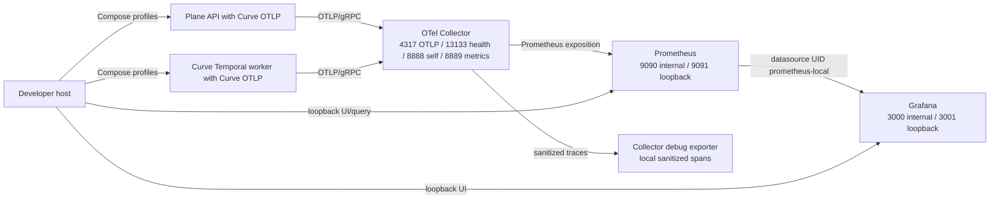

# OBS-BIND-001 Local Observability Binding

> Sanitized public reference. Fictional identities cannot authorize execution.
> Historical approvals apply only to their original bytes; see
> [public contract edition](public-reference-sanitization.md) (sanitization, integrity and approval boundaries).

## Document control

| Field | Value |
| --- | --- |
| Decision | OBS-BIND-001 (local Docker OTLP, Prometheus, Grafana, and path-health binding) |
| Status | `DECIDED_LOCAL_ONLY`; published at Curve merge `43480ca8463d0b40d436145aeb19fbbc8c2be472` and consumed by M0-S5B at Plane merge `1b06153f6f49848f208808f4f09385a581a55d26` |
| Version | 1.0 |
| Date | 2026-08-22 |
| Product | Curve |
| Decision owner | Designated reviewer, Designated technical owner |
| Local environment owner | Developer running the local environment |
| Platform Operations approval | Not required for this disposable local proof |
| Machine contract | [OBS-BIND-001 v1](../../contracts/observability/obs-bind-001-local-v1.json) (exact local topology, images, endpoints, provisioning, health, cleanup, and promotion values) |
| Consuming packet | [M0-S5 observability task packet](m0-s5-observability-task-packet.md) (M0-S5A telemetry kernel and M0-S5B local platform-integration acceptance) |

## Decision

M0-S5B (local Collector, Prometheus, Grafana, dashboard, alert, and failure-path
proof) extends the existing Plane Docker Compose stack. The integration uses the
existing `dev_env` network, a separately opt-in `curve-observability` profile,
and repository-owned configuration. It is limited to synthetic local data and
loopback host access.

The binding is:

| Input | Decided value |
| --- | --- |
| Target environment | Local development using Docker Compose |
| OTLP endpoint | `http://otel-collector:4317` in Docker; `http://localhost:4317` from a host process |
| OTLP protocol | OTLP/gRPC |
| TLS and authentication | Insecure local transport; no OTLP authentication secret |
| Prometheus | Local container; Docker URL `http://prometheus:9090`; loopback URL `http://localhost:9091` |
| Metric ingestion | OTel Collector Prometheus exporter on `otel-collector:8889`; Prometheus scrapes it |
| Grafana | Local container; loopback URL `http://localhost:3001`; default organization |
| Grafana datasource | Name `Prometheus Local`; UID `prometheus-local`; URL `http://prometheus:9090` |
| Grafana folder | Title `Curve`; UID `curve` |
| Provisioning | Repository-owned, file-based datasource, folder, and dashboard provisioning |
| Application alert evaluation | Prometheus evaluates the four versioned M0-S5A rules |
| Local alert surface | Grafana UI only; no external notification delivery |
| Path health | Collector health extension, Collector self-metrics, and two Prometheus scrape targets/rules |
| Persistence | Docker named volumes with 24-hour Prometheus retention |
| Retention and cleanup | Disposable development data; `docker compose ... down -v` removes it |
| Promotion | Staging follows only after local acceptance and a separate staging decision |

The loopback Prometheus port is `9091` because the existing Plane local stack
binds MinIO console to host port `9090`. The Docker-internal Prometheus endpoint
remains the selected `http://prometheus:9090` value.

## Runtime topology



All services join the existing `dev_env` bridge network. M0-S5B adds no
dedicated network or proxy. Host ports bind to `127.0.0.1`; container-to-
container access follows normal Compose service discovery.

## Version and supply-chain pins

| Component | Immutable multi-architecture image | Primary source |
| --- | --- | --- |
| OpenTelemetry Collector Contrib | `otel/opentelemetry-collector-contrib:0.159.0@sha256:1f2c54a30e713fac6b3ae77a1ec84010c2007e29ced8ec666214fc2f6739c1cc` | [OpenTelemetry Collector release v0.159.0](https://github.com/open-telemetry/opentelemetry-collector-releases/releases/tag/v0.159.0) (signed upstream image and binary release) |
| Prometheus | `prom/prometheus:v3.10.0@sha256:4a61322ac1103a0e3aea2a61ef1718422a48fa046441f299d71e660a3bc71ae9` | [Prometheus release v3.10.0](https://github.com/prometheus/prometheus/releases/tag/v3.10.0) (immutable upstream release) |
| Grafana | `grafana/grafana:13.1.0@sha256:121a7a9ece6dc10b969f1f96eed64b4f07dfac0d0b8abc070f7cb83bbde86f63` | [Grafana release v13.1.0](https://github.com/grafana/grafana/releases/tag/v13.1.0) (signed upstream release) |

The implementation uses the tag and digest together and verifies both Linux
AMD64 and ARM64 manifests. A version change requires a new reviewed binding
version or implementation follow-up; a floating tag is prohibited.

## Configuration contract

### Compose and repository paths

| Asset | Required implementation path |
| --- | --- |
| Compose overlay | `docker-compose-curve.yml` |
| Collector configuration | `deployments/curve-observability/otel-collector.yaml` |
| Prometheus configuration | `deployments/curve-observability/prometheus/prometheus.yml` |
| Independent path-health rules | `deployments/curve-observability/prometheus/curve-path-alerts.yaml` |
| Grafana datasource provisioning | `deployments/curve-observability/grafana/provisioning/datasources/curve-prometheus.yaml` |
| Grafana dashboard provisioning | `deployments/curve-observability/grafana/provisioning/dashboards/curve.yaml` |
| Existing dashboard | `apps/api/plane/curve/observability/grafana/curve-m0-dashboard.json` |
| Existing application rules | `apps/api/plane/curve/observability/prometheus/curve-m0-alerts.yaml` |
| Proof runner | `scripts/curve-observability-proof.mjs` |

The `api` and `curve-worker` services receive these local-only values while the
observability profile is selected:

```text
CURVE_TELEMETRY_MODE=OTLP
CURVE_OTEL_EXPORTER_OTLP_ENDPOINT=http://otel-collector:4317
CURVE_OTEL_EXPORTER_OTLP_PROTOCOL=grpc
CURVE_OTEL_EXPORTER_OTLP_INSECURE=true
CURVE_TELEMETRY_SCOPE_KEY_ID=local-dev-v1
CURVE_TELEMETRY_SCOPE_HMAC_KEY=<ephemeral untracked base64url key>
```

The workspace-scope HMAC key is data-minimization material rather than OTLP
authentication. The proof runner creates it in an ignored local environment
file with owner-only permissions, never prints it, and removes it during
cleanup. Missing or invalid values leave the Curve exporter disabled.

### Collector pipelines

The Collector configuration uses:

- OTLP/gRPC receiver on `0.0.0.0:4317` for traces and metrics;
- memory-limiter and batch processors with bounded local queues;
- Prometheus exporter on `0.0.0.0:8889` for application metrics;
- debug exporter for sanitized local trace proof only;
- health-check extension on `0.0.0.0:13133`; and
- Collector self-telemetry on `0.0.0.0:8888`.

Prometheus scrapes `curve-otel-metrics` at `otel-collector:8889` and
`otel-collector-self` at `otel-collector:8888`. The Collector Prometheus
exporter must preserve the telemetry manifest's
`UnderscoreEscapingWithSuffixes` names. No remote-write, external exporter,
trace backend, log backend, or cloud endpoint is configured.

### Grafana and alerts

Grafana provisions datasource UID `prometheus-local`, folder UID `curve`, and
the existing `curve-m0-operations` dashboard from repository files. Anonymous
Viewer access is enabled only on the loopback-bound local container; dashboard
editing and admin APIs retain their normal local restrictions.

Prometheus loads and evaluates:

1. the four application rules in the M0-S5A telemetry manifest; and
2. `CURVE_OTEL_COLLECTOR_DOWN` and `CURVE_OTEL_EXPORT_PATH_DOWN` for the two
   Collector scrape jobs.

Grafana is the sole local viewing surface for alert state. No Alertmanager,
email, Slack, webhook, pager, or other external notification target is present.

## Executable implementation plan

| Checkpoint | One reviewable outcome | Evidence |
| --- | --- | --- |
| M0-S5B-1 Compose and config | Add the three digest-pinned services, named volumes, profile, mounts, local environment builder, and config syntax checks | Rendered Compose model; Collector config validation; `promtool check config` and `promtool check rules` |
| M0-S5B-2 Provisioning | Provision Prometheus datasource UID, Curve folder/dashboard, four application rules, and two path-health rules | Grafana provisioning logs/API; Prometheus rules API; exact UID/title/rule inventory |
| M0-S5B-3 Real telemetry | Run the existing foundation proof through API/outbox/Temporal/audit and observe translated metrics plus sanitized trace export | Prometheus query results; Collector accepted-signal counters; sentinel leakage scan |
| M0-S5B-4 Alert and outage proof | Exercise deterministic application-rule fixtures, then interrupt Collector and its metric-export port independently | Six alert-state transitions; `up`/health evidence; application truth remains available |
| M0-S5B-5 Disablement/regression/cleanup | Disable Curve telemetry, omit the profile, rerun the foundation proof, run regression, and remove named volumes | No exporter call; healthy Plane behavior; test results; cleanup receipt |

Each checkpoint is one Plane PR or one independently reviewable commit within a
single M0-S5B PR. The implementation adds no database migration.

## Exact local commands

The implementation supplies the proof runner and keeps the commands below
stable. The runner uses only synthetic local values and stores sanitized
evidence under a disposable directory outside Git.

```text
docker compose -f docker-compose-local.yml -f docker-compose-curve.yml --profile curve --profile curve-observability config
node scripts/curve-observability-proof.mjs prepare
node scripts/curve-observability-proof.mjs up
node scripts/curve-observability-proof.mjs verify-health
node scripts/curve-observability-proof.mjs run-foundation
node scripts/curve-observability-proof.mjs verify-telemetry
node scripts/curve-observability-proof.mjs verify-alerts
node scripts/curve-observability-proof.mjs verify-path-failure
node scripts/curve-observability-proof.mjs verify-disablement
node scripts/curve-observability-proof.mjs cleanup
```

The proof runner wraps the underlying Docker, Prometheus HTTP API, Grafana
health/provisioning, and application proof commands; rejects a non-local
endpoint; redacts environment values; uses bounded waits; and always exposes a
cleanup command after partial failure.

## Acceptance criteria

| ID | Given / when / then |
| --- | --- |
| OBS-AC-01 | Given the two Compose overlays and both profiles, when the stack starts, then Collector, Prometheus, Grafana, API, Temporal, and the Curve worker are healthy on `dev_env`, and host observability ports bind only to loopback. |
| OBS-AC-02 | Given one real foundation operation, when it completes, then Prometheus contains the manifest-pinned translated Curve metrics and Collector self-metrics show accepted OTLP signals without rejected points. |
| OBS-AC-03 | Given Grafana provisioning, when its inventory is queried, then datasource UID `prometheus-local`, folder `Curve`, and dashboard UID `curve-m0-operations` exist and all ten panels resolve against Prometheus. |
| OBS-AC-04 | Given deterministic synthetic alert fixtures, when Prometheus evaluates the repository-owned rules for their declared durations, then all four application alerts become pending/firing and recover; Grafana displays their states without external delivery. |
| OBS-AC-05 | Given the Collector process or application-metric exposition path is interrupted, when Prometheus evaluates path-health rules, then the corresponding independent alert fires and the application preserves Operation/audit behavior. |
| OBS-AC-06 | Given two synthetic workspaces and a key rotation, when metrics, sanitized spans, and logs are inspected, then raw workspace IDs and sentinel values are absent, scopes differ, and the new bounded key ID appears. |
| OBS-AC-07 | Given `CURVE_TELEMETRY_MODE=DISABLED` and the observability profile omitted, when the same foundation proof runs, then no OTLP connection is attempted and authoritative Operation, outbox, Temporal, audit, and SSE behavior remains healthy. |
| OBS-AC-08 | Given proof completion or failure, when cleanup runs, then observability containers and `curve_prometheus_data`/`curve_grafana_data` are removed and the ordinary Plane local stack can run unchanged. |

Local acceptance is complete only when all eight criteria have attributable,
sanitized evidence and the repository-native checks remain green.

## Failure handling and rollback

| Failure | Required behavior |
| --- | --- |
| Invalid/missing local binding | Curve exporter stays disabled; proof stops before starting observability services. |
| Collector unavailable | Curve records bounded process-local export diagnostics; business/audit transactions continue; Prometheus path-health state detects the Collector outage. |
| Collector metrics endpoint unavailable | `CURVE_OTEL_EXPORT_PATH_DOWN` fires from Prometheus scrape health. |
| Prometheus unavailable | Grafana datasource health fails; application and immutable audit truth continue. |
| Grafana unavailable | Metrics and Prometheus alert evaluation continue; UI proof waits or fails without changing application state. |
| Secret/sentinel/raw workspace leakage | Stop, preserve sanitized diagnostic metadata, clean up the local stack, and do not promote. |

Rollback sets `CURVE_TELEMETRY_MODE=DISABLED`, restarts Curve services, omits
`curve-observability`, and removes the disposable services and volumes:

```text
docker compose -f docker-compose-local.yml -f docker-compose-curve.yml --profile curve --profile curve-observability down -v
```

No database migration, business-record deletion, production notification, or
external infrastructure mutation is involved.

## Promotion boundary

This decision authorizes local development only. Staging requires a separate
binding that identifies Example Organization-managed OTLP/TLS/authentication, private service
discovery, Prometheus/Grafana provisioning ownership, alert routing, retention,
backup, and operational approval. Local image or port choices do not silently
become staging defaults.

## Primary implementation references

- [OpenTelemetry Collector configuration](https://opentelemetry.io/docs/collector/configuration/) (receiver, processor, exporter, extension, and service-pipeline configuration).
- [OpenTelemetry Collector Contrib Prometheus exporter](https://github.com/open-telemetry/opentelemetry-collector-contrib/tree/main/exporter/prometheusexporter) (Prometheus exposition from Collector metrics).
- [Prometheus configuration](https://prometheus.io/docs/prometheus/latest/configuration/configuration/) (scrape configuration and rule files).
- [Prometheus alerting rules](https://prometheus.io/docs/prometheus/latest/configuration/alerting_rules/) (rule evaluation and alert state).
- [Grafana provisioning](https://grafana.com/docs/grafana/latest/administration/provisioning/) (file-based datasource and dashboard provisioning).
- [Docker Compose profiles](https://docs.docker.com/compose/how-tos/profiles/) (opt-in local service groups).
