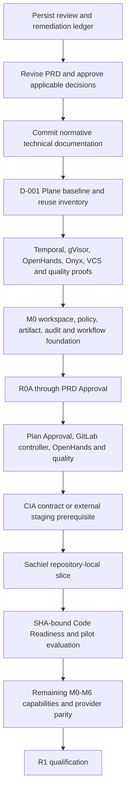

# Curve Implementation-Readiness Review and Remediation Ledger

## Document control

| Field | Value |
| ----- | ----- |
| Status | Remediation in progress; implementation authority is package-specific |
| Version | 0.7 |
| Review date | 2026-08-20 |
| Reviewed baseline | Curve PRD v0.4; remediation target advanced through Curve PRD v0.10 and the governed technical suite |
| Audience | Product, engineering, architecture, security, platform operations, legal, and AI coding agents |
| Authority | Records gaps and closure evidence; it does not override the PRD or approve an ADR |

## Executive assessment

The Curve direction is technically coherent: Plane remains the work-management foundation, Temporal owns durable Curve workflows, Onyx supplies permission-aware knowledge, OpenHands is the first execution provider, and trusted Curve controllers retain all VCS mutation authority. The proposed Loomit SDK Compatibility pilot is a suitable bounded validation scenario.

Readiness is now package-specific. D-001 (Plane upstream foundation decision)
is `DECIDED`; D-003 (runtime topology and trust-zone decision) has an
owner-approved private-platform direction pending exact-head amendment merge;
M0-S1 (module shell) and M0-S2 (operation and delivery kernel) are
implemented and merged. M0-03 (core authorization and policy kernel) is also
implemented and merged at Plane `preview` `922dd6d...`; M0-S3 (local Temporal
round-trip implementation packet) is the next executable slice after its exact
dispatch revision and context are materialized. Other packages retain their recorded decision
and proof blockers, preserving named-owner authority over infrastructure,
security, provider, retention, quality, and pilot-contract behavior.

The remediation objective is therefore:

> Make the R0B pilot executable without representing it as R1, while preserving the complete M0-M6 path and acceptance contract required for a later R1 claim.

Application-code implementation begins only when all `P0` findings required by
the target work package are closed by an approved PRD revision, ADR, proof, or
external contract as specified below. Every package retains its own material
blockers after adjacent packages complete.

## Review scope and evidence

The review covered:

- The complete [Curve PRD](../curve-ai-native-sdlc-prd.md), including scope, lifecycle, requirements, NFRs, acceptance criteria, risks, decisions, and architecture handoff.
- The complete technical suite indexed by the [technical README](README.md).
- The historical Plane review baseline at `31853ab2b8b7810c59dc30d22e52c8f4b5a71a47` and the current accepted M0-03 implementation descendant `922dd6de5d5ed5081f35cd88343154022867ccad` on branch `preview`.
- The inspected Sachiel baseline at commit `07f0a7aeedc2930e99e42524ce75c2150a700c4a` on branch `main`.
- The inspected General Config baseline at commit `d95dec9b913a54b956f96e96de186003f292d082` on branch `master`.
- Official upstream documentation for Temporal, gVisor, OpenHands, Onyx, CodeQL, EKS, OpenFeature, and AGPL obligations.

Repository SHAs above are review evidence, not approved Gate 2 base SHAs. Gate 2 must resolve and pin current repository bases again.

## Severity and state

| Value | Meaning |
| ----- | ------- |
| P0 | Blocks the affected milestone or pilot from implementation. |
| P1 | Must close before production qualification or before the affected capability is dispatched. |
| P2 | Important completeness or operability improvement; may be scheduled if it does not weaken a gate. |
| OPEN | Gap is confirmed and has no approved closure evidence. |
| IN PROGRESS | Documentation, decision, proof, or contract work has started. |
| BLOCKED | Closure requires an identified external owner or missing authoritative input. |
| CLOSED | The listed closure evidence exists and is approved. |

## Remediation ledger

| ID | Priority | Finding | Affected decisions or milestones | Required closure evidence | Owner | State |
| -- | -------- | ------- | -------------------------------- | ------------------------- | ----- | ----- |
| R-001 | P0 | D-001-D-016 had all remained `OPEN`, although the execution plan treated several as selected. | D-001-D-016; M0-M6 | D-001 is decided with attributable exact-head evidence. D-003 retains its original approval evidence and has an owner-approved 2026-08-20 private-platform amendment pending exact-head merge; environment activation remains package-gated. Other scopes remain `PROPOSED` or `OPEN`; each consuming package still requires its owner-approved ADR status/evidence. | Named PRD decision owners | IN PROGRESS |
| R-002 | P0 | The planned pilot was GitLab + OpenHands, while the early normative R0B text named GitHub + Orca. | Release baseline; D-006-D-008; D-015 | R0B now identifies GitLab/OpenHands as the validation configuration. R1 separately requires both VCS providers, OpenHands automation, and the developer-operated Orca MCP profile. | Product owner and engineering lead | CLOSED |
| R-003 | P0 | The plan treated Orca as an automated provider without an authoritative API while developers actually operate it manually. | D-006-D-007; M0-09; M4; AC-16 | OpenHands is the sole automated provider and Orca is a developer-operated MCP client. The D-006/D-007 dependency order, trust/error contracts, named-owner decisions, and conformance proof remain open and must be resolved by Security, Platform Administration, and Agent Platform before MCP implementation. | Agent platform owner; security and platform administration | IN PROGRESS |
| R-004 | P0 | D-004 selected Portkey or Envoy, while planning selected a thin Curve gateway over OpenRouter and only three new infrastructure services. | D-004; model-enabled M1/M3/M5 | The PRD and technology baseline now consistently specify the in-process Curve Model Gateway and no longer block the model-free M0 skeleton; closure still requires the approved ADR, OpenRouter contract proof, failure behavior, policy, telemetry, ownership, and exit strategy before model use. | AI platform and operations | IN PROGRESS |
| R-005 | P0 | The Plane fork lacked an authoritative `upstream` remote/ref, and rebasing shared `preview` could have rewritten published history. | D-001; M0 | D-001 is decided: the fetch-only upstream, exact pins, ancestry report, isolated candidate, checks, local smoke, community/commercial boundary, licensing obligations, ownership, and exact-head dispositions are approved. Candidate `d380678...` is merged without rewriting history and foundation `549db1a...` is preserved. M0-01, M0-S2, and M0-03 completed their accepted implementation proofs; current `preview` is `922dd6d...`. | Federico Ocampo, CTO at X3M | CLOSED |
| R-006 | P0 | The supplied General Config repository does not implement the target `/mm/organizations/{orgId}/apps/{appId}` route. | D-015; pilot Gate 2 | R0B now models CIA as an external versioned-contract/staging prerequisite; closure requires the authoritative OpenAPI artifact, deployed version, staging probe, and owner approval. | CIA TL and Product owner | IN PROGRESS |
| R-007 | P0 | The proposed SDK compatibility wire shape used camel case, while inspected Sachiel wire representations use snake case. | Pilot contract; M3; M5 | The reference contract now specifies snake-case wire fields and a camel-case mapper; closure requires CIA/Sachiel approval, authoritative OpenAPI, and consumer contract tests. | CIA TL and Sachiel TL | IN PROGRESS |
| R-008 | P0 | The four-state UI requirement did not distinguish missing compatibility data from failure of the App endpoint itself. | Pilot acceptance; Gate 2; Gate 3 | The reference contract now separates omitted compatibility on a successful App response from full App failure and defines unknown/invalid behavior; closure requires owner approval and fixtures. | Product approver and both TLs | IN PROGRESS |
| R-009 | P0 | Manual regression was required before Code Readiness, but no SHA-bound candidate mechanism was defined. | M5; Gate 3; AC-44 | R0B now specifies an exact-head local review against approved staging/synthetic fixtures with invalidation; closure requires Platform/Code Approver approval and a reproduced evidence record. | Platform operations and Code approver | IN PROGRESS |
| R-010 | P0 | CodeQL licensing and operation for private GitLab repositories are not approved. | D-010; M5 | AppSec/legal decision selecting licensed CodeQL use or an X3M-approved equivalent, including tool versions and evidence ingestion. | Application security and legal | BLOCKED |
| R-011 | P0 | gVisor on EKS requires node installation and runtime integration beyond a `RuntimeClass`. | D-003; M4 | Staging proof with supported node OS/architecture/containerd, runsc/shim, custom AMI/bootstrap, runner pool, observability, upgrade, quarantine, and cleanup tests. | Platform operations | OPEN |
| R-012 | P0 | OpenHands deployment/API mode and version are not pinned. | M4 | ADR and conformance proof selecting Agent Server/SDK/image digest, Curve-owned pod provisioning, authenticated event/artifact transport, heartbeat, cancellation, and reconciliation. | Agent platform owner | OPEN |
| R-013 | P0 | Temporal production topology is described at service level but not fully operationalized; the original local contract added Curve-specific networks and a proxy. | D-003 (runtime topology and trust-zone decision); M0-S3 (local Temporal round-trip implementation packet); non-local M0/M4/M6 | Federico's 2026-08-20 direction selects SDK 1.31.0, Plane's shared local `dev_env`, direct loopback Temporal ports, private EKS/VPC/VPN connectivity, `ClusterIP`, a dedicated Curve namespace by default, internal UI ingress, workload identity/Secrets Manager, authenticated non-local clients, synthetic local data, and M0-S3 as the executable proof. Exact-head amendment merge and accepted M0-S3 runtime evidence close the local slice. Environment activation still requires pinned images, persistence/visibility placement, certificates, retention, upgrade, backup/restore, RPO/RTO, DR, capacity, cost, and named ownership evidence. | Federico Ocampo for connectivity direction; named Platform Operations owners for environment activation | IN PROGRESS |
| R-014 | P0 | Retention is called manual-governed, but no class-by-asset periods or legal-hold/backup behavior exist. | D-009; M0 | Approved retention matrix for bodies, derivatives, audit, backups, sandboxes, previews, tombstones, legal holds, and cryptographic erasure. | Security, privacy, and legal | BLOCKED |
| R-015 | P1 | D-011 leaves the flag backend open; the plan says Curve owns flags while Sachiel already uses Flipt. | D-011; M5 | Approved Curve OpenFeature backend/provider and registered Sachiel Flipt delivery profile with naming, environments, targeting, audit, expiry, cleanup, and outage behavior. | Platform operations | OPEN |
| R-016 | P1 | Onyx OAuth delegation is a direction, not a proven per-operation identity contract. | D-002; M1 | X3M Onyx proof covering issuer/audience/scopes, token exchange or pass-through flow, expiry, revocation, durable-wait reauthorization, source ACLs, and audit. | Security and identity owner | OPEN |
| R-017 | P1 | Quality policy defined a threshold but not executable tool/rule/licensing/applicability semantics. | D-010; M5 | The PRD/domain model now define precedence, applicability, fail-closed unknowns, pinned manifests, severity normalization, non-waivable classes, false-positive/reclassification authority, limited waiver, expiry, and SHA invalidation; closure requires the D-010 tool/rule/license manifest and AppSec approval. | Application security | IN PROGRESS |
| R-018 | P1 | Pilot KPI definitions mixed elapsed production lead time, active human effort, idea-to-draft, and the PRD's idea-to-ready north star. | D-015; D-016; M6 | The pilot protocol now separates the clocks, external wait, role time, binary first pass, and three-initiative aggregate; closure requires Product confirmation whether the seven-day baseline is active effort or elapsed lead time and approval of event definitions. | Product owner | IN PROGRESS |
| R-019 | P1 | Budget caps lacked reservation, concurrency, reconciliation, reset, currency, exception-expiry, and cost-scope semantics. | D-014; M4; M6 | The PRD/domain model now define atomic multi-scope reservations, immutable settlement/adjustment, period/price versions, pause behavior, and expiring exceptions; closure requires Finance/Product/Platform approval and concurrency/reconciliation tests. | Product, finance, and platform | IN PROGRESS |
| R-020 | P1 | AGPL publication was stated but not tied reproducibly to the exact deployed source and build. | R1-04; AC-59 | The PRD now defines the exact-tag, signed-manifest, source-link, rebuild, fail-closed promotion, and rollback procedure; closure requires counsel/release-owner approval and a reproduced release test. | Release owner and legal | IN PROGRESS |
| R-021 | P1 | Docusaurus repository details are only partially known, although the pilot correctly declares documentation not applicable. | D-012; M5 | Default branch, owners, auth, build/link/navigation rules, preview, failure behavior, release relation, and proof MR for a later applicable initiative. | Product documentation owner | OPEN |
| R-022 | P1 | Sachiel's inspected lint script runs `eslint --fix`, and inspected GitLab CI does not prove merge-request checks run. | Pilot preflight; Gate 3 | The pilot now specifies non-mutating lint and the Vitest/RTL command; closure still requires the implemented harness, MR pipeline/status integration, native build result, and branch-protection reconciliation. | Sachiel TL | IN PROGRESS |
| R-023 | P1 | Plane already uses Celery; the plan did not state whether Temporal replaces existing jobs. | D-001; M0 | PRD and architecture explicitly keep Celery for bounded Plane work and Temporal exclusively for durable Curve lifecycle orchestration; replacement requires a separate approved change. | Curve engineering lead | CLOSED |
| R-024 | P2 | Package credentials and dependency egress were not fully defined for credential-free agents. | D-003; D-008; M4 | The PRD now requires lease-bound read-only approved-mirror access, no publish/arbitrary-registry access, redaction/revocation, and leak/egress tests; closure requires provider details and staging proof. | Platform operations and security | IN PROGRESS |
| R-025 | P2 | The compressed execution plan was less precise than the existing M0-M6 component backlog and did not separate decision proofs from implementation. | Development plan | The development plan now defines bounded P0 proof packages plus repository-local task-packet entry criteria and M0-M6 delivery; no single monolithic implementation branch is authorized. | Delivery lead | CLOSED |
| R-026 | P0 | Curve repository ruleset 20824868 targeted all branches, prevented feature-branch creation/update, and required CodeQL, code-quality, and 90% coverage checks that the documentation repository did not produce. | Governed baseline; P0-04; B-REVIEW | Federico approved the interim default-branch scope with creation/deletion/non-fast-forward protection, linear history, PR enforcement, zero bootstrap approvals, and strict `validate`; inapplicable scan/coverage rules were removed. Final head validation run 31884924454 passed, Curve PR #1 squash-merged at `1529b8b...`, and post-merge run 31887095811 passed. Restore one required approval when a separate PR author identity exists. | Federico Ocampo, repository owner | CLOSED |

## Normative corrections required before pilot coding

The next PRD revision must make these distinctions explicit:

1. **R0B is a validation configuration, not R1.** The selected R0B may validate GitLab and OpenHands first. It does not satisfy R1 until GitHub, the developer-operated Orca MCP profile, roadmaps, coordinated slices, both prototype modes, and the complete AC-01-AC-60 suite pass.
2. **OpenHands is the sole automated provider.** Orca is a developer-operated MCP client. It reads approved task/context data and writes only bounded, attributable workflow updates; it cannot approve, waive, re-plan, upload executable artifacts, mutate VCS through Curve, or deploy.
3. **Prototype use is optional per initiative, but both prototype capabilities remain required for R1.** “No prototype requirement” must not be interpreted as removing M6.
4. **No existing Plane roadmap migration is required for the pilot.** Curve begins with new initiatives; D-013 (roadmap migration and new-initiative policy decision) must still state the selected R1 behavior.
5. **The pilot is a dependency DAG with repository-local slices.** A CIA backend slice and Sachiel UI slice cannot be described as a single slice. If the CIA implementation repository is unavailable, CIA is an external contract/deployment prerequisite rather than an agent-dispatched Curve slice.
6. **Merge and deployment remain external.** Curve may observe their evidence; it does not merge or deploy in R1.

## Recommended dependency order

Work may proceed only when the target package's blockers are closed. P0-06A
(isolated Temporal feasibility proof) and P0-06B (least-privilege Plane
integration proof) are superseded standalone gates; M0-S3 (local Temporal
round trip) owns the executable local proof under the effective D-003
private-platform connectivity amendment.
M0-S1 (module shell) and M0-S2 (operation/delivery kernel) completed through their own packet gates;
their accepted result is recorded in [M0-S2 implementation evidence](m0-s2-implementation-evidence.md)
(exact contract, implementation, validation, and merge binding). M0-03 (core
authorization and policy kernel) is complete through the
[M0-03 core policy task packet](m0-03-core-policy-task-packet.md) (material
security decisions, exact Plane base, acceptance tests, commands, and rollback)
and [M0-03 implementation evidence](m0-03-implementation-evidence.md) (exact
context, Plane implementation/merge, validation, security acceptance, and
rollback). M0-S3 (local Temporal round trip) is ready after this dispatch
revision merges and its exact context is materialized. Protected-object persistence
and every staging or production activation remain blocked while D-009 is open.

## Pilot contract corrections

The Gate 2 pilot contract must resolve all of the following rather than leaving them to a coding agent:

- The CIA implementation repository or the exact external-dependency boundary.
- The authoritative OpenAPI location and version.
- JSON wire naming and domain mapping. Existing Sachiel conventions indicate snake-case wire fields and camel-case UI/domain fields unless the approved OpenAPI says otherwise.
- Backward compatibility: the compatibility object is optional and old consumers remain valid.
- Platform selection rules for Android and iOS.
- `COMPLIANT`, `UPGRADE_REQUIRED`, and `UNKNOWN` comparison semantics, including semantic-version parsing and unsupported values.
- Missing installed version, missing recommended version, timeout, upstream error, stale data, and full App endpoint failure behavior.
- Feature-flag eligibility and direct-route protection.
- SHA-bound manual regression mechanism and evidence.
- The exact definition of first-pass acceptance across the CIA dependency and Sachiel implementation.

## Quality-policy minimum

Before an automatic draft can be created, the selected policy version must define:

- Repository-native commands discovered at the pinned base SHA.
- Curve-run tools, versions, image digests, rules, language/build modes, and licenses.
- A normalized severity map. Until D-010 (quality/security/license baseline decision) changes it, PRD `Major` is the blocking level corresponding to the pilot's requested `High` class.
- Applicability and `NOT_APPLICABLE` authority.
- Non-waivable secret, authorization, sandbox, restricted-data, destructive-data, prohibited-license, and security-policy failures.
- Finding fingerprint, tool/rule version, base/head SHA, evidence, disposition, reclassification authority, waiver authority, rationale, expiry, and invalidation.
- The rule that AI findings can block but cannot make a deterministic check pass.

## KPI correction

The pilot must report separate clocks and quantities:

| KPI | Required definition |
| --- | ------------------- |
| Active human execution effort | Sum of attributable PO, TL, Dev, and CIA active time; baseline and observed values use the same inclusion policy. |
| Idea-to-draft lead time | `initiative.refinement_accepted` to all required pilot draft MRs open at their qualifying SHAs; external dependency wait is reported separately and also included in end-to-end elapsed time. |
| Idea-to-ready lead time | PRD north star: refinement accepted to Code Readiness for all current required heads. |
| First-pass acceptance | Binary per initiative: every required implementation slice is accepted without implementation rework; informational review comments do not fail unless they require a code change. |
| Security and native CI | No blocking Critical/Major result and no regression in repository-native checks at the qualifying SHA. Post-merge/release observations are reported separately because they occur outside Curve's R1 mutation boundary. |

One pilot produces a binary outcome, not a statistically meaningful `70%` rate. The target becomes an aggregate only after three comparable initiatives, with numerator, denominator, exclusions, and confidence caveats published.

## Closure protocol

For each ledger item:

1. Create or update the owning PRD section and ADR.
2. Attach exact evidence: version, commit, digest, command result, contract, threat model, license approval, or proof record.
3. Record named owner approval and date.
4. Update dependencies, acceptance tests, runbooks, and affected task packets.
5. Change the ledger state to `CLOSED` only when the required evidence exists and conflicts are removed from all subordinate documents.
6. Re-run Markdown, Mermaid, link, heading, decision-status, and requirement-trace validation.

An AI agent may draft the remediation and execute approved non-destructive proofs. It may not mark an owner-controlled ADR `DECIDED`, select a production provider, waive security, or infer a missing CIA repository.

## External references

- [Temporal production deployment](https://docs.temporal.io/production-deployment)
- [Temporal self-hosted guide](https://docs.temporal.io/self-hosted-guide)
- [gVisor containerd quick start](https://gvisor.dev/docs/user_guide/containerd/quick_start/)
- [gVisor Kubernetes quick start](https://gvisor.dev/docs/user_guide/quick_start/kubernetes/)
- [AWS EKS custom AMI support](https://docs.aws.amazon.com/eks/latest/eksctl/custom-ami-support.html)
- [OpenHands Agent Server overview](https://docs.openhands.dev/sdk/guides/agent-server/overview)
- [OpenHands API Sandbox](https://docs.openhands.dev/sdk/guides/agent-server/api-sandbox)
- [GitHub CodeQL CLI](https://docs.github.com/en/code-security/concepts/code-scanning/codeql/codeql-cli)
- [Onyx MCP authentication](https://docs.onyx.app/admins/actions/mcp)
- [OpenFeature specification](https://openfeature.dev/specification/)
