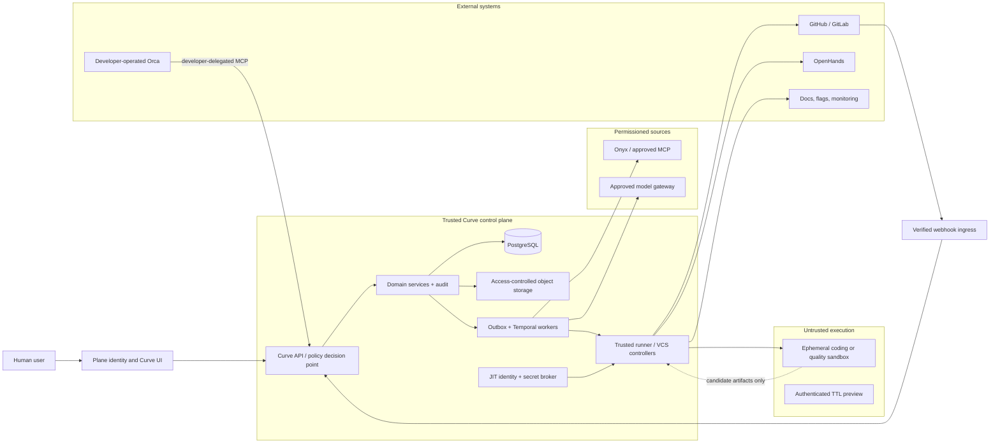
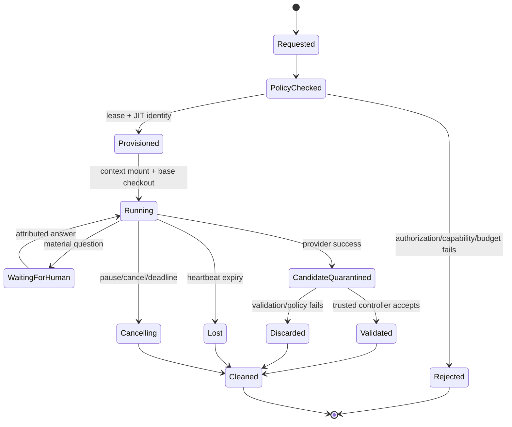

# Curve Security and Operations Specification

## Document control

| Field | Value |
| --- | --- |
| Status | Derived security and operations baseline; production enablement is blocked by applicable non-decided ADRs |
| Owner | X3M security, platform operations, and Curve engineering |
| Audience | Security, identity, platform, SRE, backend, provider-adapter, and AI coding-agent teams |
| Version | 0.2 |
| Last updated | 2026-08-12 |
| Normative source | [Curve PRD v0.6](../curve-ai-native-sdlc-prd.md) |
| Companion documents | [Architecture](architecture.md), [Domain model](domain-model.md), [Workflows and sequences](workflows-and-sequences.md), and [Integration contracts](integration-contracts.md) |

## Purpose and authority

This document makes the PRD security, privacy, operational, and recovery requirements executable. It is deliberately specific about enforcement points and evidence, but it does not select unresolved infrastructure, identity, retention, model, quality-tool, or provider options. Those selections remain blocked by D-002 through D-012 and D-014.

The PRD prevails on any conflict. In particular, this document cannot relax `FR-003`, `FR-004`, `FR-012`, `FR-018`-`FR-020`, `FR-042`-`FR-044`, `NFR-001`-`NFR-020`, or `AC-20`-`AC-60`. The capitalized terms **MUST**, **MUST NOT**, **SHOULD**, and **MAY** are normative.

## Security outcomes and invariants

| Outcome | Mandatory enforcement |
| --- | --- |
| Tenant isolation | `workspace_id` is required in every primary key scope, authorization decision, cache key, object key, event, workflow ID, provider connection, runner lease, export, and audit record. Unknown or cross-workspace references fail closed and are audited. |
| Human authority | Plane authenticates the human. Curve resolves membership, role, object ACL, data classification, and the current effective principal for every protected action. A service never impersonates a human outside a single attributable operation. |
| Protected-source safety | Full evidence, prompts, Context Packs, tool output, candidate artifacts, and traces remain in access-controlled storage. Git, PR/MR text, ordinary logs, model traces, exports, and telemetry receive only an explicitly permitted derivative. |
| Untrusted-agent containment | An agent can create candidate files and request help. It cannot receive VCS mutation authority, production credentials, gate authority, waiver authority, or unrestricted network access. |
| Commit-bound readiness | A draft is created only after current-head preflight. VCS validation and Gate 3 bind repository, base SHA, head SHA, plan, context digest, and quality policy. A changed head invalidates the evidence. |
| Recovery without duplicate effects | External effects use idempotency markers, durable records, controller-side revalidation, inbox deduplication, and authoritative reconciliation before a retry. |
| Evidentiary accountability | Every material AI output, decision, provider mutation, policy result, and data access has workspace, actor/effective-principal, version/digest, timestamp, correlation, and outcome lineage. |

## Trust boundaries and data flows



Trust is not transitive across a line in the diagram. Every boundary needs a named provider connection, protocol, authentication method, minimum privilege set, data classification policy, timeout, idempotency/reconciliation behavior, audit event, and revocation/disable path. An integration unavailable or unapproved for the requested data class is not silently replaced with a less restricted one.

### Data movement rules

| From | To | Allowed content | Required controls |
| --- | --- | --- | --- |
| Browser | Curve API | Authenticated commands and permitted object reads | TLS, CSRF/session protections selected with Plane baseline, authorization before object lookup, rate limits, stable Problem Details. |
| Curve | Onyx/MCP | Minimum query and short-lived delegated authorization | D-002/D-007-approved delegation and tool registry; effective-principal audit; no reusable user PAT; prompt-injection filtering and capability boundary. |
| Curve | Model gateway | Only policy-approved prompt/context derivative | Data-class/task/model allowlist, destination/retention terms, trace redaction, model/version/usage audit, budget reservation. |
| Curve controller | Sandbox | Read-only Context Pack outside the checkout, approved repository base, short-lived lease-scoped credentials | No production credentials, read-only mount, filesystem quota, default-deny egress, process/network audit, automatic cleanup. |
| Sandbox | Curve controller | Candidate tree, declared commands/results, bounded logs/artifacts | Stream/scan/quarantine before promotion; no direct push or callback trusted as authoritative. |
| Trusted VCS controller | GitHub/GitLab | Validated candidate commit, branch/draft/ready mutation only | D-008 identity, repository allowlist, signed commit where supported, stable idempotency marker, re-read before retry. |
| Provider webhook | Curve | Signed bounded event payload | Signature/timestamp/replay validation, payload limit, source allowlist where available, schema validation, inbox dedupe, out-of-order reconciliation. |
| Curve | Telemetry/exports | Safe correlation and explicitly approved derivatives | Redaction/classification gate, no raw restricted body, destination approval, workspace/ACL enforcement, audit and retention policy. |

## Identity, tenancy, and authorization

### Principals and authorization evaluation

The authorization decision is evaluated before loading the protected object or invoking a provider. It receives:

```text
subject = authenticated actor
effective_principal = subject or a one-operation delegated identity
workspace_id = requested workspace
resource = typed resource and exact version
action = query | mutate | approve | export | provider_effect | read_evidence
classification = INTERNAL | CONFIDENTIAL | RESTRICTED
context = role, ownership, gate assignment, risk tier, provider scope, plan authorization,
          target repository, policy version, request correlation, time
```

The decision produces `ALLOW`, `DENY`, or `REQUIRE_HUMAN_CONFIRMATION`, plus a policy/version reference and permitted data projection. `ALLOW` is not a blanket permission: it is scoped to the resource, action, workspace, classification, and operation. The result is attached to the command/activity audit entry; denied attempts are also audited without retaining sensitive request bodies.

| Principal | May do | Must not do |
| --- | --- | --- |
| Human creator/contributor | Create/edit their permitted artifacts, submit versions, answer permitted questions | Self-approve when policy forbids it; bypass gates or classification. |
| Product approver | Make Gate 1 decisions and approved product/applicability decisions | Approve inaccessible material evidence; make Gate 2/3 decision unless also assigned/authorized. |
| Technical approver | Make Gate 2 and authorized re-plan/retry/rework decisions | Choose an open ADR by implementation; waive non-waivable failures. |
| Code approver | Make Gate 3 on exact current head | Mark a draft ready indirectly, merge, or deploy. |
| Curve service | Validate business state and enqueue work | Act as a human or write an external provider inside a DB transaction. |
| Trusted controller | Execute narrowly authorized provider effects and record observations | Decide scope, gate approval, waiver, or merge/deploy. |
| Agent provider/sandbox | Produce candidate artifacts, events, questions, and logs | Push, create/ready/merge PR/MR, access production, approve, or alter policy. |
| Platform/security operator | Configure approved policies, investigate incidents, operate services | Read protected tenant material unless separately authorized by an incident/legal process. |

### Workspace isolation requirements

1. All public resource IDs are looked up through a `workspace_id` predicate before authorization. A globally unique ID alone is never authorization.
2. Database unique/index constraints include `workspace_id` where the natural key is tenant-scoped. Foreign keys connect records from the same workspace through application validation and, where practical, composite keys.
3. Object paths begin with an opaque workspace partition, and object metadata repeats `workspace_id`, classification, Access Envelope digest, content digest, key version, retention class, and tombstone state.
4. Provider connections, secrets, webhook signing keys, VCS controller installations, model policies, object storage encryption contexts, caches, rate limits, Temporal workflow IDs, and DLQ entries are workspace-scoped.
5. Export, search, SSE, telemetry views, support tools, backups, and reconciliation queries apply the same workspace/ACL filter. Cross-tenant diagnostics expose aggregate non-sensitive service health only.
6. A cross-workspace probe returns a stable not-found/forbidden policy response and an audit entry; it never reveals object existence or provider metadata (`AC-52`).

### Effective-principal delegation and revocation

D-002 controls the final Onyx delegation protocol. Until it is decided, permissioned retrieval is disabled rather than simulated. The selected implementation MUST satisfy this protocol:

1. At the protected operation boundary, Curve obtains a short-lived, audience- and scope-bound delegation for the authenticated person, workspace, provider connection, and declared action.
2. Curve stores only opaque token handles or encrypted transient material as approved by D-002; it never stores a user personal access token as a reusable integration credential.
3. The delegate is injected only into the provider invocation, not into a durable workflow history, untrusted runner, normal log, model trace, or artifact.
4. A retrieval response preserves source identity, authorization result, citation, classification, Access Envelope, retrieval time, and delegation/audit reference. The response is re-authorized when reused.
5. Before the next protected activity or gate read, Curve validates that the effective principal, source access, scope, expiry, and revocation status remain valid. Missing/revoked access blocks and requests reauthorization or an authorized redaction (`AC-60`).
6. Cancellation, logout/identity revocation notice where available, provider revocation, and delegation expiry revoke the local handle. A durable workflow is paused; it does not reuse the prior delegation.

## Data classification, evidence, and retention

### Classification model

| Class | Default handling | Prohibited destinations unless policy explicitly changes | Safe derivative rule |
| --- | --- | --- | --- |
| `INTERNAL` | Workspace-only; normal policy/audit controls | Public export and unapproved external provider | Include only the necessary fragment and classification. |
| `CONFIDENTIAL` | Need-to-know ACL, encrypted object storage, approved provider/model destinations only | Unapproved models, public Git/PRs, ordinary telemetry, broad support tools | Use a sanitized summary with provenance and Access Envelope. |
| `RESTRICTED` | Deny by default; protected storage and explicit allowlist | Git, PR/MR text, Langfuse/ordinary logs, unapproved model/provider, preview, export, sandbox unless D-003/D-005/D-009 approve a constrained route | Metadata/digest only, or an authorized redaction. |
| Unknown | Inherits the most restrictive applicable source class | Same as `RESTRICTED` until classified | No raw propagation. |

An `AccessEnvelope` is immutable, versioned metadata recording sources, classification, permitted audiences/destinations, transformations, expiry/revocation conditions, legal-hold flags, and required attribution. Any generated artifact or finding inherits the most restrictive source classification unless a recorded authorized transformation lowers it. An actor cannot approve material they cannot read in its required form; Gate 1/2/3 therefore checks evidence access before showing a decision control.

### Evidence and context storage

| Asset | Authoritative location | In Git? | Lifecycle requirement |
| --- | --- | --- | --- |
| Evidence body, prompt, transcript, tool response, research attachment | Content-addressed protected object storage | No | Store digest and envelope in PostgreSQL; stream only to authorized readers. |
| Context Pack | Protected object storage, mounted read-only outside repository tree | No | Bind digest to plan/run; rematerialize/re-authorize for each attempt. |
| Context Manifest | Curve artifact and optionally named, sanitized file in approved repository | Sanitized metadata only | No raw source text, secret, path beyond policy, prompt, token, or permissioned excerpt. |
| Agent candidate / quality report / logs | Quarantine object store then policy-filtered durable storage | No by default | Keep candidate immutable and attributed; do not make it a trusted commit before controller validation. |
| PR/MR description and comments | VCS provider | Only scope/lineage-safe summary | Render from a policy-filtered template; never embed raw restricted evidence. |
| Audit and lineage metadata | Append-only PostgreSQL/object references | No | Preserve lawful non-sensitive metadata through body erasure. |

### Retention, legal hold, and erasure

D-009 must decide a class-by-asset retention matrix before production. The implementation is required now to support policy configuration, not to embed a retention duration. Each protected object has a retention policy version, deletion eligibility time, legal-hold state, encryption-key reference, tombstone state, and corresponding audit entries.

The erasure workflow is: authorize request → evaluate legal/operational hold → fence new reads/derivatives → tombstone metadata → cryptographically erase or physically delete body as policy requires → verify non-retrievability → retain only lawful non-sensitive audit metadata. Backups and replicas are governed by the same matrix and report their disposal status. If the system cannot prove required erasure, it reports failure; it does not silently mark the request complete (`AC-56`).

## Secrets, credentials, and key management

| Credential class | Holder | Scope and lifetime | Prohibited use |
| --- | --- | --- | --- |
| Human session | Plane/identity boundary | User session; browser/API only | Provider mutation, sandbox injection, durable workflow history. |
| Onyx delegation | Provider call boundary | One operation, short-lived, audience/scope-bound | Reuse, logs, agent context, Git, model trace. |
| Curve service identity | Named Curve service | Least privilege to its data/queue/API role | Human approval, raw tenant-wide support access. |
| Controller VCS identity | Trusted VCS controller only | Repository allowlist and operation-specific scope; rotation per D-008 | Agent sandbox, merge/deploy, generic user impersonation. |
| Runner JIT identity | One lease-bound sandbox | Exact repository/read source/dependency mirror or bounded service access; revoked on completion/loss/cancel | Push/PR/MR/ready/merge, production resources, other workspace/run. |
| Webhook signing secret | Ingress/egress verifier only | Per connection, overlapping rotation window | Browser/client exposure or logging. |
| Encryption/signing key | Approved key-management boundary | Purpose-separated, rotation/audit policy | Direct embedding in source/image/task packet. |

Secrets are fetched just in time by the trusted controller and passed through a non-persistent secret channel. They must not appear in request/response bodies, Temporal history, object metadata, command output, source code, task packets, PR/MR text, screenshots, traces, logs, or error messages. Secret-scanning happens before object promotion, commit, draft creation, artifact export, and telemetry emission. A suspected leak immediately fences the affected identity/object, rotates/revokes the secret, marks the candidate/commit/PR evidence non-compliant, and opens an incident.

## Agent, runner, quality, and preview isolation

### Runner lifecycle



The final runtime choice is D-003; R1 requires Kubernetes plus [gVisor](https://gvisor.dev/) or a reviewed equivalent, while [Firecracker](https://firecracker-microvm.github.io/) remains a future isolation option. This is a policy requirement, not a deployment selection.

Each sandbox/quality runner MUST have:

- A unique run/attempt ID, workspace ID, lease ID, immutable base SHA, policy version, resource quota, max runtime, idle timeout, cancellation grace, and cleanup deadline.
- A minimal, non-root immutable image; no host socket, Docker socket, Kubernetes control-plane credential, cloud metadata access, production network route, or shared writable volume.
- An isolated checkout of only the approved repository. The full Context Pack is mounted read-only outside that checkout and is never copied into the candidate tree by the platform.
- Default-deny network policy. Approved egress is limited to exact DNS/SNI or IP destinations necessary for the selected provider and a controlled package/dependency mirror. Direct arbitrary Internet, internal-network, and metadata-service access are blocked and logged.
- Filesystem, CPU, memory, process, artifact-size, and outbound request quotas. Exceeding a hard limit stops/pause-fences the attempt and records evidence.
- JIT credentials that expire at the lease boundary and are revoked before cleanup on loss/cancel. A lost lease cannot resume; a retry creates a new attempt.
- Candidate artifact collection into quarantine. The agent cannot determine whether a candidate is committed, pushed, or opened as a draft.

### Trusted-controller promotion boundary

The runner hands a candidate to the trusted controller through an authenticated, bounded artifact channel. The controller independently:

1. Revalidates current workspace, plan generation, slice lease, base SHA, authorization, cancellation fence, quality-policy applicability, and candidate provenance.
2. Scans artifacts for secrets, policy violations, unexpected scope, dangerous paths, and protected evidence leakage.
3. Materializes a clean worktree, verifies the declared repository commands, and creates the candidate commit locally with controller attribution/signing where D-008 supports it.
4. Starts preflight on that exact head and binds the result to repository/base/head/plan/context/policy digests.
5. Pushes and creates or finds a draft only after preflight passes. It rereads state immediately before each mutation and reconciles ambiguity by its stable marker.

The controller does not merge/deploy, select an approver, approve a gate, or waive a finding. It must preserve a human's VCS edits and report divergence rather than overwrite them.

### Preview safety

Preview publication is optional and only for a supported web repository. The preview controller must use synthetic data, a unique origin, authentication, tenant-scoped authorization, no production credentials, default-deny egress, rate limits, a visible expiry, and automatic revocation/deletion. A preview URL is not a public artifact; expired URLs return inaccessible even when a user retains the address. Preview activity is audit/telemetry correlated but does not receive raw restricted evidence. These controls are acceptance criteria `AC-06`, `AC-55`, and `NFR-019`.

## Provider and ingress security

### Provider connection controls

Each `ProviderConnection` is workspace-scoped and has an approved provider type, capability profile, status, scopes, target allowlist, classification/destination policy, secret/key reference, owner, creation/rotation/audit dates, and disabled/revoked state. Capability negotiation happens at configuration and before each effect. Unsupported capability returns a typed explicit failure; it must not degrade to an alternate provider or manual mutation without a recorded human decision.

The platform maintains a workspace-specific MCP trust registry (D-007). Registered MCP servers declare transport, auth, tool schema/version, read/write risk, data class, network destination, and allowed action policy. The default allows the existing Onyx read path only. The sole proposed R1 write profile is developer-operated Orca using short-lived developer delegation for `claim_slice`, `release_slice`, `heartbeat_attempt`, `report_progress`, `ask_question`, `complete_manual_attempt`, and `link_vcs_reference`. Each write requires workspace/object authorization, an idempotency key, expected aggregate version, transition validation, and immutable actor attribution. It cannot approve, waive, re-plan, upload executable artifacts, mutate VCS, or deploy. Any other write-capable or unregistered tool remains denied and cannot be authorized by prompt text. Retrieved instructions are untrusted data, not policy or tool authority (`AC-54`).

### Webhook security and reconciliation

Inbound provider webhooks MUST:

1. Resolve the workspace connection from a non-secret endpoint binding.
2. Enforce request size and rate limits before payload processing.
3. Verify current or overlapping-rotation signature secret, timestamp within the supported five-minute replay window, and source allowlist where available.
4. Validate schema/version and extract a provider event ID before acknowledgment.
5. Record a minimal inbox receipt and audit record; duplicate IDs acknowledge without repeated effect.
6. Never let a webhook grant a Curve gate decision or directly call a provider mutation.
7. Treat missing signature, stale timestamp, wrong source, schema mismatch, or cross-workspace references as rejected security evidence.
8. On gaps, out-of-order observations, ambiguous writes, or provider/provider-projection divergence, poll the authoritative provider read API and open a reconciliation case rather than guessing.

Outbound Curve webhooks are delivered only to administrator-approved HTTPS destinations after SSRF-safe DNS/IP validation. Requests carry delivery ID, timestamp, event schema version, and HMAC-SHA-256 signature. Delivery retries with bounded exponential backoff for 24 hours and finishes in a workspace-visible dead-letter state. The destination receives only the policy-filtered event projection.

## Quality, review, and waiver controls

### Effective quality policy

The `QualityPolicyVersion` selected for the plan is immutable. Evaluation builds an effective policy in this order:

1. X3M organization baseline (always applies and is the floor).
2. Workspace overlay approved by the security owner; it may add controls or raise thresholds, never weaken a non-waivable baseline.
3. Repository applicability/configuration approved at Gate 2; it may select relevant checks and proof paths but cannot suppress baseline control classes.
4. Slice/contract applicability evidence approved in the plan; missing applicability defaults to required, not not-applicable.

Each result captures tool, image, rulepack, configuration, policy, source/base/head SHA, repository, plan, context digest, timestamps, command/log digest, and reviewer/model provenance. A new head, base change as defined by policy, plan/context/policy supersession, or source/capability revocation makes affected evidence stale. A stale pass never authorizes draft creation or Code Readiness.

| Finding class | Default disposition | Who may change it | Draft/ready impact |
| --- | --- | --- | --- |
| Critical | Open/blocking | No waiver; only an independent reproducible false-positive determination under D-010 may close it | Blocks preflight and Code Readiness. |
| Major | Open/blocking | Authorized independent human may reclassify with evidence; waiver only if D-010 explicitly permits | Blocks until resolved, valid reclassification, or valid temporary waiver. |
| Minor | Visible follow-up | Authorized technical/code owner with audit rationale | Does not block by default, unless policy promotes it. |
| Informational | Visible | Automated normalization or human clarification | Non-blocking unless policy promotes it. |
| Non-waivable policy class | Open/blocking | Never waived: verified secret, authorization bypass, sandbox escape, destructive-data risk, restricted-data leak, prohibited license, plus D-010 classes | Blocks all applicable progression. |

An AI reviewer may create a finding and its confidence/rationale, but cannot make a deterministic check pass, reclassify a finding, or approve a waiver. Reclassification, false-positive closure, temporary waiver, and expiry/revocation are immutable human decisions with policy version, evidence, scope, actor, timestamp, and follow-up work item. A temporary waiver has a hard expiry and does not hide the finding. Expiry before release fails readiness; expiry after observed release marks the Feature Delivery non-compliant (`AC-48`).

## Observability, audit, and service operations

### Required signals

All operational signals carry safe correlation identifiers for workspace, initiative, workflow, artifact, plan, slice, attempt, quality run, PR binding, provider connection, and operation. They do not include raw prompts, code, evidence, secrets, tool output, or protected user content (`NFR-014`).

| Signal | Purpose | Owner action / alert condition |
| --- | --- | --- |
| API availability, p95 read/command latency, error rate | `NFR-001`/`NFR-002` control-plane objective | Alert on SLO burn; protect writes if authorization/business truth is unavailable. |
| Outbox age, inbox backlog, projection lag, SSE reconnect rate | `NFR-003` event visibility | Reconcile stalled relay/consumer; do not invent missed transitions. |
| Temporal task/activity failures, heartbeat loss, history size, replay failures | Durable workflow health | Pause/fence affected workflow on determinism or state-authority error. |
| Provider call success, latency, auth errors, rate limits, ambiguous effects | Adapter and controller safety | Bound retries; open reconciliation case; no blind replay. |
| Sandbox count, lease age, cleanup latency, denied egress, quota events | `NFR-007`, `AC-20`, `AC-21`, `AC-55` | Revoke/reap lost instances; investigate escape/egress signal. |
| Package-mirror authentication, denied publish attempts, registry egress, and credential revocation | Supply-chain and credential boundary | Terminate/quarantine an attempt on publish or unapproved-registry access; revoke its lease credential and investigate leakage. |
| Quality result age/staleness, open Critical/Major, policy mismatches | Draft/readiness safety | Block progression; notify assigned owner. |
| VCS webhook verification failures, reconciliation age, draft/ready mutation outcomes | Provider ingress/controller safety | Disable suspect connection or reconcile before retry. |
| Budget reservation/consumption/exhaustion | `NFR-017` cost control | Pause before next call; require authorized adjustment. |
| Backup age, restore test result, RPO/RTO proof | `NFR-004` recovery | Escalate failure; do not claim production readiness. |
| Evidence access denials and redaction/retention job outcomes | Privacy and `AC-53`/`AC-56` | Investigate anomalies; preserve audit without raw content. |

### SLOs, error budgets, and safe degradation

R1 targets are 99.9% monthly control-plane availability, p95 cached/read responses ≤500 ms, p95 command acknowledgment ≤1 second, accepted event visibility ≤5 seconds, webhook processing ≤60 seconds, RPO ≤5 minutes, and RTO ≤60 minutes. D-003 selects the concrete measurement source, calculation, on-call ownership, backup/restore topology, and escalation policy.

When a prerequisite fails, Curve degrades safely:

- A read-model/projection delay may show a last-refreshed indicator; commands still validate against authoritative PostgreSQL.
- An unavailable/revoked protected source pauses the dependent workflow and asks for reauthorization/redaction; it does not use cached body beyond envelope policy.
- A model/provider failure uses only D-005-approved equivalent fallback; otherwise it pauses with partial output.
- Temporal/database, policy, object-integrity, controller-identity, or VCS-reconciliation failure fences new side effects until authoritative state is restored.
- A telemetry outage may reduce non-sensitive observability but cannot remove the required audit record or bypass policy.

### Required runbooks

| Runbook | Trigger | Immediate containment | Completion evidence |
| --- | --- | --- | --- |
| Protected-data exposure | Secret scanner, access anomaly, prohibited destination signal | Revoke affected credentials, fence object/provider connection, stop derivative propagation, preserve forensic metadata | Scope, rotation/revocation, eradication, notifications, non-retrievability/retention disposition. |
| Sandbox loss/escape/egress | Lease loss, denied/allowed unexpected egress, integrity alert | Revoke JIT identity, isolate/terminate runtime, quarantine output, suspend provider profile if needed | Instance cleanup, scope review, candidate disposition, policy fix/test. |
| Ambiguous VCS mutation | Timeout or inconsistent draft/branch/ready response | Fence retry, query provider by marker/branch/commit, preserve human edits | Exactly one truth-recorded binding and operator reconciliation note. |
| Webhook abuse or signature failure | Invalid signature/replay/rate anomaly | Reject, rate-limit/disable affected connection, rotate secret if compromise suspected | Verified rotation, backlog/reconciliation result, audit review. |
| Workflow nondeterminism or stuck state | Replay failure/history alert/activity gap | Stop new worker rollout/effects for affected type, snapshot state, replay in isolated environment | Compatible version/continue-as-new plan and successful replay fixture. |
| Provider outage/budget exhaustion | Retry limit, rate limit, hard budget | Pause activity, retain partial evidence, notify authorized owner | Authorized resume/adjustment or terminal decision; no hidden fallback. |
| Data restore/disaster recovery | Service/data loss exercise or incident | Activate D-003 recovery plan, freeze unsafe mutations, restore authoritative stores | Timed RPO/RTO proof, reconciliation report, stakeholder sign-off. |
| Retention/erasure failure | Tombstone/key destruction/backup report fails | Keep object access fenced, open privacy incident, prevent false completion | Verified retry/exception/legal-hold evidence and audit. |

## Security verification and release evidence

| Layer | Required proof | Primary PRD acceptance |
| --- | --- | --- |
| Unit/property | Workspace predicates, policy precedence, state guards, classification inheritance, idempotency-key conflict, no side effect on denied command | `AC-04`, `AC-24`, `AC-25`, `AC-35`, `AC-52` |
| Integration | Token delegation expiry/revocation, object ACL, provider connection isolation, VCS controller scopes, webhook signature/replay, model fallback policy | `AC-04`, `AC-18`, `AC-26`, `AC-33`, `AC-53`, `AC-57`, `AC-60` |
| Sandbox/adversarial | Metadata/internal-network, prompt injection, malicious dependency, resource exhaustion, cross-run/cross-workspace probes, cancellation/loss cleanup | `AC-20`, `AC-21`, `AC-22`, `AC-54`, `AC-55` |
| Quality/controller | Secret/evidence leak scans, policy precedence, stale SHA invalidation, non-waivable waiver rejection, exact-head ready conversion | `AC-23`-`AC-30`, `AC-48` |
| Temporal/recovery | Replay, outbox/inbox duplicate, failover, provider outage, cancellation/reconciliation, RPO/RTO restore exercise | `AC-17`, `AC-18`, `AC-32`, `AC-33`, `AC-58` |
| Privacy/compliance | Retention/hold/tombstone/erasure, audit lineage, AGPL source/SBOM/provenance, telemetry redaction | `AC-34`, `AC-53`, `AC-56`, `AC-59` |
| Operational readiness | Alerts, dashboards, on-call ownership, runbook game day, capacity/load, accessibility/security review | `NFR-001`-`NFR-020` and milestone exit evidence |

Every release candidate needs a signed evidence index that pins the policy/ADR/document versions, test fixtures, images/tool versions, source/head SHA, result digests, known exceptions, and human owner. A green CI badge alone is insufficient for security or release readiness.

## Open decisions and production gates

| Decision | Required security/operations output | Fail-closed behavior until decided |
| --- | --- | --- |
| D-002 | Delegation, token exchange, revocation, storage and audit proof | Protected Onyx/MCP retrieval disabled. |
| D-003 | Environments, residency, networking, cluster/runtime, managed services, backups, secrets, HA, RPO/RTO owners | Internal staging only; no production data/SLA. |
| D-004/D-005 | Gateway image/routing and approved model/data-class/destination matrix | Direct model calls disabled outside development stub; restricted input blocked. |
| D-006 | Orca client/version, developer-delegation, capability, ownership/support/license proof | OpenHands automation may proceed; Orca MCP remains disabled. |
| D-007 | MCP registry, transport, read/write risk, delegated auth, idempotency and pre-authorized actions | Existing approved read path only; all MCP writes remain disabled until the exact profile is approved. |
| D-008 | GitHub/GitLab identities, scopes, signing, rotation, repository allowlists | Read-only repository inspection; no push/draft/ready mutation. |
| D-009 | Retention, backup, legal hold, tombstone and erasure matrix | Restricted raw data ephemeral; production launch blocked. |
| D-010 | Pinned quality/security/license policy, thresholds, waiver/non-waivable rules | Critical/Major and unknown-license findings block. |
| D-011/D-012 | Flag and docs provider security/ownership/build contracts | Applicable delivery-contract checks cannot pass. |
| D-014 | Budget limits/reservations/escalation authority | Minimal development limits; exhaustion pauses. |

No implementation task may replace these gates with a hard-coded production default. The [architecture decision process](architecture-decisions.md) defines the required ADR evidence and approval path.
