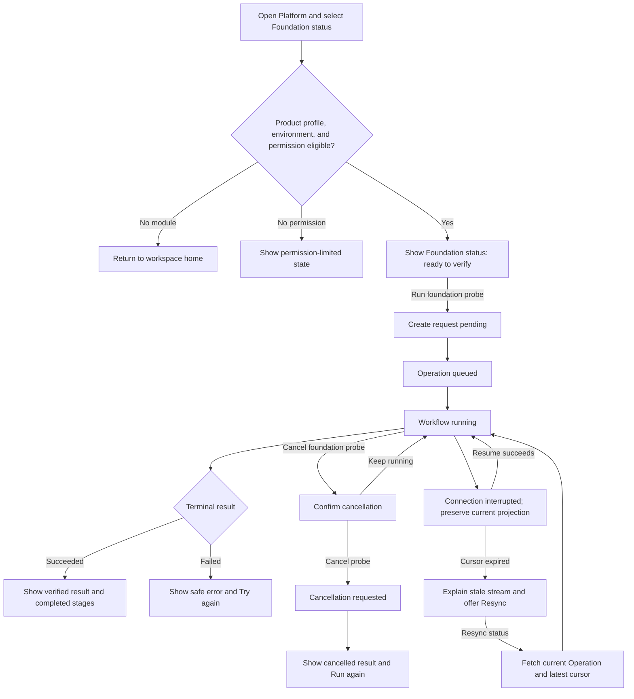
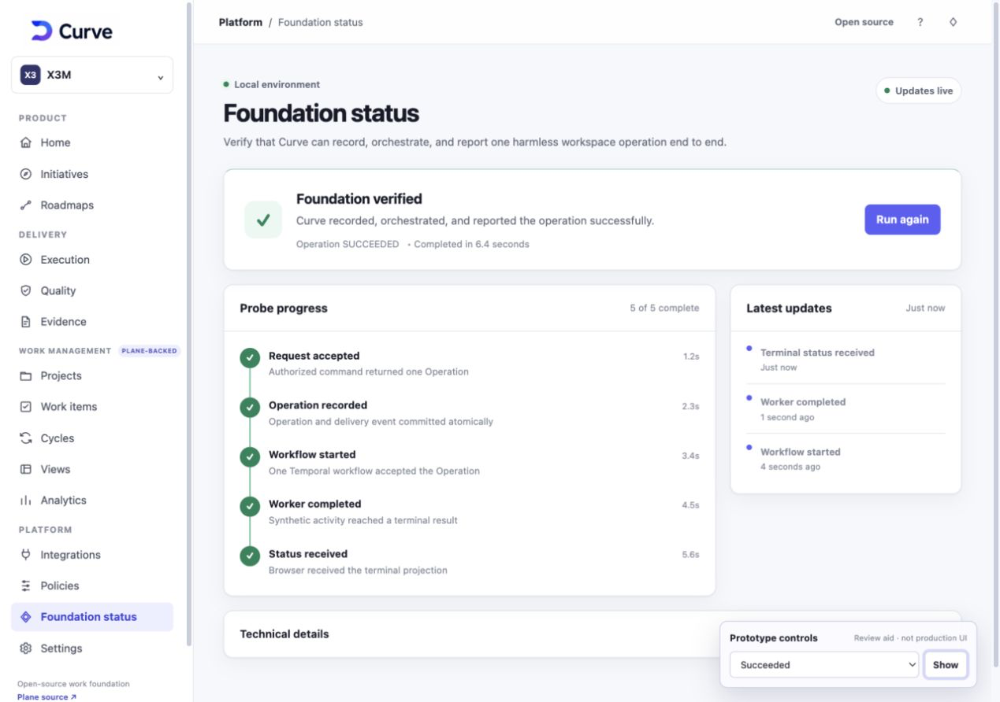

# M0-S4 Foundation Probe Experience Contract

## Document control

| Field | Value |
| --- | --- |
| Record IDs | UX-004-M0-S4 (clickable prototype and task-based review) and UX-005-M0-S4 (work-package-linked screen contract) |
| Work package | CURVE-M0-S4-API-SSE-UI (Operation API, resumable SSE, and minimal workspace UI) |
| Status | `IMPLEMENTED_AND_ACCEPTED` |
| Owner and approver | Federico Ocampo, CTO at X3M |
| Target implementation repository | `github.com/faocampo/plane`, branch created from the exact accepted M0-S3 (local Temporal round-trip implementation packet) merge |
| Source baseline | Curve PR #17 approved at exact head `a4638761bcbdb8e522e8db0af5a2ae00cb6480a8` and squash-merged as `42ea32981a3d5ce814a74c18e458ac8152a7e2fa`; Plane PR #6 approved at exact head `a1748c790a060434928b8ed521692b13b3f9739e` and squash-merged into `preview` as `e762fbbd2c1726a2833745add8245a1679c60d88` |
| Last updated | 2026-08-21 |

This record satisfies the artifact requirements of the [Curve Experience Blueprint](curve-experience-blueprint.md) (user-facing flow approval gate) for the M0-S4 (API, SSE, and minimal UI implementation packet) surface. Federico approved UX-004-M0-S4 (clickable prototype and task-based review) and UX-005-M0-S4 (work-package-linked screen contract) against exact Curve head `a4638761bcbdb8e522e8db0af5a2ae00cb6480a8`. GitHub recorded that head in [Curve PR #17](https://github.com/faocampo/curve/pull/17), whose validation passed before it was squash-merged as `42ea32981a3d5ce814a74c18e458ac8152a7e2fa`.

## Product intent

The foundation probe gives an authorized Curve engineer one clear way to verify that the local control path works end to end: an authenticated API request creates one workspace-scoped Operation, the delivery kernel dispatches one Temporal workflow, the worker completes it, and the browser receives the terminal state through resumable server-sent events.

The screen answers three questions:

1. Is the local Curve foundation ready to test?
2. What stage is the current verification in?
3. If progress stops, what safe action restores a known state?

The experience is deliberately narrow. It validates M0 plumbing before later initiative, planning, agent-execution, quality, and delivery experiences are introduced.

## Users, authorization, and availability

| Concern | Contract |
| --- | --- |
| Target role | Authorized workspace engineer or platform operator validating a local Curve development environment |
| Entry point | Curve product shell, `Platform` group, `Foundation status` item; M0 route `/:workspaceSlug/curve` |
| Availability | Curve module enabled, local environment, authenticated workspace member, and `operation.create` authorization for the synthetic foundation-probe target |
| Read access | Workspace member authorized for `operation.read` can inspect the current probe and its safe event projection |
| Cancel access | Actor authorized for `operation.cancel`, with the current Operation ETag |
| Disabled behavior | The Curve product profile remains disabled, existing Plane behavior is unchanged, and direct navigation returns to the workspace home |
| Non-local behavior | The probe action is absent and the probe command remains unavailable in staging and production |
| Permission-limited behavior | The page explains that the current user cannot run the check; it never reveals whether another workspace contains a matching Operation |

Authorization follows the [M0 authorization and state matrices](m0-authorization-and-state-matrices.md) (core roles, authorization inputs, and Operation transitions) and the [M0-03 core policy task packet](m0-03-core-policy-task-packet.md) (authorization and policy-kernel dispatch contract). The UI consumes authorized projections; it does not infer permissions from hidden controls.

## Information architecture

The foundation probe lives under `Platform` in the Curve-owned product shell. It is a temporary M0 operational-verification surface. Plane-backed work-management capabilities remain available as one grouped area inside Curve.

```text
Curve product shell
├── Product
├── Delivery
├── Work management (Plane-backed)
└── Platform
    └── Foundation status
        ├── Readiness summary and current connection
        ├── Current or latest probe progress
        ├── Recovery action when required
        └── Technical details (collapsed by default)
```

The shell uses the approved Curve logo and name as its primary identity. The page header uses `Platform / Foundation status`, the page title `Foundation status`, and the environment label `Local environment`. The sidebar contains Product, Delivery, Work management, and Platform groups; `Foundation status` is active under Platform. Plane attribution and the exact-version source link remain available in the shell footer. Provider configuration, policy administration, raw event bodies, database topology, credentials, and Temporal internals are excluded from the surface.

## Primary task flow



### Happy path

1. The engineer enters the Curve product and selects `Foundation status` under `Platform`.
2. The page loads eligibility and the latest local probe projection.
3. In the idle state, the dominant action is `Run foundation probe`.
4. Activation gives the button immediate pending feedback and submits one idempotent create command.
5. The page renders `PENDING`, `QUEUED`, and `RUNNING` as a single continuous progress view, announcing meaningful changes through a polite live region.
6. The SSE stream advances the visible stages without page refresh.
7. `SUCCEEDED` renders a verified summary, completion time, and `Run again` action.

### Cancellation

1. `Cancel probe` is available only while the current Operation can accept cancellation.
2. Activation opens a focused confirmation dialog naming the consequence: the current verification stops and completed evidence remains.
3. `Keep running` closes the dialog and restores focus to `Cancel probe`.
4. `Cancel probe` sends the current ETag through `If-Match`, renders `CANCEL_REQUESTED`, and prevents a duplicate cancellation.
5. `CANCELLED` renders a terminal summary and `Run again`.

### Connection recovery

1. Loss of the SSE connection preserves the last acknowledged projection and changes the connection label to `Reconnecting`.
2. The client resumes with `Last-Event-ID`; already acknowledged events do not animate or announce again.
3. A `410` stale-cursor response changes the dominant action to `Resync status`.
4. Resync fetches the authoritative current Operation and opens a new stream from the returned cursor.
5. If resync fails, the safe error retains `Try again` and the last confirmed update time.

## Screen and state contract

| State | Visible content | Dominant action | Accessibility and recovery |
| --- | --- | --- | --- |
| Shell loading | Page skeleton for heading, summary, and progress | None | Page title is set; no empty-state announcement occurs before eligibility resolves |
| Product profile disabled | Existing Plane workspace home | Existing workspace navigation | Existing Plane behavior is unchanged; direct route uses the existing safe redirect |
| Permission limited | `You do not have permission to run the foundation check` and workspace-admin guidance | `Back to workspace` | Heading receives focus after navigation; no Operation identifiers or cross-workspace detail |
| Idle/empty | `Ready to verify`, local-environment label, live connection, no prior run | `Run foundation probe` | Button has an explicit accessible name; explanatory copy precedes the action |
| Create pending | `Starting foundation probe` | Disabled progress button | Button activation is acknowledged immediately; repeated activation is prevented |
| Queued | `Probe queued` and first stage complete | `Cancel probe` when authorized | Status is announced once; timeline remains keyboard-readable |
| Running | `Workflow running`, current stage, elapsed time, last update | `Cancel probe` when authorized | Polite live updates; elapsed time is not announced continuously |
| Cancel confirmation | Modal naming the current probe and retained evidence | `Cancel probe` | Initial focus on `Keep running`; Escape closes; focus returns to trigger |
| Cancel requested | `Cancellation requested` | None until terminal | Duplicate requests disabled; current progress remains visible |
| Cancelled | `Probe cancelled`, completed stages, completion time | `Run again` | Terminal state announced once; reason uses plain language |
| Succeeded | `Foundation verified`, all stages complete, duration, completion time | `Run again` | Success uses icon, label, and text rather than color alone |
| Failed | `Foundation check could not complete`, safe error code, last completed stage | `Try again` | Raw exception/body omitted; technical details expose correlation and safe code only |
| SSE reconnecting | `Updates reconnecting`, last confirmed update, unchanged Operation state | Existing state action unless unsafe | Connection status uses `role=status`; no duplicate event announcements |
| SSE cursor stale | `Live updates need to be resynchronized` | `Resync status` | Explains retained evidence and the next action; no automatic destructive reset |
| Resync failed | `Current status could not be refreshed` and safe error code | `Try again` | Keeps last confirmed state visually distinct from current connectivity |

## Progress stages

The progress timeline uses stable user-facing stages rather than internal component names:

| Stage | Completion evidence shown to the user |
| --- | --- |
| Request accepted | Authorized command returned one Operation resource |
| Operation recorded | Workspace-scoped Operation and delivery event committed atomically |
| Workflow started | Exactly one workflow execution was accepted for the Operation |
| Worker completed | The synthetic activity reached its terminal result |
| Status received | The browser received or resynchronized the terminal projection |

Each stage has `waiting`, `active`, `complete`, or `failed` presentation. The UI may derive presentation from contract-authorized events, but the Operation resource remains authoritative for lifecycle state.

## Progressive disclosure and safe evidence

`Technical details` is collapsed by default and includes only:

- Operation identifier.
- Current optimistic version and ETag.
- Correlation identifier.
- Current SSE connection state and last acknowledged event identifier.
- Start, last-update, and terminal timestamps.
- Safe RFC 9457 Problem Details type/code when applicable.

The panel excludes credentials, tokens, protected request/response bodies, raw Temporal payloads, stack traces, SQL, object-store references, actor attributes, and cross-workspace identifiers. A copy control copies one labeled safe value at a time and confirms the copied label through a polite live region.

## API and interaction bindings

| Interaction | Contract behavior |
| --- | --- |
| Load page | Read Curve workspace shell, request the latest authorized `FOUNDATION_PROBE` through the server-side `operation_type` filter, reject a mismatched detail projection, and obtain an SSE resume cursor |
| Run foundation probe | `POST` one local-only probe command with a fresh idempotency key; accept `202`, `Location`, ETag, and a contract-valid Operation |
| Receive progress | Subscribe to workspace-scoped SSE; persist the last acknowledged event ID after rendering the event |
| Resume progress | Reconnect with `Last-Event-ID`; render only later events in server order |
| Resync stale cursor | On `410`, fetch the current Operation projection, accept its cursor, and reconnect |
| Cancel | Send the visible Operation ETag through `If-Match`; handle `202`, safe `412`, or safe `428` without optimistic terminal claims |
| Retry after failure | Create a new Operation with a new idempotency key; keep the prior Operation independently addressable |

Wire behavior follows the [integration contracts](integration-contracts.md) (OpenAPI, commands, events, SSE, idempotency, and reconciliation conventions) and `curve-v1.openapi.yaml` (normative Curve API definition). A contract mismatch stops M0-S4 (API, SSE, and minimal UI implementation packet) rather than being resolved in presentation code.

## Prototype

The static [M0-S4 foundation probe prototype](../design/prototypes/m0-s4-foundation-probe/index.html) (clickable local foundation-status flow in the Curve-first shell) demonstrates the proposed interaction without API or infrastructure side effects. Its adjacent optimized logo file is a delivery derivative governed by the [Curve brand identity](../design/curve-brand.md) (approved logo assets, usage rules, and derivative policy).

Prototype-only controls in the lower-right corner let a reviewer enter states that would normally be produced by the API or SSE stream. They are labeled `Prototype controls` and are excluded from the production screen contract.



## Task-based review script

### Review setup

| Field | Value |
| --- | --- |
| Participant | Federico Ocampo acting as the authorized workspace engineer and accountable product approver |
| Artifact | Exact committed prototype linked above |
| Starting condition | `Ready` prototype state at a desktop viewport; repeat core actions at 1280 px and 768 px widths |
| Assistance | Task prompts only; findings recorded after each task |

### Tasks and acceptance observations

| Task | Prompt | Pass evidence to record |
| --- | --- | --- |
| T1 Discover | “Open Foundation status and determine whether the local foundation is ready to verify.” | Recognizes Curve as the product, finds Foundation status under Platform, and explains readiness/environment without assistance |
| T2 Run | “Start the verification and tell me where it is in the process.” | Activates the dominant action, identifies current stage, and distinguishes progress from connection state |
| T3 Inspect | “Find the operation ID and last event without losing the progress context.” | Opens Technical details and finds both safe values; recognizes details as supporting information |
| T4 Recover connection | “Live updates were interrupted. Restore the current status.” | Uses reconnect feedback; when shown a stale cursor, selects `Resync status` and explains retained evidence |
| T5 Cancel | “Start another verification, then stop it safely.” | Opens confirmation, understands retained evidence, cancels, and reaches a terminal cancelled state |
| T6 Recover failure | “The verification failed. Identify the safe diagnostic and try again.” | Finds safe error/correlation data, avoids looking for a stack trace, and starts a new Operation |
| T7 Keyboard | “Complete T2 through T6 using the keyboard.” | Logical focus order, visible focus, dialog trap/return, accordion behavior, and actionable status announcements work |

### Findings record

| Finding | Severity | Disposition | Owner |
| --- | --- | --- | --- |
| V1 represented Plane as the product shell and Curve as a peer module | Major | `RESOLVED_IN_V2`: Curve owns the logo and shell; Plane-backed capabilities are grouped under Work management; Foundation status is under Platform | Federico Ocampo |
| Task-based review of the Curve-first v2 flow | Resolved | `PASS`: Federico approved UX-004-M0-S4 and UX-005-M0-S4 against exact head `a463876...`; PR #17 validation passed and the approved artifacts were squash-merged as `42ea329...` | Federico Ocampo |

## UX-004 and UX-005 approval record

```yaml
record_ids:
  - UX-004-M0-S4
  - UX-005-M0-S4
work_package: CURVE-M0-S4-API-SSE-UI
status: APPROVED_READY_FOR_IMPLEMENTATION
owner: Federico Ocampo
approver: Federico Ocampo
target_role: Authorized workspace engineer or platform operator
user_job: Verify and recover the local Curve foundation end to end
information_architecture: Curve product shell > Platform > Foundation status
prototype_review:
  artifact: docs/design/prototypes/m0-s4-foundation-probe/index.html
  participants:
    - Federico Ocampo
  tasks: T1-T7 in this record
  result: PASS
  findings_and_disposition: Plane-first v1 shell replaced by the approved Curve-first v2 shell; no blocking UX finding remains
approval:
  decision_at: 2026-08-21
  approved_curve_commit: a4638761bcbdb8e522e8db0af5a2ae00cb6480a8
  merged_curve_commit: 42ea32981a3d5ce814a74c18e458ac8152a7e2fa
  evidence: https://github.com/faocampo/curve/pull/17
```

## Implementation acceptance additions

The following browser tests supplement the M0-S4 executable acceptance in the [M0 local task packets](m0-local-skeleton-task-packets.md) (repository-local implementation packets):

1. Given eligibility is loading, when the route renders, then no idle or permission state flashes before the result.
2. Given the Curve product profile is disabled, when the route resolves, then existing Plane behavior is unchanged and direct access follows the existing safe redirect.
3. Given the Curve product profile is enabled, when the shell renders, then the approved Curve logo and name are the primary identity and no peer `Curve` navigation item exists.
4. Given the shell renders, when navigation is inspected, then Plane-backed capabilities are grouped under `Work management` and `Foundation status` is active under `Platform`.
5. Given a read-authorized actor without create authorization, when the page loads, then the permission-limited projection contains no hidden Operation data.
6. Given a create request is pending, when the action is activated repeatedly, then only one idempotent command is issued.
7. Given ordered progress events, when they render, then the timeline advances monotonically and each meaningful status is announced once.
8. Given a reconnect from the last acknowledged event, when duplicate and later events arrive, then duplicate events do not change or reannounce the projection.
9. Given a stale cursor, when the actor resynchronizes, then the UI replaces the stale projection with the authorized current Operation and reconnects from the new cursor.
10. Given cancellation confirmation, when the actor keeps the run, cancels it, or presses Escape, then focus and command behavior match this screen contract.
11. Given a safe Problem Details response, when the failure renders, then raw response bodies and stack traces are absent from the DOM, logs, and copy controls.
12. Given every state in the state contract, when checked with automated accessibility rules and keyboard interaction tests, then names, roles, focus, contrast, and live-region behavior conform to WCAG 2.2 AA.

## Approval effect and change control

Approval of this record completed the M0-S4 Definition/UX gate and authorized implementation of the user experience described here within the existing M0-S4 technical scope. Plane PR #6 subsequently implemented and accepted the API, SSE, Plane UI, tests, and accessibility behavior; [M0-S4 implementation evidence](m0-s4-implementation-evidence.md) (exact context, merges, verification, product/security acceptance, and rollback) is authoritative for completion. The acceptance leaves D-003 (runtime topology and trust-zone decision), the local-only boundary, and the existing API contract unchanged.

A change to route placement, target role, authorization behavior, dominant task, Operation lifecycle presentation, cancellation semantics, SSE recovery, safe-detail boundary, or accessibility behavior supersedes the affected UX-004/UX-005 record and returns the user-facing portion of M0-S4 to `BLOCKED` pending review.
