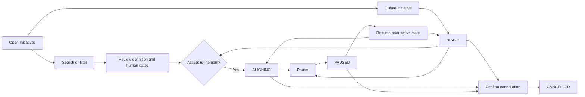

# M1-01B Initiative Shell Experience Contract

> Sanitized public reference. Fictional identities cannot authorize execution.
> Historical approvals apply only to their original bytes; see
> [public contract edition](public-reference-sanitization.md) (sanitization, integrity and approval boundaries).

## Document control

| Field | Value |
| --- | --- |
| Work package | M1-01B (Curve-first Initiative shell) |
| Records | UX-006-M1-01B (clickable prototype and task-based review); UX-007-M1-01B (work-package-linked screen contract) |
| Status | `UX_APPROVED / IMPLEMENTATION_PACKET_REQUIRED` |
| Version | 0.2 |
| Date | 2026-08-29 |
| Product owner and approver | Designated reviewer |
| Backend prerequisite | [M1-01A implementation evidence](m1-01a-initiative-core-implementation-evidence.md) (accepted Initiative domain/API implementation, tests, merge tree, data boundary, and rollback) |
| Prototype | [M1-01B Initiative shell prototype](../design/prototypes/m1-01b-initiative-shell/index.html) (clickable synthetic list, create, detail, lifecycle, and recovery-state review surface) |
| Implementation authority | `NOT_AUTHORIZED`; the approved UX record enables separate Plane implementation-packet finalization and dispatch approval |

## Product intent

M1-01B gives an authenticated Example Organization workspace member one Curve-owned place to
find, create, understand, and manage manual-first Initiatives. It exposes the
accepted M1-01A lifecycle without introducing Idea Brief, PRD, provider, model,
agent-execution, or roadmap behavior.

The review must answer:

1. Does Curve read as the primary product while Plane-backed work management is
   presented as a component?
2. Can a user find an Initiative and understand its state, Product, risk, and
   three required human assignments without opening technical details?
3. Can a permitted user create an Initiative and use every available lifecycle
   action with clear consequences and recovery?
4. Do blocked, empty, loading, and failure states preserve trust and an obvious
   next action?

## Roles, authorization, and availability

| Actor | Visible capability |
| --- | --- |
| Active workspace member | Read authorized Initiative list/detail and assignment summaries |
| Initiative creator or permitted contributor | Create an Initiative and perform permitted refinement/lifecycle actions |
| Workspace administrator | Use the same surface under the accepted M1-01A workspace policy |
| Unauthorized or inactive member | Receive a non-enumerating permission state with workspace-administrator recovery guidance |

The UI consumes authorized API projections. It does not infer permission from
button visibility. A rejected mutation preserves the last confirmed resource,
shows a safe Problem Details message, and offers retry only when retry is valid.

## Information architecture

```text
Curve
├── Portfolio
├── Initiatives
│   ├── Search and filter
│   ├── Initiative list
│   ├── Initiative detail
│   │   ├── Definition
│   │   ├── Human gates
│   │   └── Activity and metadata
│   └── Create Initiative
└── Work management
    ├── Your work
    └── Projects
```

Plane attribution and the exact deployed-source link remain available in the
product shell. The Curve identity, portfolio, and lifecycle remain primary.

## Primary lifecycle



## Screen contract

### Curve shell and portfolio context

- The approved Curve lockup is the primary identity.
- `Portfolio` and `Initiatives` are first-class Curve navigation destinations.
- Plane-backed `Your work` and `Projects` are grouped under `Work management`.
- The workspace switcher and signed-in user remain visible.
- The page announces that the surface is local and manual-first during this
  checkpoint.

### Initiative portfolio and list

- Summary cards communicate total active work, alignment load, and risk needing
  attention.
- Search matches title, keyword, Product, and description.
- State and risk filters compose with search and update the visible-result count.
- Each result exposes title, keyword, Product, state, risk, last activity, and
  relative update time.
- Selection is keyboard reachable and has a persistent selected state.
- No-result filtering and workspace-empty states are distinct.

### Initiative detail

- The header exposes title, keyword, Product, state, risk, and permitted actions.
- Definition copy is readable before technical metadata.
- Human gates always show Product Approver, Technical Approver, and Code
  Approver assignments.
- Activity and metadata provide creator, mode, workflow version, optimistic
  version, and last confirmed update.
- Actions follow M1-01A exactly: accept refinement, pause, resume, and cancel.
- Cancellation requires confirmation and communicates the durable effect.

### Create Initiative drawer

- Required fields are Product, title, keyword, description, risk, and the three
  human assignments.
- Keyword help communicates the accepted case-preserving letters, numbers, and
  hyphens rule; server-side case-insensitive uniqueness remains authoritative.
- Validation places an inline message next to each invalid field, moves focus to
  the first invalid field, and announces the error summary.
- Successful creation closes the drawer, selects the created Initiative, and
  announces its Draft state.
- Escape and Cancel close the drawer and restore focus to the initiating control.

## State and recovery matrix

| State | Required presentation | Recovery/action |
| --- | --- | --- |
| Loading | Stable page shell and non-text skeleton with accessible loading label | Resolve to authorized content, empty, permission, or error |
| Workspace empty | Explain the value of the first governed Initiative | Create Initiative when authorized |
| Filter empty | Preserve current filters and state that no item matches | Clear or change filters |
| Permission limited | Reveal no Initiative existence or metadata | Return to workspace or contact an administrator |
| Load error | Preserve privacy and avoid raw provider/server details | Retry the authorized request |
| Mutation conflict | Keep last confirmed state and identify that a newer version exists | Refresh, review, and retry deliberately |
| Validation error | Retain user input and bind errors to fields | Correct fields and resubmit |
| Cancel confirmation | Name the Initiative and consequence | Keep Initiative or confirm cancellation |
| Cancelled | Historical content remains readable; incompatible actions are absent | None in M1-01B |

## Responsive and accessibility contract

- Desktop uses a list/detail split so portfolio comparison and focused review
  remain visible together.
- Tablet collapses summary density while retaining list/detail context.
- Mobile stacks the list and detail, makes actions full-width where needed, and
  keeps dialogs/drawers within the viewport.
- Landmarks, headings, labels, list semantics, dialog semantics, status
  announcements, and visible focus are required.
- Every task must be possible by keyboard; focus returns to the initiating
  control when a modal surface closes.
- State, risk, selection, success, and failure use text plus visual treatment;
  color is never the only signal.
- Target is WCAG 2.2 AA, including contrast, target size, zoom/reflow, and reduced
  motion behavior.

## Clickable prototype

Open the [M1-01B Initiative shell prototype](../design/prototypes/m1-01b-initiative-shell/index.html)
(static synthetic review build). It makes no API request and mutates no
repository or external system. The `Prototype controls` region exposes loading,
empty, permission, and error states without pretending those controls are part
of the production UI.

## Task-based manual review

| Task | Reviewer action | Pass evidence |
| --- | --- | --- |
| T1 | Identify the product and explain where Plane-backed work lives | Reviewer identifies Curve as primary and Work management as the Plane-backed component |
| T2 | Find `SDK Compatibility` using search or filters | Correct Initiative is selected and its Product/state/risk are understandable |
| T3 | Review all three human gates | Product, Technical, and Code approvers are visible with their roles |
| T4 | At Standard risk, assign the same person to two gates, attempt creation, then correct the assignments and create the Initiative | Duplicate people are identified and creation is blocked; three distinct people produce a selected Draft with the chosen assignments |
| T5 | Submit invalid create data | Inline validation, focus, and status announcement identify recovery |
| T6 | Accept refinement, pause, and resume | State changes and available actions remain consistent with the lifecycle |
| T7 | Start cancellation and keep the Initiative | Confirmation is clear and focus returns without changing state |
| T8 | Confirm cancellation on a synthetic item | Item remains historically readable and shows Cancelled |
| T9 | Review loading, empty, permission, and error scenarios | Each state is distinguishable, safe, and recoverable where applicable |
| T10 | Repeat core navigation and create/cancel flow at mobile width and by keyboard | Content reflows; no task depends on pointer, hover, or color alone |

## Pre-publication verification

| Check | Evidence |
| --- | --- |
| Desktop render | [Desktop review capture](../../.impeccable/review/desktop.png) (default Initiative list/detail state at the 1440 by 1000 review viewport) |
| Mobile render | [Mobile review capture](../../.impeccable/review/mobile.png) (sanitized default first viewport at 390 by 844) |
| Responsive layout | No horizontal overflow at either review width; every filtered Initiative remains visible in the mobile list before the stacked detail, and the shell, portfolio, filters, drawer, and dialog remain within the viewport |
| Creation | Each opening starts with blank authored fields and safe selector defaults; required-field validation, accepted keyword-format validation, elevated-risk three-person separation, selection-derived gate assignments, focus placement, status announcement, successful Draft creation, selection, and count update exercised |
| Lifecycle | `DRAFT -> ALIGNING -> PAUSED -> ALIGNING -> CANCELLED` exercised; cancellation confirmation displayed and terminal actions removed |
| Recovery states | Permission back-navigation, safe-error retry, empty-state create action, state-specific icon treatment, and mobile panel spacing exercised |
| Browser diagnostics | No console warning or error recorded during the exercised paths |
| Mechanical detector | Regex fallback completed because optional HTML parser modules were unavailable; its Inter warning is an accepted continuation of the approved M0-S4 Curve shell typography rather than a new visual-world decision |
| Finish review | Prescribed in-thread fallback used because collaboration slots were occupied; the second correction pass rechecked fresh-form state, successful-creation reset, four-row mobile visibility, filter-result accuracy, recovery-state hierarchy, 1440 px desktop, and 390 px mobile rendering; no additional blocking defect found |

The finish-review verdict means that the artifact is ready for accountable manual
UX review. It does not populate the approval record or authorize Plane code.

## Manual review iteration 1

Designated reviewer reported T1, T2, T3, and T5 as passing on 2026-08-29. T4 was
reported as passing with pending validation; T6 and the remaining tasks have not
yet received a final result. The five annotated findings from this review remain
part of the exact-commit gate until Designated reviewer retests the corrected prototype.

| Finding | Reported issue | Correction in this iteration | Retest state |
| --- | --- | --- | --- |
| MR-01 | The Standard/High three-distinct-human rule did not block creation | Creation now rejects duplicate people, identifies every duplicated selector, focuses the first invalid selector, announces the recovery, and derives the created gate assignments from the corrected selections | Required |
| MR-02 | The `Paused` list badge had inconsistent alignment and size | List-state badges now use one centered 76 px geometry and align to the same row edge | Required |
| MR-03 | Initials were misaligned in mandatory-gate avatars | Gate-avatar layout is isolated from descriptive-text selectors and centers initials with explicit flex geometry and line height | Required |
| MR-04 | Initials were misaligned in the signed-in-user avatar | Footer identity copy has a dedicated selector; the avatar keeps explicit centered geometry | Required, including Designated reviewer's pending validations |
| MR-05 | The Help icon required verification | The control retains the accessible name `Help` and uses an explicit circle, question curve, and visible dot with consistent authored stroke geometry | Required |

This correction record documents prototype behavior and review evidence. It does
not mark UX-006-M1-01B (clickable Initiative prototype and task review) or
UX-007-M1-01B (work-package-linked Initiative screen contract) approved.

## Manual review iteration 2

Designated reviewer reported T6, T7, and T8 as passing on 2026-08-29. T9 passed
functionally with visual follow-ups. T10 identified that the mobile list exposed
only the selected Initiative regardless of filters. Designated reviewer also reported that
the New Initiative form retained values from the prior creation attempt.

| Finding | Reported issue | Correction in this iteration | Retest state |
| --- | --- | --- | --- |
| MR-06 | Mobile displayed only the selected Initiative | The mobile rule that hid every non-selected row is removed; all search/filter matches remain visible before the stacked detail | Passed by Codex at `ea1500a759d290283157686788c3a5a0547581ca` |
| MR-07 | New Initiative retained prior values | Every drawer opening resets authored fields, selector defaults, validation classes, `aria-invalid`, and the approver error before focus enters the form | Passed by Codex at `ea1500a759d290283157686788c3a5a0547581ca` |
| MR-08 | Recovery states passed functionally with visual issues | Empty, permission, and error states now use compact state-specific icon containers, consistent authored strokes, stronger heading rhythm, and reduced mobile panel height | Passed by Codex at `ea1500a759d290283157686788c3a5a0547581ca` |

## Independent execution verification

Codex executed T9 and T10 on 2026-08-29 against exact Curve commit
`ea1500a759d290283157686788c3a5a0547581ca`. This verification closes the
reported correction retests while keeping Designated reviewer's accountable Product
approval separate.

| Check | Result and evidence |
| --- | --- |
| T9 recovery states | Passed loading, empty, permission, and error differentiation; heading focus; state-specific icons; recovery actions; fresh empty-state creation; desktop fit; and 390 px mobile fit |
| T10 mobile list | Passed at 390 by 844: all four unfiltered Initiatives remain visible, Paused returns one row, Standard risk returns two rows, `Example Product` returns two rows, and every row selects its matching stacked detail |
| T10 keyboard semantics | Passed native-button focusability, deterministic tab order, reverse-Tab focus containment, Escape closure/focus return, invalid-submit focus recovery, and keyboard-reachable create/cancel paths |
| Approver invariant | Passed: Standard risk marks all three duplicate approver controls invalid and exposes the recovery message; distinct defaults permit Draft creation |
| Form reset | Passed before and after successful creation: authored fields are blank, validation is cleared, risk returns to Standard, and three distinct approver defaults are restored |
| Browser and layout diagnostics | Passed with zero application exceptions and zero horizontal overflow; the local server's absent favicon was excluded from application diagnostics |
| Repository validation | Passed 71 Markdown files, 48 Mermaid diagrams, 47 JSON Schemas with 126 fixtures, 106 contract/project tests, and GitHub Project dry-run consistency |

The execution verdict for T9 and T10 is `PASS`. Designated reviewer approved the
tested UX record at exact Curve commit
`656a196aaba884ad297d48d6ed150ef7f246f194` on 2026-08-29. The approval closes
the UX definition gate and grants no Plane implementation authority.

## Review decision record

```yaml
records:
  - UX-006-M1-01B
  - UX-007-M1-01B
status: APPROVED
reviewer: Designated reviewer
reviewed_curve_commit: 656a196aaba884ad297d48d6ed150ef7f246f194
result: PASS
test_executor: Codex
tested_curve_commit: ea1500a759d290283157686788c3a5a0547581ca
test_result: PASS
approved_assumptions: []
required_changes: []
implementation_authorized: false
```

This approval binds the exact Curve revision containing the accepted contract,
prototype, and independent test evidence. M1-01B now moves to final
implementation-packet preparation. A separate dispatch authorization must bind
the resulting Curve context digest and Plane base before any Plane mutation.

## Derived Plane implementation packet

After approval, the coding packet must pin the accepted Curve commit and one
exact Plane `preview` base, then implement only:

- additive Curve Initiatives route and navigation within the existing Curve app;
- typed M1-01A API client and authorized list/detail/create/action projections;
- loading, empty, filter-empty, permission, error, conflict, validation, and
  confirmation states defined here;
- responsive behavior and WCAG 2.2 AA mechanics;
- focused component, interaction, authorization-visibility, accessibility, and
  browser tests;
- Curve-disabled regression, monorepo check/build, backend regression, security
  scan, and exact-head CI evidence.

The implementation must not add Idea Brief/PRD authoring, providers, models,
agent execution, roadmaps, automatic approvals, deployment, or protected data.
Rollback is branch reversion before merge or disabling Curve after merge.

## Change control

A change to Curve-first navigation, primary list/detail task, creation fields,
role authorization, M1-01A lifecycle semantics, confirmation behavior,
responsive model, or accessibility behavior supersedes the affected UX record
and requires a new exact-commit manual review before Plane implementation.
