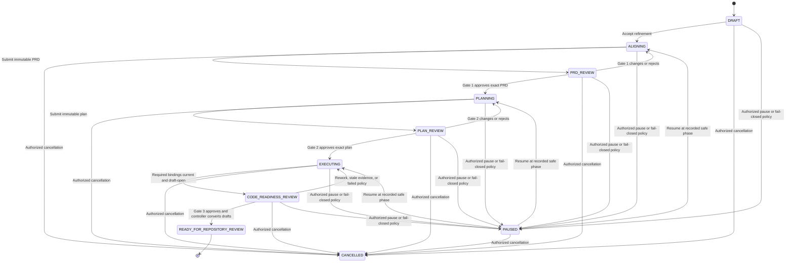
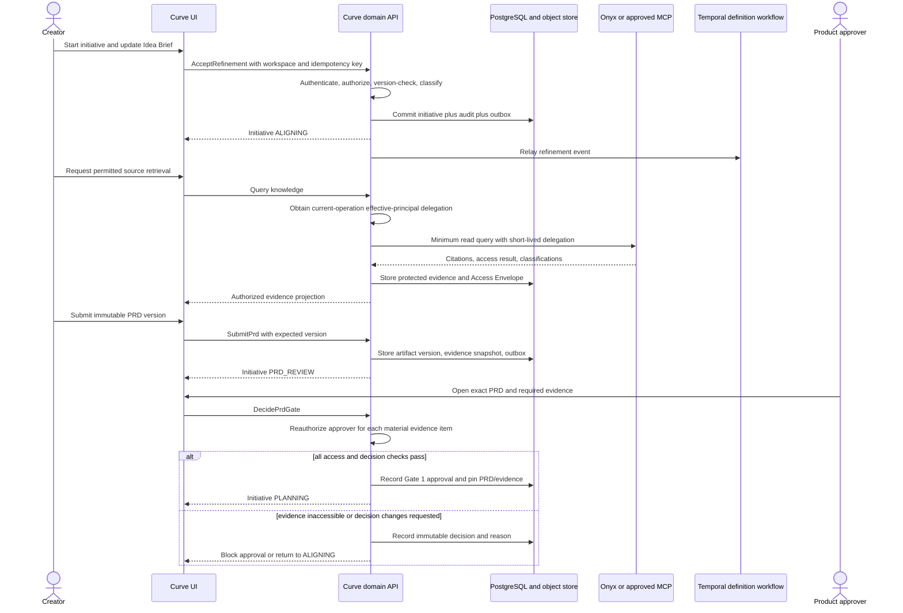
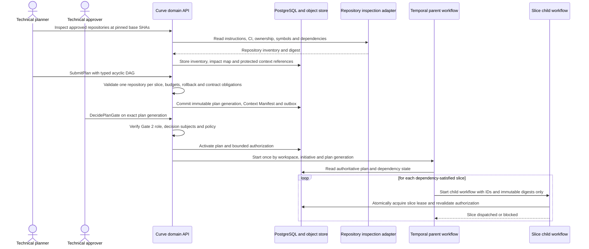
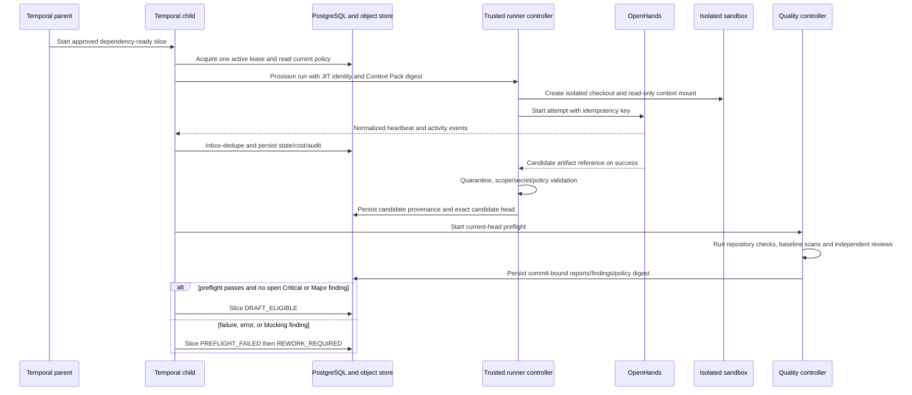
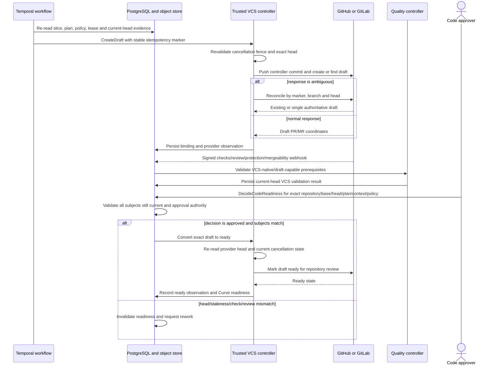
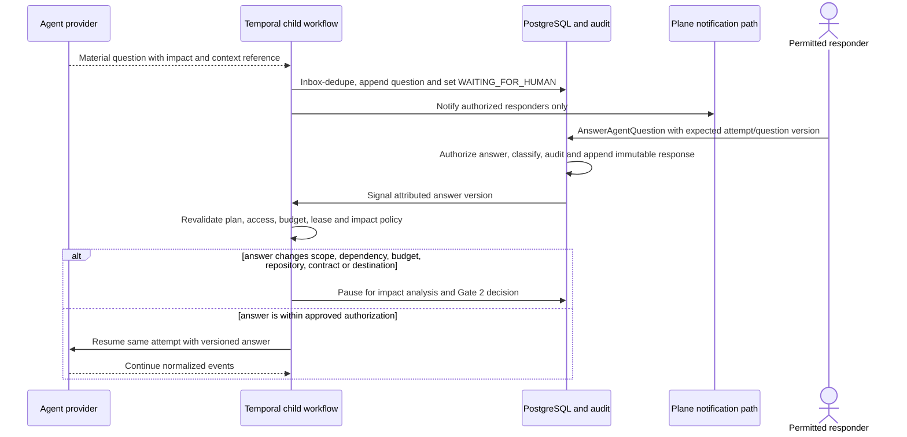
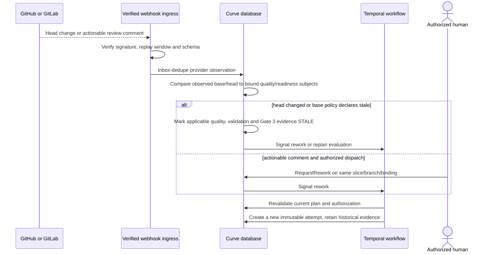
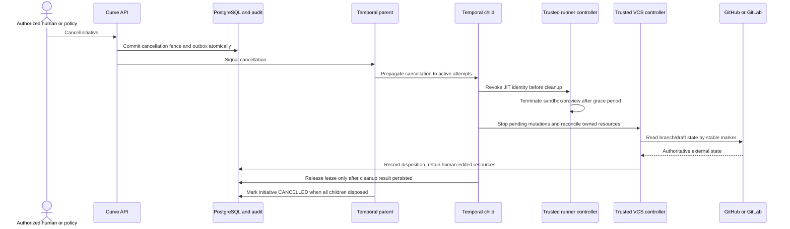
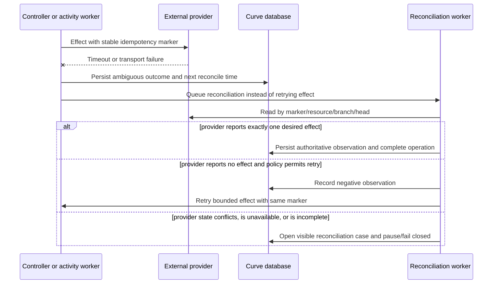

# Curve Workflows and Sequences

## Document control

| Field | Value |
| --- | --- |
| Status | Derived architecture specification |
| Source | [Curve PRD v0.8](../curve-ai-native-sdlc-prd.md) |
| Audience | Architecture, backend, workflow, provider-adapter, QA, and operations engineers |
| Scope | R0A, R0B, and R1 lifecycle orchestration |

## 1. Normative basis

This document translates the PRD lifecycle into implementable commands, state transitions, durable workflows, and provider interactions. The PRD remains authoritative. Its scope invariants, numbered requirements, lifecycle tables, and acceptance criteria MUST NOT be weakened here.

The terms **MUST**, **MUST NOT**, **SHOULD**, and **MAY** follow RFC 2119. If this document conflicts with the PRD, the PRD wins. No item in decision register D-001 through D-016 is resolved by this document. A workflow that reaches a capability blocked by an open decision MUST apply that decision's recorded fallback and stop or pause as specified.

Primary traceability:

- Lifecycle and synchronization: FR-011 through FR-024 and FR-041 through FR-044.
- Workspace, principal, evidence, and context safety: FR-003, FR-004, FR-012, FR-043.
- Service behavior: NFR-003 through NFR-008, NFR-011, NFR-013, NFR-014, and NFR-018.
- Recovery acceptance: AC-17 through AC-36, AC-42 through AC-50, and AC-57 through AC-60.

## 2. Workflow invariants

1. PostgreSQL is authoritative for Curve aggregates, approvals, policies, and normalized projections. Temporal is authoritative only for orchestration progress, timers, waits, and activity history.
2. Every aggregate, workflow ID, event, inbox/outbox record, provider binding, cache key, and object key includes `workspace_id`.
3. Every mutation checks the effective principal, workspace, object authorization, aggregate version, and applicable policy before changing state.
4. A command transaction writes domain state and an outbox message atomically. It MUST NOT call Temporal or an external provider in the transaction.
5. The outbox relay is at least once. Temporal signals, activities, application services, and provider mutations are idempotent.
6. A slice affects exactly one repository, has at most one active lease, and has at most one active PR/MR binding. Rework reuses its branch and binding.
7. An agent attempt produces candidate artifacts only. Agents cannot push, create a draft, mark ready, merge, deploy, approve, reclassify, or waive.
8. Preflight, VCS validation, and Code Readiness bind an exact repository, base SHA, head SHA, approved plan version, Context Pack digest, and Quality Policy version.
9. Any new head SHA makes prior applicable quality runs and Code Readiness decisions `STALE`.
10. Cancellation and pause establish a mutation fence before controllers stop or reconcile external work. A controller MUST recheck the current aggregate version and cancellation state immediately before an external mutation.
11. Provider facts are reconciled from their authoritative APIs. Provider state never grants a Curve approval.
12. Merge, deployment, and post-release signals are observed projections; Curve does not perform merge or deployment in R1.

## 3. Authority and processing model

### 3.1 Command path

All synchronous commands follow this path:

1. Authenticate through Plane and resolve the effective human principal.
2. Resolve `workspace_id`; reject any cross-workspace reference.
3. Authorize role, object, data-classification, provider scope, and requested side effect.
4. Validate `If-Match` or aggregate version and any command idempotency key.
5. Validate lifecycle preconditions and exact subject versions.
6. Persist the aggregate transition, append history/audit data, and write the outbox entry in one transaction.
7. Return the updated resource or `202 Accepted` with an operation resource.
8. Relay the outbox entry to Temporal or the bounded worker.
9. Apply external effects only through an idempotent activity and trusted application service.
10. Persist the provider outcome through an inbox-deduplicated application service, preserving the original causation chain.

Failures use RFC 9457 Problem Details. Authentication, authorization, validation, policy, and budget failures are terminal for that command and are not automatically retried. Optimistic-concurrency failure returns a stable conflict and performs no side effect.

### 3.2 Event envelope

Every emitted event MUST contain the PRD v0.8 envelope:

`event_id`, `schema_version`, `workspace_id`, `aggregate_type`, `aggregate_id`, `aggregate_version`, per-aggregate `sequence`, optional `initiative_id`, `workflow_version`, `actor_type`, `actor_id`, `occurred_at`, `recorded_at`, `correlation_id`, `causation_id`, `idempotency_key_digest`, `classification`, and a schema-versioned payload. A raw idempotency key never enters an event, log, audit record, or persisted command record.

Consumers MUST deduplicate `event_id`, reject cross-workspace references, and buffer or reconcile an out-of-order aggregate sequence. Incompatible payload changes require a new schema version and a dual-publish migration.

### 3.3 Canonical commands and outcomes

Names below are logical application commands. OpenAPI operation IDs may use these names without changing their semantics.

| Command | Authority | Required preconditions | Domain outcome and event |
| --- | --- | --- | --- |
| `AcceptRefinement` | Creator | Initiative `DRAFT`; Product, mode, risk proposal, and three gate assignments valid | Initiative becomes `ALIGNING`; `initiative.refinement_accepted` |
| `SubmitPrd` | Creator/contributor | Complete immutable PRD version; blockers resolved or classified | Initiative becomes `PRD_REVIEW`; immutable artifact submission |
| `DecidePrdGate` | Product approver | Exact submitted PRD and accessible material evidence | `prd.approved` or version-bound changes-requested/rejected decision |
| `SubmitPlan` | Creator/technical contributor | Definition of Ready, acyclic typed DAG, base SHAs, policy, budget, rollback, and contract applicability | Initiative becomes `PLAN_REVIEW`; immutable plan submission |
| `DecidePlanGate` | Technical approver | Exact submitted plan and all Gate 2 evidence | `plan.approved` or version-bound changes-requested/rejected decision |
| `DispatchSlice` | Technical approver or Gate-2-authorized policy | Approved active plan; dependency satisfied; no active lease | Slice `READY -> RUNNING`; `agent.started` follows successful lease/start |
| `AnswerAgentQuestion` | Permitted responder | Attempt waiting; answer access and impact validation pass | Versioned answer appended; child workflow signaled |
| `RetryAttempt` | Technical approver/policy | Prior attempt terminal; cleanup/reconciliation complete; budget valid | New attempt and lease; prior attempt remains immutable |
| `CancelInitiative` | Authorized human | Non-terminal initiative | Cancellation fence and `initiative.cancelled`; cleanup/reconciliation operation |
| `PauseInitiative` | Authorized human/fail-closed policy | Non-terminal initiative | `initiative.paused`; active work receives pause/cancel signals |
| `ResumeInitiative` | Authorized human | Reauthorization complete; blockers resolved | Returns to recorded safe phase and signals workflow |
| `StartPreflight` | Parent/child policy | Accepted candidate commit from trusted controller | `quality.started`; result emits `quality.completed` |
| `CreateDraft` | Gate-2-authorized policy through trusted controller | Slice `DRAFT_ELIGIBLE`; exact evidence current | One idempotent draft; `pull_request.draft_created` |
| `RequestRework` | Code approver or authorized review dispatcher | Open binding/comment or failed validation | Same slice/branch/binding becomes rework; `pull_request.rework_requested` |
| `DecideCodeReadiness` | Configured code approver | Exact current head and all Gate 3 prerequisites | `pull_request.code_readiness_approved` or rework |
| `ConvertDraftToReady` | Explicit Code Readiness command through trusted controller | Approved decision still matches provider head | Provider transition; `pull_request.ready_for_review` |
| `RecordObservedRelease` | Trusted provider observation or authorized R1 evidence | Provider/deployment identity valid | Contract becomes `RELEASED_UNVERIFIED` |
| `VerifyPostRelease` | Authorized human through trusted MonitoringProvider | Observed deployment and approved verification definition | `POST_RELEASE_VERIFIED` or `NON_COMPLIANT` plus follow-up |

## 4. Normative state transitions

### 4.1 Initiative

| Current state | Accepted trigger | Next state | Required side effects |
| --- | --- | --- | --- |
| `DRAFT` | `AcceptRefinement` | `ALIGNING` | Record metric start, workflow version, Product, mode, risk proposal, and three assignments. |
| `ALIGNING` | `SubmitPrd` | `PRD_REVIEW` | Freeze submitted PRD and evidence snapshot. |
| `PRD_REVIEW` | Gate 1 changes/rejects | `ALIGNING` | Preserve decision and displayed version; edits create a new version. |
| `PRD_REVIEW` | Gate 1 approves | `PLANNING` | Pin PRD/evidence; bind/create Roadmap Item only in `ROADMAP` mode. |
| `PLANNING` | `SubmitPlan` | `PLAN_REVIEW` | Freeze plan generation and its DAG, policy, Context Pack inputs, budgets, and side-effect request. |
| `PLAN_REVIEW` | Gate 2 changes/rejects | `PLANNING` | Preserve decision; edits create a new plan version. |
| `PLAN_REVIEW` | Gate 2 approves | `EXECUTING` | Activate exact plan generation and authorization; start/signal its parent workflow. |
| `EXECUTING` | All required bindings draft-open, VCS-valid, and contract-pre-release-ready | `CODE_READINESS_REVIEW` | Present Gate 3 subjects at current heads. |
| `CODE_READINESS_REVIEW` | Rework/invalidation/base staleness/check failure/waiver expiry | `EXECUTING` | Mark prior evidence stale and dispatch only explicitly authorized rework. |
| `CODE_READINESS_REVIEW` | All exact-head Gate 3 decisions and controller conversions succeed | `READY_FOR_REPOSITORY_REVIEW` | Record idea-to-ready endpoint. |
| Any non-terminal | Pause/fail-closed policy | `PAUSED` | Stop new effects, signal active work, preserve resources, reconcile. |
| Any non-terminal | Unrecoverable policy/operator failure | `FAILED` | Open a visible recovery decision; retain last safe phase. |
| Any non-terminal | Authorized cancellation | `CANCELLED` | Fence mutations, revoke identities, terminate untrusted runtimes, retain and label human-edited external resources. |

`READY_FOR_REPOSITORY_REVIEW` and `CANCELLED` are terminal for the R1 initiative. Observed merge, deployment, and post-release verification update projections and the Feature Delivery Contract; they do not reopen the initiative.

### 4.2 Vertical Slice

| From | To | Trigger and invariant |
| --- | --- | --- |
| `PLANNED` | `BLOCKED` | At least one typed dependency is unsatisfied. |
| `PLANNED` or `BLOCKED` | `READY` | Dependency satisfaction state is met and Gate 2 authorization is current. |
| `READY` | `RUNNING` | One active lease and a new attempt are acquired atomically. |
| `RUNNING` | `WAITING_FOR_HUMAN` | Provider emits a material question; attempt and child workflow wait durably. |
| `WAITING_FOR_HUMAN` | `RUNNING` | Authorized, attributed answer is accepted and no impact decision blocks resume. |
| `RUNNING` | `PREFLIGHT_RUNNING` | Trusted controller accepts candidate artifacts and creates the exact candidate commit locally. |
| `PREFLIGHT_RUNNING` | `PREFLIGHT_FAILED` | Any required check errors/fails or Critical/Major finding remains open. |
| `PREFLIGHT_FAILED` | `REWORK_REQUIRED` | Failure and findings are normalized and assigned. |
| `PREFLIGHT_RUNNING` | `DRAFT_ELIGIBLE` | Current-head preflight passes. |
| `DRAFT_ELIGIBLE` | `DRAFT_OPEN` | Trusted controller pushes and creates or finds exactly one draft. |
| `DRAFT_OPEN` | `VCS_VALIDATING` | Provider checks/reviews/protection/mergeability synchronization begins. |
| `VCS_VALIDATING` | `REWORK_REQUIRED` | Required failure, actionable review, stale base/head, or authorized rework. |
| `VCS_VALIDATING` | `CODE_READY` | Gate 3 approves current head and trusted controller converts it to ready. |
| `REWORK_REQUIRED` | `READY` | Rework authorization is recorded; same branch and binding are retained. |
| Any non-terminal | `FAILED` | Terminal attempt or unrecoverable provider/policy failure after recovery decision. |
| Any non-terminal | `CANCELLED` | Initiative/slice cancellation completes its cleanup and reconciliation. |

### 4.3 Agent Run Attempt

- `QUEUED -> STARTING -> RUNNING` is the normal path.
- `RUNNING -> WAITING_FOR_HUMAN -> RUNNING` is allowed only through a versioned attributed answer.
- `RUNNING -> SUCCEEDED` means candidate artifacts are available; it does not mean code is accepted or pushed.
- A transient normalized error may produce `FAILED_RETRYABLE`; a retry creates a new attempt rather than reviving the terminal one.
- Validation, authorization, policy, budget, or unsupported-capability errors produce `FAILED_TERMINAL` unless a human changes the governing input.
- Missed heartbeat/lease expiry produces `LOST`, immediate JIT revocation, quarantine, and reconciliation.
- Deadline produces `TIMED_OUT`; cancellation produces `CANCELLED`.
- At most one attempt owns the active slice lease, and exactly one successful candidate may be accepted for the next preflight.

### 4.4 Quality, binding, set, and contract

| Aggregate | Normative flow |
| --- | --- |
| Quality Run | `QUEUED -> RUNNING -> PASSED/FAILED/ERROR/CANCELLED`; a governing SHA, plan, context, or policy change makes a prior result `STALE`. |
| PR/MR Binding | `NOT_CREATED -> CREATING_DRAFT -> DRAFT_OPEN -> CHECKS_RUNNING -> CURVE_READY_APPROVED -> READY_FOR_REVIEW`; failures or new commits enter `REWORK_REQUIRED`; provider may later report `CLOSED` or `MERGED`. |
| Pull Request Set | Derived only: `INCOMPLETE`, `VALIDATING`, `REWORK_REQUIRED`, `CODE_READY`, or `CLOSED`. It is not an atomic transaction. |
| Feature Delivery Contract | `NOT_STARTED -> PRE_RELEASE_BLOCKED/PRE_RELEASE_READY -> RELEASED_UNVERIFIED -> POST_RELEASE_VERIFIED/NON_COMPLIANT`. |

A contract check is `PENDING`, `PASSED`, `FAILED`, `NOT_APPLICABLE`, or `TEMPORARILY_WAIVED`. Applicability is fixed at Gate 2. Waiver expiry before release returns the check to failed; expiry after observed release makes the delivery non-compliant without rewriting prior readiness.

## 5. Temporal orchestration topology

### 5.1 Parent workflow

One versioned parent workflow exists per `workspace_id + initiative_id + plan_generation`. It starts when Gate 2 activates the plan generation. A stable workflow ID prevents duplicate starts.

The parent MUST:

- Load only identifiers and immutable digests into Temporal history; large or protected bodies remain in object storage.
- Revalidate authoritative PostgreSQL state before every state-changing activity.
- Materialize the approved typed DAG and release slices only when dependency satisfaction states are met.
- Start a child workflow for each attempt, never more than one active child lease per slice.
- Aggregate slice, binding, Pull Request Set, and contract projections without replacing their database truth.
- Wait durably for agent questions, human decisions, provider callbacks, retry timers, waiver expiry, and reconciliation results.
- Propagate pause/cancel signals and wait for cleanup results.
- Use version markers for workflow-code changes and `continue-as-new` before history limits.
- End when the initiative reaches an R1 terminal state and all required reconciliation/cleanup operations have reached a recorded disposition.

### 5.2 Child workflow

One child workflow exists per immutable Agent Run Attempt. It MUST:

1. Acquire the active slice lease through an application service.
2. Check decision prerequisites, provider capability, budget, effective authorization, context access, and sandbox policy.
3. Materialize the read-only Context Pack mount outside the repository working tree.
4. Ask the AgentExecutionProvider to start the attempt with an idempotency key.
5. Consume normalized events and heartbeats; persist each through inbox-deduplicated application services.
6. On a question, persist it, transition to waiting, notify through Plane/Celery, and await a signal.
7. On success, collect candidate artifacts and hand them to the trusted runner/VCS-controller boundary.
8. On loss/cancel/timeout, revoke JIT identity before cleanup, quarantine ambiguous output, and reconcile the provider.
9. Release the slice lease only after its terminal state and cleanup outcome are persisted.

The child never calls GitHub or GitLab with mutation authority.

### 5.3 Activity policy

- Every activity has start-to-close and heartbeat timeouts.
- Transient errors retry with jittered exponential backoff, at most three automatic attempts by default.
- Authentication, authorization, validation, policy, budget, and unsupported-capability errors do not retry.
- An ambiguous external mutation response MUST be reconciled by stable idempotency marker before retry.
- Cancellation is propagated, but an external cleanup/reconciliation activity is allowed to complete after cancellation so its result can be recorded.
- Archived representative histories MUST replay successfully before deploying new workflow workers.

## 6. Sequence diagrams

### 6.1 Initiative lifecycle and the three human gates

The diagram shows exactly three human gates: Gate 1 approves the immutable PRD, Gate 2 approves the immutable execution plan, and Gate 3 approves Code Readiness for each exact current head. Roadmap publication, external repository review, merge, deployment, and post-release verification are separate events; they are not a fourth Curve gate.

### 6.2 Alignment, evidence, and Gate 1

No retrieval response becomes generally visible because it was once retrieved. A later artifact, model call, gate display, export, or execution rechecks the Access Envelope and effective principal. A revoked source is a blocking condition, not a cache miss to work around.

### 6.3 Plan approval, authorized fan-out, and slice dispatch

The plan is a bounded authorization, not a blank permission for a workflow. A new repository, side effect, scope, data destination, budget, dependency, contract applicability, or artifact version requires impact analysis and Gate 2 reapproval. Temporal history stores identifiers and digests, never protected source bodies.

### 6.4 Agent attempt to draft eligibility

The agent never receives a VCS mutation token. Candidate success is not a commit, preflight pass, draft, Code Readiness approval, merge, or deployment. The trusted runner/controller independently controls all promotions and preserves a candidate in quarantine on failure.

### 6.5 Automatic draft creation, VCS validation, and Gate 3

Draft creation happens automatically only after preflight. Code Readiness happens only after VCS-native validation and a configured human's explicit current-head decision. Repository-native approvals that become available only after a draft is ready remain outside Curve's Gate 3 and are observed rather than simulated.

### 6.6 Human question, pause, and resume

The same durable child workflow resumes only when its controlling inputs are still valid. A question cannot be used as an informal approval channel for a new side effect or scope change.

### 6.7 New head, review rework, and evidence invalidation

Rework never creates a second active PR/MR binding for the slice. A head change preserves prior evidence for audit but removes its authority to satisfy preflight, VCS validation, or Gate 3.

### 6.8 Cancellation, lease loss, and reconciliation

On heartbeat expiry, the child follows the same cleanup path but marks the attempt `LOST` and quarantines output. It never resumes the lost process or creates a concurrent lease. Provider state is reconciled before retry; a timeout is not evidence that a mutation did not occur.

### 6.9 Provider outage, duplicate delivery, and ambiguous mutation

Inbox handlers deduplicate provider event IDs, retain sequence/observation time, and do not reorder facts silently. Invalid signatures and forged callbacks are security audit data; they cannot change a lifecycle projection. The reconciliation owner closes a case only with an authoritative observed result or an approved operator recovery decision.

## 7. Idempotency, concurrency, and compensation rules

### 7.1 Idempotency keys and effect markers

| Boundary | Idempotency scope | Required behavior |
| --- | --- | --- |
| Public command | Workspace + principal + command type + key + request digest | Same key/same digest returns the recorded outcome; same key/different digest is a conflict with no effect. |
| Temporal start/signal | Workspace + initiative + plan generation/workflow version + signal ID | Duplicate relay/start/signal does not start a second process or reapply a decision. |
| Agent attempt | Workspace + slice + attempt + provider operation marker | Retry creates a new immutable attempt only after prior cleanup; provider start reconciliation precedes retry. |
| VCS mutation | Workspace + binding + effect type + controller marker | Create/find exactly one branch/draft/ready conversion; timeout triggers read/reconcile before replay. |
| Webhook | Provider connection + provider event ID | Duplicate acknowledges without repeating projection/effect; invalid events remain auditable. |
| Object promotion/export | Workspace + artifact version/content digest + destination | A completed content-addressed write is reused; divergent content fails integrity checks. |

### 7.2 Optimistic concurrency and freshness

Every command carries an expected aggregate version or strong entity tag. A command validates its exact decision subjects: PRD/plan/artifact revision, policy version, repository/base/head SHA, Context Pack digest, Access Envelope, budget reservation, gate assignment, and provider observation state as applicable. If a subject is stale, superseded, unauthorized, or changed, the command returns a stable conflict/precondition failure and performs no external effect.

The controller repeats this check immediately before a provider mutation. This protects against a race in which a user pauses/cancels, a VCS head changes, or a policy/decision is revoked after Temporal selected work but before the activity executes.

### 7.3 Explicit compensation

Curve does not claim distributed rollback. It records local state first, then applies narrowly authorized effects, then records authoritative observations. When an earlier effect cannot be reversed safely:

- It marks the aggregate/binding as requiring reconciliation or rework.
- It retains human-edited external resources and never blindly deletes branches, drafts, comments, or provider artifacts.
- It opens an attributed recovery task/decision with the source/head/marker and expected resolution.
- It recalculates contract/readiness projections from facts; it does not overwrite historical evidence.

## 8. Workflow compatibility and operational change management

Temporal workflow changes are versioned, deterministic, and replay-tested against representative histories. Workflow code holds only orchestration logic; business writes pass through versioned application services that perform authorization/concurrency checks. A change that requires new state uses a compatibility marker, a migration/read adapter, and `continue-as-new` before history limits. Operators cannot fix a stuck workflow by altering historical business truth directly.

Provider contract, policy, schema, image, rulepack, or infrastructure changes are released through a compatibility plan that states affected workspaces, current runs, replay/migration proof, rollback/disable method, telemetry, and owner. The change-control path pauses or supersedes in-flight work when a governing subject changes; it never silently mutates an approved task packet.

## 9. Implementation checklist

Before an AI coding agent implements a workflow or controller slice, it must demonstrate:

- The target milestone's blocking ADRs are decided, and the exact PRD/document/schema/policy versions are in its task packet.
- Domain state transition, event, outbox, audit, optimistic-concurrency, and idempotency behavior are implemented atomically.
- A fake provider and test fixture prove happy path, duplicate, stale, denied, timeout, cancellation, loss, reconciliation, and restart behavior.
- Protected context remains outside the checkout and test logs/fixtures prove it cannot appear in Git, PR/MR text, ordinary telemetry, or unapproved provider calls.
- The trusted controller—not the agent—owns commit/push/draft/ready effects, with revalidation immediately before every mutation.
- The test suite verifies one repository and at most one active binding per slice; rework preserves the same branch/binding.
- Temporal replay and `continue-as-new` behavior are exercised for affected workflow versions.
- Every displayed state is a projection of authoritative facts and exposes staleness, decision subjects, and reconciliation status rather than inferring success.
